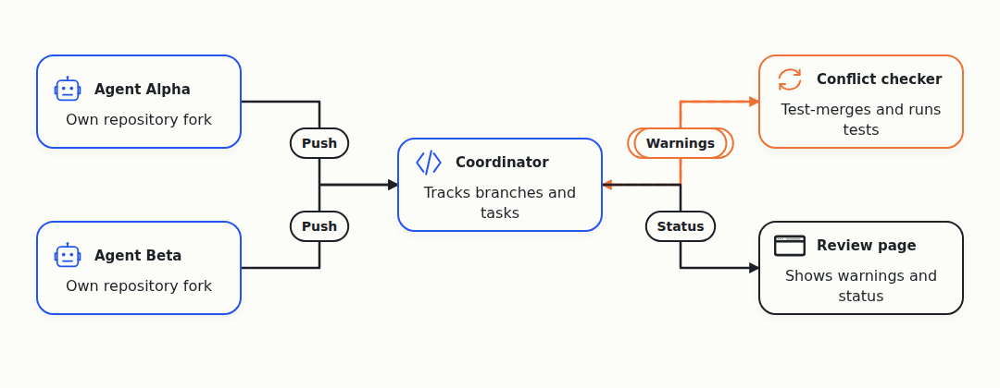
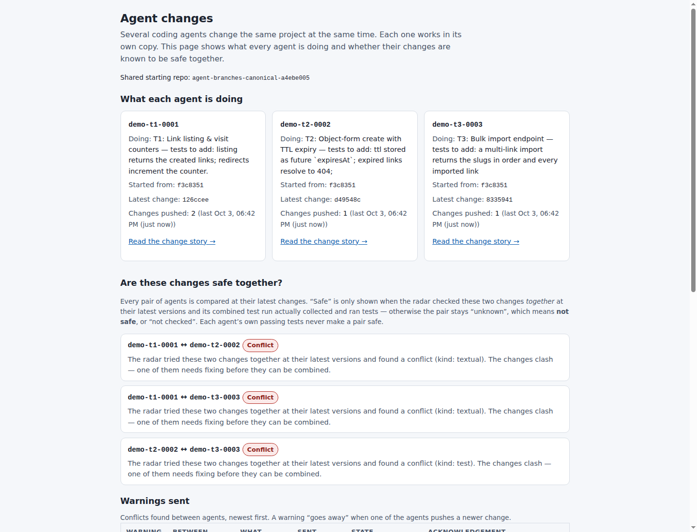

# Agent Branches

**Agent Branches gives every coding agent its own copy (fork) of a repository and warns you which agents' changes will clash, before anything is merged.**

It is our entry to Cloudflare's [next Git platform competition](https://blog.cloudflare.com/next-git-platform-on-cloudflare/): build Git for coding agents on Cloudflare Workers and Artifacts, with several agents changing code at the same time. Entries are due 14 October 2026. It is a prototype, built and journaled in public by a team of AI agents.

## The problem

More and more people run several coding agents on one repository at once. Two things go wrong:

1. **Clashes show up late.** Agent A and agent B both change the same file. Each one's tests pass on its own. Nobody learns that the two changes collide until someone tries to merge them. Sometimes the clash is in the text (both edit the same lines); sometimes both merge cleanly but the combined code fails its tests.
2. **Nobody sees the whole picture.** A person reviewing four agents has no single view of who is doing what, starting from which commit, with which test results. What each agent was asked to do is lost in a chat window.

## How it works



- **One fork per agent.** Creating a task forks the main repository and gives the agent a short-lived token that can push only to its own fork. The agent uses plain `git push`. Each task records what the agent was asked to do and the exact commit it started from.
- **A coordinator on Cloudflare.** A Cloudflare Worker with a Durable Object (a small stateful service) keeps track of every agent's latest commit and every warning. It never runs Git or tests itself.
- **A separate checker.** A trusted process trial-merges every pair of agents' latest work, runs the tests on the combined code, and reports back. Results computed against commits that have since changed are rejected.
- **"Unknown" is never shown as safe.** A pair is shown as clean only if it was checked at the current commits and its combined test run actually ran tests. Anything else shows as "not checked".
- **A review page.** For each agent: its task, starting commit, pushes and test results. For each pair: clash, clean or not checked, and why.



## What is built and verified

| What | Status | Evidence |
| --- | --- | --- |
| Full flow with 3 agents: fork, push, checker, warnings, review page. Finds all 3 designed clashes (2 in the text, 1 only in the tests) | Passed 36 of 36 checks on 3 Oct, on a local stand-in for Artifacts (real Git repositories on disk) | [`live/evidence/run-3/summary.txt`](live/evidence/run-3/summary.txt) |
| A stale checker result is rejected after a new push | Passed in the same run | [`live/evidence/run-3/stale-409.json`](live/evidence/run-3/stale-409.json) |
| Real Cloudflare Artifacts: create repo, fork, per-repo tokens, clone, push; a read-only token cannot push | 28 operations run against the real service on 3 Oct | [`artifacts-spike/RESULTS.md`](artifacts-spike/RESULTS.md) |
| Coordinator test suites | Pass today (see below) | [`prototype/`](prototype/) |

**Not done yet:**

- The Worker is **not deployed** to Cloudflare. Everything runs locally under `wrangler dev`.
- The coordinator has **not run end to end against real Artifacts**. Each Artifacts operation it needs was tested on its own.
- The three "agents" in the recorded run are **scripted patches**, not live coding agents.
- The documented Artifacts API cannot fork at an arbitrary commit, so the real mode forks the default branch and records where it started.
- The checker is trusted, not sandboxed, and it only looks at pairs of agents.

**What our own tests found.** When two real agents worked side by side, seeing each other's unfinished work changed nothing: neither broke the other ([research §3.1](_docs/research/research.md#31-a01-fair-pair-a-null-result)). Outside studies agree that such clashes are real but rare. For a single agent, plain Git is simpler and faster. The demo uses tasks designed to overlap, so it shows what the tool can detect, not how often clashes happen.

## Try it

You need `git`, `node` and `npm`, and `python3`.

```sh
git clone https://github.com/alexeygrigorev/cloudflare-agent-git.git
cd cloudflare-agent-git

# 1. See the three designed clashes with plain git (about 2 seconds)
bash demo-target/verify-overlap.sh   # ends with: ALL 4 FACTS VERIFIED

# 2. Read the recorded run: 36 checks, ends with "36/36 assertions passed (final)"
cat live/evidence/run-3/summary.txt

# 3. Run the coordinator's tests
cd prototype
npm install
npm test               # Worker tests inside workerd: 114 passed (about 40 s)
npm run test:sidecar   # local Git server: 16 passed
npm run test:node      # same core on plain Node: 64 passed
```

Checked on 7 Oct 2026 on Linux with Node 24.

The one-command full demo, `bash live/run-demo.sh` (setup in [`live/README.md`](live/README.md)), **currently fails on `main`**: the coordinator now requires a token to read its status, and the script's health check does not send one yet. The evidence above is from its last successful run, on 3 Oct.

Going further: the API is in [`prototype/CONTRACT.md`](prototype/CONTRACT.md), and the deploy plan is in [`prototype/README.md`](prototype/README.md#switch-to-real-artifacts-spike-validated-path-plan-l1-realmd). [`docs-submission/DEMO-SCRIPT.md`](docs-submission/DEMO-SCRIPT.md) is the script for the 8-minute demo video.

## How this was made

The founder, Alexey Grigorev, gave the work to a team of AI coding agents on rented servers: one coordinating agent, a lead agent per product, short-lived workers, and reviewers that run on a different model from the work they check. The same team also builds its own supporting tools: a dashboard, a launcher that decides which agent starts next, and messaging between computers.

The experiment is written up in public, including what failed:

- Daily journal: <https://alexeygrigorev.com/cloudflare-agent-git/>
- How the team works: [`_docs/04-way-of-working.md`](_docs/04-way-of-working.md)
- What we researched and measured: [`_docs/research/research.md`](_docs/research/research.md)
- Failures and lessons: [`_docs/founder-journal/failures.md`](_docs/founder-journal/failures.md)

## Status and what's next

Working prototype, verified locally. Before the 14 October deadline:

1. Fix the one-command demo so it works on `main` again.
2. Deploy the Worker and run it against real Artifacts end to end.
3. Run it with live coding agents instead of scripted patches.
4. Record and submit the 5 to 10 minute demo video.

## Where to find things

- [`AGENTS.md`](AGENTS.md): instructions for AI agents working in this repo
- [`_docs/`](_docs/): project documentation
- [GitHub issues](https://github.com/alexeygrigorev/cloudflare-agent-git/issues): tasks

## License

MIT, see [`LICENSE`](LICENSE).
