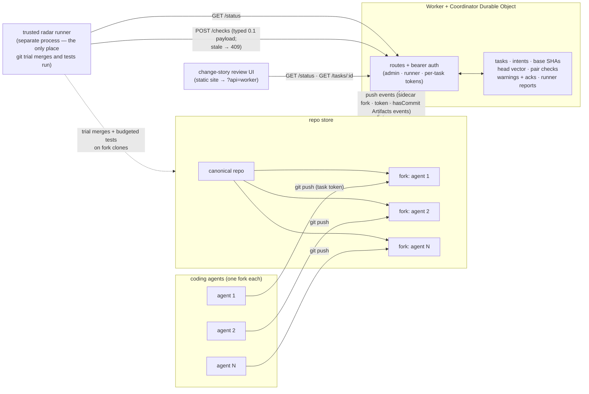

# Agent Branches — submission

**Agent Branches gives every coding agent its own fork of the repo, watches all
works-in-progress live, and tells humans which agent pairs will break each
other — before anything is merged.** Agents push to their own forks with plain
`git push` over per-task tokens; a Cloudflare Worker + Durable Object
coordinator tracks every head vector and warning; a trusted runner trial-merges
and test-merges each pair of agent heads and posts typed results back; a
change-story review UI shows, per agent, the intent it was given, the commit it
started from, its pushes, test provenance and every active conflict — and it
never renders an unchecked or inconclusive state as "safe". The full flow
(fork → push → radar → warning → stale-gate → review UI) is verified end to
end at 36/36 assertions — every assertion the run script defines
(`passed: 36, total: 36` in `result.json`), with the radar covering all
**3 of 3** active pairs (N = 3 agents → N·(N−1)/2 = 3 pairs) — on a local
stand-in store of real bare git repositories
(`live/evidence/run-3/`), and the Cloudflare Artifacts operations the design
depends on (create repo, fork, per-repo write tokens, read-cannot-push, clone
and push latencies) are verified against the real service in a 28-op evidenced
spike (`artifacts-spike/RESULTS.md`, branch `proto/artifacts-spike`).

---

## The problem

Teams increasingly run several coding agents against the same repository at
once. Today that breaks in three ways:

1. **Silent interference.** Agent A and agent B both edit `src/worker.js`;
   each finishes green against its own base. Nothing tells anyone that the two
   patches collide until someone merges — textual conflicts (both insert at the
   same anchor) and semantic/test conflicts (each change passes alone but the
   combination fails) surface late, in someone else's session.
2. **No shared picture of works-in-progress.** A human reviewing four agents
   has no single view of *who is doing what, from which base commit, with which
   tests*. Intent lives in a prompt that is gone by review time.
3. **Resource blow-up.** The naive remedy — a full checkout/worktree per agent
   — multiplies build and dependency state. On this project's own host,
   472 linked worktrees hold 131.7 GiB per-directory of which 62.1% is
   duplicated dependencies/build output, one Rust debug build alone added
   12.26 GiB, and a 2 GiB-cgroup agent died of OOM from parallel children
   (`research/claude/dogfood-resource-evidence.md`). Queues that run combined
   tests with no admission control turn "verify everything" into "OOM the
   host".

## What it does

- **One fork per agent.** `POST /tasks` forks the canonical repo and mints a
  per-task write token (default TTL **1 hour**: the request field is
  `ttlSeconds` in **seconds**, default 3600; the response carries an ISO
  `expiresAt`, and the store rejects an expired token on use. Stored hashed —
  the coordinator keeps only a SHA-256 digest). Agents clone and push with
  ordinary git; read-scope tokens cannot push. Each task records its
  **intent** (what the agent was asked) and **base_sha** (the exact commit it
  started from).
- **Worker + Durable Object coordinator.** All mutating routes are
  bearer-gated with cross-agent 403s (an agent cannot report pushes, tests or
  acks for another agent) and fail closed (503) when a secret is unconfigured.
  Pushes are verified against the real fork (`sha` must exist), deduped, and
  advance the head vector. The Worker **never runs git and never runs tests**
  — coordination only. SQLite-backed DO storage has **no per-key
  `expirationTtl`** (that option does not exist on DO storage), so nothing
  expires silently: token expiry is an explicit timestamp the store checks on
  use, and retention is enforced deterministically in code at write time by
  bounded caps — the push-dedup ring keeps the latest **16** accepted pushes
  per agent, warnings the newest **200**, and the radar log the newest
  **50** entries.
- **Live conflict radar run by a trusted runner.** A separate process reads
  `GET /status`, does pairwise `git merge-tree` trial merges plus budgeted
  combined-tree tests (per-pair test budget `budget_s`, in **seconds** —
  120 s in run 3), and posts a typed payload to `POST /checks`. The payload
  must declare its wire: `contract: "0.1"` (canonical typed shape) or
  `"0.0"` (legacy string adapter); a missing or unknown `contract` field is
  rejected with **400**. The vector is gated: if any head moved since the
  runner fetched `/status`, the POST is rejected with **409** naming the
  current heads. Only runner-verified `conflict` results create warnings; a
  later `clean` at the same heads resolves them.
- **Unknown is never shown as safe.** Pair status is four-valued:
  `conflict | clean | unknown | not_checked`. The UI badges "Clean" only for a
  clean result at exactly the current heads with tests actually collected in
  that pair's **own** combined test run (per-pair
  `coverage.tests_collected > 0`); anything else — unchecked, stale,
  inconclusive, or a push whose report-back failed (durable unprocessed-push
  ledger) — shows as not checked, never as clean.
- **Change-story review UI.** Per agent: intent, base SHA, pushes, test
  provenance (`command`/`exit`/`head_sha`, authenticated to that agent); per
  pair: status badge, conflict kind (`textual` / `test`), human-readable
  evidence, and who acknowledged which warning at which head.

## Architecture



In the verified local mode the "repo store" is real bare git repositories on
disk served by a small Node sidecar (smart HTTP, per-repo tokens,
post-receive → push events); the Worker runs under `wrangler dev` and talks to
the sidecar over `fetch`. In the intended deployment the same `ArtifactsPort`
is implemented over the Cloudflare Artifacts binding and the store is Artifacts
repos — the binding operations used (create, fork, createToken, log,
readCommit, list, delete) are exactly the documented ones, and each was
exercised for real in the spike. Full wire contract:
[`prototype/CONTRACT.md`](prototype/CONTRACT.md) (v0.1.2).

## Status — what is verified where

Evidence-first; every row cites its file.

| Capability | Status | Evidence |
| --- | --- | --- |
| End-to-end demo flow: 3 concurrent agents, fork → push → typed radar checks → 3 conflict warnings (2 textual + 1 test) → review UI badges, **36/36 assertions** (all 36 assertions the script defines passed; radar coverage **3/3 active pairs** — N = 3 → N·(N−1)/2 = 3; per-pair `tests_collected: 19` on the one pair whose combined test stage ran) | ✅ Verified **on the local stand-in** (real bare git repos via Node sidecar + Worker under `wrangler dev`) | `live/evidence/run-3/result.json`, `summary.txt`, `ui-index.png`, `ui-task-task-0002.png` (branch `proto/live`) |
| Stale-result gate: replaying an old radar payload after a push → `409` naming current heads | ✅ Verified locally | `live/evidence/run-3/stale-409.json` |
| "Unknown ≠ clean" semantics incl. failed push-report ledger forcing `not_checked` | ✅ Verified locally + in worker unit suites (no headline count recorded; `npm run test:all` = typecheck + vitest worker suites + sidecar tests) | `prototype/CONTRACT.md` §0.1.2 change 3; `prototype/` vitest suites |
| Real Cloudflare Artifacts: create namespace/repo, fork ×2, mint tokens, clone, push, read-scope push rejected, cross-checked via wrangler CLI — **28 evidenced ops** | ✅ Verified **against the real service** (2026-10-03) | `artifacts-spike/RESULTS.md` (branch `proto/artifacts-spike`) |
| Real Artifacts latencies (reads 120–450 ms, fork 3.4–4.5 s, clone 500 ms, push 346–416 ms) fit the demo budget | ✅ Measured once, spike scale | `artifacts-spike/RESULTS.md` §latencies |
| Resource rationale: worktree/build duplication and parallel-test memory (disk 3.0× at N=3 on a zero-dep crate; 62.1% of 111.7 GiB worktree bytes are deps/build; single Rust build +12.26 GiB) | ✅ Measured on our host, small scale, honestly caveated | `rust-demo/bench/README.md` (branch `proto/rust-demo`); `research/claude/dogfood-resource-evidence.md` |
| **Worker deployed to Cloudflare** | ❌ **Pending** — not authorized/deployed yet; `wrangler dev` only | `prototype/README.md` §"Switch to real Artifacts" |
| **Coordinator running against real Artifacts** (binding `ArtifactsPort` behind a live Worker) | ❌ **Pending** — binding path is designed and its ops individually verified, but never run end to end | `artifacts-spike/RESULTS.md` §Assumption scorecard (D, E unverified) |
| **Real coding agents as the pushers** in the E2E run | ❌ **Pending** — run 3's three agents are scripted reference patches applied via authenticated pushes; task intents/SHAs/warnings/UI are all real | `live/README.md` §"What the script does" step 4 |
| Real Artifacts event subscription feeding `/events/artifacts` | ❌ **Pending** (local webhook stands in) | `prototype/CONTRACT.md` §auth |
| Fork at an arbitrary base commit on real Artifacts | ⚠️ Not supported by the documented API — real mode forks the default branch and records the realized base | `prototype/CONTRACT.md` D3; `artifacts-spike/RESULTS.md` assumption F |

## Try it locally

Verified reproduction of run 3 (from `live/README.md`):

Prerequisites: `node` + `npx` (wrangler dev), `python3`, `git`, `rsync`;
headless Chrome only for the screenshot step.

```sh
# 0) get the repo and the integration branch
git clone https://github.com/alexeygrigorev/cloudflare-agent-git.git
cd cloudflare-agent-git
git checkout proto/live

# 1) create the untracked token file live/.dev.vars (never committed; mode 600).
#    Tokens are arbitrary bearer strings you choose:
cat > live/.dev.vars <<'EOF'
export ADMIN_TOKEN='<random>'
export RUNNER_TOKEN='<random>'
export SIDECAR_TOKEN='<random>'
export SIDECAR_PORT=8799
export WORKER_PORT=8787
export UI_PORT=8788
EOF
chmod 600 live/.dev.vars

# 2) from the repo root (so `python3 -m radar` resolves) — one command runs the
#    whole demo; all steps are idempotent via markers in live/state/:
bash live/run-demo.sh > live/run-3.log 2>&1
echo "exit=$?"   # 0 on success

# 3) inspect results
cat live/evidence/run-3/result.json    # assertions, machine-readable
cat live/evidence/run-3/summary.txt    # same, human-readable
python3 -m json.tool live/evidence/run-3/status.json | head -40
```

Do not pipe the script's stdout into `tail -f`: server processes inherit the
pipe and hold it open — read `live/run-3.log` instead. A full fresh run:
`rm -rf live/state live/artifacts prototype/.wrangler`. The run-3 evidence
referenced above is committed on `proto/live` under `live/evidence/run-3/`.

## Run on Cloudflare — ⚠️ pending deploy

The Worker is **not deployed** yet; the deployment steps below are the
documented plan, executed only up to `wrangler dev`. They are validated in
detail by the spike (`artifacts-spike/RESULTS.md` §PLAN-L1-REAL), but no step
after `dev` has been run end to end.

1. `wrangler login` (or set `CLOUDFLARE_API_TOKEN`), create the Artifacts
   namespace and the canonical repo (spike ops O1–O7).
2. Add the documented binding to `wrangler.jsonc`:
   `"artifacts": [{ "binding": "ARTIFACTS", "namespace": "agent-branches" }]`,
   then `npx wrangler types` and confirm the generated type matches
   `ArtifactsNamespaceBinding` in `src/artifacts/real.ts`.
3. Seed the canonical repo: `POST /setup` via the binding, then clone its
   remote and push a baseline with a minted write token.
4. Point an Artifacts event subscription (`artifacts.repo`) at the deployed
   `POST /events/artifacts` route (dedicated rotated secret — pre-deploy auth
   checklist in `prototype/CONTRACT.md`).
5. `npx wrangler deploy` — then rerun the radar + review UI against the public
   Worker.

## Limitations

- **No deployed Worker.** Everything live today is local (`wrangler dev`,
  miniflare DO storage, sidecar repos). The public-internet path needs the
  auth review first (token rotation, TLS, dedicated event-subscription secret).
- **Scripted agents, not agent runs.** Run 3 proves the coordination, radar
  and review pipeline on real pushes; it does not yet prove autonomous coding
  agents driving those pushes. The demo targets high-overlap work by design
  (three tasks all touching `demo-target/src/worker.js` / its API surface) and
  says so — general-purpose semantic-conflict detection is out of scope of the
  evidence.
- **Small-scale resource numbers.** The bench is N=3 on a zero-dependency
  crate, single host, single run; only mode-vs-mode ratios are cited, no
  extrapolation (`rust-demo/bench/README.md`).
- **Artifacts API realities** (documented where they differ from docs): token
  format `art_v2_x_…`, `status` only on list, `last_push_at` stays `null`,
  read-scope push rejection surfaces as HTTP 400, no fork-at-commit
  (`artifacts-spike/RESULTS.md`).
- **The runner is trusted, not sandboxed**: whatever process holds
  `RUNNER_TOKEN` decides pair verdicts; the Worker records provenance but does
  not re-run tests (by design — the Worker never runs git or tests).
- Radar coverage is pairwise at current heads; it does not reason about
  three-way interactions beyond what pair tests surface.

## License

MIT — see [`LICENSE`](LICENSE).
