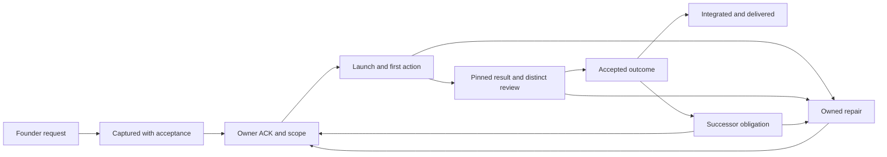

# Continuation runtime design

The continuation runtime is how useful agent work keeps moving without the founder stepping in. It is both an operating process and the software that enforces it: the trackers, the maintained supervisor, the Agent Quota Launcher, the agents bus and the project heads. The founder asks once. The system records the request, keeps a named owner accountable through execution, review and recovery, and delivers the accepted result. Over time the founder's role shrinks to the daily standup. This is the target design. A rule written here proves nothing until it passes the acceptance below.

The rules and their sources are in [03-way-of-working.md](03-way-of-working.md), which wins on any conflict; this document explains how the runtime carries them out.

## Roles

Each role:

- Principal: plans priorities across teams, assigns scoped work through heads, monitors outcomes and flow, challenges evidence, coordinates hand-offs, keeps the high-level tracker. Never: implements product code, personally reviews code, runs its own execution team, takes over a head's protected scope.
- Head: interactive orchestrator for one project. Breaks goals into tasks, launches implementers and reviewers, accepts reviewed results, integrates within its edit scope, refills and recovers. Never: reviews its own work, invents workers, acts on unreceived scope, becomes the default sole implementer.
- Worker (executor): implements and tests one assigned task and hands back a pinned result. Never: accepts its own result, mutates other tasks, works outside delegated paths.
- Independent reviewer: inspects a pinned candidate, runs the relevant checks, returns a free verdict. Never: changes the candidate, reviews its own output, accepts unpinned artifacts.
- Supervisor and collector: configured mechanical transitions, due checks, routing and observations. Never: gives model verdicts, fabricates custody or readiness, grants source permissions.
- Root: watches the principal and the heads and keeps them running, relays what the founder says to them and brings back what he needs. It runs on the founder's laptop, on Hetzner or on Win35. Never: holds product edit scope, acts as scheduler, routine reviewer or release approver.

Principals and heads may launch as many workers as useful tasks and current resource gates allow; there is no fixed team cap. Heads keep their context and orchestrate; workers do the work. Principals check each other at agreed checkpoints. Agents may invent better ways of working and challenge the founder, inside the safety gates. Every actor reads AGENTS.md, [03-way-of-working.md](03-way-of-working.md), its hand-off and its task contract at startup and records that it did.

Edit-scope claims are made on the agents bus, never written into documents.

## From request to delivered outcome

Each transition needs its proof:

- Request → captured: requires stable ID, exact source and time, acceptance criteria, mapping to constraints or supersessions. If missing: reconcile intake without losing existing rows or history.
- Captured → owned: requires current owner's ACK, scope, dependencies, next action, due time and recovery trigger. If missing: resolve custody or get a received hand-off. Assignment is not ACK.
- Owned → executing: requires fresh admission and a task-bound first model tool call or deterministic operation receipt. If missing: diagnose dispatch. A launch or a process ID is not useful work.
- Executing → review: requires pinned artifact, terminal result, relevant tests run. If missing: preserve failures and route a repair.
- Review → accepted: requires distinct reviewer, exact digest, the task's own criteria. If missing: repair or get the missing review. No self-review or bypass.
- Accepted → delivered: requires the required integration or release verified, and the result shown to the founder. If missing: keep the delivery obligation open. A draft link is not a published URL.
- Accepted → next action: requires durable successor obligation and an actual first action on it. If missing: persist an owned refill recovery.

Every transition records task and attempt, actor, host, real parent, generation and epoch, time, predecessor and evidence digest. Failed attempts, original missed deadlines and reopen reasons stay visible. A parent request closes only when all its criteria are met and delivered, or the founder cancels or supersedes it. Delivery, read ACK, ownership acceptance, first action, artifact acceptance, deployment and founder delivery are separate events. Delegating or sending a message never discharges the sender's obligation.

State and its notification obligation must be stored durably together and reconciled after a crash. Stable intent IDs make replays safe and reject changed payloads. After a lost receipt, check the actual effect before any retry, especially for external changes.

## Task states

Tasks move proposed → claimed → executing → awaiting review → accepted → resolved → refill, with failure → recovered possible from any state. The head loop below gives the evidence for each step. An unacknowledged proposal stays a proposal. A collected unit's default status, partial output or head prose is not success. Self, stale, reused, forced or tests-only review doesn't count. Source-only work resolves only its own bounded task, never a larger adoption goal. Each open task names its next action, owner checkpoint or an explicit unknown, blocking dependency and remedy. Principal monitoring deadlines are tracked apart from a head's own promises.

## The head task loop

Implementers and reviewers that run as separate sessions are external tasks started through the maintained Agent Quota Launcher with supported provider adapters, never by hand or through a raw model CLI run. A head may still use its own built-in subagents for small pieces; they count as active only when they do real work. The head records its exact launcher workspace, config and store in its hand-off. If the route fails, it repairs it through the owner or picks another freshly admitted provider. It never falls back silently to an untracked agent.

1. Scope: preserve the founder source and task ID; set acceptance criteria, non-goals, the real internal user, source repository and full SHA, workspace, edit scope, integration owner, lease epoch, dependencies, a generous timeout, a small scratch estimate and a recovery path.
2. Admit: fresh quota, account limits, actual occupancy, host and scratch checks, a reservation. A queued or starting label isn't running.
3. Run: record provider, actor, parent, team, model and version, task, invocation, and the first useful tool call. Keep logs private.
4. Complete: provider terminal result and artifact hashes. Failed and cancelled work keeps its history; useful partial artifacts are kept apart.
5. Review: a distinct external reviewer on the exact final SHA and hashes, read-only, reproducing positive and negative paths. Automated tests are validation, not review.
6. Repair: on requested changes, send every finding verbatim to an external implementer; the head does not patch code. Re-pin and re-review until approved. A provider failure or timeout is not a verdict. Blocked means unproven, never permission to integrate.
7. Integrate: the integration owner verifies the reviewed bytes, pushes them straight to main with no pull request, confirms a recoverable remote checkpoint and any required deployed or real-user behaviour. Changed bytes need a new review. Record a unique resolution event; never backfill unknown times.
8. Next task: immediately pick a disjoint ready contract. Events drive the loop; a final model turn is a checkpoint, not completion.

Each task gets its own workspace with non-overlapping paths. Peer dirty files, index and HEAD stay untouched. Idle means no eligible contract remains after reconciliation, reported with a dependency trigger. Blocked means a named failed gate with an executed mitigation, a verification check and a resume route; other eligible work continues. Repeated manual workarounds become feature requests to the owning tool's head.

The head reports its scope ACK, launcher store, task SHA, implementer and reviewer evidence, integration result and next task to the principal.

## Deadlines, wake and recovery

- Response objectives (proposed, not yet agreed): owner ACK within 5 minutes, first action within 10, first progress within 15. Longer work agrees a checkpoint in advance. Original misses stay visible.
- The maintained supervisor owns event, dependency and failure handling plus a bounded due scan (target: at most every 60 seconds). Root's 30-minute check is oversight and recovery, not a dispatch clock. One existing supervisor; no second scheduler, watcher or writer.
- A stalled or capacity-exhausted principal or head gets a safe wake after about 3 minutes. Delivery requires proven idle readiness: two fresh safe observations and an immediate recheck, bound to the current generation. Busy, draft, menu, unknown or quota-error states block injection; pending input and founder drafts are never overwritten.
- An asynchronous reply to an agent (a dependency answer, a peer message) must actually wake the recipient so it reads the reply and acts. An inbox ACK while busy is not submission to an idle prompt.
- Agents that support a native goal mechanism (Claude Code and Codex `/goal`) start with it, sent as a direct message to an idle prompt (see [principal](team/03-principal.md)); an inbox copy does not activate it. Every provider, with or without it, is also covered by an independent provider-neutral guardian that survives the agent's death.
- At a miss, the recovery owner diagnoses, repairs or works around, or hands off with a received ACK, then records the result, independent verification, resumed work, next owner, due time and trigger. A repeated identical reminder is not recovery; an ineffective remedy is changed. Independent eligible work keeps moving.
- Failover: after two missed semantic checks, the existing reviewed failover path elects a successor only with confirmed loss, an exclusive fenced epoch validated by the target and a genuine successor ACK. A timeout alone grants nothing. A missing principal is replaced by starting a fresh interactive principal session, not by promoting a head; heads keep their projects, and a responsive principal is never duplicated. Heads back up the principal's coverage while it is absent.
- Bounded retries respect provider Retry-After; an uncertain delivery is never retried blindly. Exhausted retries produce a live owned hold and a next check, not an endless loop to a dead owner.
- A worker's lifecycle actions need its exact unit identity (invocation, boot, start time, generation). Unknown status is not dead; process-ID reuse or a stale transcript never authorizes replacement.

## Enforcement

Rules alone don't stop violations. Two separate mechanisms are needed: disallowed actions are denied at the real operation boundary, and required interactions become durable obligations with owners, deadlines and recovery.

Each consequential operation carries a trusted actor binding: native or enrolled identity, host, session and generation, role, team and real parent, task and attempt, current scope ACK and epoch, allowed action and resource, policy version and evidence. Identity comes from the bound process or enrollment, never from a caller-supplied label or borrowed sender ID. A parent's scope does not automatically pass to its child. Default deny: missing, contradictory or expired evidence denies the action and opens a recovery obligation. Check again at dispatch, write and integration time. Read-only discovery and other authorized work stay available. The validator is small, shared and built into existing tools (as in OWASP and NIST SP 800-162). It is not a new IAM service.

Each boundary must enforce:

- Intake, tracker writes, checkouts: Stable IDs and history, compare-and-swap, scope and epoch, valid transitions, on every writer and sync path.
- Assignment and bus: Notification obligation stored with state; genuine recipient, scope, stable intent, dedup, task-action permission.
- Launcher admission: One loaded config, store and controller; fresh quota and shared reservations; current ownership; first-action evidence.
- Review and acceptance: Exact artifact and criteria; a distinct executed review at every CLI and API entry point.
- Terminal and refill: Task, invocation, owner and generation bound; durable successor or recovery obligation.
- Due and failover: ACK, action, review and delivery dues; protected readiness; target-side fencing.
- Source versus runtime: Reviewed artifact plus the actually loaded module, binary, config and store.
- Cross-computer work: Reviewed HTTPS endpoint and enrollment, device-local secrets, scoped action, reconnect reconciliation.
- Integration, publication, delivery: Current edit-scope claim, reviewed revision and assets, actual release and shown result.

Each event creates an obligation with an owner:

- Assignment: Sender keeps custody until the recipient ACKs scope. Done when: Recipient's next real action.
- Delegation: Head records child, parent, team, task, paths, admission, due. Done when: Child's task-bound first action.
- Worker terminal: Head routes a pinned review, keeps other work moving. Done when: Distinct reviewer verdict.
- Review rejection: Head and executor own a bounded repair. Done when: Correction, re-review, resumed work.
- Acceptance: Integration and successor obligations held separately. Done when: Integrated revision and next first action.
- Stall or failure: Current recovery owner acts or hands off. Done when: Cause, action taken, verification, next owner and due.
- Principal or head absence: Reviewed fenced backup custody. Done when: Exclusive epoch, successor ACK, useful continuation.
- Founder outcome: Root keeps the delivery obligation. Done when: Result shown, or verified published URL and summary.

Once a valid scope is accepted, the maintained path permits the work automatically under fresh gates; there is no routine principal approval. Exceptions come only from explicit founder instructions, recorded and bounded. Agents running as the same operating-system user can bypass tool gates through the shell; that boundary is recorded, not hidden. Startup read receipts prove access, not comprehension.

## Multi-host operation

Win35 and Hetzner share one task authority and one pool of provider reservations; account quotas count across both. Task history and obligations live outside any model's context or host process.

- Hosts connect outbound over authenticated agent bus connections with enrolled device identities and exact recipients, so no host needs inbound access or a desktop chat. SSH and source cloning are bootstrap and recovery only.
- Each host registers its device, session and generation, supported tools, containment and health. A capability advertisement is not an admission. Controls for Win35 are proven on Win35.
- A task packet holds stable request, task and attempt IDs, acceptance, dependencies, owner and backup with epoch, host eligibility, workspace and pinned base, edit scope, model fit, admission and reservation, reviewer and integration contract, due checkpoints and a durable trigger. Workers claim through the authoritative path; an expired claim never silently returns to ready.
- Context hand-off: the successor gets the goal and checklist, confirmed facts versus hypotheses, source, artifact and review pointers, failed attempts and repairs, dependencies, intent receipts and the next action with checkpoint, never credentials. The successor verifies its own identity, source, epoch, scope and environment. Model context is rebuilt from the packet; a live conversation does not migrate.

Each failure gets an immediate action:

- Missing ACK or first action: Diagnose identity, readiness, route and pending envelopes; get received backup custody. Resume when: A safe current recipient acts.
- Worker or reviewer disappears: Preserve artifacts, check lifecycle and epoch; reassign only after fencing. Resume when: Exclusive scope, fresh gates, new first action.
- Host disconnect: Keep cursor and outbox; continue only pre-authorized isolated work. Resume when: Reconnect reconciles intents, effects and epoch before replay.
- Shared authority unavailable: Read-only last-known tracker, authorized isolated work, local evidence. Resume when: Authority recovered and reconciled; never a second offline writer.
- Lost receipt after an effect: Query the receipt or target state. Resume when: Same idempotency contract or a verified compensating action.
- Stalled plan, repeated route failure: Compare plan with progress, bound attempts, pick an alternative or decompose. Resume when: Resumed useful progress.
- Tracker lost rows or stale checkout: Recover from durable evidence, keep current IDs, find the bypassing writer. Resume when: Every writer and checkout path preserves obligations.

Offline work needs a grant issued in advance: isolated edit scope, permitted local effects, expiry and already reserved capacity. Offline, there is no renewal, no new shared claim, no external effect and no canonical integration. Unknown quota stops new model admission. A resumed old generation can't write after a fenced successor. Two computers don't make a quorum; the design declares its single-authority limit and this safe degraded mode, and buys no new infrastructure.

## Tracker and metrics

Trackers are plain public GitHub issues, without a GitHub Project. Each project's team owns its own tracker; the principal's high-level tasks are issues in this repository. The repositories, labels and everyday commands are in [github-task-tracker.md](github-task-tracker.md). Private evidence stays out of issues; issues carry sanitized summaries. The old JSON ledgers (`TASKS.json`, `TEAM-REGISTRY.json`, `DELIVERY-BACKLOG.json`) stay in place until every reader and collector has moved to the issues ([reader cutover, #48](https://github.com/alexeygrigorev/cloudflare-agent-git/issues/48)); until then no tool may treat both as writable. There is only one writable authority per task. Every founder request maps to a task or to an explicit constraint or supersession; policy instructions that constrain many tasks are linked policies, not fake jobs. Request coverage is reconciled sources over the enumerated known corpus, with gaps shown.

The primary outcome is unique accepted resolved task IDs in a stated window, counted once at the owning head's acceptance event with a bound distinct review. Work awaiting review, labels, failed or cancelled attempts, duplicates and open parents are excluded. Reopens are recorded separately. Historical times that are unknown stay unknown.

Metric definitions:

- Tasks created: Unique IDs with a real creation event in the window.
- Open tasks: Unresolved IDs at a stated time, by status.
- Resolved tasks: Unique accepted IDs in the window, with a short per-project overview.
- Active agents: Deduplicated useful executors with recent first-tool, progress or terminal evidence; heads, services, controllers, queued and ended excluded; unknown coverage keeps the count unknown, not zero.
- Ready reserve: Accepted executable ready contracts, against the target of 50 active.
- Commits: Unique SHAs per repository in hourly Berlin buckets and rolling 24 hours, committer timestamp, merges separate, mirrors counted once.
- Transitions: Age of created, executing, review, accepted, delivered and reopened tasks; recovery latency; founder reminders and manual rescues.
- Provider usage: Measured tokens and cost only; quota percentages are not usage.

Windows are rolling 24 hours, calendar day with time zone, and 30 minutes, each with start, end and data time. The same contract feeds the dashboard and the public site. Public views show sanitized summaries; raw transcripts, credentials and private identifiers stay private.

Tracker availability means a usable page and API, fresh data from the canonical store and a working task drill-down, checked from each computer. A status 200 alone is not freshness. When the tracker is down, pending obligations are preserved and a timestamped read-only export serves until reconciliation. The existing service is recovered, not duplicated. There is no promise of 100% uptime.

## Resources and safety

The resources section of [03-way-of-working.md](03-way-of-working.md#9-resources) holds the numbers: disk floor, scratch, memory caps and the USD 5 monthly cloud budget. The agent starter owns provider choice and quota. The runtime applies the current version and takes a fresh reading before every launch; an unknown reading means no launch. Each model worker runs in its own contained unit, not as an uncontrolled child inside a head, and more agents without measured topology and memory can reduce useful throughput. A provider fallback is a new admitted attempt, never a silent substitution. Cleanup never deletes dirty worktrees, active leases, history or unknown-owner paths. Secrets and raw logs stay machine-local.

## Acceptance

Each control is accepted separately. For each one, record the candidate hash, installed paths and version, loaded config and store, actor, host, generation and epoch, the executed outcome and an independent receipt. List the production callers and bypasses. A helper protects only the callers that use it.

Required tests, alongside legitimate work:

1. A crash after assignment and before send; duplicate delivery and a changed payload, recovered as one obligation.
2. Missing ACK, ACK without action, stalled progress, failed refill, each recovered to an actual first action.
3. Stale epoch, process-ID reuse, fabricated role or parent, unreceived scope, rejected at the real target.
4. Busy, draft, menu, unknown and quota-error readiness, with work preserved and other tasks continuing.
5. Self-review, a missing witness, an artifact changed after review and direct acceptance, each rejected.
6. A lost receipt after an external effect, reconciled before retry; concurrent writers and checkouts that keep every ID.
7. Root and principal both absent: two useful completion, review, acceptance and successor first-action cycles, plus recovery from worker, reviewer and recovery failures. Timers and toy consumers don't count.
8. A physical cross-computer partition and reconnect, plus a tracker outage, with no duplicate effect and fresh parity after.
9. Founder delivery: the actual result, or a published report URL with summary and fresh illustration.

Passing them is a first demonstration. The target is 50 active agents now; steps of 10, 25 and 50 measure progress toward it and are never a reason to stop launching useful work. Report these stages separately: process adopted, source reviewed, installed path verified, small-cycle autonomy accepted, physical multi-host recovery accepted, sustained scale accepted. A failed gate becomes a tracked task with a mitigation, owner, due time and trigger.

## Founder delivery and reporting

Root shows a finished standup labelled unpublished, and a published article with its verified live URL and a short share-ready summary. Every daily report includes the continuation runtime's progress, checked against a literal checklist: requirements and agent ideas with status, implemented versus planned, and wake, refill and failover results including failures. The separate article about this way of working waits until the founder accepts [03-way-of-working.md](03-way-of-working.md). Then Claude Opus writes it with fresh ImageGen art, editable diagrams and independent review.

## Open specifics

The specifics still to decide or build are a checklist in [issue #101](https://github.com/alexeygrigorev/cloudflare-agent-git/issues/101): the transactional outbox, guarded tracker writers, launcher fencing, review on every accept path, safe idle and reply wake, the surviving guardian, the live failover test, the due scan, retry policy, worker containment, a non-SSH cross-computer cycle, the single-authority limit, queue backups, metrics, tracker availability, instruction coverage, pressure-hook proof and the shell-bypass boundary. Each item that needs work gets its own issue with an owner, linked from there.
