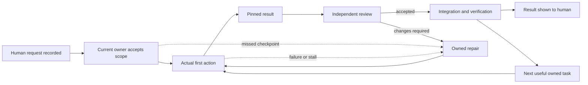
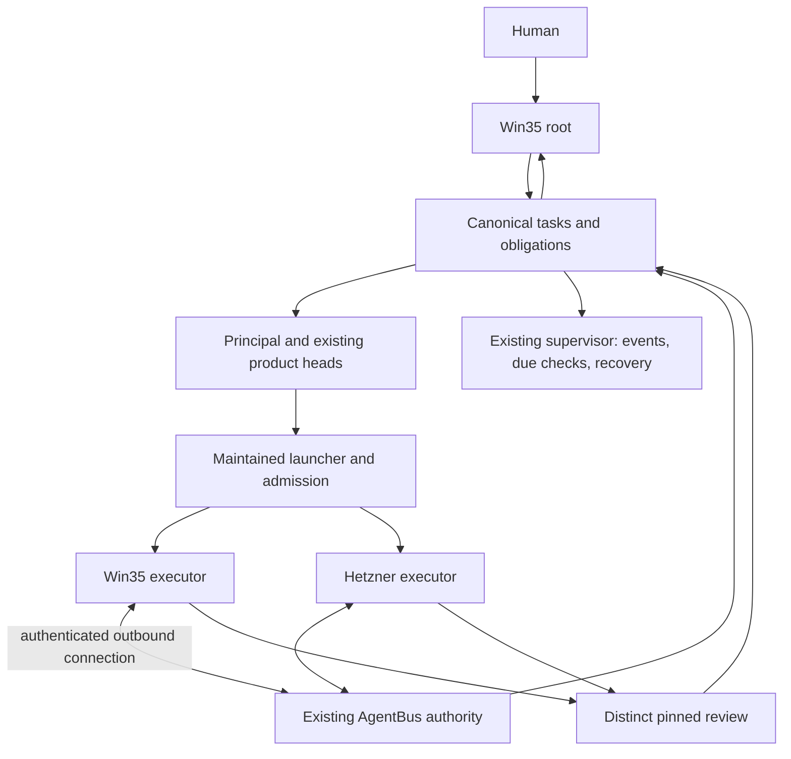

# From a human request to an accepted outcome across computers

**Draft 1 for human review — 7 October 2026.** This consolidates the existing Continuation Runtime process, principal notes and source audits. It is a review proposal and implementation contract, **not a claim that enforcement or unattended operation has been completed**. Canonical intake: `human-comprehensive-process-review-opus-article-20261007`; [verbatim instruction](../../experiment/human-comprehensive-process-review-opus-article-20261007.txt). The human will review and iterate before the Opus 5.5 article begins.

## 1. The outcome we owe the human

The human should be able to request an authorized result once and receive either the independently accepted result or a concrete decision that genuinely requires their input. Recording a task, sending a message and listing problems do not fulfill that promise. The system must retain responsibility while work is assigned, executed, reviewed, repaired, integrated and delivered.

The target contract requires accountable follow-through, durable evidence and bounded recovery within available authority and resources. Current enforcement is incomplete; this is an obligation we owe, not a demonstrated reliability guarantee. We cannot guarantee every technical goal succeeds or that a service never fails. A genuine limit remains visible, with executed diagnosis and alternatives; it does not erase the request or require the human to rediscover it.

The operational goals are:

1. Every known human request is preserved and reconciled to executable tasks, explicit constraints or documented supersession.
2. Each open obligation has a genuine current owner, a recovery owner, an executable next step, a due checkpoint and a durable trigger.
3. Failures cause diagnosis, repair or received handoff, followed by verified resumed work.
4. Teams continue useful completion → independent review → acceptance → next first action without human reminders or desktop dispatch.
5. Win35 and Hetzner participate through authenticated durable communication, with truthful host identity and safe reconnect behavior.
6. The tracker shows freshness and coverage; current useful workers and commits are measured alongside accepted outcomes.

## 2. What went wrong, including root's responsibility

The existing written rules are extensive. Their operational consequences are incomplete. Root follow-through too often ended at a reminder, delivery receipt or reported checkpoint rather than genuine custody and resumed action. Repeated status summaries exposed misses without proving a recovery path had acted. Older coordinate-only language was allowed to obscure the later explicit monitoring and recovery duty. Delegation distributes execution; it does not discharge root's human-outcome obligation.

Confirmed failures and observations must remain separate from their suspected causes:

| Observation | Confirmed evidence | Consequence and correction |
|---|---|---|
| Principal missed pending messages | Principal acknowledged using a moving-time inbox filter | Use fixed turn-start plus durable unread/exact-envelope reconciliation; preserve original timestamps and late ACKs |
| Task records disappeared across source/runtime lineage | Earlier 300-row snapshot, later published 277, and selected missing intake rows recovered from private snapshots | Guard every writer and checkout/reconciliation path; preserve per-ID history. Responsible writer/time remains unknown |
| Tracker returned HTTP200 with stale data | Earlier stale collector timestamp despite newer canonical tasks | Treat UI/API/freshness/store identity as separate checks; restore the existing collector and verify new data |
| Freshness repair was subsequently executed | Ant reported null `evidence_paths` TypeError repair, collector restart and fresh 281-row endpoints at 05:56:08 UTC; root verified fresh API at 05:57:32 UTC | A dated recovery observation, not continuous availability acceptance |
| Team permissions are not consistently checked | Source audit found ordinary acceptance and mutation paths without comprehensive role/scope/epoch checks | Put shared authorization and review validation at every consequential entry point; test bypasses |
| Cross-host bootstrap was confused with product readiness | SSH/source sync and local loopback exist, but secure physical nonSSH useful Win35 acceptance remains open | Bus owns endpoint implementation/configuration; root supplies an accepted physical bootstrap, not the missing server product |
| Autonomous refill and fifty useful workers remain unaccepted | Historical milestones and individual callbacks do not prove sustained useful cycles or current fleet coverage | Keep autonomy acceptance and 10→25→50 useful-concurrency acceptance separate |

Adding another document or watcher cannot fix these failures by itself. This document names the operation that must enforce each rule, the owner route and the evidence required before closing it.

## 3. Comparison with the principal

The principal's [coverage audit](../../research/codex/request-outcome-coverage-audit-20261007.md), published in `7e026f9`, and genuine returned pilot-adoption notes were compared with root's [research](../../research/orchestrator/REQUEST-OUTCOME-RESEARCH-20261007.md), [coverage audit](../../research/orchestrator/HUMAN-REQUEST-COVERAGE-AUDIT-20261007.md), [multi-host design](../../research/orchestrator/MULTIHOST-AUTONOMY-DESIGN-20261007.md) and [team enforcement audit](TEAM-INTERACTION-ENFORCEMENT.md).

| Topic | Principal position | Consolidated decision |
|---|---|---|
| Request lifecycle | Genuine ACK adopted recorded → owned → executing → review → accepted → delivered as an operating pilot | Adopt the obligations; explicitly distinguish pilot adoption from installed enforcement |
| Timing | Existing 10/30-minute wake intervals cannot guarantee five-minute ACK | Event-driven obligations plus proposed ≤60-second due scan in the existing supervisor; deadlines are adopted task contracts, not retroactive promises |
| First action | Deterministic work needs an actual operation receipt; model work needs maintained-launcher first tool | Use task-appropriate evidence; do not count a message or process start |
| Progress deadline | Semantic checkpoints vary by task; longer computation contract agreed in advance | Preserve original misses; no silent deadline extensions |
| Request coverage | 53 files at 05:46:40 UTC: 17 literal references, 31 thematic candidates, five mapping/policy gaps | Root's earlier 51-file scan had a different cutoff. Neither scan establishes all asks fulfilled; reconcile each requirement atom semantically |
| Failure recovery | Existing scoped Ant/Bus owners retain custody; protect QL source lease | Reuse existing teams and reviewed services; scope and ACK each cross-team repair |
| Secure endpoint | Bus responsibility, not a missing desktop SSH alias | Server/auth/config remains Bus-owned; physical Win35 acceptance remains a distinct gate |

The direct comparison was received from the genuine principal at 06:02:53 UTC, replying to root's exact comparison envelope. Its supporting [C3122 notes](../../research/codex/continuation-enforcement-notes-c3122-20261007.md) were published at `bc2ae1bd458f62381d19883f42d307208bac43bf` and fetched/read by root. The principal explicitly supports one canonical synthesis and holds the article for human review. This is actual notes comparison and operating-pilot agreement, not principal acceptance of every word of this draft or deployed controls.

Additional comparison corrections incorporated here: target-side actor/scope/current-ACK/epoch validation must cover every claim/write/review/accept; two useful accepted successor cycles must include worker/reviewer/network/unknown-readiness faults; durable journal effects can exist despite model-visible denial and require intent reconciliation rather than blind replay; endpoint runtime failure and valid independent artifact acceptance must remain separate facts. New Bus/Ant action-grant scopes are requested but their genuine ACKs remain pending. Neither administrative tracker updates nor registry reads grant those scopes.

## 4. Research basis and design choice

The [research comparison](../../research/orchestrator/MULTIHOST-AUTONOMY-DESIGN-20261007.md) examines primary documentation for agent harnesses, durable workflows, task ledgers, transactional outboxes, A2A, leases and consensus. The chosen design is one durable authority with existing product heads and replaceable host executors. Reasoning can remain flexible; state transitions, permissions, deadlines, reservations and evidence validation must be deterministic outside model context.

We reuse the maintained launcher, supervisor, AgentBus and tracker. We do not install a competing workflow engine merely because a mature one provides useful design patterns. A2A-style task/artifact transport does not supply our scheduler, independent acceptance or recovery policy. Leases record exclusive claims; target-side fencing enforces exclusivity. Neither establishes useful progress. Two computers with a two-voter majority cannot continue consensus after either voter disappears; no two-host high-availability guarantee is claimed.

The authoritative obligation-store boundary must be pinned before implementation acceptance: canonical request/task/history resides in the existing guarded TASKS authority; launcher attempts and Bus envelopes remain separately keyed operational records reconciled to it. This is a chosen contract, not proof that those stores are already transactionally unified. The current store/config paths, writer inventory, transaction/outbox boundary, reconciliation ownership and failure recovery must be independently accepted before claiming one enforced authority. The initial single canonical authority is an explicit availability limitation. Recovery uses durable private checkpoints, ordinary Git source recovery and received fenced custody. A third service, replicated authority or new spend requires a separately owned reviewed proposal within existing authorization.

## 5. Team definitions become permissions and obligations

There remain four products: Agent Branches, Agent Dashboard, Agent Quota Launcher and Cross-computer Agent Coordination. Continuation Runtime describes their shared process, not a fifth execution team. Current identities are resolved privately from genuine native/enrolled sessions and scoped ACKs; historical registry IDs are not proof of current custody.

| Role | Owns | Must not silently assume |
|---|---|---|
| Root, initially desktop and later explicitly accepted Win35 custody | Human intake, research/process synthesis, outcome monitoring, bounded communication/custody recovery, authorized local work/capabilities and human delivery | Another actor's identity, product source lease, routine product-code review or release authority |
| Principal | Priorities, continuous team oversight, peer challenges, cross-team dependencies, scope/custody coordination and course correction | Routine product implementation/review or protected head source custody |
| Product head | Task decomposition, genuine delegate registration, routing, progress/recovery, distinct review, integration within scope and refill | Self-review, duplicate writers or an unreceived peer handoff |
| Executor | Assigned implementation/research/test work and pinned evidence | Own-result acceptance or undelegated mutation |
| Independent reviewer | Checks pinned candidate against criteria and returns an attributable verdict | Reviewing own work or silently changing the candidate |
| Supervisor/collector | Configured mechanical transitions, routing, deadlines and measurements | Model judgment, fabricated readiness or implicit source-main permission |

**Permission and liveness are different controls.** An authorization validator rejects an unauthorized action. A durable obligation makes a required ACK, review, recovery or delivery due even when the actor stops talking. Both are needed. Authorized work should proceed automatically within received scope rather than wait for principal approval of every operation.

## 6. One request, one durable lifecycle

The canonical request retains exact words, known source/time, later steering, desired observable outcome and acceptance criteria. Unknown occurrence times remain unknown. Multi-ask messages are decomposed into requirement atoms linked to existing tasks. Constraints apply across tasks; they are not fake executable jobs. Supersession preserves the original and names the newer authority.

The task packet includes genuine owner/recovery owner, host/parent/generation, received scope ACK, epoch, workspace/owned paths, admission constraints, exact source/artifact pins, reviewer requirement, next action, dependencies, due checkpoints and continuation trigger. Evidence is referenced from private storage where necessary; secrets and raw transcripts do not enter public Git.

Every transition binds task/attempt, actor/host/generation/epoch, occurrence timestamp, predecessor and evidence digest. A failed attempt remains failed even if its artifact is useful. Task completion, review acceptance, integration, human delivery and successor execution are separate events. The parent human request closes only after all criteria and delivery are satisfied or explicit cancellation/supersession occurs.

Assignment creates a durable notification obligation in the same authoritative transaction as the state change. If current JSON storage cannot provide that atomicity, its limitation must be repaired or independently reconciled; two separate file writes are not a transactional outbox. Stable intent IDs and changed-payload rejection protect retries. Delivery, read ACK, semantic custody, first action and accepted outcome remain distinct.

## 7. Timing and what happens on a miss

The principal has adopted 5/10/15-minute objectives as an operating pilot, while challenging whether existing timers can fulfill them. Same-turn intake, five-minute owner ACK, ten-minute first action and task-specific progress checkpoints initially around fifteen minutes therefore require explicit task-level adoption, actual timestamps and recovery consequences. They are not installed guarantees or universal head promises. Existing task contracts take precedence. A long compute task can agree a longer semantic checkpoint before execution.

The existing supervisor should consume completion/dependency/failure events and scan due obligations at an independently reviewed interval proposed ≤60 seconds. Installed interval and observed latency must be measured. The thirty-minute root check is oversight and failed-custody recovery, not the dispatch clock.

At a miss, the current recovery owner must record and execute:

1. Confirmed cause versus hypothesis and bounded diagnostic action.
2. Repair, supported workaround or received scoped handoff already performed, with its actual result.
3. Independent verification and actual resumed useful action, or explicit remaining dependency.
4. Named next owner/action, original miss, next due and durable trigger.

Repeated identical reminders are not recovery. An unhealthy route changes to a freshly eligible supported alternative while independent useful work continues. Quota exhaustion or protected readiness cannot be bypassed. Ambiguous external effects are reconciled before retrying; non-idempotent writes are never blindly replayed.

Two missed semantic checkpoints can activate the existing reviewed failover protocol, subject to genuine loss/readiness, exclusive fenced epoch and received successor scope. Timeout alone does not transfer authority. Old generations must be rejected at dispatch, write and integration targets. Pending envelopes, drafts and private histories remain intact.

## 8. Multi-host operation: Win35 and Hetzner

Win35 runs useful local tasks and orchestrates Hetzner through the same task authority and evidence contract. It is not a second uncoordinated scheduler or independent allocation of shared provider quotas. Root startup/custody and any automation destination transfer require explicit verified handoff; synchronized source alone does not start a root.

This is the intended logical architecture, not a deployed network diagram. Outbound authenticated connections allow NAT/firewall-compatible work without assuming Hetzner can open a connection to the desktop. Endpoint reachability, device enrollment, isolation and exact recipient resolution must be proved on the physical hosts. SSH remains authorized bootstrap/recovery evidence, not final native product acceptance.

Each host executes task-scoped grants with current epoch and bounded authority. During a partition, only previously admitted isolated work within unexpired scope and reserved capacity may continue. No new shared claims, lease renewal, canonical integration or uncertain external mutations are permitted. Unknown quota prevents new model admission. Offline artifacts are preserved and reconciled before integration; an offline task copy is timestamped read-only evidence, not a second authority.

Reconnect reconciles exact envelope IDs, task/attempt/generation, cursors, acknowledgments and observed effects. Duplicate transport must not duplicate logical execution. A paused old host cannot resume writes after a successor receives a newer epoch. Model context is rebuilt from a task packet and pinned evidence; a live session is not magically migrated.

Bus currently retains secure endpoint ownership. Initial head reports described `bus-win35-endpoint-impl-01` launch and scoped output, plus discovery acceptance at 05:51:06 UTC. Principal's subsequent administrative reconciliation found actual endpoint first tool at 05:48:22 UTC and 141 model steps through 05:54:11, but launcher FAILED at 05:54:24 because the expected report was missing. A valid independently accepted pinned discovery-review receipt coexists with that review actor's FAILED runtime; these facts are retained separately.

The principal already sent bounded preserve/diagnose/reconcile instructions to Bus and Ant, then refined them with exact receipt and runtime evidence. Confirmed missing expected report is not a complete diagnosis of the result-flow cause. Root does not call the endpoint active, deployed or accepted. The 06:15 UTC reconciliation checkpoint remains; the earlier approximately 06:50 UTC promise preceded these failures and requires a renewed owner checkpoint rather than silent extension. One strict Ant delivery returned NOTREADY after a later-PTY contradiction; the original envelope stays pending without override. Physical authenticated Win35 nonSSH task/result/review/continuation and offline negatives remain open.

## 9. Where enforcement must run

For every consequential operation validate trusted actor binding, role/team/real parent, current received scope, allowed action/resource/paths, epoch, policy version and prerequisite evidence. Caller-supplied role strings are not authority. A parent's rights do not automatically become every child's rights.

| Boundary | Required gate | Current evidence level / gap |
|---|---|---|
| Canonical task writer and checkout | CAS, history/ID preservation, semantic transition and current scope/epoch | Guard exists; full writer/checkout coverage and role authorization unproved |
| Assignment/delegation | Trusted recipient/parent, received scope and persistent notification/first-action obligations | Native messages exist; full atomic state/outbox and obligation enforcement unproved |
| Launcher admission | Loaded configuration/store, current epoch, fresh shared quota reservation, task workspace and first action | Helpers and real admitted workers exist; ordinary caller coverage needs proof |
| Acceptance API/CLI | Exact immutable artifact, distinct genuine reviewer and task criteria | Validator exists; inspected ordinary accept route could bypass it |
| Terminal ingestion | Task/invocation/owner/generation binding and current custody | Some checks exist; optional owner and comprehensive role/epoch coverage gaps |
| Refill | Persistent successor/recovery obligation committed with acceptance | Individual refill attempts exist; error cannot disappear behind successful predecessor exit |
| Readiness/failover | Generation-bound safe idle, protected drafts/busy/unknown, genuine successor and target-side fencing | `c552765` source repair and distinct review; end-to-end loaded takeover still open |
| Source/runtime binding | Exact loaded module/binary/config/store manifest; reviewed reload/restart | `c610827` source manifest and changed-source exit reported; complete loaded coverage remains to verify |
| Bus action | Enrolled identity, project isolation, scoped task action/epoch, replay/cursor handling | Transport authentication alone is not role authorization or physical useful-work acceptance |
| Integration/release | Current source lease, reviewed exact revision, preserved fallback and release criteria | All consequential writer paths must be enumerated; no implicit main permission |

Maintained tools can enforce their own boundaries. Unrestricted agents running as the same OS user can still bypass controls with direct shell/file operations. That residual boundary must be declared and measured. Scoped workspaces/tool interfaces can reduce it within current authorization; this document does not authorize an unrelated global permission lockdown or claim universal prevention.

## 10. Tracker availability, requests, agents and commits

The tracker must remain the visible canonical view of obligations. The existing private service is host-local port 8766 through authorized access. A usable page, task API, canonical-store identity, freshness, drilldown and independent Win35 access are separate acceptance criteria. HTTP200 is a point observation. Proposed availability/freshness/recovery SLO values require owner adoption and measured coverage; literal 100% uptime is not promised.

| Metric | Definition and exclusion |
|---|---|
| Request coverage | Reconciled requirement atoms / enumerated known source atoms, cutoff and inaccessible gaps; filename matches alone do not count |
| Useful ACTIVE / 50 | Current distinct useful executors and real harness subagents with recent task-bound action, deduplicated host/provider/session/generation/parent; exclude heads, services, idle, queued and ended actors |
| Executable READY reserve | Accepted scoped task packets with dependencies satisfied and viable current admission route; proposed/blocked rows do not count |
| Accepted outcomes | Unique task IDs with actual semantic acceptance and distinct pinned review in the stated window; source-only child acceptance cannot close broader deployment scope |
| Commits | Unique Git SHA by repository and branch coverage in aligned windows, committer timestamp declared; separate non-merge and integration commits, deduplicate mirrors |
| Recovery | Miss-to-action and repair-to-resumed-work latency, stale/orphaned owners, failed refill and recurrence |
| Human intervention | Reminders and manual rescues per request/window, with accepted outcomes and coverage to prevent gaming |
| Availability/freshness | UI/API success, latency, canonical-store binding, data age and observation coverage; stale success is a failure |

Use hourly Berlin buckets, exact rolling 24-hour and 30-minute windows with UTC boundaries, data-as-of and unknown coverage. Quota percentages do not measure tokens or spending. Missing fleet/host/harness coverage keeps the total unknown rather than zero.

Ant reported 14 live processes and 333 unique commits across five repositories over 24 hours on this morning's snapshot. Those process categories include unregistered and waiting actors; they are **not 14 useful workers**. The commit report needs exact window/source/reachability coverage before comparative use. The historical independently verified 25 useful workers on 5 October is not a current count. Current overall useful ACTIVE/50 and executable reserve remain unverified in the evidence used for this draft.

On tracker failure, restore the existing singleton service and access path under genuine custody. Preserve canonical writes and provide a timestamped last-known read-only copy. Source checkout must never overwrite live obligations. Every failure becomes a task-linked executed recovery, not a hidden stale screen.

## 11. Rollout through existing ownership

This table maps implementation to existing lanes; it does not grant peer-owned paths. The principal must obtain missing scoped ACKs and actual due timestamps. Unknown dues remain unknown instead of inventing a plan promise.

| Milestone | Existing route/task | Required next acceptance |
|---|---|---|
| Reconcile all human asks and disappearing rows | Principal intake mapping; `human-request-outcome-process-20261007`, C2710 reconciliation | Per-atom mapping, preserved original/history, all writer/checkout lineage audited; responsible loss path confirmed or clearly unknown |
| Usable fresh tracker and trustworthy metrics | `human-tracker-availability-agents-commits-20261007`, `scale50-58`, collector C3111 | Genuine scoped owner ACK, Win35 UI/API/store/freshness proof, aggregate definitions and failure/restart test |
| Due obligations and safe recovery | Ant received C3110 supervision scope | Loaded event/due scan, missed ACK/action/review/refill repair, protected readiness negatives and exclusive takeover |
| Launcher normal-path authorization/review/refill | Existing QL source owner and scale50 A/D; read-only Ant reconciliation where ACKed | Direct CLI/API negatives, current store/epoch, pinned independent acceptance, persistent failed refill followed by next first tool |
| Secure physical cross-host execution | Bus received C3120/Win35 scope and `bus-win35-endpoint-impl-01` | Distinct reviewed endpoint, device/config custody, actual physical bidirectional useful task and reconnect negatives |
| Adopt team interaction rules | `human-team-interaction-enforcement-20261007`, principal coordinated scoped lanes | Every consequential caller accounted for, permissions and durable obligations tested; no principal-per-action bottleneck |
| Autonomous useful cycles | Existing `ROLE-FAILOVER-LIVE-ACCEPTANCE-20261006` and recovery lanes | Root/principal absent: at least two useful completion→review→acceptance→next-first-action cycles plus recovery |
| Useful concurrency 10→25→50 | Five streams in [SCALE50-RECOVERY-PLAN](../SCALE50-RECOVERY-PLAN.md) | Measured eligible provider capacity, owned executable backlog, current inclusive deduplicated counts and stage results |
| Win35 root custody | [WIN35-ROOT-INSTRUCTIONS](../WIN35-ROOT-INSTRUCTIONS.md) | Clean exact source sync, real startup identity/scope/continuation ACK, explicit automation custody; source sync alone insufficient |

Implementer and reviewer are separately delegated through current heads. Heads keep other useful work moving while reviews or dependencies are pending. Root verifies actual repair/handoff outcomes and delivers them; it does not become the product scheduler or approval gate.

## 12. Acceptance campaign

Controls are declared enforced only after independent review of production caller coverage, exact installed/config/store pins and live outcomes. The campaign must cover legitimate positive work and these negatives:

1. Crash between assignment and send; replay produces one logical obligation.
2. Duplicate envelope and changed payload under the same ID; dedup and reject correctly.
3. Missing ACK, ACK without action and stalled progress; bounded recovery actually resumes useful work.
4. Old epoch, fabricated role/parent, wrong team/paths and unACKed scope; reject at real CLI/API/write targets.
5. Self-review, missing reviewer action and artifact mutation after review; ordinary acceptance paths reject.
6. Successful external effect with lost receipt; reconcile before supported retry.
7. Concurrent tracker writes and source checkout; preserve IDs/history and reject stale writes.
8. Failed refill; predecessor stays accepted while persistent recovery obtains the next first action.
9. Principal/root loss, worker/reviewer loss and protected busy/draft/unknown states; safe custody and independent work continue.
10. Physical Win35 partition/reconnect; no duplicate task or stale integration, exact cursor/envelope reconciliation.
11. Tracker failure/stale snapshot; actual restore, fresh canonical view and honest offline fallback.
12. User-visible delivery; a completed report has its verified public URL, short summary and actual new illustration evidence.

Two successful useful cycles are an initial demonstration, not a statistically established reliability guarantee. Repeat realistic failures and measure recovery/coverage over time. Source tests, timers, head callbacks, toy consumers or launch counts cannot substitute for useful end-to-end acceptance.

## 13. A worked example

The human asks for Win35 to execute a useful task through AgentBus. Root records the requirement and links existing Bus tasks. The current Bus head accepts endpoint implementation scope and declares a checkpoint. An eligible executor starts through the maintained launcher, produces a pinned adapter/config result, and a distinct reviewer checks security and failure cases. The head deploys only the accepted revision within its lease and supplies private enrollment separately from a secret-free bootstrap brief.

Win35 enrolls with genuine device identity and pulls a scoped useful task. Its executor records first action, produces a result and sends the exact envelope. A distinct review is accepted; a successor starts automatically. If the connection drops after the result send, reconnect reconciles that envelope before retry. If an owner stops, the existing supervisor preserves the obligation and applies fenced received recovery. Root shows the accepted outcome and limits without requiring another human reminder.

If the endpoint test fails, the task remains open. The report names the confirmed failure, the repair already attempted, result, verifier, next owner/due and durable trigger. Local loopback or SSH success does not close the physical nonSSH requirement. This is an acceptance scenario, not a claim it has already happened.

## 14. Preserved limits

Retain privacy, truthful identities, fresh provider quotas and aggregate shared capacity, independent review, ordinary Git recovery, protected dirty work/drafts, process containment, current disk/scratch policy, Rust/global-install hold and spending restrictions. The initiative RAM override removes estimated/free-RAM dispatch refusal for that initiative; it does not waive containment or other limits. Cloudflare's total USD5 including base plan is not a metered hard cap; optional cloud relay remains held without actual aggregate usage and preventive bounds. Agent execution remains on authorized user hosts/Hetzner. No new services, purchases, arbitrary provider split or busywork is implied.

## 15. Human review and later Opus 5.5 article

Please review whether this process gives the right responsibility boundaries, recovery consequences, proof requirements and visibility. We will keep versioned changes and record accepted decisions without replacing operational evidence with approval of the prose. Review comments can alter the design; genuine current owners reconcile affected scopes and acceptance tasks.

**Article stage: NOT STARTED; dependency is an explicitly accepted design version after review/iteration.** Root retains this dependency in the canonical task and existing heartbeat. Once satisfied, use the existing publication owner and remote preparation workflow with a separate feature-article key, not a competing daily writer or scheduler.

The article brief will require:

- Genuine **Opus 5.5**, verified actual supported model/route and fresh admission. If unavailable, report the evidence and obtain the model decision; never silently use another Opus version.
- The exact accepted document digest and a fresh fact cutoff, distinguishing proposed architecture, implemented source, loaded controls and independently accepted operation.
- A reader-facing explanation of the request lifecycle, team responsibilities, multi-host execution, failure recovery and how each rule is enforced; use concrete failure examples and honest current limits.
- New ImageGen illustrations in the approved flat editorial style, with actual generation evidence and publication-owner acceptance/integration. Use desktop capability only if unavailable remotely.
- Editable diagrams for request flow, host/authority topology and failure/recovery, plus reviewed renders. Intended topology is labeled as such.
- Existing full stylint and independent factual/editorial/rendered review at exact source/assets pins. Private identifiers, credentials, transcripts and internal archives remain private.
- Delivery of the reviewed article draft first. Publication follows separately authorized release and existing gates; a published edition is shown with its verified live URL and short share-ready summary. No automatic social posting.

## 16. Evidence and version discipline

Initial evidence cutoff: 7 October 2026, 05:57:32 UTC / 07:57:32 Berlin. Principal's direct comparison and supporting notes were subsequently received and read through approximately 06:06 UTC / 08:06 Berlin, retaining their exact event times. The principal additionally verified API 282-task parity and 06:01:35 freshness; source-byte equality does not prove loaded collector-module identity. No historical datum is promoted to current state.

Supporting documents: [request contract](REQUEST-TO-OUTCOME.md), [enforcement ledger](ENFORCEMENT.md), [multi-host process](MULTIHOST-PROCESS.md), [team/interaction controls](TEAM-INTERACTION-ENFORCEMENT.md), [metrics](METRICS.md), [root lessons](../../research/orchestrator/WIN35-ROOT-LESSONS-20261007.md), [principal coverage audit](../../research/codex/request-outcome-coverage-audit-20261007.md). Governance remains [ROLE-CONTRACT](../ROLE-CONTRACT.md), [OPERATING-MODEL](../OPERATING-MODEL.md), [RESOURCE-POLICY](../RESOURCE-POLICY.md), [USER-STEERING](../USER-STEERING.md), canonical TASKS/TEAM-REGISTRY and latest explicit human steering.

The review document is a consolidated explanation. Canonical task state, private evidence and genuine ownership remain authoritative. A document being committed or copied to Win35 does not complete any of its runtime gates.
