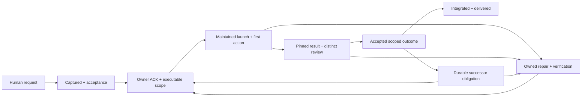

# From request to delivered outcome across computers

**Draft 2 — shortened for human review,7 October 2026.** This amends Draft 1 at887e8b0. It describes the intended process and required proof; it does not claim installed enforcement or autonomous operation. Human task: `human-comprehensive-process-review-opus-article-20261007`.

**Why read this:** review responsibility, recovery and enforcement design as a whole. Routine checks use the short operating references and current tracker, not this design/history. The article waits for an explicitly accepted design version.

## The outcome we owe

A human asks once. We preserve the requirement, keep a current owner accountable through execution/review/recovery, and deliver the accepted result. If a decision genuinely exceeds existing authority, we prepare the concrete options and ask. Delegating or sending a message does not discharge the coordinator's obligation.

The four products are Agent Branches, Dashboard, Quota Launcher and Cross-computer Coordination. Principals own coverage and course correction; heads delegate execution and distinct review, integrate and refill; the maintained supervisor retains event/due obligations between turns; root handles human intake/delivery and bounded failed-custody recovery. No routine human/root approval is needed for authorized useful work.

## What must change

| Observed failure | Required correction |
|---|---|
| Repeated pings with no verified action | Diagnose the failing transition, execute recovery or receive a healthy-owner handoff, then verify resumed action. Change an ineffective remedy. |
| Requests/rows lost across source/runtime lineage | One authoritative tracker, stable IDs/history, guarded concurrent writers and checkout/cutover reconciliation. Preserve cause uncertainty. |
| HTTP200 serving old data | Verify UI/API, canonical-store identity and data age separately; recover the existing service and prove fresh parity. |
| Written team rules without caller coverage | Validate actual actor/scope/epoch/review at every consequential operation, and test direct bypasses. |
| Source sync/one-host tests treated as cross-host readiness | Physical secure task/result/review/continuation and reconnect acceptance on both computers. |
| Launches/timers/count labels treated as autonomous work | Useful completion→distinct review→acceptance→next first action without desktop nudges, plus failure recovery. |

Root's earlier reminder/delivery-only follow-through was insufficient. Historical incident details, timestamps and exact receipts remain in dated research/tasks and Draft 1, not duplicated here as current state.

## Principal comparison and research

Root genuinely compared principal C3122 notes atbc2ae1 and direct reply `01a114f5-2812-7fe3-9ab5-75cba6657bf0`, alongside root request-outcome, multi-host and team-control audits. The principal adopted the lifecycle as an operating pilot, challenged whether current10/30-minute wake intervals meet5-minute ACKs, required real first tools/operation receipts and task-specific progress contracts, and supported one review draft.

The design uses one durable task authority, existing heads and replaceable scoped host executors. Authentication and leases alone do not enforce stale-owner rejection. Neither proposed<=60-second due scanning, two-host quorum HA nor approval of this document establishes installed timing/availability. See MULTIHOST-PROCESS.md and the supporting research for alternatives and source evidence.

## One request, one lifecycle

Each transition binds request/task/attempt, actor/host/real parent/generation/epoch, occurrence time, predecessor and evidence digest. Preserve failed attempts and original missed deadlines. Delivery, read ACK, ownership acceptance, first action, artifact acceptance, deployment and human delivery are distinct. Close the parent only after all criteria/delivery or explicit cancellation/supersession.

Assignments persist notification obligations with state; current separate JSON writes do not prove an atomic outbox. Stable intent IDs and changed-payload rejection protect replay. Lost receipts require effect reconciliation before retry, especially for external mutations.

## Deadlines and failure consequences

The5-minute owner ACK,10-minute first-action and initial15-minute progress objectives are an operating pilot requiring actual task-level adoption and due timestamps. Longer computation can agree a checkpoint in advance. Original misses remain visible. Existing event/dependency/failure handling and proposed bounded due scans belong to the maintained supervisor; desktop 30-minute checks are oversight/recovery, not dispatch clocks.

At a miss, the received recovery owner executes diagnosis, repair/workaround or scoped handoff and records actual result, independent verification/resumed work, next owner/action/dependency/due and durable trigger. Repeated identical reminders are not recovery. Keep independent eligible work moving. Failover after repeated semantic misses still requires genuine safe readiness, exclusive received custody and target-side epoch fencing; timeout alone grants nothing.

## Enforcement boundaries

| Operation | Required check |
|---|---|
| Task claim/write/checkout | Trusted actor, scope/role/team/real parent, current ACK/epoch, valid predecessor and preserved IDs/history |
| Launcher admission | Authoritative loaded config/store/controller, fresh quota/shared reservations, bounded task/workspace and first-action evidence |
| Terminal/review/acceptance | Task/invocation/owner binding; immutable artifact, distinct actual reviewer and semantic criteria at every CLI/API entry point |
| Refill/due/recovery | Durable outstanding successor/repair obligation; safe readiness and received fenced successor, not successful exit alone |
| Bus/integration/release | Enrolled identity and task-action permission, exact IDs/cursors, current edit-scope claim and accepted release evidence |

Existing guards/validators/source fixes provide selective controls, not comprehensive production coverage. Each release needs exact installed module/binary/config/store evidence and independent live acceptance. Unrestricted same-user shell/file access can bypass tool boundaries; retain that explicit limitation. This proposal does not authorize global ACL changes, another broker or duplicate watcher.

## Multi-host work

Win35 and Hetzner share the task authority and aggregate provider reservations. Hosts use authenticated outbound AgentBus connections, enrolled identities, exact recipient resolution and scoped epoch-bound task packets. NAT-friendly outbound transport avoids assuming either host can directly contact a desktop chat. Source cloning/SSH remains bootstrap/recovery evidence.

During a partition, only previously admitted isolated work within unexpired scope and reserved capacity may continue. No new shared claims, lease renewal, canonical integration or uncertain mutations. Unknown quota prevents new model admission. Preserve offline artifacts/read-only snapshots; reconnect reconciles envelopes, attempts, cursors and actual effects before integration. A resumed old generation cannot write after a fenced successor. Context is reconstructed from a task packet, not magically transferred from a live model session.

Actual Win35 startup, device enrollment, useful physical task/reply/review/successor and reconnect remain separate acceptance obligations. No current deployed/fleet claim is made by this document.

## Tracker and measurements

Every ask must map to an obligation or explicit constraint/supersession. Each open task shows received owner/recovery owner, next action/due, latest useful evidence and continuation. The trackers are plain GitHub issues, with no GitHub Project: each project's team owns its own tracker, and the principal's high-level tasks are issues in the public repository alexeygrigorev/cloudflare-agent-git; private evidence stays outside issues. TASKS.json is a legacy ledger migrating into issues. No two writable authorities.

Measure current useful ACTIVE/50 and executable READY reserve, accepted unique outcomes, aligned hourlyBerlin/rolling24h unique-SHA commits, request/recovery latency and human reminders/manual rescues. Deduplicate host/provider/session/generation/parent; separate heads/services/idle/ended and unknown coverage. Quota is not token usage/cost, commits are not accepted results, and a status card is not useful activity. METRICS.md holds exact definitions.

Tracker acceptance includes usable UI/API, fresh canonical parity, Win35 access and tested recovery. On outage preserve pending obligations and a timestamped read-only export; recover the existing owned path. Do not promise100% uptime.

## Rollout and acceptance

Principal obtains current scoped owner ACKs, existing task mappings and due checkpoints for tracker reconciliation, normal launcher/review/refill gates, safe due/failover, physical Bus work and interaction enforcement. Heads delegate implementers and distinct reviewers; root follows recovery/delivery. Required task references remain in the tracker and supporting enforcement/scale plans, not stale routing tables here.

Acceptance must cover intake completeness; concurrent writers/checkout loss; crash-after-assignment/replay/changed payload; missing ACK/action and failed refill; forged scope/stale epoch; self-review/changed artifact/direct accept; uncertain effect retry; busy/draft/unknown/quota-error readiness; worker/reviewer/root/principal loss; tracker outage; physical partition/reconnect; and human-visible report delivery. Demonstrate two useful unattended reviewed successor cycles plus recovery. This is an initial demonstration, not a statistical reliability guarantee.

Example: for a Win35 useful-task request, Bus owns reviewed endpoint/config and device-local enrollment; Win35 claims a scoped task, produces a result and reconciles send/reconnect; a distinct review is accepted and the next task begins. If the endpoint fails, preserve the failed attempt and show the repair already executed plus next owner/due. One-host loopback or SSH does not close this requirement.

## Limits, review and article

ROLE-CONTRACT and RESOURCE-POLICY retain privacy, genuine identity, edit-scope claims, drafts/dirty work, independent review, quotas/shared reservations, process containment, current disk/scratch rules, initiative RAM override, Rust/global-install hold, ordinary Git fallback and totalUSD5Cloudflare boundary. No purchases, automatic contest entry, duplicate services/writers, fake work or arbitrary provider split.

**Article NOT STARTED.** Human review/iteration must accept an exact design version first. Then existing publication custody coordinates actual verified Opus 5.5, fresh ImageGen in the approved style, editable lifecycle/host/recovery diagrams and distinct factual/editorial/rendered review with full stylint. No model substitution or automatic publication/social post. Deliver a reviewed draft; published release needs its verified live URL and short share-ready summary. Routine daily reporting continues independently.

Supporting references: REQUEST-TO-OUTCOME, ENFORCEMENT, TEAM-INTERACTION-ENFORCEMENT, MULTIHOST-PROCESS, METRICS, SCALE50-RECOVERY-PLAN; research/orchestrator/REQUEST-OUTCOME-RESEARCH-20261007.md, MULTIHOST-AUTONOMY-DESIGN-20261007.md and principal continuation-enforcement-notes-c3122-20261007.md. Original evidence cutoff/receipts and full comparison are preserved in Draft 1 at887e8b0. This shortened amendment changes presentation, not acceptance state.
