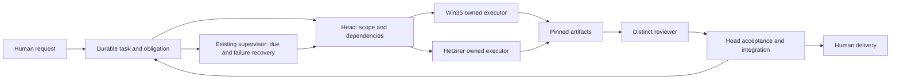

# Multi-host autonomous operating process

Read [design research](../../research/orchestrator/MULTIHOST-AUTONOMY-DESIGN-20261007.md), [request contract](REQUEST-TO-OUTCOME.md), [enforcement ledger](ENFORCEMENT.md) and current resource policy. **Recommended design; operating pilot partly adopted, installed multi-host enforcement not accepted.** Existing protected source scopes and genuine owners remain authoritative.

## One obligation, replaceable execution

Use the existing canonical tracker/event authority, maintained supervisor, Agent Quota Launcher, AgentBus and product heads. Keep task history and obligations independent of model context/host process. Principals plan across teams, heads decompose and integrate, independently owned workers execute, distinct reviewers assess pinned results. The root follows through and delivers outcomes; ordinary dispatch/repair must continue without it.

The diagram is a target process, not an installed topology. No new scheduler/service is implied.

## Task packet and claim

Before dispatch, record stable request/task/attempt IDs, source and acceptance, dependency IDs, current owner/backup identity and epoch, host eligibility, workspace/pinned base, owned paths, tool/model fit, actual fresh admission and account reservation, reviewer/integration contract, due checkpoints and durable trigger. A worker claims through the authoritative maintained path; scheduling receipt is separate from first useful action. Expired/offline claims do not silently become READY.

Each host registers genuine device/session/generation, supported tools and containment, current health and private evidence pointers. Capability advertisements are not admission receipts. Account quotas and occupancy are shared across computers. Windows-specific controls must be proved; Linux service assumptions cannot be copied as Windows acceptance.

## Context handoff

The successor packet contains goal and acceptance checklist, confirmed facts versus hypotheses, exact committed/source/artifact/review pointers, prior failed attempts and executed repair, dependencies/owner ACKs, preserved private logs, operation-intent receipts, next concrete action and checkpoint. It excludes credentials and unrelated private corpus. At startup the successor verifies its own identity, current source/epoch/scope and actual environment; stale role tags or copied environment variables do not transfer custody.

Model context can be reconstructed from the durable packet/events. Preserve recoverable original history privately. Do not claim that arbitrary model state or a live conversation migrates transparently across providers/computers.

## Normal loop

1. Root records human intake and acceptance; principal/head receives genuine scope custody. UnACKed intake remains root-owned.
2. Head creates substantive disjoint task contracts and accepted READY reserve, then compatible host executors claim work under maintained launcher and fresh gates. Keep reviews parallel when ownership/dependencies allow.
3. Worker reports real first action/progress and terminal artifact with task/host/session/generation. A final model turn is only an attempt checkpoint.
4. Terminal success creates a durable independent review obligation. Rejection creates owned repair; another eligible independent task continues meanwhile.
5. Owning head accepts the exact reviewed result and integrates within its lease. Commit hashes/artifact outcomes are recorded; source acceptance and deployed/useful adoption remain separate.
6. Acceptance creates a durable successor obligation. The maintained path verifies next useful model first action; failure persists recovery owner/due. Root delivers the requested outcome or verified public report without a human reminder.

Required implementation: task APIs must reject invalid state/evidence/epoch, and deployed AgentBus must authenticate scoped endpoints/devices and preserve exact envelopes/read ACK/semantic acceptance/task outcome separately. These complete installed guarantees are not yet proved. Prefer outbound connections from user computers to the reviewed reachable endpoint; direct inbound access or a Hetzner SSH alias is not necessary for that design. Optional protocol interoperability does not itself install persistence, security or autonomy.

## Failure and partition policy

| Failure | Immediate owned action | Permission to resume |
|---|---|---|
| Missing ACK/first action | Diagnose current identity/readiness, route/config/health and actual pending envelopes; obtain bounded received backup custody | Safe current recipient and actual operation/model action; never busy/draft/unknown injection |
| Worker or reviewer disappears | Preserve artifact/receipt, investigate actual lifecycle and current epoch; reassign only after fencing/received handoff | Current exclusive scope, fresh gates and new first action |
| Host disconnect | Retain cursor/outbox; continue only pre-authorized disjoint isolated work with still-valid verifiable authority/admission | Reconnect reconciles intent/effects/current epoch before replay/integration; unknown quota denies new dispatch |
| Shared authority unavailable | Keep read-only last-known tracker and authorized isolated work; persist local evidence without shared integration | Proven authority recovery and reconciliation; no second offline canonical writer |
| Lost receipt after effect | Query supported receipt/target state and reconcile original intent | Same supported idempotency contract or verified compensating action; no blind uncertain retry |
| Stalled plan/repeated route failure | Compare plan/progress evidence, bound attempts, select supported alternative/decompose differently, record challenge | Independent task/resumed useful progress; another reminder is not recovery |
| Tracker lost rows or stale checkout | Recover exact missing records from durable evidence, preserve all current IDs; diagnose writer/sync bypass | Every writer/update/checkout path preserves obligations; live API and restart/checkout negative independently pass |

Host liveness, role lease, execution progress and semantic acceptance are different signals. Never declare takeover merely from an expired timer. Require current exclusive epoch validated by the dispatch/write target and genuine successor scope ACK; source-main leases stay protected. Two computers alone do not establish quorum-based highly available authority. Declare the initial single-authority limitation and safe degraded mode; do not add an unapproved quorum service or buy infrastructure.

Offline work requires an explicit pre-issued bounded grant: isolated owned paths, permitted local effects, expiry and already reserved shared capacity. No offline renewal, new shared claim, external mutable effect or canonical integration is allowed. Expired/unverifiable authority or unknown quota stops affected dispatch; retain artifacts and continue only independently authorized work whose gates remain verifiable. An offline model may produce isolated artifacts under the grant but cannot assume its epoch still owns shared resources; reconciliation and current-epoch validation precede integration. This degraded mode is limited useful execution, not uninterrupted global autonomy.

## Enforce through existing owned work

| Existing route | Next process control to implement/verify | Required proof |
|---|---|---|
| Principal + existing tracker/guard owner, C2710 reconciliation | All intake and writer/sync paths preserve request IDs/history and validate transition obligations | Newly observed intake-loss negative; exact scoped recovery plus durable prevention and live source/API parity |
| Bus current327 scope / C3120 | Actual reviewed endpoint/enrollment, outbound Win35 receiver and durable task/status/artifact/reconnect semantics | Physical secure useful bidirectional model task, independent acceptance and offline replay/dedup |
| Ant currentC3110 + role-failover rows | Current readiness/quotas, due events, safe epoch/custody recovery and durable review/refill obligations | Exact loaded pin, protected-state negatives and useful absent-root/principal cycles |
| QL protected source owner + refill/fencing lanes | Shared reservations, compatible host claim, all acceptance paths and durable successor | Source/installed parity, distinct pinned review gate and next model action after failed-refill recovery |
| Existing Dashboard/collector/publication owners | Request/task transition ages, current useful actor coverage, per-repo commits, availability and human delivery | Owner ACK, actual installed view/coverage and delivered result; no duplicated collector/writer |

This table proposes control scope, not new leases or accepted head deadlines. Principal coordinates genuine mappings/ACKs/dues through current tracker. Adopted pilot response `01a114e4-91f7` calls for event-driven obligations and <=60s due scan in the existing supervisor; that is a proposal/adoption direction, not observed installed timing. Existing task-specific commitments and preserved misses remain.

## Autonomy release gate

Use the real-task/fault experiment in the research document. At least two useful accepted completion/review/successor cycles with root and principal absent are the initial demonstration, not statistical reliability proof. Repeat across worker/reviewer loss, network interruption, ambiguous effects, epoch conflicts and tracker checkout/restart. Record failures and interventions. Expand10→25→50 only with substantive backlog and measured current provider/host outcomes; no fixed provider split, fake workers or forgotten review queue.

Declare separately: process adopted, source reviewed, installed path verified, small-cycle autonomy accepted, physical multi-host recovery accepted, and sustained scale target accepted. The human should receive concrete outcomes and executed recovery; the runtime should not require their reminders to find the next task.
