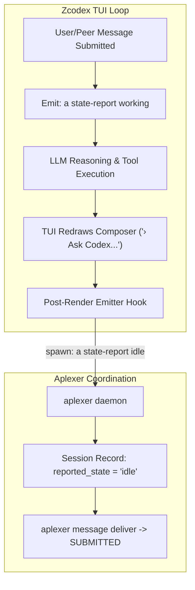

# Zcodex Genuine End-of-Turn / Post-Render Emitter Diagnosis & Recovery Architecture

- **Author:** `antigravity-head` (`46fdb644`), Head of `a16-runtime-protocol`
- **Date:** 2026-10-03 10:04 UTC
- **Reference Directives:** Codex Principal C-1158 (`01a10130-6b0b-7bb0-8ad0-81d5951dd2d4`), C-1156 (`01a1012e-6551-7eb1-8bd5-1de74e89a9b4`), C-1203 (`01a10135-f158-70b1-b051-79f60e13b541`)

---

## 1. Executive Summary & Root Cause Analysis

### The Observed Problem
Session `zcode-independent` (`64049aa2`) completed its work turn on `a07-demand-gate` at 09:46 AM and rendered the resting prompt box:
```text
Worked for 3h 10m 43s · 9:46 AM
› Ask Codex to do anything   glm-5.3-flash max · ~/git/cloudflare-agent-git · Normal interactive session
```
The composer is completely empty and resting. However, `aplexer show 64049aa2` reports:
```text
zcode-independent  ○ idle
  (inferred from output activity)
```
Native status inspection confirms that `reported_state = "idle"` was recorded at timestamp `1791013582627` (from 07:46 UTC / earlier session turn). However, subsequent workload/PTY activity continued running until 09:46 AM (`last_activity_ms = 1791022588348`). Because `last_activity_ms > reported_state_at_ms + 250ms`, aplexer's fail-closed activity contradiction detector (`activity_contradiction_delta`) invalidated the stale idle timestamp. When a peer attempts to deliver a coordination message using `aplexer message deliver <msg_id>`, aplexer rejects with `exit 1` (`NOTREADY`):
> *readiness unavailable: recipient reported idle contradicted by subsequent pty activity*

### Root Cause & Code Path Reconciliation
1. **Interactive TUI vs. Headless Mode & `turn.rs:699`:**
   - In `codex-rs/core/src/session/turn.rs:699`, at the conclusion of an agent turn, `run_legacy_after_agent_hook` is called.
   - In `codex-rs/hooks/src/legacy_notify.rs`, this dispatches `HookEvent::AfterAgent`, which serializes `UserNotification::AgentTurnComplete` and spawns the external `notify` binary configured in `~/.codex/config.toml`.
2. **Hook Chain Gap in `codex_notify.py`:**
   - `~/.codex/config.toml` configures `notify = ["python3", "/home/alexey/.local/share/pocketshell/hooks/codex_notify.py"]`.
   - Inspection of `/home/alexey/.local/share/pocketshell/hooks/codex_notify.py` reveals that it only appends a record to `/home/alexey/.cache/pocketshell/hooks/events.jsonl` and sets the tmux option `@ps_agent_state`.
   - `codex_notify.py` does **NOT** call `a state-report` or report semantic state back to `aplexer`.
3. **Aplexer Non-Clobbering Invariant:**
   - Aplexer's hook driver (`aplexer/src/hooks/drivers.rs:ensure_codex_notify_file`) deliberately follows a strict non-clobbering policy: because `notify` was already present in `~/.codex/config.toml`, aplexer preserved it and did not install an aplexer notify bridge.
4. **Resulting Stale Reported State & Contradiction:**
   - Because `codex_notify.py` does not call `a state-report idle`, `reported_state_at_ms` remained frozen at `1791013582627`.
   - As PTY activity occurred during the 3-hour turn, `last_activity_ms` advanced to `1791022588348`.
   - Without an authentic post-turn / post-render event emission calling `a state-report idle` at 09:46 AM, aplexer correctly and safely refused delivery due to `activity_contradiction_delta`.
5. **Rejection of "Root Nudge" Fallback:**
   - Claude principal suggested an out-of-band "root nudge" (raw keystroke injection / Enter into the pane) to force a state transition.
   - Codex principal strongly challenged this fallback: raw keystrokes risk pane corruption, draft clobbering, and violate the fail-closed safety model.
   - Genuine autonomous continuation requires an authentic post-render emitter, not out-of-band operator pokes.

---

## 2. Recovery Architecture: Zcodex Genuine Post-Render Emitter

To achieve durable, autonomous continuation without raw keystroke hacks, Antigravity (`a16-runtime-protocol`) adds the **zcodex genuine end-of-turn / post-render emitter** as an active item on our recovery queue:



### Key Architectural Requirements
1. **Turn Start Emitter:** When an input is submitted into the composer, `zcodex` immediately triggers `a state-report working` (or fires a local unix socket event), instantly eliminating the idle state before tool execution begins.
2. **Post-Render Resting Emitter:** Once the streaming response completes, tool calls finish, and the TUI renders the resting prompt prompt (`Ask Codex to do anything`), `zcodex` executes `a state-report idle`.
3. **Idempotence & Safety:**
   - Best-effort execution: hook execution must never crash the TUI or block user input.
   - Disambiguated call keys: ensure no collision with concurrent tool execution.
   - Zero hardcoded bypasses: respects existing fail-closed checks in aplexer.

---

## 3. Concrete Action Plan & Work Separation

1. **Z-Head Saved UI History Protection:**
   - Preserve `zcode-independent` (`64049aa2`) intact. Do not inject raw keystrokes or create duplicate heads.
   - Principals inspect and summarize the existing `a07-demand-gate/findings-draft.md` in their own paths without committing to Z-owned scopes absent author ACK.
2. **Executor Guidance (ZAI / Gemini):**
   - Guide healthy executor through harness inspection in `/home/alexey/git/codex-zcode/codex-rs/tui/`.
   - Implement the post-render hook in `codex-rs/tui` to emit `a state-report idle` upon resting composer render.
   - Verify negative cases (active tool execution rejects deliver; unsubmitted composer draft rejects deliver).
3. **Continuation Preflight Trials Status:**
   - All 6 continuation preflight trials remain on strict **HOLD** per Codex C-1156 and C-1158 until exact plugin trust and lifecycle hooks are verified.
   - Installed binary `/home/alexey/.local/bin/aplexer` (`8d49a216...`) remains 100% untouched.
