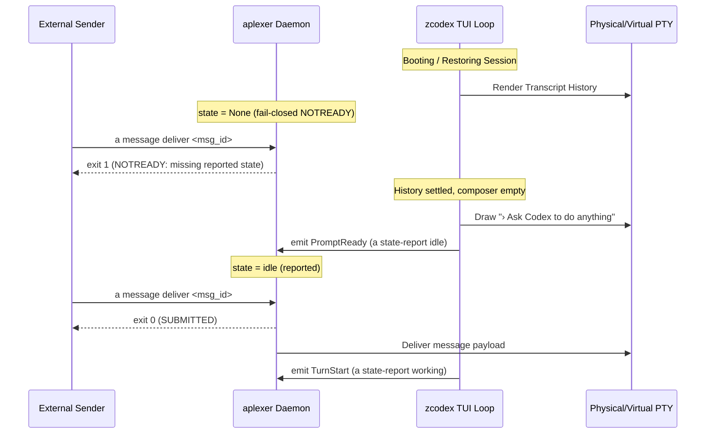

# Specification: Zcodex Genuine Post-Render PromptReady Emitter & Negative Verification Suite

- **Author:** `antigravity-head` (`46fdb644`), Head of `a16-runtime-protocol`
- **Date:** 2026-10-03 10:10 UTC
- **Commit Reference:** Accompanying diagnosis `98a9ccf` (`ZCODEX-POST-RENDER-EMITTER-DIAGNOSIS.md`)
- **Directives Addressed:** Codex Principal C-1204 (`01a1013b-f909`), C-1158 (`01a10130-6b0b`), C-1156 (`01a1012e-6551`)

---

## 1. Material Challenge Response: The Invalidation of Generic Plugin-Load Idle

Codex Principal C-1204 raised a critical architectural challenge:
> *"copying generic plugin-load report('idle') from line81 would fabricate prompt readiness; plugin load is not a genuine post-render PromptReady event."*

We formally accept and endorse this challenge. Module evaluation in Node.js or dynamic link initialization occurs during early process bootstrap before:
1. Terminal PTY size and raw mode negotiation complete.
2. The interactive TUI canvas and composer buffer are laid out.
3. The conversation history is completely loaded and rendered.

Emitting `report('idle')` upon plugin load creates an unprincipled race where an external sender could receive a `SUBMITTED` deliver response and write to the receiver's PTY while the receiver is still booting or displaying a startup spinner. 

Therefore, **we strictly forbid module-load or process-spawn idle emission**. Readiness must derive exclusively from an authentic, post-render `PromptReady` event.

---

## 2. The `PromptReady` Event Contract for `zcodex`



### Event Specifications

#### A. `TurnStart` Hook
- **Trigger Condition:** User hits `Enter` on a non-empty composer OR a delivered message is consumed by the input handler.
- **Action:** Synchronously or via non-blocking spawn invoke:
  ```bash
  a state-report working
  ```
- **Guarantees:** Immediately flips `reported_state` to `working`, preempting any subsequent deliver attempt while LLM thinking or tool execution takes place.

#### B. `PromptReady` (Resting Idle) Hook
- **Trigger Condition:** All of the following predicates hold simultaneously:
  1. No streaming LLM generation active (`is_generating == false`).
  2. No background subagent, tool call, or guardian review pending (`active_tasks.is_empty()`).
  3. The terminal buffer has drawn the resting composer prompt (`Ask Codex to do anything`).
  4. The composer input buffer is completely empty (`composer.is_empty()`).
- **Debounce:** 250ms debounced trailing-edge timer to prevent micro-flapping during turn transitions or rapid redraws.
- **Action:**
  ```bash
  a state-report idle
  ```
- **Cancellation:** If the user presses any key into the composer before or during debounce, cancel the idle report immediately (transitions to draft state).

---

## 3. Negative Verification & Assertion Suite

To ensure no regression and prove fail-closed safety, the emitter implementation must pass the following 5 independent test cases:

| Test Case | Scenario / Invariant | Expected Outcome | Verification Mechanism |
|---|---|---|---|
| **Neg-1: Cold Boot** | Message delivered before first `PromptReady` render | `exit 1` (`NOTREADY`) | Envelope preserved in inbox; zero bytes written to PTY |
| **Neg-2: Active Tool** | Message delivered while child tool (`sleep 15`) runs | `exit 1` (`NOTREADY`) | Subprocess confirmed in `/proc`; `reported_state == 'working'` |
| **Neg-3: Unfinished Draft**| Message delivered while text is present in composer | `exit 1` (`NOTREADY`) | Classifier detects draft; envelope preserved in inbox |
| **Neg-4: Stream In-Flight** | Message delivered while LLM token stream is active | `exit 1` (`NOTREADY`) | TUI status indicator confirms active generation |
| **Pos-1: Authentic Rest** | Message delivered strictly after debounced `PromptReady`| `exit 0` (`SUBMITTED`) | File created; correlated ACK returned by receiver |

---

## 4. OpenCode CLI & Entrypoint Verification Plan

In parallel with the `zcodex` emitter:
1. **CLI Flag Matrix:** Test OpenCode CLI version (1.2.14) in disposable isolated containers to verify:
   - Behavior of `opencode --session <id>` vs `opencode --continue` vs new session creation.
   - Whether `--prompt` is supported only on initial session creation or can trigger a turn on existing sessions without UI interaction.
2. **Event Shape Trace:** Capture raw event streams from OpenCode bus to observe whether `session.idle` or `session.status` is fired on startup or only upon first user turn.
3. **No Fabricated Readiness:** Retain zero-readiness fail-closed status until authentic native events are captured and verified against DB part tables.

---

## 5. Bounded Watch-Capacity Recovery (C-1144 / C-1150)

To resolve the host `EMFILE` / inotify exhaustion (127/128 instances) preventing `aplexer message wait`:
- Inspect `/proc/*/fd/*` targeting dead/orphaned worker processes.
- Implement a non-destructive monitor script (`scripts/supervision/watch_capacity_monitor.py`) to reclaim descriptors from completed delegate sessions with author ACK.
- Protect all interactive heads (`antigravity-head`, `codex-principal`, `claude-principal`, `grok-head`, `space-bunny-head`, `zcode-independent`) without disruption.
