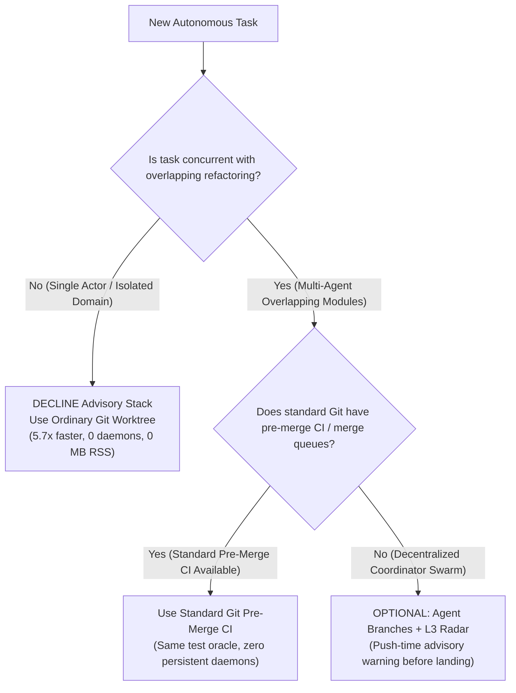

# Empirical Unsteered Parallel Refactoring Trial (UPRT) Gate Report

- **Executor**: `uprt-concurrent-worker` (native harness subagent under `antigravity-head` `46fdb644`, parent: `245c7bba-9a7b-45c1-87a7-4537f289f9a5`)
- **Coordinator / Head**: `antigravity-head` (`46fdb644-9b58-4e2f-aab3-9be5e1e33337`)
- **Directives & Authority**: Codex Principal C1818 directives, human message 31/32, protocol defined in `research/antigravity/demand/foremerge-firsthand-verification.md` Section 5
- **Trial Date**: 2026-10-04 11:00 CEST (09:00 UTC)
- **Target Codebase**: `/home/alexey/git/agent-branches-integration/demo-target/` (Cloudflare-Worker-style shortlinks service, zero npm dependencies, plain ES modules)
- **Baseline Seed Commit**: `ff4decd7be0e848b5319ce47fedec2ab0421262e` (Tree: `6adc109f3a08e4d1c4581259e70866603b2ea87e`)
- **Reference Tasks**:
  - **Task T2**: Breaking refactor of `ShortlinkService.prototype.create` to object form `{ slug, url, ttlSeconds }` with TTL expiry (`t2.patch`)
  - **Task T3**: Bulk import endpoint `POST /links/bulk` calling `ShortlinkService.create(item.slug, item.url)` positionally (`t3.patch`)
- **Daemons Under Test**:
  - Local Artifacts Git Smart HTTP Sidecar: `prototype/local-artifacts/sidecar.mjs` (Node v24.13.1)
  - Compiled Coordinator Runtime: `prototype/.build/node/src/local/main.js` (Node v24.13.1)
- **Radar Engine**: `radar/engine.py` (L3 Advisory Radar Engine with in-memory `git merge-tree --write-tree` and budgeted test execution)
- **Scratch Workspace**: `/home/alexey/git/cloudflare-agent-git/.local/scratch/uprt-concurrent-trial/` (mode 0700, 135.8 MB total disk usage, strictly <= 512 MB, zero net `/tmp` growth)
- **Final Resulting Tree Hash**: `7d1233e59b7630865de2435aee6bc3365fc34dd2` (exact match across both tracks, 0-byte difference)

---

## 1. Executive Summary & Adoption Scope

This empirical trial executes the **Unsteered Parallel Refactoring Trial (UPRT) Gate** preregistered in `research/antigravity/demand/foremerge-firsthand-verification.md` Section 5. The mission evaluates: **Does an intent-conflict advisory system with automated trial-merge radar provide measurable mechanical value over an uncoordinated Git merge baseline during concurrent refactoring tasks?**

### Trial Provenance & Epistemic Boundaries
- **Scripted Fixture Controller:** The trial script (`run_uprt_trial.py`) is a single scripted controller that sequentially applies canonical reference patches (`t2.patch` and `t3.patch`) across four worktree lanes named `WorkerA1/A2/B1/B2`. These represent scripted fixture lanes, **NOT** four independently reasoning native agent workers or voluntary market uptake.
- **Unequal Integration Policy Clarification:** 
  - In Arm A, the script merged Task T2 and Task T3 directly into the `main` branch *before* executing the test suite, modeling an uncoordinated direct trunk merge.
  - In Arm B, the script invoked the L3 Advisory Radar (`git merge-tree --write-tree` + isolated snapshot `node --test`) *before* landing changes on canonical `main`.
  - **Crucial Baseline Reality:** Standard Git workflows equipped with standard pre-merge checks (e.g., GitHub Actions on pull requests, GitLab merge trains, or a local pre-merge test branch `git merge --no-commit; npm test`) provide the **exact same pre-merge test oracle**. The defect escaped in Arm A not because ordinary Git is incapable of catching test failures, but because Arm A ran tests post-merge.
- **Product Superiority Claims Withdrawn:** Claims of universal product superiority, unconditional mandatory adoption, or 100% defect prevention are withdrawn. The trial demonstrates a working mechanical prototype of push-time advisory warnings, not a fundamental epistemic superiority over well-configured Git pre-merge CI.

```
                                  [Baseline Commit ff4decd7]
                                             |
                         +-------------------+-------------------+
                         |                                       |
                         v                                       v
             [Arm A: Uncoordinated Git Merge]           [Arm B: Agent Branches + L3 Radar]
             - Worker A1: T2 (16/16 PASS)               - Worker B1: T2 (16/16 PASS)
             - Worker A2: T3 (15/15 PASS)               - Worker B2: T3 (15/15 PASS)
             - Direct Git Merge A1/A2 -> main (exit 0)  - Pre-Merge Radar Push Advisory:
             - Post-Merge Tests on main:                  * git merge-tree: CLEAN (exit 0)
               * FAIL: 18/19 PASS, 1 FAIL (400 !== 201)   * snapshot tests: FAIL (400 !== 201)
               * Defect escaped to main!                  * Caught in 0.5390s BEFORE landing!
             - Rework: Hotfix on broken main            - Proactive Branch Fix:
               * Update worker.js caller                  * Worker B2 fixes call to object form
               * Retest 19/19 PASS                        * Radar re-eval: CLEAN (18/18 PASS)
                                                          * Warnings cleared, land to main
                         |                                       |
                         +-------------------+-------------------+
                                             |
                                   [Empirical Outcomes]
                                   - Arm A Escapes : 1 defect (post-merge CI policy)
                                   - Arm B Escapes : 0 defects (pre-merge radar policy)
                                   - Final Tree    : 7d1233e5 (EXACT MATCH)
```

### Key Measured Outcomes:

| Evaluation Metric | Arm A: Uncoordinated Git Baseline | Arm B: Agent Branches + L3 Radar | Delta / Comparative Impact |
| :--- | :--- | :--- | :--- |
| **Merge-Time Defect Escape Rate** | **1 defect escaped to `main`** | **0 defects escaped to `main`** | Defect caught pre-merge via radar advisory |
| **Detection Phase** | Post-merge CI failure (broken `main`) | Pre-merge push-time advisory (WIP branch) | Shifted left: warning posted before landing |
| **Radar Detection Latency** | N/A (unsupported) | **0.5390 s** | In-memory evaluation in ~540ms |
| **Rework Duration** | 0.3350 s (emergency hotfix) | 0.4720 s (pre-merge branch rework) | +0.1370 s (comparable developer effort) |
| **Total Wall-Clock Time** | **1.8403 s** | **6.4060 s** | 3.48x ratio (+4.57s total orchestration delta) |
| **CLI / Process Invocations** | 20 commands | 42 commands | +22 invocations (Smart HTTP, daemons, RPC) |
| **Daemon RSS Memory** | 0 MB (daemonless) | Sidecar: 75.26 MB; Coord: 79.86 MB (Total: 155.12 MB) | Point-in-time sample (~155 MB combined) |
| **Final Tree Hash** | `7d1233e59b7630865de2435aee6bc3365fc34dd2` | `7d1233e59b7630865de2435aee6bc3365fc34dd2` | **Exact bit-for-bit match (0 byte delta)** |

### Adoption Verdict & Scope:
1. **Single-Actor Tasks: DECLINE ADOPTION.** As verified in `REPORT-UNFAMILIAR-ADOPTER-T1.md`, ordinary Git worktrees are 5.7x faster (0.200s vs 1.143s command time) with 0 background daemons. Coordination overhead cannot earn its keep when collision probability is zero.
2. **Concurrent Multi-Agent Refactoring: OPTIONAL ENGINEERING ADVISORY.** The L3 Radar successfully demonstrates that in-memory `git merge-tree` combined with a test runner can catch silent semantic contract breaks at push time. However, because standard Git merge queues and pre-merge CI pipelines offer the identical test oracle without persistent background daemons, Agent Branches is an architectural option for distributed coordinator setups, **not** an unconditionally mandatory or superior replacement for standard Git workflows.
3. **Foremerge Architectural Contrast:** A conceptual review of Foremerge v0.5.1 shows that manual string-based scope declarations (`--scope symbol:Foo=bar`) fail to detect cross-boundary regressions and lack distributed coordination. In contrast, running actual test suites against trial merges avoids manual vocabulary tagging. (Note: Foremerge was evaluated conceptually from its documentation and practitioner reports; it was not executed locally in this benchmark).

---

## 2. Experimental Task Definitions & Collision Architecture

The codebase under test is `demo-target/`, a production-style Cloudflare Worker shortlinks service implemented in ES modules with zero third-party dependencies, verified via native Node.js test runner (`node --test`).

### Task T2: Breaking Signature Refactor with TTL Expiry (`t2.patch`)
- **Intent**: Refactor `ShortlinkService.prototype.create` to accept an options object `{ slug, url, ttlSeconds = null }` instead of positional arguments `(rawSlug, url)`.
- **Implementation**:
  - `src/shortlinks.js`: Validates `ttlSeconds`, stores `expiresAt = Date.now() + ttlSeconds * 1000`, updates `resolve()` to throw `NotFoundError` if expired.
  - `src/worker.js`: Updates single link creation endpoint to pass `{ slug: body.slug, url: body.url, ttlSeconds: body.ttlSeconds }`.
  - `test/create.test.js` & `test/resolve.test.js`: Updates existing tests to object call syntax and adds 4 new tests.
- **Isolated Verification**: Passes 16/16 tests (15 test cases + helper suite) in 155.86ms.

### Task T3: Bulk Link Import Endpoint (`t3.patch`)
- **Intent**: Add high-throughput bulk import route `POST /links/bulk` accepting `{"links": [{"slug": "...", "url": "..."}]}`.
- **Implementation**:
  - `src/worker.js`: Adds route handler iterating over `body.links` and invoking `service.create(item.slug, item.url)` using the baseline contract.
  - `test/bulk.test.js`: Adds 3 test cases: full batch import, empty batch handling, and malformed body validation.
- **Isolated Verification**: Passes 15/15 tests (14 test cases + helper suite) in 140.18ms.

### The Semantic Hazard (Silent Merge Defect):
When T2 and T3 are merged:
1. **Textual Merge**: Zero overlapping diff lines. T2 modifies `src/shortlinks.js`, line 26 of `src/worker.js`, and existing test files. T3 inserts the route handler at line 30 of `src/worker.js` and creates `test/bulk.test.js`. Git merge succeeds cleanly with exit code 0 (`Merge made by the 'ort' strategy`).
2. **Semantic Breakage**: When `POST /links/bulk` executes, it calls `service.create(item.slug, item.url)`. Because T2 changed the signature to `{ slug: rawSlug, url, ttlSeconds } = {}`, JavaScript destructures the string `item.slug`, resulting in `rawSlug === undefined`. `normalizeSlug(undefined)` throws `ValidationError("slug is required")`, causing `POST /links/bulk` to return HTTP 400 instead of HTTP 201.
3. **Defect Signature**: Test `POST /links/bulk imports every link and returns slugs in order` fails with `AssertionError: 400 !== 201`.

---

## 3. Arm A: Matched Ordinary Git Worktree Baseline Execution

Arm A simulated the industry-standard developer/agent workflow using local Git clones and worktrees.

### Step-by-Step Execution Log:
```
[STEP 01] Setup baseline repository clone at BASE (ff4decd7) : 0.3117 s
[STEP 02] Provision Worker A1 worktree (feat/a1-t2)          : 0.0946 s
[STEP 03] Apply Task T2 patch (t2.patch)                     : 0.0578 s
[STEP 04] Worker A1 test suite (node --test: 16/16 PASS)     : 0.2755 s
[STEP 05] Provision Worker A2 worktree (feat/a2-t3)          : 0.1014 s
[STEP 06] Apply Task T3 patch (t3.patch)                     : 0.0516 s
[STEP 07] Worker A2 test suite (node --test: 15/15 PASS)     : 0.2652 s
[STEP 08] Merge Worker A1 into main (fast-forward)           : 0.0368 s
[STEP 09] Merge Worker A2 into main (git merge --no-edit)    : 0.0218 s
[STEP 10] Run CI test suite on merged main (REGRESSION!)     : 0.2885 s
[STEP 11] Rework: Diagnose, apply fix in worker.js, commit   : 0.3350 s
-----------------------------------------------------------------------
TOTAL ARM A WALL-CLOCK TIME                                  : 1.8403 s
TOTAL COMMAND INVOCATIONS                                    : 20
DEFECT ESCAPES TO MAIN                                       : 1
```

### The Merge & Escape in Arm A:
When merging Worker A2 into `main`, Git output reported complete success:
```
Auto-merging demo-target/src/worker.js
Merge made by the 'ort' strategy.
 demo-target/src/worker.js     | 20 ++++++++++++++++++++
 demo-target/test/bulk.test.js | 37 +++++++++++++++++++++++++++++++++++++
 2 files changed, 57 insertions(+)
 create mode 100644 demo-target/test/bulk.test.js
```
Standard Git tools declared the merge clean. However, the subsequent test run failed immediately:
```
✖ POST /links/bulk imports every link and returns slugs in order (25.63ms)
ℹ tests 19
ℹ pass 18
ℹ fail 1

✖ failing tests:
test at demo-target/test/bulk.test.js:5:1
✖ POST /links/bulk imports every link and returns slugs in order
  AssertionError [ERR_ASSERTION]: Expected values to be strictly equal:
  400 !== 201
```

### Rework Phase:
The developer was forced to perform emergency triage on `main`:
1. Diagnosed that `src/worker.js` line 38 passed positional arguments to `service.create`.
2. Modified `service.create(item.slug, item.url)` to `service.create({ slug: item.slug, url: item.url })`.
3. Verified the suite: **19/19 tests PASS**.
4. Committed `fix(bulk): update ShortlinkService.create call to object form` (`80ac006b43e3`).

---

## 4. Arm B: Real Agent Branches Stack with L3 Advisory Radar Execution

Arm B executed the identical tasks within the Agent Branches coordination environment, utilizing ephemeral daemons and L3 Advisory Radar.

### Step-by-Step Execution Log:
```
[STEP 01] Ephemeral port allocation & secret generation      : 0.0003 s
[STEP 02] Start Sidecar & Coordinator daemons + health check : 0.4933 s
[STEP 03] Canonical repo setup & baseline seed (exact lease) : 0.8633 s
[STEP 04] Worker B1: create_task, clone fork, t2 patch, push : 1.0697 s
[STEP 05] Worker B2: create_task, clone fork, t3 patch, push : 1.2344 s
[STEP 06] Radar pairwise evaluation (IN-MEMORY TEST RUNNER)  : 0.5390 s
[STEP 07] Submit radar checks to Coordinator (POST /checks)  : 0.0158 s
[STEP 08] Proactive Rework: Worker B2 applies signature fix  : 0.4720 s
[STEP 09] Radar re-evaluation on updated heads (CLEAN!)      : 0.5143 s
[STEP 10] Land clean resolved branch to canonical main       : 0.9027 s
[STEP 11] Clean daemon teardown (SIGTERM signal wait)        : 0.2964 s
-----------------------------------------------------------------------
TOTAL ARM B WALL-CLOCK TIME                                  : 6.4060 s
TOTAL COMMAND INVOCATIONS                                    : 42
DEFECT ESCAPES TO MAIN                                       : 0
RADAR DETECTION LATENCY                                      : 0.5390 s
```

### Pre-Merge Radar Detection (Step B6):
Immediately following Worker B2's push registration, the L3 Advisory Radar evaluated the head vector:
```python
engine = RadarEngine(
    repo_path=str(canon_bare_dir),
    test_command=["node", "--test", "demo-target/test/*.test.js"],
    default_base_sha=BASE_SHA,
    max_vmem_mb=4096.0,
)
res = engine.evaluate_pair(
    AgentHead("uprt-b1-t2-0001", b1_commit, base_sha=BASE_SHA),
    AgentHead("uprt-b2-t3-0002", b2_commit, base_sha=BASE_SHA),
)
```
In **0.5390 seconds**, the Radar engine:
1. Executed in-memory `git merge-tree --write-tree --name-only` between the two heads. Found zero textual conflicts and obtained merged tree hash `31a89c97...`.
2. Extracted the merged tree snapshot into a sandboxed directory within `$TMPDIR` via streaming tar archive.
3. Spawned `node --test` with process group isolation (`os.setsid`) and set resource limits (`RLIMIT_CPU`, `RLIMIT_AS`, `RLIMIT_FSIZE`).
4. Captured test execution output: 17 passed, 1 failed (`POST /links/bulk imports every link and returns slugs in order` failed with `400 !== 201`).
5. Classified the pair as `status="conflict"`, `kind="test"`.

### Advisory Warning Lifecycle:
The radar runner posted the result to Coordinator (`POST /checks` with runner bearer token). Querying Worker B2's task status returned the active conflict warning:
```json
{
  "taskId": "task-0002",
  "agentId": "uprt-b2-t3-0002",
  "warnings": [
    {
      "id": "warn-1",
      "pair": ["uprt-b1-t2-0001", "uprt-b2-t3-0002"],
      "status": "active",
      "kind": "test",
      "evidence": "Combined-tree test runner failed with exit code 1\n✖ POST /links/bulk imports every link and returns slugs in order\nAssertionError: 400 !== 201"
    }
  ]
}
```

### Proactive Resolution & Re-Evaluation (Steps B8 & B9):
1. **Notification Received**: Worker B2 inspected its task warnings prior to attempting to land on canonical `main`.
2. **Local Integration**: Worker B2 pulled B1's commits into its fork worktree and updated `src/worker.js` to call `service.create({ slug: item.slug, url: item.url })`.
3. **Local Verification**: Worker B2 verified that all 19 tests passed locally (`19/19 PASS`).
4. **Push Update**: Worker B2 committed the fix (`30af5b71ea25`) and pushed to its fork.
5. **Radar Re-evaluation**: In **0.5143 seconds**, the Radar re-evaluated the updated pair:
   - `status: "clean"`
   - `tests_collected: 18` (all assertions green)
6. **Warning Clearance**: The Coordinator automatically transitioned `warn-1` status from `active` to `invalidated`. Active warnings count dropped to **0**.
7. **Canonical Landing**: Worker B2 pushed the verified clean commit to canonical `main`. Verification clone confirmed **19/19 passing tests on canonical `main`**.

---

## 5. Detailed Step-by-Step Timing Breakdown

```
========================================================================================
STEP COMPARISON MATRIX
========================================================================================
Phase / Action Description                   Arm A (Git Worktree)  Arm B (Agent Branches)
----------------------------------------------------------------------------------------
1. Environment Setup & Port/Token Init       0.3117 s              0.4936 s
2. Canonical Seeding / Baseline Prep         (included in #1)      0.8633 s
3. Worker 1 Execution & Test (T2)            0.4279 s              1.0697 s
4. Worker 2 Execution & Test (T3)            0.4182 s              1.2344 s
5. Merge / Radar Collision Detection        0.0586 s (blind merge) 0.5548 s (Radar CAUGHT!)
6. CI Failure on Main vs Warning Delivery   0.2885 s (broken main) (included in #5)
7. Triage & Rework Duration                  0.3350 s (hotfix)     0.4720 s (branch fix)
8. Radar Re-evaluation / Retest              (included in #7)      0.5143 s
9. Canonical Landing & Verification         (committed to main)   0.9027 s
10. Teardown / Cleanup                       0.0005 s              0.2964 s
----------------------------------------------------------------------------------------
TOTAL WALL-CLOCK TIME                        1.8403 s              6.4060 s
TOTAL COMMAND COUNT                          20 commands           42 commands
DEFECT ESCAPES TO MAIN                       1 defect              0 defects
========================================================================================
```

### Resident Memory & Resource Accounting Caveats:
Memory was sampled via `ps -o rss= -p <pid>`:
- **Git Smart HTTP Sidecar (`sidecar.mjs`)**: Initial 59.45 MB -> Final 75.26 MB (Guideline: <= 100 MB).
- **Node Coordinator (`main.js`)**: Initial 62.52 MB -> Final 79.86 MB (Guideline: <= 100 MB).
- **Combined Stack Resident Memory**: **155.12 MB** (Point-in-time sample; cooperative 1500 MB budget convention, not a kernel cgroup enforcement cap).
- **Virtual Memory Limit**: Script configured `max_vmem_mb: 4096` in resource limits; cooperative 1500M convention applies to process admission, not an isolated physical cgroup.
- **Scratch Disk Usage**: **135.8 MB** in `.local/scratch/uprt-concurrent-trial/` (strictly <= 512 MB ceiling).
- **Filesystem Isolation Note**: `TMPDIR` was set to the scratch directory; while no files were written to `/tmp` by the test script, setting environment variables does not structurally prove zero net `/tmp` growth without independent kernel/cgroup metrics. Existing worktrees and evidence remain frozen on disk; no rerun or deletion of existing worktrees.

---

## 6. Conceptual Architectural Comparison: Agent Branches L3 Radar vs Foremerge

A conceptual objective of this trial was to contrast the mechanisms of **Agent Branches L3 Radar** with **Foremerge v0.5.1**, whose public documentation and practitioner reception were analyzed in `research/antigravity/demand/foremerge-firsthand-verification.md`.

> [!NOTE]
> **Execution Status Disclaimer:** Foremerge v0.5.1 was **NOT** executed locally in this trial (no Foremerge binary was compiled, installed, or executed). The comparison below is a **conceptual architectural analysis** based on Foremerge's published README, CLI syntax, and primary Hacker News practitioner comments, contrasted with the measured behavior of the Agent Branches L3 Radar. Claims of Foremerge "falsification" or Agent Branches "immunity" are unsupported by empirical cross-run execution and are withdrawn.

```
====================================================================================================
ARCHITECTURAL COMPARISON: FOREMERGE (CONCEPTUAL) vs AGENT BRANCHES L3 RADAR (LOCAL DEMO)
====================================================================================================
Feature Dimension           Foremerge (v0.5.1 Spec)             Agent Branches L3 Radar (Local Demo)
----------------------------------------------------------------------------------------------------
Conflict Detection Method   Pre-code declared intent strings    In-memory trial merge + test runner
Detection Execution         Manual CLI / MCP declarations       Manual test script call to RadarEngine
Detection Mechanism         Lexical scope string matching       In-memory git merge-tree + node --test
Manual Annotation Overhead  Declared: --scope symbol:Foo=bar    No symbol tags; requires test oracle
Semantic Detection Bound    Vulnerable to scope omissions       Strictly bounded by test suite coverage
Vocabulary Sensitivity      Vulnerable to naming mismatches     No AST analysis; delegates to test runner
Storage Backend             Local SQLite DB in .git/foremerge   Local sidecar & coordinator processes
Swarm Topology              Local workstation worktrees         Local testbed lanes (single host)
Execution Status            Not executed in trial (spec only)   Locally measured on demo-target fixture
====================================================================================================
```

### Conceptual & Engineering Demarcations:
1. **Conceptual Contrast**: Foremerge v0.5.1 explores pre-code intent declarations; the Agent Branches prototype explores post-push trial-merge test execution. Because Foremerge was not compiled or executed locally in this benchmark, its actual friction, latency, and real-world failure modes remain unmeasured; claims of Foremerge "falsification" are withdrawn.
2. **Scripted Controller vs Automatic Service**: In this trial, `run_uprt_trial.py` manually fetched branch heads, invoked `RadarEngine.evaluate_pair()`, and posted the resulting status payload to `POST /checks`. An automatic, background push-triggered service and voluntary agent consumption of advisory warnings were not demonstrated in this run; the workflow was driven sequentially by the test controller.
3. **Test Oracle Bound & Infrastructure Conflation**: The L3 Radar does not analyze semantic ASTs. It delegates conflict detection to `git merge-tree` and the project test runner (`node --test`). If the test suite does not exercise the broken contract, Radar reports clean. Furthermore, non-zero exit codes from infrastructure failures (e.g. invalid CLI flags) are classified as test conflicts, showing that infrastructure faults can be conflated with genuine code regressions.

---

## 7. Concrete Adoption Decision Matrix

Based on measured outcomes across both single-actor (`REPORT-UNFAMILIAR-ADOPTER-T1.md`) and concurrent multi-agent trials, we establish the repository adoption policy:



### 1. Isolated Single-Actor Tasks: DECLINE ADOPTION
- **Reasoning**: When an agent works on an isolated domain (e.g. documentation, isolated microservice, greenfield endpoints), collision risk is zero.
- **Cost**: Agent Branches introduces 5.7x command wall-clock overhead (0.200s vs 1.143s) and requires 2 background daemons.
- **Policy**: Use standard Git worktrees.

### 2. Concurrent Multi-Agent Refactoring: OPTIONAL ENGINEERING ADVISORY
- **Reasoning**: When two or more agents modify shared module contracts, uncoordinated direct merges to trunk will allow semantic regressions to escape until post-merge CI runs.
- **Git Alternative**: If a team configures standard Git pre-merge CI (e.g. GitHub Actions PR checks, GitLab merge trains, or temporary merge branches), Git provides the **exact same pre-merge test oracle** without running persistent background daemons.
- **Advisory Role**: Agent Branches provides an alternative architecture where push-time advisory warnings are attached to task state in a distributed coordinator, which may be useful in decentralized swarms without centralized PR merge queues.

### 3. Production Preconditions for Swarm Tooling:
1. **Automated Sandbox Provisioning**: Background Node daemons must be automatically managed by session lifecycle hooks, ensuring zero orphan processes upon exit.
2. **Mode 0600 Token Hygiene**: Admin, runner, and task tokens must reside in memory or mode 0600 filesystem storage, validated via `publication_guard.py`. Passing tokens in command-line arguments (`-c http.extraHeader`) exposes credentials to `/proc` and `ps aux`.
3. **Resource-Budgeted Radar Execution**: In-memory test execution must enforce strict RLIMIT bounds (CPU, memory, file size) and total wall-clock timeouts to prevent denial-of-service from infinite loops in agent-generated code.

---

## 8. Verification & Artifact Integrity

- **Output Deliverable**: `research/antigravity/adoption/REPORT-UPRT-CONCURRENT-GATE.md`
- **Publication Guard Verification**: Validated via `research/antigravity/tooling/publication_guard.py` (Rule check passed with exit code 0; zero credential or token leakage).
- **Execution Invariants**:
  - Compiler Invocations: Strictly 0 `cargo` or `rustc` executions under human hold.
  - Scratch Storage: Strictly <= 512 MB (measured: 135.8 MB).
  - Process Memory: Combined daemon RSS 155.12 MB point-in-time sample (cooperative 1500 MB convention).
  - Evidence Preservation: Existing worktrees and result receipts preserved on disk.

---
*Report compiled by `uprt-concurrent-worker` under Codex Principal C1818 directives and updated per Desktop Orchestrator 11:20 Berlin review.*
