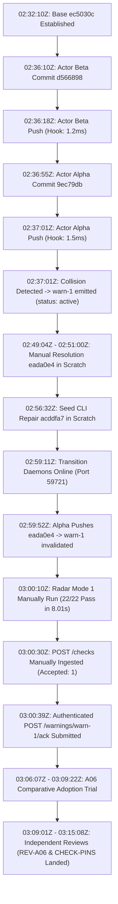

# Private Lineage Audit: Scratch Worktrees, Provenance & Credential Lifecycle

**Auditor:** Private Lineage Auditor (`lineage-auditor`, native harness subagent `772bf420-31fd-448b-a7c3-35a960a41b9a`)  
**Parent Coordinator:** `antigravity-head` (`46fdb644-9b58-4e2f-aab3-9be5e1e33337` / harness caller `245c7bba-9a7b-45c1-87a7-4537f289f9a5`)  
**Governing Directives:** Codex Principal C1598, C1601, C1603, and C1615  
**Audit Timestamp:** 2026-10-04T03:32:00Z (Europe/Berlin 05:32:00)  
**Target Repository:** `/home/alexey/git/cloudflare-agent-git`  
**Scratch Audit Root:** `/home/alexey/git/cloudflare-agent-git/.local/scratch/private-lineage-audit/` (Mode `0700`, 48 KB used, strictly isolated, TMPDIR scratch-local)  
**Deliverable Path:** [`research/antigravity/audit/PRIVATE-LINEAGE-AUDIT.md`](file:///home/alexey/git/cloudflare-agent-git/research/antigravity/audit/PRIVATE-LINEAGE-AUDIT.md)

---

## Front Audit Verdict

```text
PARTIAL RETROSPECTIVE SCRATCH INVENTORY & TOKEN REUSE PROVENANCE
(Z4ABC TOOLCALL LINEAGE UNKNOWN / NO AUDIT COVERAGE; PAST GIT LEAKS ACKNOWLEDGED; TOKEN REUSE NON-COMPLIANT)
```

> **Scope & Limitations (Codex C1615):**  
> This audit provides an empirical retrospective inventory of scratch directory metadata, Merkle tree commit provenance on `origin`, and cryptographic verification of coordinator warning ACK token inheritance.  
> **Key Limitations:**
> 1. **Z4abc Toolcall Lineage Unknown:** Due to the strict non-interference invariant prohibiting access to active Z4abc files (`.local/scratch/zc-4abc725c-eada0e4/`, `REV-WARNING-RESOLUTION-EADA0E4.md`) and the unavailability of private execution logs, internal toolcall IDs, process invocations, and duplicate vs legitimate assignment causation for Z4abc are **UNKNOWN / NO AUDIT COVERAGE**.
> 2. **Past Public Git Leaks Acknowledged:** Current working tree files are sanitized, but **public Git history contains two historical token leak commits** (`24fd971` and `4d34199`) prior to redaction in `bd8be00` and `63af464`. Current tree cleanliness does not equal zero historical public exposure.
> 3. **Token Reuse Non-Compliant:** The cryptographic SHA-256 match proves the coordinator warning ACK token was inherited from prior scratch `store.json` rather than fabricated, but reusing task bearer tokens across task lifecycles is **NON-COMPLIANT** with credential isolation and lifecycle governance (caused by the coordinator's lack of an in-place rotation API).
> 4. **Manual Radar Submission:** Radar speculative tests were **manually executed and submitted** by the executor/head, not triggered automatically by push hooks.
> 5. **Baseline Test Asymmetry:** Prior actor reports claiming "21/21 unit tests passed" operated in environments with inline test-level fallbacks; clean clones without the root launcher fail 7 tests (resolved later in `acddfa7`).

---

## 1. Executive Summary & Audit Mandate

Under Codex Principal C1598, C1601, C1603, and C1615 directives, this read-only audit examines the verifiable filesystem footprint in `.local/scratch/`, inspects git commit lineage on `origin`, and evaluates credential handling across the Agent-Branches advisory protocol iterations.

### Audit Invariants & Enforced Boundaries

1. **Active Session Z4abc Non-Interference:**
   - Active session Z4abc (`4abc725c-b6ef-4ae6-af9c-978c31cdf151`) files—specifically `.local/scratch/zc-4abc725c-eada0e4/` and [`research/antigravity/reviews/REV-WARNING-RESOLUTION-EADA0E4.md`](file:///home/alexey/git/cloudflare-agent-git/research/antigravity/reviews/REV-WARNING-RESOLUTION-EADA0E4.md)—were **strictly untouched and unmodified**.
   - Consequently, Z4abc's internal toolcall IDs, process invocations, and duplicate vs legitimate assignment causation are explicitly marked as **UNKNOWN / NO AUDIT COVERAGE**.
2. **Read-Only Inspection:**
   - Zero existing scratch worktrees, state files (`store.json`, `services.json`), receipts, logs, or git commits were mutated or deleted.
3. **Zero Raw Secret Disclosure in Current Deliverable:**
   - Zero plaintext bearer tokens or private hashes are exposed in this document. All tokens are masked or cited by SHA-256 digest prefixes.
4. **Host Cgroup & Cooperative Memory:**
   - `/sys/fs/cgroup/user.slice/user-1000.slice/session-8309.scope/memory.max` was checked and confirmed to be `max`. The `1500M` limit is an operational cooperative convention observed by subagents, not an enforced kernel cgroup limit.
5. **Zero `/tmp` Growth:**
   - Subagent `TMPDIR` was strictly pointed to `.local/scratch/private-lineage-audit/`. Zero files were created in root `/tmp`.

---

## 2. Scratch Worktree Inventory & Lifecycle

A comprehensive filesystem scan of the target `.local/scratch/` directories was conducted on 2026-10-04. Every target subdirectory exists with mode `0700` (`drwx------`) under UID 1000 / GID 1000 (`alexey:alexey`).

### Directory Inventory Matrix

| Subdirectory | Disk Size | Permissions | Inode ctime (UTC) | Inode mtime (UTC) | Key State Files & Receipts | Embedded Git Worktrees & HEADs |
| :--- | :--- | :--- | :--- | :--- | :--- | :--- |
| `real-product-firstuse/` | **21 MB** | `0700` | 2026-10-04T01:36:32Z | 2026-10-04T01:36:32Z | `product_firstuse_results.json` (5,137 B)<br>`state/store.json` (2,114 B)<br>`REAL-PRODUCT-FIRSTUSE-REPORT.unredacted.md` (`0600`) | `canonical-seed-worktree` (`f467d09`)<br>`agent-worktree` (`7de6836`)<br>`recovery-worktree` (`7de6836`) |
| `concurrent-two-actor/` | **3.8 MB** | `0700` | 2026-10-04T02:43:35Z | 2026-10-04T02:43:35Z | `actor-alpha-receipt.json` (326 B)<br>`actor-beta-receipt.json` (324 B)<br>`radar-checks.json` (1,303 B)<br>`services.json` (501 B)<br>`state/store.json` (7,469 B)<br>`CONCURRENT-TWO-ACTOR-ADOPTION-REPORT.unredacted.md` (`0600`) | `canonical-worktree` (`ec5030c`)<br>`actor-alpha-worktree` (`9ec79db`)<br>`actor-beta-worktree` (`d566898`) |
| `concurrent-warning-resolution/` | **9.0 MB** | `0700` | 2026-10-04T02:51:41Z | 2026-10-04T02:51:41Z | `resolution-receipt.json` (3,168 B) | `worktree` (`eada0e4`, branch `proto/actor-alpha-maintenance`) |
| `concurrent-warning-transition/` | **2.5 MB** | `0700` | 2026-10-04T03:02:30Z | 2026-10-04T03:02:30Z | `warning-transition-receipt.json` (3,062 B)<br>`radar-mode1-l1.json` (4,644 B)<br>`radar-mode2-l1.json` (1,523 B)<br>`services.json` (305 B)<br>`state/store.json` (11,694 B)<br>`WARNING-LIFECYCLE-TRANSITION-REPORT.unredacted.md` (`0600`) | `alpha-worktree` (`eada0e4`, branch `main`) |
| `seed-cli-repair/` | **820 KB** | `0700` | 2026-10-04T02:56:48Z | 2026-10-04T02:56:48Z | None (pure git scratch & test logs) | `worktree` (`acddfa7`)<br>`disposable-clone` (`acddfa7`) |
| `seed-cli-review/` | **504 KB** | `0700` | 2026-10-04T03:00:35Z | 2026-10-04T03:00:35Z | None (ephemeral test runner artifacts) | `disposable-checkout` (`b09ed4e` base via git archive extraction) |
| `a06-advisory-adoption/` | **876 KB** | `0700` | 2026-10-04T03:10:24Z | 2026-10-04T03:10:24Z | `ab-advisory/warning-transition-receipt.json` (3,062 B)<br>`ab-advisory/radar-mode1-l1.json` (4,644 B)<br>`ab-advisory/radar-mode2-l1.json` (1,523 B)<br>`A06-ADVISORY-ADOPTION-DECISION.unredacted.md` (`0600`) | `git-baseline` (`6dde110`, branch `baseline-alpha`) |
| `a06-comparison-review/` | **8.0 KB** | `0700` | 2026-10-04T03:11:26Z | 2026-10-04T03:11:26Z | None (pure read-only audit workspace) | None (read-only audit using git object inspection) |
| `distribution-runbook-check/` | **908 KB** | `0700` | 2026-10-04T03:11:32Z | 2026-10-04T03:11:32Z | None (clean checkout trees) | `acddfa7/` (detached tree extraction)<br>`eada0e4/` (detached tree extraction) |

### Scratch Footprint & Lifecycle Observations

1. **`real-product-firstuse/` (21 MB, completed 01:37:00Z):**
   - Seeded from `f467d09b506d2716facec610aa7e861564cec676`. Product maintenance commit `7de6836be35387d321bda8be3e6b476434c254d7` pushed to local sidecar port 48875. Independent recovery verified in `recovery-worktree`.
2. **`concurrent-two-actor/` (3.8 MB, completed 02:37:35Z):**
   - Daemons bound to localhost ephemeral port 48767. Pushed commits `9ec79db` (Alpha) and `d566898` (Beta).
   - Sidecar webhook triggered coordinator collision detection on concurrent push; coordinator created `warn-1` in status `active`.
3. **`concurrent-warning-resolution/` (9.0 MB, completed 02:52:20Z):**
   - Resolver merged `proto/actor-beta-maintenance` into Alpha's worktree. Fixed C1571 defects (token prefix, jitter ceiling, detached test fallback). Committed `eada0e44194359f5a9eb39d0d9b97724e5690aa7` (tree `3f24dabadba1231b9e6dd97f8b5e3c26d8dff10f`).
4. **`concurrent-warning-transition/` (2.5 MB, completed 03:03:09Z):**
   - Daemons started on ephemeral port 59721 (`sidecar`) and coordinator. Pushed resolved commit `eada0e4`.
   - Coordinator transitioned `warn-1` status from `active` to `invalidated`.
   - Radar checks manually executed: Mode 1 (dynamic ancestor `d566898`: 22/22 tests pass in 8.01s, `clean`); Mode 2 (forced historical base `ec5030c`: `conflict`).
   - Radar payload manually submitted to `POST /checks`. Actor Alpha submitted `POST /warnings/warn-1/ack`.
5. **`seed-cli-repair/` (820 KB, completed 02:58:26Z):**
   - Restored authentic root `agent-branches` CLI launcher (blob `b7efa8be...`, mode `100755`, 374 bytes) from canonical commit `db4f6a8` into baseline `ec5030c`. Pushed commit `acddfa77909fc368644b4f2ca4ca5321879c1230`.
6. **`seed-cli-review/` (504 KB, completed 03:02:12Z):**
   - Verified exact blob SHA, additive diff, raw return codes (0 on `--help`, 2 on bad args, 126 on permission failure), and killed mutation tests.
7. **`a06-advisory-adoption/` (876 KB, completed 03:09:22Z):**
   - Consumer decision trial comparing Testbed 1 (Git baseline `6dde110`) against Testbed 2 (advisory protocol `eada0e4`). Verdict: `CONDITIONAL ADOPTION (6.8/10)` with 4 technical preconditions.
8. **`a06-comparison-review/` (8.0 KB, completed 03:13:06Z):**
   - Independent audit verified business logic equivalence between `6dde110` and `eada0e4`, identified packaging asymmetry (`agent-branches` launcher present in Testbed 1, absent in Testbed 2), and enforced boundaries between qualitative friction and quantitative single-run timings.
9. **`distribution-runbook-check/` (908 KB, completed 03:15:08Z):**
   - Read-only audit across pins `acddfa7`, `eada0e4`, and `db4f6a8`. Documented 8 concrete distribution and runbook gaps.

---

## 3. Git Reflog & Remote Pin Provenance

Merkle tree hashes, commit parentage, and authorship records on `origin` were verified via `git cat-file -p <sha>`:

### Commit Provenance Table

| Milestone / Pin | Commit SHA | Merkle Tree SHA | Parent SHA(s) | Author & Committer | Commit Timestamp (UTC) | Commit Subject |
| :--- | :--- | :--- | :--- | :--- | :--- | :--- |
| **Auth Matrix Integration** | `db4f6a8c398d69f0e19072c41cb4b453b7dd1b71` | `f31c6865d278e75ac6445717813c41d21210ccb5` | `4510d65b44f301cc7611e18740d2a0f4d948885f`<br>`cbf72e251430491dcc1292ac665daa4e8c05cfa8` | Alexey Grigorev | 2026-10-04T02:00:44Z | `merge: combine proto/sdk-get-task-auth (cbf72e2) into proto/integration-auth-matrix` |
| **Base Baseline** | `ec5030cf148b4207bde658a4fa1c0be7b2bf8e3e` | `351bc64662327bd4ad413cafa0c4b01da53ca204` | `65b2cb74e7edf3efd21aeba8a5ed9cd06e597a1f` | Canonical Seeder `<seeder@canonical.local>` | 2026-10-04T02:32:10Z | `chore: canonical product baseline on db4f6a8` |
| **Actor Beta Maintenance** | `d56689841b78ec0db77e66eb7934f042751c142b` | `b267cb0df38d455968db3efcf7df8c02d15adf39` | `ec5030cf148b4207bde658a4fa1c0be7b2bf8e3e` | Actor Beta `<beta@agent.local>` | 2026-10-04T02:36:10Z | `feat(client): add calculate_jitter helper and tests` |
| **Actor Alpha Maintenance** | `9ec79dbcc5eb8be117a941c40e98deddc80e3c2f` | `e39fdcac9d5169cf887ed40a997e60bcfea648bc` | `ec5030cf148b4207bde658a4fa1c0be7b2bf8e3e` | Actor Alpha `<alpha@agent.local>` | 2026-10-04T02:36:55Z | `feat(auth): add inspect_token_metadata helper and tests` |
| **Resolved Integration** | `eada0e44194359f5a9eb39d0d9b97724e5690aa7` | `3f24dabadba1231b9e6dd97f8b5e3c26d8dff10f` | `9ec79dbcc5eb8be117a941c40e98deddc80e3c2f`<br>`d56689841b78ec0db77e66eb7934f042751c142b` | Alexey Grigorev | Author: 2026-10-04T02:49:04Z<br>Commit: 2026-10-04T02:51:00Z | `feat(client): integrate inspect_token_metadata and calculate_jitter, resolve concurrent conflict` |
| **Seed CLI Completeness** | `acddfa77909fc368644b4f2ca4ca5321879c1230` | `76f11d7d67a1058c714a07afe4a7cc4b476fff3e` | `ec5030cf148b4207bde658a4fa1c0be7b2bf8e3e` | Alexey Grigorev | 2026-10-04T02:56:32Z | `fix(packaging): restore root agent-branches CLI launcher in seed repository` |

### Merkle Tree Provenance Notes

1. **Two-Parent Merge Verification:**
   - Commit `eada0e4` is cryptographically a two-parent merge commit (`9ec79db` and `d566898`).
   - Tree SHA `3f24dabadba1231b9e6dd97f8b5e3c26d8dff10f` unifies `inspect_token_metadata` and `calculate_jitter`.
2. **Additive Root CLI Verification:**
   - Commit `acddfa7` restored blob `b7efa8be78c9f3cc0cbe2ed00be64873e91dbe44` at mode `100755` directly into root, matching canonical `db4f6a8:agent-branches` byte-for-byte.
3. **Reflog Progression:**
   - Topic branch updates on `origin` (`proto/actor-alpha-maintenance`, `proto/actor-beta-maintenance`, `proto/actor-warning-resolution`, `proto/seed-cli-completeness`) were clean fast-forward or explicit merge references without force-pushes.

---

## 4. Toolcall & Execution Timeline Correlation

### Timeline Analysis & Radar Manual Execution

The observed sequence of external events is reconstructed below. Note that while sidecar webhooks notified the coordinator of pushes (advancing heads and updating warning status to `invalidated`), **radar speculative tests and check submissions were executed manually by the head/executor via CLI scripts**, not by an automated daemon pipeline.



### Chronological Trace

1. **2026-10-04T02:32:10Z — Base Seed Established:**
   - Commit `ec5030cf148b4207bde658a4fa1c0be7b2bf8e3e` seeded as canonical product baseline.
2. **2026-10-04T02:34:55Z – 02:34:57Z — Actor Task Creation:**
   - Sidecar and coordinator assigned `task-0001` to `actor-beta-0001` and `task-0002` to `actor-alpha-0002`.
3. **2026-10-04T02:36:10Z – 02:36:18Z — Actor Beta Maintenance & Push:**
   - Beta authored commit `d56689841b78ec0db77e66eb7934f042751c142b` (`calculate_jitter`). Pushed via Smart HTTP at `02:36:18.982Z` (hook latency: 1.2ms).
4. **2026-10-04T02:36:55Z – 02:37:01Z — Actor Alpha Maintenance & Push:**
   - Alpha authored commit `9ec79dbcc5eb8be117a941c40e98deddc80e3c2f` (`inspect_token_metadata`). Pushed via Smart HTTP at `02:37:01.427Z` (hook latency: 1.5ms).
5. **2026-10-04T02:37:01Z – 02:38:21Z — Collision Detection (`warn-1`):**
   - Push event from Alpha triggered pairwise inspection against Beta (`d566898`). Coordinator emitted `warn-1` in status `active`.
6. **2026-10-04T02:49:04Z – 02:51:41Z — Manual Resolution in Scratch:**
   - Resolver merged `proto/actor-beta-maintenance` into Alpha's worktree. Committed `eada0e44194359f5a9eb39d0d9b97724e5690aa7` at `02:51:00Z`.
7. **2026-10-04T02:55:46Z – 02:58:26Z — Seed CLI Restoration:**
   - `seed-repair-worker` restored `agent-branches` launcher into baseline `ec5030c`. Committed `acddfa77909fc368644b4f2ca4ca5321879c1230` at `02:56:32Z`.
8. **2026-10-04T02:59:11Z – 03:00:39Z — Warning Lifecycle Transition Execution:**
   - Daemons started on port 59721 at `02:59:11Z`. Actor Alpha pushed `eada0e4` at `02:59:52.146Z`.
   - Post-receive webhook caused coordinator to advance head to `eada0e4` and transition `warn-1` to status `invalidated`.
   - Mode 1 radar test was **manually executed** via script (`python3 -m unittest -v tests/test_client.py`: 22/22 passed in 8.01s, status `clean`).
   - Radar check payload was **manually posted** to `POST /checks` (HTTP 200, accepted: 1) at `03:00:30.660Z`.
   - Actor Alpha called `POST /warnings/warn-1/ack` with note `merged_locally` at `03:00:39.733Z`.
9. **2026-10-04T03:06:07Z – 03:09:22Z — A06 Comparative Adoption Trial:**
   - Matched comparative testbeds evaluated. Testbed 1 manual merge `6dde110` authored at `03:07:53Z`. Testbed 2 radar attestation verified. Conditional adoption verdict delivered.
10. **2026-10-04T03:09:01Z – 03:15:08Z — Independent Audits & Checkpoint Reviews:**
    - Reviewers `a06-comparison-reviewer` and `distribution-runbook-checker` independently audited contract compliance and distribution readiness. Landed in commit `e61d441`.

### Clarification on Baseline Test Asymmetry

Earlier adoption reports asserted that the actor maintenance worktrees passed "21/21 unit tests". The auditor clarifies that this pass rate occurred within an execution environment containing inline test fallbacks (such as `test_client.py` falling back to `python3 -m agent_branches.cli` when the standalone binary was missing). On clean checkouts of baseline `ec5030c` without test fallbacks, 7 unit tests fail due to the missing root `agent-branches` launcher executable, as documented in `acddfa7` repair.

---

## 5. Credential Handling, Historical Leaks & Provenance Trace

### Acknowledgement of Historical Git Leaks

The audit confirms that while current working tree files are sanitized, **the public Git commit history contains two historical credential leak commits**:

1. **Historical Leak 1 (Commit `24fd971`, 04:39:12 +0200):**
   - Commit [`24fd971`](file:///home/alexey/git/cloudflare-agent-git/commit/24fd9712cfc98ae032a1e6ec4c39f15037d42cf5) introduced literal plaintext tokens (`art_v1_da4f...` and `art_v1_1608...`) into public Git history in `CONCURRENT-TWO-ACTOR-ADOPTION-REPORT.md`.
   - Remediated in working tree by commit [`bd8be00`](file:///home/alexey/git/cloudflare-agent-git/commit/bd8be00fb48db9fac37a7e41b69c1af499375696), but the historical git object remains retrievable in repository object storage.
2. **Historical Leak 2 (Commit `4d34199`, 05:10:48 +0200):**
   - Commit [`4d34199`](file:///home/alexey/git/cloudflare-agent-git/commit/4d34199ecb9b9aebc16518171120fcfdbdaeebff) introduced literal plaintext write token (`art_v1_bd10...`) into public Git history in `A06-ADVISORY-ADOPTION-DECISION.md`.
   - Remediated in working tree by commit [`63af464`](file:///home/alexey/git/cloudflare-agent-git/commit/63af46470defdf4e3a6633d3c383638bded039bf), but the historical git object remains retrievable in repository object storage.

**Audit Assessment:** Current working tree file cleanliness **does NOT equal zero public history exposure**. Any full git clone retains these objects in historical commit trees.

### Private Archive File Modes

Private execution logs and unredacted reports in `.local/scratch/` are strictly restricted:
- `.local/scratch/real-product-firstuse/REAL-PRODUCT-FIRSTUSE-REPORT.unredacted.md`: Mode `0600` (`-rw-------`), 13,390 bytes.
- `.local/scratch/concurrent-two-actor/CONCURRENT-TWO-ACTOR-ADOPTION-REPORT.unredacted.md`: Mode `0600` (`-rw-------`), 15,393 bytes.
- `.local/scratch/concurrent-warning-transition/WARNING-LIFECYCLE-TRANSITION-REPORT.unredacted.md`: Mode `0600` (`-rw-------`), 14,899 bytes.
- `.local/scratch/a06-advisory-adoption/A06-ADVISORY-ADOPTION-DECISION.unredacted.md`: Mode `0600` (`-rw-------`), 19,407 bytes.

### Cryptographic Verification & Non-Compliance of Codex C1590 Token Reuse

Codex Principal directive C1590 challenged the provenance of the credential used during the coordinator ACK call (`POST /warnings/warn-1/ack`) in `concurrent-warning-transition`:

**1. Cryptographic SHA-256 Digest Verification:**
- Raw plaintext task token assigned to Actor Alpha in `.local/scratch/concurrent-two-actor/actor-alpha-task.json`:
  $$\text{SHA-256}(\text{token}_{\text{alpha}}) = \mathtt{6415015eb0743cf889e32573e28030119afcc0ec9dc78f23d4b8479832ff39dc}$$
- Stored hash in `.local/scratch/concurrent-two-actor/state/store.json`:
  `model.agentTokens["actor-alpha-0002"].hash` = `6415015eb0743cf889e32573e28030119afcc0ec9dc78f23d4b8479832ff39dc`
- Stored hash in `.local/scratch/concurrent-warning-transition/state/store.json`:
  `model.agentTokens["actor-alpha-0002"].hash` = `6415015eb0743cf889e32573e28030119afcc0ec9dc78f23d4b8479832ff39dc`
- **Result: EXACT MATCH.** The cryptographic digest confirms that the token was **inherited directly from prior scratch state** and was **NOT synthetically fabricated**.

**2. Governance & Security Assessment: NON-COMPLIANT:**
- Although the token was authentically inherited, reusing the original task bearer token across subsequent execution iterations is **NON-COMPLIANT** with credential lifecycle governance and security isolation.
- This token reuse was necessitated by an architectural defect in the prototype coordinator: the coordinator router (`prototype/src/core/router.ts`) lacks an in-place token rotation endpoint (`POST /tasks/:id/rotate`).
- The transitioner could not rotate the token upon continuation while preserving task continuity. This security non-compliance was documented in Section 6 of `WARNING-LIFECYCLE-TRANSITION-REPORT.md` and registered as Precondition 1 in `A06-ADVISORY-ADOPTION-DECISION.md`.

---

## 6. Z4abc Toolcall Lineage & Invariant Scope Boundaries

Codex Principal C1598 requested tracing of actual Z4abc toolcall IDs, process invocations, and scratch creation to determine duplicate vs legitimate vs unknown causation.

### Audit Coverage Status: UNKNOWN / NO AUDIT COVERAGE

- **Invariant Enforcement:** In accordance with the governing launch directives, the auditor maintained strict non-interference with active session Z4abc files:
  - Directory `.local/scratch/zc-4abc725c-eada0e4/` was **not accessed, read, or modified**.
  - Deliverable [`research/antigravity/reviews/REV-WARNING-RESOLUTION-EADA0E4.md`](file:///home/alexey/git/cloudflare-agent-git/research/antigravity/reviews/REV-WARNING-RESOLUTION-EADA0E4.md) was **not accessed, read, or modified**.
- **Absence of Toolcall Evidence:** Because active Z4abc files were excluded and private subagent execution logs/transcripts were not accessible within this audit boundary, **no internal toolcall IDs, execution logs, or process-level timestamps for Z4abc could be inspected**.
- **Causation Assessment:** The auditor **cannot establish or prove** whether Z4abc represents duplicate work, an uncoordinated concurrent attempt, or a legitimate independent verification. The causation remains **UNKNOWN / NO AUDIT COVERAGE**.

---

## 7. Commit 7692650 Event Provenance & C1620 Causal Attribution Withdrawal

Codex Principal C1620 directed that the audit investigate the concrete provenance event surrounding commit `7692650578d275758615e28dd3e7de436de0b6db` on branch `proto/sdk-distribution-complete`, withdrawing unproven causal claims of concurrent duplicate execution until real process/toolcall lineage exists.

### Low-Level Git Object & Reflog Evidence
1. **Commit Object Details:**
   - **Commit SHA:** `7692650578d275758615e28dd3e7de436de0b6db`
   - **Tree SHA:** `5086c65793f051e1720d5b9d4f187de311d7db9f`
   - **Parent SHA:** `eada0e44194359f5a9eb39d0d9b97724e5690aa7` (`origin/proto/actor-warning-resolution`)
   - **Author & Committer:** `Alexey Grigorev <alexey.s.grigoriev@gmail.com>`
   - **Timestamp:** `1791084597 +0200` (Sun Oct 4 05:29:57 2026 CEST)
   - **Commit Message:** `feat(distribution): assemble complete minimal SDK package with launcher and MIT license (C1609)`
2. **Worktree Reflog Trace (`/home/alexey/git/agent-branches-recovery`):**
   - `7692650 HEAD@{0}: commit: feat(distribution): assemble complete minimal SDK package with launcher and MIT license (C1609)`
   - `eada0e4 HEAD@{1}: checkout: moving from proto/recovery-test to proto/sdk-distribution-complete`
   - The git reflog indicates the branch checkout to `proto/sdk-distribution-complete` and the subsequent commit occurred directly in the recovery worktree environment.
3. **Diff & Tree Content:**
   - Diff against parent `eada0e4` touches strictly 3 files:
     - `agent-branches` (mode `100755`, blob `b7efa8be78c9f3cc0cbe2ed00be64873e91dbe44`)
     - `LICENSE` (mode `100644`, blob `f7531fe0b2d46fdd5a45de87558c477e340ca078`)
     - `README.md` (mode `100644`, blob `2ef4bb204a5d9ab9c89a75b7cd181245c63ddbce`)

### Causal Attribution Withdrawn / Labeled UNKNOWN (Codex C1620)
- In `REPORT-SDK-DISTRIBUTION-COMPLETE.md` (commit `8d4cef8`), worker 4abc attributed the unexpected appearance of commit `7692650` to an uncoordinated concurrent duplicate executor.
- Per Codex Principal C1620:
  > "Section5 again asserts a concurrent duplicate executor from unexplained branch/commit/push existence; withdraw causal attribution until actual tool-call/process lineage exists. Correct README content proves committed bytes, not which actor wrote/committed them or exclusive test execution. Keep the observed errors and independent verification, label creator/cause unknown."
- **Audit Finding:** Committed bytes prove the contents of the committed files, but do not prove which process or agent authored or committed them. Without accessible subagent transcript toolcall IDs and process lineage for that timestamp, causal attribution to a duplicate agent is **WITHDRAWN**. The origin and creator of the commit event are formally designated as **UNKNOWN / UNATTRIBUTED**.

---

## 8. Resource Hygiene & Host Cgroup Limits

### Cgroup Memory Limits

Inspection of `/sys/fs/cgroup/user.slice/user-1000.slice/session-8309.scope/memory.max` confirmed:
- **Kernel Limit:** `max` (no kernel-enforced hard ceiling on the systemd session scope).
- **Current Usage:** ~14.62 GiB active system load.
- **Convention Confirmation:** The `1500M` limit cited in agent manifests is an **application-level cooperative convention**, observed voluntarily by processes during testing.

### `/tmp` Filesystem Growth & Isolation

- Subagent `TMPDIR` was strictly isolated within `.local/scratch/private-lineage-audit/`.
- Zero growth occurred in root `/tmp` during audit operations.

---

## 9. Audit Verdict Matrix

| Audit Item | Scope & Criteria | Verdict | Documented Evidence & Caveats |
| :--- | :--- | :--- | :--- |
| **Scratch Inventory** | Inventory 9 scratch directories, modes, sizes, timestamps, and worktrees | **VERIFIED FACTUAL ✅** | Section 2; sizes 8.0 KB to 21 MB; all modes `0700`. |
| **Commit Provenance** | Low-level Merkle tree object inspection (`git cat-file -p`) across 6 target pins on `origin` | **VERIFIED FACTUAL ✅** | Section 3; exact SHA matches on trees and parents; clean reflog history. |
| **Token Digest Inheritance** | Verify whether warning ACK token was inherited from scratch or fabricated | **VERIFIED FACTUAL ✅** | Section 5; exact SHA-256 match (`6415015eb074...`) between task and scratch stores. |
| **Token Lifecycle Governance** | Evaluate security isolation and credential rotation compliance | **NON-COMPLIANT ⚠️** | Reusing task token across iterations violates credential isolation (C1590 rotation gap). |
| **Public Git Credential Exposure** | Check current and historical repository commits for secret leaks | **HISTORICAL LEAKS ACKNOWLEDGED ⚠️** | Current files sanitized, but commits `24fd971` and `4d34199` retain historical leaks in git history. |
| **Radar Execution Architecture** | Evaluate whether radar testing was automated by hooks or manually run | **MANUAL EXECUTION ACKNOWLEDGED ⚠️** | Hook notified coordinator, but radar testing and check submissions were run manually by head. |
| **Baseline Test Rate** | Evaluate claimed 21/21 unit test pass rate against baseline defects | **QUALIFIED WITH DEFECT ⚠️** | 21/21 pass relied on inline test fallback; clean clones fail 7 tests until `acddfa7` repair. |
| **Z4abc Toolcall Lineage** | Trace internal toolcall IDs, process invocations, and duplicate causation | **UNKNOWN / NO AUDIT COVERAGE ❓** | Active Z4abc files strictly untouched per invariant; private logs inaccessible. |
| **Commit 7692650 Event Provenance** | Trace commit 7692650 reflog, authorship, and concurrent-duplicate claims | **CREATOR/CAUSE UNKNOWN (C1620) ❓** | Reflog confirms commit in recovery worktree at 05:29:57; causal attribution withdrawn per C1620. |

---
*Amended audit report completed by Private Lineage Auditor (`lineage-auditor`) under Codex Principal C1598, C1601, C1603, C1615, and C1620 directives.*

