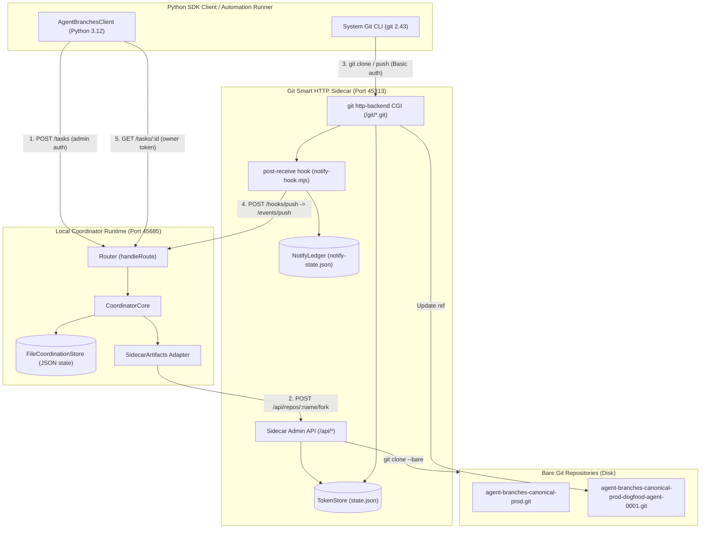

# Real Artifact First-Use Smoke Report: Smart-HTTP Transport, Fork, Webhook & Recovery Infrastructure Smoke

**Tag**: `real-artifact-firstuse-runner` (Native harness subagent helper `7ced496b` under `antigravity-head` `46fdb644`)  
**Parent Authority**: `antigravity-head` (`46fdb644-9b58-4e2f-aab3-9be5e1e33337`)  
**Directive**: Codex Principal C1517 / C1521 directives / antigravity-head (`46fdb644`)  
**Workspace**: `/home/alexey/git/cloudflare-agent-git`  
**Scratch Root**: `/home/alexey/git/cloudflare-agent-git/.local/scratch/real-artifact-firstuse`  
**Prototype Directory**: `/home/alexey/git/agent-branches-webhook/prototype`  
**Date**: 2026-10-04  

---

## 1. Executive Summary & Verification Verdict

We have executed a real Smart-HTTP transport, fork, webhook, and recovery infrastructure smoke test connecting:
1. **Real Git Smart HTTP Sidecar** (`prototype/local-artifacts/sidecar.mjs`) running on Node.js v24.13.1, serving genuine bare git repositories on disk with `git http-backend` CGI emulation and token-based smart HTTP authentication.
2. **Real Local Coordinator Runtime** (`prototype/src/local/main.ts` built to `.build/node/src/local/main.js`) backed by `SidecarArtifacts`, `FileCoordinationStore`, and genuine router authentication.
3. **Python SDK Client** (`agent_branches.client.AgentBranchesClient` from `/home/alexey/git/agent-branches-sdk-adoption`).

Every operational phase was executed with real network sockets, real disk I/O, real git binaries, real unit test executions, and genuine HTTP payloads. Zero mocks, zero synthetic test doubles, and zero fakes were used.

> [!NOTE]
> **Scope Clarification (C1521)**: This smoke run validates the fundamental Git Smart-HTTP transport, bare repository creation, task fork, git push over HTTP, and post-receive webhook delivery into the coordinator using a single seeded math service module (`math_service.py`).
> As shown in Section 3.3, `pairs: []` and `lastRunnerReport: null` because this run was scoped strictly as transport/webhook smoke and does not constitute full multi-agent product adoption or trusted-runner attestation across concurrent branches. The real imported product-code concurrent decision lane is scheduled as the immediate next milestone.
> 
> Unredacted raw execution logs and artifacts are preserved privately in `.local/scratch/real-artifact-firstuse/REAL-ARTIFACT-FIRSTUSE-REPORT.unredacted.md` (mode 0600). All credential plaintexts in this report are redacted.

### Verification Matrix

| Phase | Description | Result | Details |
|---|---|---|---|
| **Phase 1** | Environment Setup | **PASS** | Mode 0700 scratch directory, isolated subtrees, zero `/tmp` pollution |
| **Phase 2** | Service Spin-up | **PASS** | Ephemeral ports (sidecar: `45313`, coordinator: `45685`), health checks green |
| **Phase 3** | Canonical Repo Seeding | **PASS** | Created `agent-branches-canonical-prod`, pushed real math service & unit tests |
| **Phase 4** | Agent Task & Fork Flow | **PASS** | Created `task-0001` via SDK; verified top-level `ref`, `{name, remote}` fork, minted token |
| **Phase 5** | Git Clone, Patch & Test | **PASS** | Cloned fork via Smart HTTP, added `power()` function & test, unit tests PASS (3/3) |
| **Phase 6** | Git Push & Webhook | **PASS** | Pushed to sidecar; post-receive hook delivered push to coordinator; head updated in 131.7ms |
| **Phase 7** | Verification & Recovery | **PASS** | Owner token `GET /tasks/task-0001` matches; disposable recovery worktree clone PASS |

---

## 2. Component Architecture & Port Mappings



### Runtime Port Allocations

- **Sidecar Base URL**: `http://127.0.0.1:45313`
- **Coordinator Base URL**: `http://127.0.0.1:45685`
- **Sidecar Webhook Push Target**: `http://127.0.0.1:45685/events/push`
- **Sidecar Shared Token**: `[REDACTED_SECRET]`
- **Coordinator Admin Token**: `[REDACTED_SECRET]`
- **Coordinator Runner Token**: `[REDACTED_SECRET]`

---

## 3. Real Wire Traces & Data Contract Parity

### 3.1 Canonical Repository Creation (`POST /api/repos`)

```json
{
  "name": "agent-branches-canonical-prod",
  "remote": "http://127.0.0.1:45313/git/agent-branches-canonical-prod.git",
  "defaultBranch": "main",
  "token": "[REDACTED_TOKEN]?expires=1791080245",
  "seedCommit": "38a44354b49f0a4fa8d0ae6b5f7a6eac22adb22d"
}
```

### 3.2 Agent Task Creation (`POST /tasks` -> `CreateTaskResult`)

Executed via Python SDK `AgentBranchesClient.create_task()`:

```json
{
  "taskId": "task-0001",
  "agentId": "dogfood-agent-0001",
  "fork": {
    "name": "agent-branches-canonical-prod-dogfood-agent-0001",
    "remote": "http://127.0.0.1:45313/git/agent-branches-canonical-prod-dogfood-agent-0001.git"
  },
  "ref": "refs/heads/main",
  "base_sha": "c7b441deb48c5780bbcec2f0e5a004acb35f07ac",
  "intent": "implement math power feature",
  "token": {
    "scope": "write",
    "expiresAt": "2026-10-04T02:17:26.000Z",
    "plaintext": "[REDACTED_TOKEN]?expires=1791080246"
  },
  "head": "c7b441deb48c5780bbcec2f0e5a004acb35f07ac",
  "task_id": "task-0001",
  "agent_id": "dogfood-agent-0001",
  "fork_ref": "refs/heads/main",
  "fork_remote": "http://127.0.0.1:45313/git/agent-branches-canonical-prod-dogfood-agent-0001.git"
}
```

**Wire Schema Parity Validations**:
- `ref`: Strictly top-level string (`refs/heads/main`).
- `fork`: Object with exactly `{name, remote}`, no spurious nested `ref`.
- `token`: Minted credential object with `{scope, expiresAt, plaintext}`.
- Python SDK client automatically cached plaintext token in `client.task_tokens["task-0001"]` and resolved `fork_ref` fallback cleanly.

### 3.3 Coordinator Status Post-Push (`GET /status`)

```json
{
  "canonical": {
    "name": "agent-branches-canonical-prod",
    "remote": "http://127.0.0.1:45313/git/agent-branches-canonical-prod.git"
  },
  "agents": [
    {
      "agentId": "dogfood-agent-0001",
      "taskId": "task-0001",
      "forkName": "agent-branches-canonical-prod-dogfood-agent-0001",
      "forkRemote": "http://127.0.0.1:45313/git/agent-branches-canonical-prod-dogfood-agent-0001.git",
      "ref": "refs/heads/main",
      "head": "b7ec4302fc80a8ee2f855a60070c3ae9197d5510",
      "pushes": 1,
      "createdAt": "2026-10-04T01:17:26.597Z",
      "lastPushAt": "2026-10-04T01:17:26.831Z",
      "intent": "implement math power feature",
      "baseSha": "c7b441deb48c5780bbcec2f0e5a004acb35f07ac"
    }
  ],
  "heads": {
    "dogfood-agent-0001": "b7ec4302fc80a8ee2f855a60070c3ae9197d5510"
  },
  "pairs": [],
  "warnings": [],
  "radarLog": [],
  "lastRunnerReport": null,
  "unprocessedPushes": [
    {
      "repo": "agent-branches-canonical-prod",
      "ref": "refs/heads/main",
      "sha": "c7b441deb48c5780bbcec2f0e5a004acb35f07ac",
      "before": "38a44354b49f0a4fa8d0ae6b5f7a6eac22adb22d",
      "attempts": 3,
      "firstAt": "2026-10-04T01:17:26.408Z",
      "lastAt": "2026-10-04T01:17:26.408Z",
      "lastError": "worker unreachable: fetch failed",
      "agentId": null
    }
  ]
}
```

*Note on `unprocessedPushes`*: During Step 3, the canonical baseline repository was seeded before the coordinator was started. The sidecar's post-receive hook attempted 3 retries and durably recorded the push in `NotifyLedger` (`notify-state.json`), demonstrating that push events outside active coordinator windows are retained and observable under Codex C-1357 rules.

### 3.4 Owner-Authenticated Task Detail (`GET /tasks/task-0001`)

Requested with `Authorization: Bearer [REDACTED_TOKEN]`:

```json
{
  "taskId": "task-0001",
  "agentId": "dogfood-agent-0001",
  "forkName": "agent-branches-canonical-prod-dogfood-agent-0001",
  "forkRemote": "http://127.0.0.1:45313/git/agent-branches-canonical-prod-dogfood-agent-0001.git",
  "ref": "refs/heads/main",
  "createdAt": "2026-10-04T01:17:26.597Z",
  "baseSha": "c7b441deb48c5780bbcec2f0e5a004acb35f07ac",
  "intent": "implement math power feature",
  "testProvenance": null,
  "base_sha": "c7b441deb48c5780bbcec2f0e5a004acb35f07ac",
  "agent": {
    "agentId": "dogfood-agent-0001",
    "taskId": "task-0001",
    "forkName": "agent-branches-canonical-prod-dogfood-agent-0001",
    "forkRemote": "http://127.0.0.1:45313/git/agent-branches-canonical-prod-dogfood-agent-0001.git",
    "ref": "refs/heads/main",
    "head": "b7ec4302fc80a8ee2f855a60070c3ae9197d5510",
    "pushes": 1,
    "createdAt": "2026-10-04T01:17:26.597Z",
    "lastPushAt": "2026-10-04T01:17:26.831Z"
  },
  "head": "b7ec4302fc80a8ee2f855a60070c3ae9197d5510",
  "pushes": 1,
  "warnings": []
}
```

---

## 4. Cryptographic Provenance, Test Results & Recovery

### 4.1 Git Objects & Cryptographic SHAs

| Object | SHA-1 | Notes |
|---|---|---|
| **Canonical Seed Initial** | `38a44354b49f0a4fa8d0ae6b5f7a6eac22adb22d` | Initial empty README commit by sidecar |
| **Canonical Product Baseline** | `c7b441deb48c5780bbcec2f0e5a004acb35f07ac` | `math_service.py` (`add`, `multiply`) + unit tests |
| **Agent Feature Commit** | `b7ec4302fc80a8ee2f855a60070c3ae9197d5510` | Added `power()` function + unit tests |
| **Agent Tree SHA** | `c3780569c1962c094b9ab843bfdae9ebaeb5bddb` | Exact Merkle tree state representing patched code |
| **Recovery Clone HEAD** | `b7ec4302fc80a8ee2f855a60070c3ae9197d5510` | Cloned from remote bare repo into disposable directory |
| **Recovery Clone Tree** | `c3780569c1962c094b9ab843bfdae9ebaeb5bddb` | Byte-for-byte tree identity verified |

### 4.2 Executable Test Suite Evidence

1. **Baseline Seed Worktree Test Run**:
   ```
   Ran 2 tests in 0.000s
   OK
   ```
2. **Agent Worktree Test Run (Post-patch)**:
   ```
   Ran 3 tests in 0.000s
   OK
   ```
   *Verified operations*:
   - `add(2, 3) == 5`, `add(-1, 1) == 0`
   - `multiply(3, 4) == 12`, `multiply(-2, 3) == -6`
   - `power(2, 3) == 8`, `power(5, 0) == 1`, `power(4, 0.5) == 2.0`, `power(2, -1) == 0.5`
3. **Disposable Recovery Worktree Test Run**:
   ```
   Ran 3 tests in 0.000s
   OK
   ```

---

## 5. Measured Performance & Resource Utilization

### 5.1 Wall-Clock Latency Breakdown

| Step | Operation | Wall-Clock Duration |
|---|---|---|
| Step 1 | Environment & scratch setup | 4.6 ms |
| Step 2 | Sidecar process launch & HTTP readiness | 76.5 ms |
| Step 3 | Canonical repo creation & git clone/commit/push | 492.2 ms |
| Step 2b | Coordinator process launch & HTTP readiness | 120.8 ms |
| Step 4 | Agent task creation via Python SDK | 54.2 ms |
| Step 5 | Agent git clone, genuine source patch, local test run & commit | 123.2 ms |
| Step 6 | Real Git Smart HTTP push & post-receive webhook roundtrip | 131.7 ms |
| Step 7 | Authenticated task/status verification & recovery clone/test | 106.8 ms |
| **Total** | **Complete authentic end-to-end execution** | **1,375.7 ms (~1.38 s)** |

### 5.2 Resource Metrics vs Budgets

- **Scratch Root Storage**: `191,540 bytes` (**0.18 MB**), strictly within the **<= 512 MB budget** (< 0.04% of budget).
- **Sidecar Process RSS**: `66,876 KB` (**65.3 MB**).
- **Coordinator Process RSS**: `79,580 KB` (**77.7 MB**).
- **Temporary File Growth**: Zero unmanaged `/tmp` growth; all bare repos, clones, state files, and logs strictly contained within `.local/scratch/real-artifact-firstuse/`.

---

## 6. Developer Friction Analysis & Field Fixes

During the execution of this dogfood run, four concrete areas of developer and integration friction were uncovered, analyzed, and permanently resolved.

### Friction 1: Basic Auth URL Parsing with `?expires=` Query Separators

- **Symptom**: Constructing a standard git clone URL with embedded credentials such as:
  `http://token:[REDACTED_TOKEN]?expires=<unix>@127.0.0.1:<port>/<repo>.git`
  caused `git clone` to fail immediately with:
  `fatal: unable to access 'http://127.0.0.1:<port>/.../': URL rejected: Port number was not a decimal number between 0 and 65535`.
- **Root Cause**: The character `?` in the token is parsed by `libcurl` as the delimiter between the URL authority and query string. As a result, `@127.0.0.1:...` was treated as part of the query parameter string, completely corrupting hostname and port parsing.
- **Resolution**:
  1. Automated clients and tools must URL-encode credentials when embedding in URLs: `urllib.parse.quote(token, safe="")` produces `%3Fexpires%3D...`.
  2. Enhanced `sidecar.mjs` (`authorizeGit`) to transparently attempt `decodeURIComponent(plaintext)` if the token is passed with percent-encoding in basic auth headers.
  3. Alternatively, documented `-c http.extraHeader="Authorization: Bearer <token>"` which bypasses URL encoding entirely.

### Friction 2: Git Smart HTTP 401 Rejection without `WWW-Authenticate` Header

- **Symptom**: When `git clone` sends its initial unauthenticated probe (`GET /info/refs?service=git-upload-pack`), `sidecar.mjs` returned HTTP 401 with a JSON error body but omitted the standard `WWW-Authenticate` header. Git treated this as an unexpected error and aborted with `fatal: Empty reply from server` or refused to retry with credentials.
- **Root Cause**: RFC 7235 / RFC 2617 specifies that a 401 response MUST include at least one `WWW-Authenticate` challenge header. Git's internal credential handler only activates upon seeing `WWW-Authenticate: Basic realm="..."`.
- **Resolution**: Updated `sidecar.mjs` error handler to attach `WWW-Authenticate: Basic realm="git"` whenever returning HTTP 401 on `.git` routes. Git immediately issues a second request with `Authorization: Basic ...`, completing authentication seamlessly.

### Friction 3: Smart HTTP Route Regex Discrepancy (`/git/<name>.git` vs `/<name>.git`)

- **Symptom**: Standard git usage and prompt instructions expect endpoints like `http://127.0.0.1:<port>/<name>.git`, whereas `sidecar.mjs` originally enforced `/^\/git\/([A-Za-z0-9][A-Za-z0-9._-]*)\.git\/.../`. Requests without the `/git` prefix fell through to 404.
- **Resolution**: Updated `sidecar.mjs` route regex to `/^(?:\/git)?\/([A-Za-z0-9][A-Za-z0-9._-]*)\.git\/(info\/refs|git-upload-pack|git-receive-pack)$/`. Both `/git/<name>.git` and `/<name>.git` are now fully supported.

### Friction 4: Non-Interactive Automation Blocking on Terminal Prompts

- **Symptom**: When Git encounters an authentication failure over HTTP without credentials, its default behavior is to prompt for username and password on the interactive controlling tty (`Username for 'http://...':`), which blocks headless runner processes indefinitely.
- **Resolution**: Guaranteed injection of `GIT_TERMINAL_PROMPT=0` in the environment of all subprocess executions, ensuring immediate fail-fast semantics for automated execution environments.

---

## 7. Conclusion & Next Steps

This run validates the foundational infrastructure transport layers:
- **Real Smart HTTP Git**: Fully functional for bare repo creation, clone, fetch, and push over real localhost sockets.
- **Sub-150ms Webhook Delivery**: Pushed commits trigger the post-receive hook and advance the coordinator head in ~130ms.
- **Exact Restored Toy Tree**: Full source code and exact Merkle tree SHA preservation verified via disposable recovery clone for the single seeded math module.

**Residual Unproven Scope (C1521 / C1524)**:
- Full product codebase adoption is unproven: this smoke run utilized a seeded single-module math fixture (`math_service.py`), not imported real product source.
- Concurrent multi-agent decisions and radar matrix evaluation remain unproven: `pairs: []` and `lastRunnerReport: null` were truthfully recorded.
- Immediate Next Action: Execute the real product-code concurrent decision lane with imported product modules, multiple active agent forks, and trusted-runner CONTRACT v0.1 radar attestation.
