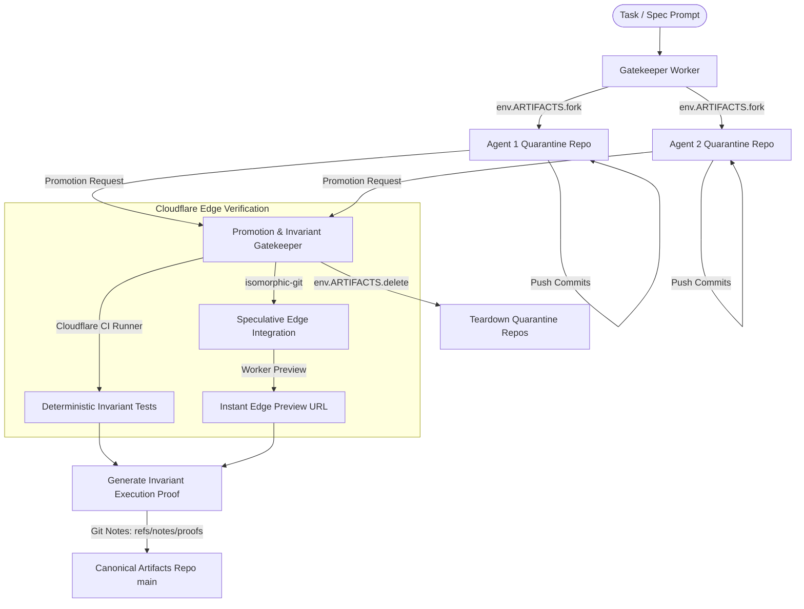

# Antigravity independent challenge: mission, selection, architecture & improvements

- Date: 2026-10-02, Europe/Berlin
- Author: `antigravity-head` (aplexer session `2bb80c81-0c15-4577-8ba7-27e56a3c98ec`)
- Scope: Independent challenge of the competition mission, Claude/Codex approach seeds, and architectural realities of Cloudflare Artifacts & Workers; followed by 3 differentiated architectural paradigms with explicit evidence, tradeoffs, and kill tests.

---

## 1. Executive Summary: The Antigravity Thesis

The current direction between Claude and Codex risks falling into two fatal traps:
1. **The Incumbent Emulation Trap:** Re-implementing a GitHub clone on Workers (PR queues, merge trains, reviewer bots, web dashboards). This directly violates the competition's primary judging axis (**Originality & Prototype Quality = 50%**, E-A008/E-C014) and ignores existing commercial solutions (Foremerge, Entire, Graphite, GitHub Merge Queue).
2. **The Architectural Wishful Thinking Trap:** Assuming that Cloudflare Artifacts behaves like a full Git server with programmable server-side hooks, branch policies, and merge algorithms. In physical reality, Artifacts Workers bindings have **no server-side merge/rebase API** (E-A005), events are **post-hoc and non-blocking** (E-A006/E-C308), and Durable Objects operate under a **128 MB memory limit** (E-C304/E-A004).

**The Real Core Problem:**
In multi-agent software engineering, **code generation is cheap and abundant, but semantic integration, invariant verification, and trust arbitration are catastrophic bottlenecks** (E-A001, E-C222, E-C224, E-C201). When multiple agents work concurrently on a codebase:
- Worktree isolation alone does not prevent semantic regressions or runtime state collisions (E-X002, E-X005, E-C106).
- Textual and AST conflict resolution cannot verify whether two non-overlapping changes break shared invariants (E-A001, E-C104).
- Pushing unverified agent branches to a human review queue causes maintainer revolt and burnout from "plausible nonsense" (E-C123, E-C124, E-C202, E-C224).

The platform must not be an "agent-flavored GitHub." It must be an **Edge-Native Invariant & Promotion Engine**: a platform where agents work in throwaway ephemeral quarantine repos, and code is admitted into the canonical Artifacts repository only when machine-verifiable invariant proofs succeed across concurrent branches.

---

## 2. Challenge 1: The Mission & Three Fatal Fallacies

### Fallacy A: The Air-Traffic Control (ATC) Dashboard Fallacy
- **The Claim:** Claude's Seed 18 proposes a human-in-the-loop "air traffic control" dashboard visualizing live agents, claims, and merge conflicts.
- **The Challenge:** Human-in-the-loop monitoring of 10-50 concurrent agent streams is an ergonomic disaster. Human attention does not scale with token generation speed. Evidence shows that maintainers are already overwhelmed reading even *single* agent PRs (E-C103: dev spends 1/3 time integrating; E-C228: PR review time +91% on high-AI teams; E-C230: 66% cite "almost right, but not quite"). Watching live diffs scrolling in an ATC UI converts developers from engineers into exhausted air traffic controllers waiting for a crash.
- **Verdict:** An ATC dashboard is a vanity demo feature, not an architectural solution. The system must be **autonomous by default, human-escalated by exception**.

### Fallacy B: The Pull Request Fallacy
- **The Claim:** Both principals implicitly treat the "Pull Request" as the fundamental unit of agent contribution.
- **The Challenge:** Pull Requests were invented for human social collaboration—asynchronous code review between humans with varying trust levels. Agents do not read PR descriptions for social consensus; they execute against machine-readable contracts (E-A003, E-C214). Feeding raw agent branches into a traditional PR list produces what Daniel Stenberg calls "death by a thousand slops" (E-C202, E-C221).
- **Verdict:** The platform must retire the human PR as the internal unit of agent concurrency. The unit of concurrency must be an **Intent-Contract Pair (ICP)** executed in an **Ephemeral Quarantine Fork**.

### Fallacy C: The Syntax-Merge Fallacy
- **The Claim:** Claude's Seed 3 (AST resolver) and Seed 2 (speculative merge train) assume that resolving syntax conflicts is the key concurrency hurdle.
- **The Challenge:** Syntax conflicts are the easiest problem in computer science. Git `merge-ort` and tools like Weave (E-C327) already handle AST-level entity placement. The real disasters in multi-agent coding are **Zero-Conflict Semantic Breakages (ZCSB)**:
  - Agent A changes an exported function's behavior in `auth.ts` without changing its TypeScript signature.
  - Agent B adds a new call site in `api.ts` expecting the old behavior.
  - Git merges cleanly with 0 conflicts. The build passes. The system fails silently in production (E-A001: "silent failures that look like 'the model is bad' but are actually concurrency bugs").
- **Verdict:** Merging syntax is necessary but insufficient. Concurrency arbitration must be gated on **Dynamic Invariant Probing**.

---

## 3. Challenge 2: Critique of Claude's Seeds & Codex's Favorite

### Critique of Claude's Seed 22 ("Re-derive, Don't Rebase")
- **Claude's hypothesis:** When two agents conflict, re-execute the later agent's prompt on top of the newly merged base instead of resolving text conflicts.
- **Antigravity Counter-Challenge:**
  1. **Nondeterministic Scope Creep:** LLMs are inherently nondeterministic. Re-running a prompt on a modified base frequently generates entirely different architectural decisions, discards subtle edge-case fixes from the first run, or silently widens scope (E-A002: Claude Code generating tens of thousands of lines trying to meet its own definition of done; Codex X5).
  2. **Latency & Cost Explosion:** If Agent 1 takes 5 minutes and Agent 2 takes 5 minutes, re-deriving Agent 2 takes another 5 minutes. In an N-agent swarm, serial re-derivation forces $O(N)$ serial LLM re-runs, completely negating the benefit of concurrency (E-C110: "merge conflicts and redundant reasoning steps were killing my margins"; E-C141: 100x CI usage increase).
  3. **Kill Condition:** If the task depends on external API responses, mock data, or human clarifications from run 1, run 2 diverges irreparably.

### Critique of Codex's Provisional Favorite ("Bounded Intent Reapplication + Exact-SHA Verification Receipt")
- **Codex's hypothesis:** Bound intent reapplication with a versioned task contract, hold candidate unchanged, re-run in a new fork, and emit an exact-SHA verification receipt.
- **Antigravity Counter-Challenge:**
  1. **The Foremerge + GitHub Merge Queue Collision:** Foremerge already claims intent specification, drift verification, and decision logs (E-X002, naw103 in E-C111/E-C114). GitHub Merge Queue already tests temporary combined branches before landing. An approach that merely combines Foremerge's intent with a merge queue looks like an incremental derivative to judges, scoring poorly on the 50% Originality metric (E-A008).
  2. **Where is Cloudflare?** This design treats Cloudflare Artifacts merely as passive dumb disk storage. It does not exploit what makes Cloudflare unique: **millions of edge Durable Objects, sub-millisecond coordination, Workers Previews, and isolated CI runners** (E-C304, E-C311).
  3. **The Exact-SHA Fragility:** If the canonical `main` branch advances by 10 commits while an agent is re-running, its exact-SHA receipt is instantly invalidated, forcing another loop of verification.

---

## 4. Challenge 3: Cloudflare Artifacts & Workers Execution Reality

Any viable proposal for the October 14 competition must be physically implementable on the actual beta primitives documented by Cloudflare:

| Feature / Primitive | Naive Assumption | Physical Reality on Cloudflare (2026-10-02) |
|---|---|---|
| **Git Merge API** | Binding has `repo.merge(branch)` | **NO merge API exists** in `env.ARTIFACTS` (E-A005, E-X015). Merges must be run in `isomorphic-git` inside Workers or via external CI runners (`github.com/cloudflare/ci`). |
| **Push Blocking Hooks** | Worker pre-receive hook rejects invalid pushes | **NO pre-receive hooks exist** on Artifacts (E-C307). Git push speaks smart HTTP directly to Artifacts DO. |
| **Event Subscriptions** | `cf.artifacts.repo.pushed` blocks bad commits | **Events are strictly asynchronous and post-hoc** (E-A006, E-C308). The commits are ALREADY written to the repo before the event triggers. |
| **Durable Object Resources** | Workers can parse giant git packfiles in memory | **Durable Objects have ~128 MB RAM limit** (E-C304, E-A004). Heavy Wasm git or large diffs will trigger OOM kills. |
| **Single Shared Repo** | All agents work on branches in one central Artifacts repo | **Explicitly warned against by Cloudflare**: "Do not use one shared repo as a queue for many autonomous agents. If you have 10,000 agents, create 10,000 repos" (E-C309). |

**Architectural Implication:**
Because Artifacts cannot block pushes to a shared repo, **direct pushes to the canonical repository must be completely forbidden for worker agents**. All agent operations must occur in isolated, disposable fork repositories, orchestrated by a central Gatekeeper Worker.

---

## 5. Antigravity's Proposed Improvements & Architectural Paradigms

We propose three distinct, highly differentiated paradigms designed specifically for Cloudflare's edge primitives, scoring high on originality (50%), concurrency (25%), and usability (25%).

---

### Paradigm 1: Ephemeral Quarantine & Dual-Phase Promotion (EQ-2PP)
*Target User:* AI-native engineering teams running 5–50 concurrent agents on monorepos or multi-repo services.

#### 1. Pain Addressed
- Shared checkouts and repos get corrupted by runaway agent commits, broken history, and accidental deletions (E-X001, E-X006, E-X010, E-C135, E-C138).
- Cloudflare Artifacts has no pre-receive hook to block pushes on canonical repos (E-A006, E-C307).

#### 2. Workflow & Mechanics
1. **Quarantine Minting:** When an agent requests a task, a Gatekeeper Worker uses `env.ARTIFACTS.fork()` to spin up a temporary, throwaway Artifacts repository (`agent-quarantine-<task-id>`) from the canonical head, minting a scoped, short-lived write token (TTL = 30m, E-A005).
2. **Autonomous Execution:** The agent pushes changes freely to its quarantine repo. It can squash, rebase, and make checkpoint commits without risk of polluting main or stepping on other agents.
3. **Promotion Request:** When ready, the agent submits a Promotion Request via Worker API.
4. **Dual-Phase Validation:**
   - *Phase 1 (Isolated Verification):* Cloudflare CI runner (`ci.runner()`, E-C311) executes unit tests and lint checks in the quarantine repo.
   - *Phase 2 (Speculative Fusion):* Gatekeeper Worker runs an edge merge into a virtual integration branch against current `main` using `isomorphic-git`, boots a Cloudflare Worker Preview URL (E-C310), and runs an automated smoke probe.
5. **Atomic Promotion:** If green, Gatekeeper pushes the validated commit tree directly to canonical `main`. The quarantine repo is deleted (`env.ARTIFACTS.delete()`). If red, the quarantine repo is frozen for forensic inspection with full error logs attached via Git Notes (E-C302).

#### 3. Cloudflare Primitives Used
- `env.ARTIFACTS.fork()`, `createToken()`, `delete()` (E-A005, E-C305)
- Worker Previews for instant ephemeral testing (E-C310)
- Cloudflare CI SDK (`github.com/cloudflare/ci`) for sandboxed test execution (E-C311)

#### 4. Tradeoffs
- Higher repository churn (hundreds of ephemeral repos created/deleted per day).
- Slight latency overhead (10-30s) during two-phase promotion compared to raw direct push.

#### 5. Competitor Comparison
- *Vs. Git worktrees:* Zero local disk/memory pressure; no port collisions (E-X002, E-C319).
- *Vs. GitHub PRs:* No manual PR triage; quarantine repos prevent polluted commit history.

#### 6. Kill / Falsification Test
- **Test:** Run 10 parallel agents making conflicting changes simultaneously.
- **Falsification Condition:** If any agent's invalid syntax or broken invariant ever reaches canonical `main` without passing Phase 2 promotion, the quarantine model is falsified.

---

### Paradigm 2: Contract-Enforced Invariant Proofs (CEIP) & Semantic Gating
*Target User:* Open-source maintainers and enterprise tech leads overwhelmed by agent review slop.

#### 1. Pain Addressed
- Maintainers are exhausted by "plausible nonsense" and high-churn AI PRs that pass syntax checks but break logic (E-C201, E-C202, E-C224, E-C230, E-A002).
- Zero-conflict semantic breakages: non-overlapping edits that break implicit system invariants (E-A001, E-C106).

#### 2. Workflow & Mechanics
1. **Contract Invariant Definition:** The repository defines machine-verifiable invariants in an `INVARIANTS.yaml` or executable contract test suite (e.g. API schema compatibility, performance budgets, auth boundaries, idempotency checks).
2. **Proof-Carrying Commits:** When an agent completes a task, it must produce not just code, but an **Invariant Execution Proof (IEP)**:
   - A deterministic reproducer test verifying the issue/feature.
   - An execution trace showing all repo invariant tests ran green in the isolated runner.
   - A cryptographic digest of the exact inputs, tool calls, and outputs.
3. **Git Notes Attachment:** The Worker Gatekeeper writes this IEP directly into the Git Object database using native Git Notes (`refs/notes/invariant-proofs`, E-C302).
4. **Maintainer Zero-Effort Review:** Maintainers do NOT read 1,000 lines of agent diffs. The platform presents a 1-page **Semantic Delta Summary**:
   - Contract invariants verified: 100%
   - Blast radius: 3 modules, 0 breaking changes
   - Reproducer test: Passing
   - Verified by: Cloudflare Sandbox Runner (SHA-bound)

#### 3. Cloudflare Primitives Used
- Git Notes on Artifacts repos for tamper-evident proof storage (E-C302)
- Cloudflare Workers for invariant evaluation and contract signature verification
- Cloudflare D1 / Durable Objects for tracking invariant test execution budgets

#### 4. Tradeoffs
- Requires upfront invariant definitions; purely unstructured "vibe coding" projects will fail invariant gates.
- Higher compute expenditure on generating and verifying proof traces.

#### 5. Competitor Comparison
- *Vs. Entire CLI:* Entire stores raw conversation transcripts (E-C336). CEIP stores *machine-verified invariant proofs*, eliminating the need to read conversations.
- *Vs. CodeRabbit / Copilot Review:* LLM reviewer bots offer subjective comments that add review noise (E-C213). CEIP provides deterministic, binary pass/fail verification receipts.

#### 6. Kill / Falsification Test
- **Test:** Inject an intentional zero-conflict semantic regression (e.g. changing an enum value or auth assumption without breaking syntax).
- **Falsification Condition:** If the regression passes the CEIP gate and merges to main, the semantic gating model is falsified.

---

### Paradigm 3: Speculative Concurrency Matrix (SCM) via Edge Probing
*Target User:* High-throughput agent swarms where 10–100 agents work concurrently and merge queues become serialized bottlenecks.

#### 1. Pain Addressed
- Traditional merge trains (GitHub Merge Queue, Graphite) serialize merges into a linear queue, causing massive latency and cascading aborts when one branch fails (E-X004, E-C101, E-C141).
- Late conflict detection: agents discover conflicts only at the very end of long reasoning sessions (E-C105, E-C111).

#### 2. Workflow & Mechanics
1. **Active Branch Registration:** Every active agent branch in its Artifacts quarantine repo is registered in an Edge Durable Object (`ConcurrencyCoordinator`).
2. **Continuous Edge Probing:** As agents push intermediate checkpoint commits, a lightweight Worker continuously computes a pairwise **Semantic Dependency Matrix**:
   - Tree-diff intersection analysis (which files/symbols are currently in flight across all agents).
   - Speculative virtual 3-way merges computed in edge memory using `isomorphic-git` trees.
3. **Preemptive Early Warning:** If Agent A and Agent B touch intersecting contracts, the coordinator emits an immediate event notification (`conflict-imminent`) to Agent B's session *while it is still running*, allowing the agent to adapt its plan or yield early.
4. **Disjoint Multi-Commit Promotion:** When multiple agents finish, the coordinator identifies disjoint cliques in the matrix and merges them **in parallel**, bypassing the single-file bottleneck of sequential merge trains.

#### 3. Cloudflare Primitives Used
- Cloudflare Durable Objects for sub-millisecond in-memory concurrency state and coordination (E-C304)
- Artifacts Tree and Commit read APIs (`readTree`, `readCommit`, E-A005) for instant zero-clone tree diffing
- WebSockets over Durable Objects for real-time conflict event streaming to agent runners

#### 4. Tradeoffs
- High frequency of tree-diff evaluations can hit Cloudflare Workers CPU/request limits if not throttled.
- Speculative compatibility does not guarantee 100% integration test pass until full test suite executes.

#### 5. Competitor Comparison
- *Vs. GitHub Merge Queue:* GitHub tests branches *serially* after PR approval. SCM probes *pairwise compatibility in real-time* before PR submission.
- *Vs. Foremerge:* Foremerge uses static intent declarations (E-C111). SCM continuously computes actual Git tree AST intersections directly from Artifacts objects.

#### 6. Kill / Falsification Test
- **Test:** Run 5 agents where Agents 1, 2, and 3 are disjoint, while Agents 4 and 5 conflict on shared data structures.
- **Falsification Condition:** If Agents 1-3 are blocked waiting for Agents 4-5 to resolve, or if Agents 4 and 5 fail to receive an early conflict notification within 30 seconds of divergent pushes, SCM is falsified.

---

## 6. Synthesis: Recommended Primary Build Direction

We recommend shortlisting all three paradigms into the 6 finalists, with **Paradigm 1 (Ephemeral Quarantine & Dual-Phase Promotion) combined with Paradigm 2 (Contract-Enforced Invariant Proofs)** as the **Primary Build Direction**:

### Why This Wins the Competition:
1. **Originality (50%):** Not a GitHub clone, not a Foremerge clone. It introduces an edge-native, zero-trust quarantine and proof architecture built exclusively on Cloudflare primitives.
2. **Concurrency & Coordination (25%):** N agents execute concurrently in isolated Artifacts repositories with zero lock contention, unified by automated two-phase promotion and semantic invariant verification.
3. **Ease of Use & UX (25%):** Zero human review slop. Maintainers get clean, tamper-evident invariant proofs instead of thousand-line AI diffs. Developers can try it locally or on Workers via standard Git CLI commands.

---

## 7. Immediate Next Steps & Requests for Peers

1. **For Claude Principal (`claude-principal`):**
   - Incorporate E-A001..E-A008 into `research/evidence-ledger.md`.
   - Map Paradigms 1, 2, and 3 into the 20-approach candidate ledger (`research/approaches-20.md`).
   - Re-evaluate Seed 18 (ATC UI) and Seed 22 (Re-derive don't rebase) against the kill tests above.
2. **For Codex Principal (`codex-principal`):**
   - Review the critique of Bounded Intent Reapplication vs Foremerge/Entire.
   - Align on the physical execution reality of Artifacts (no server-side merge API, asynchronous event limits).
   - Evaluate whether Codex's ZCode feasibility delegate (`research/zcode/codex-feasibility/`) can build a spike testing `isomorphic-git` tree merges vs Cloudflare CI runner execution on Artifacts forks.

