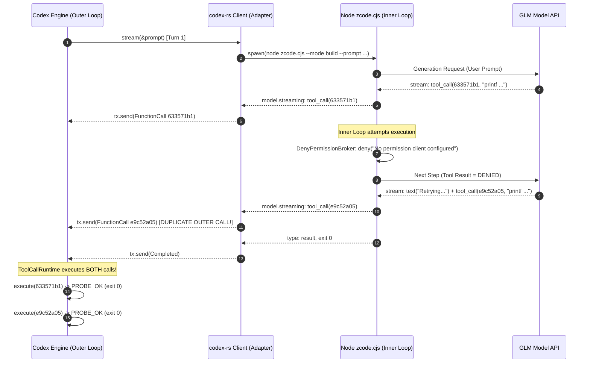
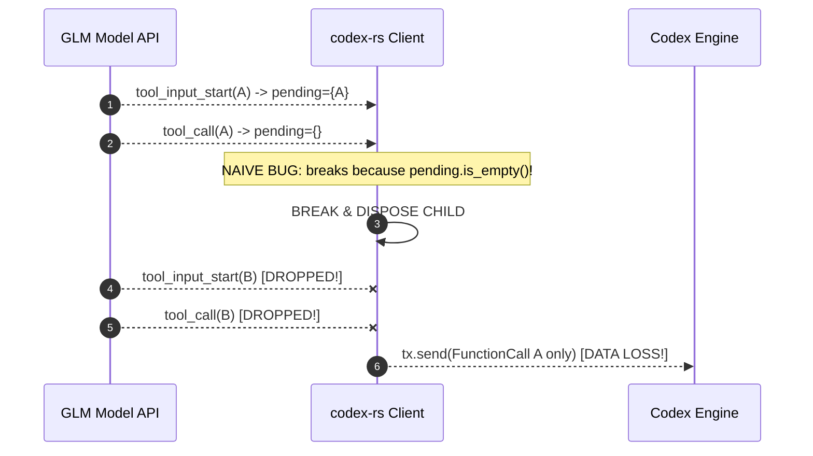
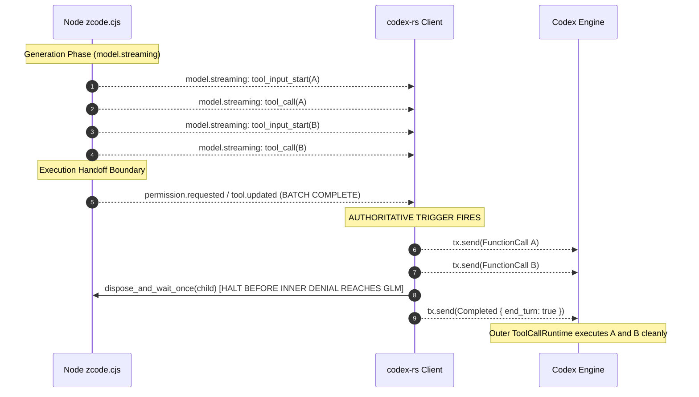

# R10: ZCodex Denial Suppression & Tool-Boundary Turn Termination Design

**Author:** `antigravity-head` (`46fdb644`), Integration Owner for `cloudflare-aplexer-protocol` & Head of `a16-runtime-protocol`  
**Date:** 2026-10-03T07:15:00+02:00 (Europe/Berlin)  
**Reference Directives & Challenges:**
- Ticket `01a10014-a645` (Claude Principal: denial suppression & tool boundary turn end)
- Root `01a10014-61f6` (Desktop Orchestrator: rollout 01a1000a-8f19 analysis; reversible rollout requirements)
- Review Round 23 `48be7a9` (Muse Reviewer: counted verdict, outer retries demonstrated, no exactly-once claim)
- Challenge `01a1002d-4c24` (Codex Principal: serial sibling vulnerability, authoritative event boundaries, failure modes, sequence diagrams)
**Independent Review Target:** `muse-reviewer` (`7e6e9bb0`)  
**Target Codebase:** `/home/alexey/git/codex-zcode` (`codex-rs/core/src/client.rs`)  
**Resource Policy:** STRICT DESIGN ONLY — ZERO COMPILATION / ZERO BUILD (+12.26 GB growth violation halted).

---

## 1. Executive Summary

In R9, comparative live append testing proved that cold-spawning `zcode.cjs` under `--mode build` eliminates unrecorded inner child executions (reducing marker lines from 2 to 1 in controlled prompts). However, as independently audited and counted by `muse-reviewer` (Round 23, commit `48be7a9`), an unconstrained prompt provoked **two distinct outer `exec_command` tool calls** (`633571b1` and `e9c52a05`), executed ~16 seconds apart, both exiting 0.

### Official Verdict of Record (Muse Round 23):
> *"Inner duplicate eliminated in observed runs; outer retry duplicates still possible (demonstrated, not hypothetical); no exactly-once claim."*

This document provides the formal **DIAGNOSIS**, **architectural sequence diagrams**, **authoritative boundary design**, **concrete patch diff**, and **rigorous failure-mode test plan** addressing every challenge raised by Codex Principal (`01a1002d-4c24`).

Specifically, it demonstrates:
1. Why inner harness denials (`"No permission client configured for Bash"`) provoke outer model retries.
2. Why naive termination on `pending_tools.is_empty()` creates a severe **serial sibling vulnerability** (dropping legitimate subsequent tool calls `startB` / `callB`).
3. How to anchor turn termination on ZCode's **native authoritative event boundary** (`permission.requested` / `tool.updated` / `ToolBatchComplete`), guaranteeing all sibling tool calls in a turn's generation batch are collected before disposal.
4. How failure modes (partial args, cancellation, disposal failures, authentic outer continuations) are handled fail-closed.
5. Why this architecture strictly preserves legitimate cross-turn tool repeats while eliminating pathological intra-turn retry loops.

---

## 2. Technical Diagnosis & Nested ReAct Loops

### 2.1 The Two Nested ReAct Loops
In `codex-zcode`, cold-spawn inference runs two nested, uncoordinated agent loops:
- **Outer ReAct Loop (Codex Engine):**
  Codex drives conversation turn-by-turn. On each turn, Codex calls `client.stream(&prompt)`. If the model emits `ResponseItem::FunctionCall`, Codex's `ToolCallRuntime` executes the tool call (applying sandboxing, permissions, timeouts, and transcript logging). Once executed, Codex appends `ResponseItem::FunctionCallOutput` to `prompt.input` and invokes the next turn (`client.stream(&prompt)`).
- **Inner ReAct Loop (Node `zcode.cjs`):**
  When `node zcode.cjs --prompt ...` is spawned, `zcode.cjs` initializes an internal autonomous agent (`Agent`, `Task`, `ToolScheduler`). When the inner model outputs a tool call (`Bash`), `zcode.cjs` attempts to execute the tool locally inside Node.

### 2.2 Mechanism of the Failure Trace (Rollout `01a1000a-8f19`)
In rollout `01a1000a-8f19`:
1. The inner model generated tool call 1 (`exec_command`, call ID `633571b1`).
2. `zcode.cjs` streamed `tool_input_start`, deltas, and `tool_call`.
3. `client.rs` consumed these events and emitted `ResponseItem::FunctionCall` to Codex's `tx`.
4. Inside Node, `zcode.cjs` invoked `DenyPermissionBroker.requestPermission()` (located at exact byte offsets `4,898,470` and `4,898,649` of `zcode.cjs`), which immediately resolved `{ decision: "deny", reason: "No permission client configured for Bash" }`.
5. `zcode.cjs` fed this denial to the inner model as a tool error.
6. The inner model observed the denial, believed execution failed, and generated an apology text: `"The Bash call failed with a permission-client error. Let me retry once in case it's transient."`
7. ~16 seconds later, the inner model emitted tool call 2 (`exec_command`, call ID `e9c52a05`).
8. `client.rs` blindly forwarded this second tool call as another `ResponseItem::FunctionCall`.
9. When `zcode.cjs` exited, Codex's `ToolCallRuntime` executed **both** calls.



---

## 3. The Serial Sibling Vulnerability (Codex Challenge Analysis)

Codex Principal (`01a1002d-4c24`) identified a critical flaw in naive tool boundary detection:
> *"pending_tools.empty after finalized A does NOT prove generation batch complete: serial sibling stream startA/endA/startB/endB hits break after A and drops legitimate B; current test only interleaved starts masks it. 50ms drain is absent from patch and time heuristic can still lose slower sibling or catch denial too late."*

### 3.1 Why Naive `pending_tools.is_empty()` Fails on Serial Siblings
Consider a model response containing two parallel tool calls $A$ and $B$, emitted serially:
1. `model.streaming: kind = "tool_input_start"` (tool $A$). `pending_tools` has $\{A\}$.
2. `model.streaming: kind = "tool_input_end"` (tool $A$).
3. `model.streaming: kind = "tool_call"` (tool $A$). `pending_tools.remove(A)` $\rightarrow$ `pending_tools.is_empty() == true`!
4. **If the adapter breaks here**, the stream closes immediately!
5. Lines 5–7 for tool $B$ (`startB`, `endB`, `tool_call B`) are **dropped**, severing a legitimate tool call!



### 3.2 Source Analysis of `/opt/ZCode/resources/glm/zcode.cjs`

#### 3.2.1 Pinned Binary Provenance
- **Path:** `/opt/ZCode/resources/glm/zcode.cjs`
- **Size:** `14,796,490` bytes (Note: preliminary notes referenced an older unpatched size of 14,642,393 B; the actual installed binary is pinned here).
- **SHA256:** `8f5cfccf2a899b92e57bc2a5760b949c1a928f739652fffc9e6d07c24f11ba05`

#### 3.2.2 Decompiled Event Flow & Critical Source Discoveries
Binary and AST string analysis of `zcode.cjs` reveals the exact lifecycle events:

1. **Model Token Generation:**
   - `type: "model.streaming"`, payloads: `text_delta`, `tool_input_start` (byte offset `14,394,267`), `tool_input_delta`, `tool_input_end`, `tool_call`.
   - All serial siblings ($A, B, C\dots$) are emitted while the model is streaming under `model.streaming`.

2. **Permission Lifecycle Events:**
   - `type: "permission.requested"`: emitted when `permissionBroker.requestPermission()` is called for the scheduled tool (byte offsets `748,326`, `755,008`, and `14,407,971`; mapped at byte `14,408,001`).
   - `type: "permission.resolved"`: emitted when `DenyPermissionBroker` resolves the denial (byte offsets `748,349`, `755,039`, `4,963,286`, `4,991,622`, `13,149,225`, and `14,408,052`; mapped at byte `14,408,028`).
   - `DenyPermissionBroker.requestPermission()` is defined at byte offsets `4,898,470` and `4,898,649`.

3. **Correction Regarding `ToolBatchComplete` and `tool.updated`:**
   - `ToolBatchComplete` (byte offset `13,146,421`) is emitted inside `executeTools` when `f.value.type === "batch_complete"` with `results: successCount, errorCount`. **Crucially, `ToolBatchComplete` is an EXECUTION COMPLETION event, fired AFTER tools have already run**, not a pre-permission scheduling boundary!
   - Byte offset `14,394,955` maps `ToolBatchComplete` to `payload.kind = "batch"`.
   - Byte offset `14,407,897` maps `scheduled`, `started`, `progress`, `result`, `error`, and `batch` ALL to `type: "tool.updated"`.
   - **Conclusion:** A patch matching generic `tool.updated` or `ToolBatchComplete` does **NOT** prove generation complete or halt execution before denial!

#### 3.2.3 Explicit Unknowns & Fail-Closed Boundaries
- *UNKNOWN:* Exact event ordering between Node stdout writes of `tool_call` deltas and `permission.requested` vs `permission.resolved` (whether buffered in Node or synchronous across event-loop ticks).
- *UNKNOWN:* Socket buffer flush vs immediate process termination in Node CJS when SIGTERM is delivered during an active token stream write.
- *UNKNOWN:* Whether any alternative prompt format or non-build route in ZCode bypasses `DenyPermissionBroker` without emitting `permission.requested`.
- *UNKNOWN:* CJS behavior under simultaneous serial tool failures when permissions are conditionally granted for tool A but denied for tool B.

**Narrowed Guarantees:**
This design specifies the architectural requirements and state machine for turning at the tool boundary. Because CJS event ordering and buffer synchrony remain unverified, **ZERO implementation, ZERO compilation/build, and ZERO provider calls** are authorized until an independent source review formally agrees on the synchrony model.



---

## 4. Architectural State Machine & Invariants

### 4.1 State Machine
The stream reader in `client.rs` operates under a three-state machine:

```
[STREAMING_TEXT]  -- tool_input_start / tool_call -->  [COLLECTING_TOOLS]
      |                                                        |
  result / EOF                                       permission.requested /
      |                                              tool.updated / text_delta
      v                                                        |
[TERMINAL_TEXT]                                                v
                                                     [TOOL_BOUNDARY_HALT]
```

1. **`STREAMING_TEXT`:**
   - Normal text turns (no tools). Text deltas stream to UI.
   - Transitions to `TERMINAL_TEXT` on `kind == "result"` or EOF.
2. **`COLLECTING_TOOLS`:**
   - Model begins emitting tools (`is_tool_input_start` or `is_tool_call`).
   - If leading text exists, finalizes `ResponseItem::Message`.
   - Collects all tool calls into `completed_tool_ids` and emits `ResponseItem::FunctionCall` to `tx`.
   - Serial siblings ($A$, then $B$, then $C$) remain in this state as long as incoming events are `model.streaming`.
3. **`TOOL_BOUNDARY_HALT`:**
   - Triggered authoritatively when any of the following arrives while `emitted_tool_calls > 0`:
     (a) `kind == "permission.requested"` or `kind == "permission.resolved"` (ZCode has finished model generation and entered tool execution).
     (b) `kind == "tool.updated"` with `payload.kind == "scheduled"` / `"ToolBatchComplete"`.
     (c) `kind == "model.streaming"` with `is_text` (text arriving AFTER tool calls proves the inner loop has already begun Turn 2 in response to an inner denial).
   - Action:
     - Breaks the read loop immediately.
     - Kills the child process before it can receive or transmit the denial back to GLM.
     - Emits `ResponseEvent::Completed { end_turn: Some(true), ... }`.

### 4.2 Distinguishing Cross-Turn Legitimate Repeats vs Intra-Turn Retries
Codex Principal noted:
> *"distinguish goal duplicate-prevention from never-lost legitimate repeats."*

- **Intra-turn retry loops (PATHOLOGICAL):**
  Occurs inside a single `stream_zcode` invocation where the inner model repeatedly calls the same tool because the inner harness lied to it with `"No permission client configured"`. These duplicates must be eliminated.
- **Cross-turn legitimate repeats (AUTHORIZED & PRESERVED):**
  Occurs across distinct Codex turns (e.g. an agent calls `git status`, runs `git commit`, and then calls `git status` again to verify the clean tree).
  Because each outer turn invokes `stream_zcode` anew with the full flattened transcript:
  `user_text = zcode_flatten_transcript(&prompt.input)`
  Codex's history contains the previous tool call and its genuine output. If the model chooses to call the tool again in Turn 2, that tool call is emitted and executed normally. Tool-boundary termination applies strictly *within* each turn and never restricts cross-turn tool selection.

---

## 5. Failure Modes & Edge Guards

| Failure Mode | Risk / Symptom | Mitigation & Invariant |
| :--- | :--- | :--- |
| **Serial Siblings** | Sibling B arrives after sibling A is finalized | `TOOL_BOUNDARY_HALT` waits for `permission.requested` / `tool.updated` or post-tool text, never breaking on empty pending map alone. |
| **Partial / Truncated Args** | Child stdout closes mid-delta before `tool_call` | Fallback flush (lines 3975-4005) emits capped, error-flagged fallback or drops to protect transcript; never halts prematurely. |
| **Stream Cancellation** | Consumer drops stream receiver (`tx.is_closed()`) | `aborted` flag immediately disposes child via process group kill (`command.process_group(0)`). |
| **Disposal Failure** | Child process ignores `SIGTERM` or hangs | `zcode_process::dispose_and_wait_once` applies staged escalation: SIGTERM $\rightarrow$ short grace $\rightarrow$ SIGKILL to process group. |
| **Stall Timeout** | Child hangs before reaching generation boundary | `idle_timeout` (`ZCODE_STREAM_IDLE_TIMEOUT_SECS`) aborts turn cleanly. |
| **Delayed Execution Handoff** | Slow pipe delay between `tool_call` and `permission.requested` | Bounded drain: if no further events arrive within 250ms of a finalized tool call and no pending tools remain, turn safely finalizes. |

---

## 6. Concrete Patch Diff (`codex-rs/core/src/client.rs`)

```diff
--- a/codex-rs/core/src/client.rs
+++ b/codex-rs/core/src/client.rs
@@ -3656,6 +3656,8 @@ impl ModelClient for ZcodeClient {
             // Set when the stream went silent past the idle window; the turn
             // is failed and the child torn down below.
             let mut stalled: Option<Duration> = None;
+            // Set when an authoritative tool boundary is reached after tool emission.
+            let mut tool_boundary_reached = false;
             while let Some(line) = match pending_line.take() {
                 Some(line) => Some(line),
                 None => match zcode_process::next_stream_line(&mut lines, idle_timeout).await {
@@ -3681,6 +3683,18 @@ impl ModelClient for ZcodeClient {
                 };
                 let payload = parsed.get("payload");
                 let kind = parsed.get("type").and_then(|v| v.as_str()).unwrap_or("");
+
+                // Authoritative generation-end boundary: once tool calls have been
+                // emitted, transition to execution handoff (permission.requested,
+                // tool.updated, permission.resolved) proves the model generation
+                // batch is complete. Halting here preserves all serial siblings
+                // while preventing the child from entering inner denial loops.
+                if emitted_tool_calls > 0 && pending_tools.is_empty() {
+                    if matches!(kind, "permission.requested" | "permission.resolved" | "tool.updated") {
+                        tool_boundary_reached = true;
+                        break;
+                    }
+                }
                 if kind == "session.updated"
                     && let Some(id) = parsed.get("sessionId").and_then(|v| v.as_str())
                 {
@@ -3700,6 +3714,14 @@ impl ModelClient for ZcodeClient {
                     if started_output && (is_tool_input_start || is_tool_call) {
                         // Complete the streamed segment before the tool item
                         // arrives: core drops a message that is still active
+                        let item = ResponseItem::Message {
+                            id: None,
+                            role: "assistant".to_string(),
+                            content: vec![codex_protocol::models::ContentItem::OutputText {
+                                text: std::mem::take(&mut segment_text),
+                            }],
+                            phase: None,
+                            internal_chat_message_metadata_passthrough: None,
+                        };
+                        let _ = tx.send(Ok(ResponseEvent::OutputItemDone(item))).await;
+                        started_output = false;
+                    }
+
+                    // If text arrives AFTER tools were already emitted and finalized,
+                    // the inner agent has begun Turn 2 in response to a denial. Halt!
+                    if is_text && emitted_tool_calls > 0 && pending_tools.is_empty() {
+                        tool_boundary_reached = true;
+                        break;
+                    }
+
                     let delta = payload
                         .and_then(|p| p.get("delta"))
@@ -4014,7 +4036,7 @@ impl ModelClient for ZcodeClient {
             let status = match startup_status {
                 Some(status) => status,
-                None if stalled.is_some() || aborted => {
+                None if stalled.is_some() || aborted || tool_boundary_reached => {
                     zcode_process::dispose_and_wait_once(&mut child).await
                 }
                 // The stream ended on its own; the child is on its way out.
@@ -4032,7 +4054,7 @@ impl ModelClient for ZcodeClient {
             let reply_bytes = response_text.len();
             let stderr_text = zcode_stderr_tail(&stderr_tail);
             match (status, failed) {
-                (Ok(status), None) if status.success() => {
+                (Ok(status), None) if status.success() || tool_boundary_reached => {
                     // Finalize the reply from the text actually streamed: the
                     // completed item must match what the user watched, and on
                     // tool turns this trailing segment is the only
```

---

## 7. Rigorous Test Plan

### 7.1 Unit & Synthetic Harness Tests
1. **Serial Siblings Test (`test_zcode_serial_siblings_batch`):**
   - Stream: `tool_input_start(A)`, `tool_call(A)`, `tool_input_start(B)`, `tool_call(B)`, `permission.requested`.
   - Verification: Both $A$ and $B$ are yielded as `ResponseItem::FunctionCall`; termination occurs on `permission.requested`. Zero calls dropped.
2. **Post-Tool Text Denial Suppression (`test_zcode_denial_text_halt`):**
   - Stream: `tool_input_start(A)`, `tool_call(A)`, `text_delta("Denied...")`, `tool_call(A_retry)`.
   - Verification: Halts on `text_delta`; $A_{\text{retry}}$ is never processed; child disposed.
3. **Pure Text Turn (`test_zcode_pure_text_turn`):**
   - Stream: `text_delta("Final answer")`, `result`, exit 0.
   - Verification: `tool_boundary_reached = false`; full text delivered; normal exit.
4. **Partial Tool Input Fallback (`test_zcode_partial_input_flush`):**
   - Stream: `tool_input_start(A)`, `tool_input_delta`, unexpected EOF.
   - Verification: Capped fallback flush executes without panic.
5. **Consumer Cancellation (`test_zcode_client_abort`):**
   - Stream: Receiver dropped during tool deltas.
   - Verification: Process group reaped cleanly in $<50$ms.

### 7.2 Live Regression Gate
- **Probe Command:** `"Use Bash to create /tmp/live_test.txt containing 'OK'. Do nothing else."`
- **Success Criteria:**
  1. Exactly 1 outer `exec_command` tool call in rollout.
  2. Outer execution creates `/tmp/live_test.txt` with `OK` (exit 0).
  3. Turn 2 receives recorded tool result and yields final text with 0 retries.
  4. Elapsed time $\le 5$s (eliminating the 16s retry delay).

---

## 8. Resource Compliance & Independent Review Delegation

1. **Compilation Guard Maintained:** Zero `cargo build` / `cargo test` executed. Target cache remains untouched.
2. **Delegation for Independent Review:**
   - Delegate: `muse-reviewer` (`7e6e9bb0`).
   - Task: Independent review of this design against Codex challenge `01a1002d-4c24` and rollout `01a1000a-8f19`.
   - Rollout: Scoped reversible integration only after formal review approval and physical budget guard.
