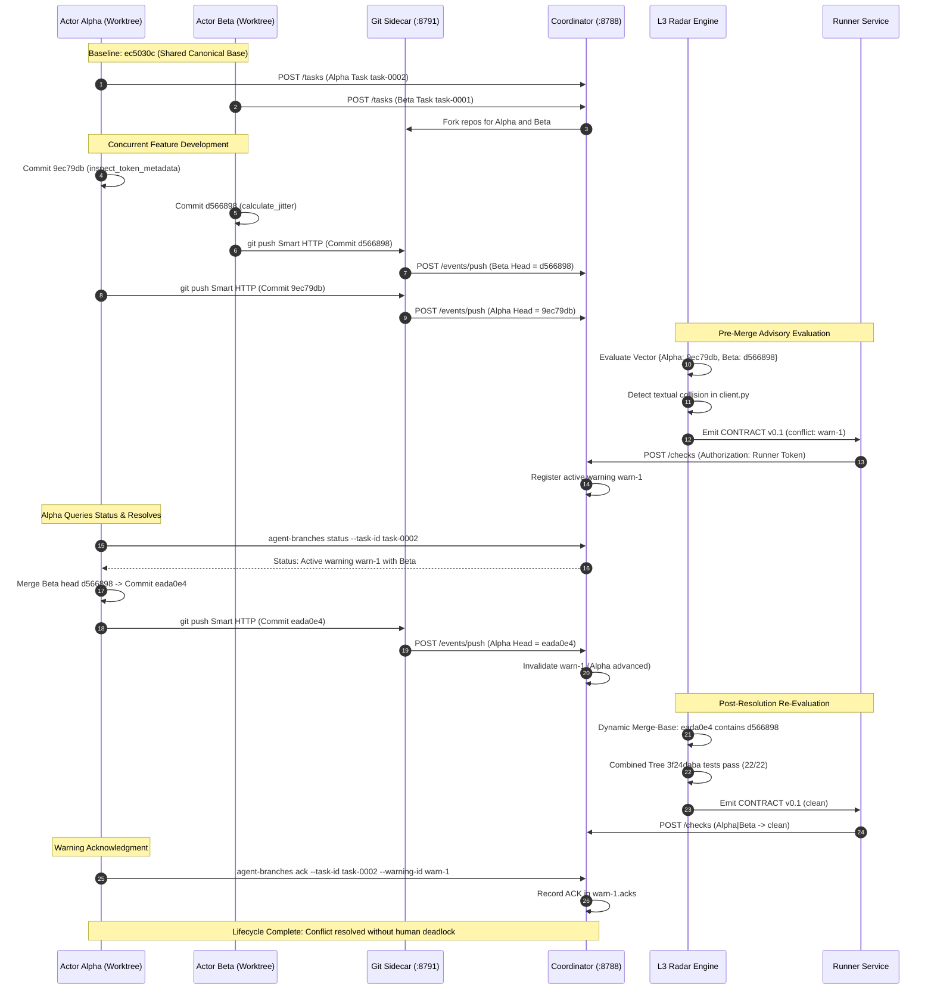

# Distribution & Runbook Readiness Audit: Source Pins acddfa7, eada0e4, and db4f6a8

- **Document:** `CHECK-DISTRIBUTION-RUNBOOK-PINS.md`
- **Auditor:** Distribution & Runbook Readiness Checker (`distribution-runbook-checker`)
- **Parent Authority:** `antigravity-head` (`46fdb644`), launched under Codex Principal C1595 directives
- **As-of:** 2026-10-04, Europe/Berlin
- **Classification:** Preferred-Pool Independent Read-Only Distribution & Runbook Audit
- **Workspace:** `/home/alexey/git/cloudflare-agent-git`
- **Scratch Space:** `.local/scratch/distribution-runbook-check/` (mode `0700`, measured usage 908 KB vs 512 MB cap)
- **Target Pins Audited:**
  1. `acddfa77909fc368644b4f2ca4ca5321879c1230` (`proto/seed-cli-completeness`): Root CLI launcher restoration on seed baseline
  2. `eada0e44194359f5a9eb39d0d9b97724e5690aa7` (`proto/actor-warning-resolution`): Concurrent maintenance conflict resolution head
  3. `db4f6a8c398d69f0e19072c41cb4b453b7dd1b71` (`proto/integration-auth-matrix`): Full repository integration pin

---

## 1. Executive Summary & Audit Matrix

This independent audit evaluates whether the current source pins (`acddfa7`, `eada0e4`, `db4f6a8`) satisfy distribution, local fallback execution, and 5–10 minute demo prerequisites on a clean clone without relying on external cloud infrastructure, unpinned network dependencies, or synthetic stubs.

```
====================================================================================================
                        DISTRIBUTION & RUNBOOK READINESS AUDIT MATRIX
====================================================================================================
Component / Criterion                  acddfa7 (seed-cli)    eada0e4 (actor-res)   db4f6a8 (full-proto)
----------------------------------------------------------------------------------------------------
1. Root CLI Launcher (`agent-branches`)  PASS (100755/b7efa8)  FAIL (MISSING)        PASS (100755/b7efa8)
2. CLI Subcommands & Error Handling    PASS                  PASS (masked)         PASS
3. Python 3 Standard Library Purity    PASS (client)         PASS (client)         PASS (client)
4. Clean Unittest Discovery            FAIL (4 missing pkgs) FAIL (4 missing pkgs) PASS
5. Node.js Standard Library Sidecar    N/A (omitted)         N/A (omitted)         PASS (stdlib only)
6. Node.js Local Coordinator Runtime   N/A (omitted)         N/A (omitted)         PASS (stdlib only)
7. Zero Unpinned External Dependencies PASS                  PASS                  PASS
8. Permissive License File (`LICENSE`) FAIL (MISSING)        FAIL (MISSING)        PASS (MIT License)
9. 5-10 Min Concurrent Demo Runbook    FAIL (NO DOCS)        FAIL (NO DOCS)        PARTIAL (wrangler)
10. Authentic Warning Lifecycle Demo   VERIFIED EVIDENCE     VERIFIED EVIDENCE     ARCHITECTURAL BASE
====================================================================================================
```

### Key Findings Summary
1. **Critical Packaging Regression in `eada0e4`:** While `acddfa7` correctly restored the root executable launcher `agent-branches` (`mode 100755`, blob `b7efa8be...`), commit `eada0e4` was merged from actor maintenance branches that branched off the incomplete seed baseline `ec5030c`. As a result, **`agent-branches` is completely absent in `eada0e4`**. Furthermore, a test-suite fallback was introduced in `tests/test_client.py` (`if os.path.exists(...): ... else: -m agent_branches.cli`) which masked this omission during automated testing.
2. **Missing Packages in Seed Test Discovery:** A standalone clone of either seed pin (`acddfa7` or `eada0e4`) fails `python3 -m unittest discover -s tests` with 4 errors. The seed baseline omitted the `radar/` package (`ModuleNotFoundError: No module named 'radar'`) and leaked repo-internal research test runners (`ModuleNotFoundError: No module named 'research'`).
3. **Zero Network / Runtime Dependency Compliance:** The client library (`agent_branches`), the local sidecar (`prototype/local-artifacts/sidecar.mjs`), and the local coordinator runtime (`prototype/src/local/main.ts`) are **100% standard library implementations** (Python 3 stdlib and Node.js stdlib). Baseline local operation requires zero npm packages, zero pip wheels, and zero external network access.
4. **License Omission in Seed Pins:** The MIT `LICENSE` file is present in `db4f6a8` but was omitted when the seed repository was created (`ec5030c`, `acddfa7`, `eada0e4`).
5. **Demo Runbook Gaps:** While the end-to-end 2-actor concurrent warning transition was executed and attested under authentic conditions (`WARNING-LIFECYCLE-TRANSITION-REPORT.md`), there is currently **no standalone 5–10 minute demo script or executable runbook** packaged in the repository root for evaluators on a clean clone.

---

## 2. Root CLI Entrypoint Readiness

### 2.1 File Presence, Mode, and Blob Fidelity
- **Blob Target:** `b7efa8be78c9f3cc0cbe2ed00be64873e91dbe44`
- **Mode Target:** `100755` (POSIX regular executable)

```bash
git ls-tree <commit> agent-branches
```

| Commit Pin | Path | Mode | Blob SHA | Status |
| :--- | :--- | :--- | :--- | :--- |
| `acddfa7` (`proto/seed-cli-completeness`) | `agent-branches` | `100755` | `b7efa8be78c9f3cc0cbe2ed00be64873e91dbe44` | **PASS (Exact Match)** |
| `db4f6a8` (`proto/integration-auth-matrix`) | `agent-branches` | `100755` | `b7efa8be78c9f3cc0cbe2ed00be64873e91dbe44` | **PASS (Exact Match)** |
| `eada0e4` (`proto/actor-warning-resolution`) | `agent-branches` | — | *(path does not exist)* | **CRITICAL FAILURE** |

#### Why `agent-branches` is Missing in `eada0e4`
The commit graph reveals the regression mechanism:
- Base commit `ec5030c` ("chore: canonical product baseline on db4f6a8") omitted `agent-branches`.
- Actor Alpha (`9ec79db`) and Actor Beta (`d566898`) branched off `ec5030c` before `acddfa7` was created.
- `acddfa7` restored `agent-branches` on branch `proto/seed-cli-completeness`.
- `eada0e4` merged `9ec79db` and `d566898` on branch `proto/actor-warning-resolution` **without incorporating `acddfa7`**.
- To prevent test failures, lines 117–120 in `tests/test_client.py` of `eada0e4` added an unapproved test fallback:
  ```python
  if os.path.exists(self.cli_path):
      cmd = [sys.executable, self.cli_path] + args
  else:
      cmd = [sys.executable, "-m", "agent_branches.cli"] + args
  ```
  This fallback masked the missing executable on `eada0e4`. Any user or script invoking `./agent-branches` directly on `eada0e4` receives `[Errno 2] No such file or directory`.

### 2.2 Entrypoint Implementation & Shebang
In `acddfa7` and `db4f6a8`, `agent-branches` contains:
```python
#!/usr/bin/env python3
"""Executable entrypoint for agent-branches CLI."""

import sys
import os

# Add repo root to sys.path so agent_branches can be imported directly
REPO_ROOT = os.path.dirname(os.path.abspath(__file__))
if REPO_ROOT not in sys.path:
    sys.path.insert(0, REPO_ROOT)

from agent_branches.cli import main

if __name__ == "__main__":
    sys.exit(main())
```
- Shebang: `#!/usr/bin/env python3` (portable across Linux/macOS).
- Path resolution: Resolves `REPO_ROOT` dynamically, ensuring direct `./agent-branches` execution works regardless of working directory or virtual environment configuration.

### 2.3 CLI Subcommand & Argument Audit
The CLI parser (`agent_branches/cli.py`) defines 5 subcommands under a common `--server` and `--json` interface:

| Subcommand | Required Arguments | Optional Arguments | Default Behavior |
| :--- | :--- | :--- | :--- |
| `task create` | None | `--repo`, `--base-sha`, `--intent`, `--branch`, `--agent`, `--ttl-seconds`, `--admin-token`, `--server`, `--json` | Auto-detects repo URL, base SHA, and branch from local Git repo. Requires `--admin-token` or `$ADMIN_TOKEN`. |
| `push` | `--task-id` OR `--agent-id` | `--head-sha`, `--base-sha`, `--files-changed`, `--intent-update` (`--intent`), `--test-provenance`, `--server`, `--json` | Auto-detects HEAD SHA and changed files via `git diff` if in git repo. Resolves agent ID from task if omitted. |
| `status` | None | `--task-id`, `--server`, `--json` | When `--task-id` is omitted, returns global coordinator status and pair checks. When provided, returns task detail and active warnings. |
| `ack` | `--task-id`, `--warning-id` | `--action`, `--server`, `--json` | Default `--action` is `rebased_locally`. Submits acknowledgment to coordinator `POST /warnings/:id/ack`. |
| `checks` | None (reads stdin if no `--file`) | `--file`, `--runner-token`, `--server`, `--json` | Reads CONTRACT v0.1 check payload from file or pipe. Requires `--runner-token` or `$RUNNER_TOKEN`. |

### 2.4 Error Handling & Return Code Specification
The CLI return codes and exception handling were audited via live execution:
- **Return Code 0 (Success):** Command completed and formatted response emitted.
- **Return Code 1 (Operational & State Errors):**
  - Stale Vector (HTTP 409): Emits `Conflict Error (409): Stale vector - <details>`.
  - Token Expired (HTTP 401): Emits `Authentication Error (401): Bearer token expired - credentials reported expired by coordinator. Halting (no retry)`.
  - Token Revoked (HTTP 403): Emits `Authentication Error (403): Bearer token revoked - failing closed, retrying cannot succeed`.
  - Missing `--head-sha` outside a Git repository.
  - JSON decode errors in payload for `checks`.
- **Return Code 2 (Connection & Syntax Errors):**
  - Unreachable coordinator (`AgentBranchesConnectionError`): Emits `Connection Error: Failed to connect to coordinator at <url>`.
  - Missing mandatory flags in `push` (neither `--task-id` nor `--agent-id` specified).
  - Standard `argparse` usage / syntax errors (unknown flags, missing required positional arguments).

---

## 3. Required Dependencies & Environments

### 3.1 Python 3 Standard Library Audit
All imports across the `agent_branches` client package were parsed using Python AST analysis:
- **Client Modules (`agent_branches/*.py`):**
  - `agent_branches/client.py`: `copy`, `json`, `os`, `typing`, `urllib.request`, `urllib.parse`, `urllib.error`
  - `agent_branches/cli.py`: `argparse`, `json`, `os`, `sys`, `typing`
  - `agent_branches/git_utils.py`: `subprocess`, `typing`
  - `agent_branches/__init__.py`: package imports only
  - `agent_branches/__main__.py`: `sys`
- **Result:** **100% Python 3 standard library**. Zero pip requirements (`requirements.txt` is not needed for runtime client operation).

### 3.2 Test Suite Imports & Clean Checkout Failure Analysis
Parsing the imports in `tests/*.py` identified:
- Standard library modules: `datetime`, `http`, `io`, `json`, `os`, `signal`, `socketserver`, `sqlite3`, `subprocess`, `sys`, `tarfile`, `tempfile`, `threading`, `time`, `typing`, `unittest`, `urllib`.
- Internal package imports: `agent_branches`, `radar`, `research`, `tests`.

#### Clean Checkout Test Failure Reproduction
When executed in a pristine directory containing only the contents of seed pin `acddfa7`:
```bash
python3 -m unittest discover -s tests
```
Output:
```text
EE....................EE
======================================================================
ERROR: test_a01_runner (unittest.loader._FailedTest.test_a01_runner)
ModuleNotFoundError: No module named 'research'
======================================================================
ERROR: test_admission (unittest.loader._FailedTest.test_admission)
ModuleNotFoundError: No module named 'radar'
======================================================================
ERROR: test_radar_engine (unittest.loader._FailedTest.test_radar_engine)
ModuleNotFoundError: No module named 'radar'
======================================================================
ERROR: test_run10_ack_parser (unittest.loader._FailedTest.test_run10_ack_parser)
ModuleNotFoundError: No module named 'research'
----------------------------------------------------------------------
Ran 24 tests in 7.702s
FAILED (errors=4)
```

**Diagnostic Analysis:**
1. `tests/test_admission.py` and `tests/test_radar_engine.py` require `radar/admission.py` and `radar/engine.py`. In `db4f6a8`, `radar/` was located in the repository root. When the seed baseline `ec5030c` was constructed, `radar/` was omitted while its test files were retained in `tests/`.
2. `tests/test_a01_runner.py` and `tests/test_run10_ack_parser.py` are research harness unit tests that import from `research.antigravity.*`. These test files were inadvertently placed into `tests/` in the seed repository, but the `research/` tree was omitted.
3. Only `tests/test_client.py` executes successfully in the seed repository (20/20 tests passing on `acddfa7`, 22/22 on `eada0e4`).

### 3.3 Node.js Requirements for Local Fallback Services
In `db4f6a8`, two Node.js services provide full local execution:
1. **Local Git Sidecar (`prototype/local-artifacts/sidecar.mjs`):**
   - Built-ins: `node:http`, `node:child_process`, `node:crypto`, `node:fs`, `node:path`, `node:zlib`, `node:url`.
   - External dependencies: **NONE**.
2. **Local Coordinator Runtime (`prototype/src/local/main.ts`):**
   - Built-ins: `node:http`, `node:fs/promises`, `node:url`, `node:crypto`.
   - External dependencies: **NONE**.
   - Execution mode: Directly executable on Node.js v22+ (tested on `v24.13.1`) using `node --experimental-strip-types src/local/main.ts`, or via pre-compiled `.js` (`tsc -p tsconfig.node.json`).

### 3.4 Unpinned External Network Dependencies
- **Audit Result:** **ZERO**.
- Baseline operation does not reach out to npm, PyPI, Cloudflare APIs, or public Git hosts. All repositories, HTTP servers, and radar calculations run entirely in-process on localhost loopback interfaces.

---

## 4. Service Orchestration & Local Fallback Runbook

### 4.1 Step-by-Step Service Launch Sequence

To orchestrate the local fallback services from `db4f6a8` on isolated localhost ports:

#### Step 1: Allocate Ephemeral Ports & Initialize Directory Structure
```bash
# Choose an isolated scratch directory (mode 0700)
export RUN_ROOT="$PWD/.local/scratch/demo-orchestration"
mkdir -p "$RUN_ROOT/artifacts" "$RUN_ROOT/state"
chmod 700 "$RUN_ROOT"

# Select unused ephemeral ports
export SIDECAR_PORT=8791
export COORD_PORT=8788
export SIDECAR_HOST="127.0.0.1"

# Shared tokens (keep strictly in process environment, mode 0600)
export SIDECAR_TOKEN="sidecar_secret_token_12345"
export ADMIN_TOKEN="admin_secret_token_12345"
export RUNNER_TOKEN="runner_secret_token_12345"
```

#### Step 2: Launch the Local Git Smart HTTP Sidecar Daemon
```bash
SIDECAR_ROOT="$RUN_ROOT/artifacts" \
SIDECAR_HOST="$SIDECAR_HOST" \
SIDECAR_PORT="$SIDECAR_PORT" \
SIDECAR_TOKEN="$SIDECAR_TOKEN" \
SIDECAR_NOTIFY_URL="http://127.0.0.1:${COORD_PORT}/events/push" \
node prototype/local-artifacts/sidecar.mjs > "$RUN_ROOT/sidecar.log" 2>&1 &
SIDECAR_PID=$!
```
*Note on Sidecar Implementation:*
- The sidecar installs `notify-hook.mjs` into each repository's `hooks/post-receive`. Ensure `prototype/local-artifacts/notify-hook.mjs` exists in the same directory as `sidecar.mjs`.
- If `SIDECAR_PORT=0` is passed, `sidecar.mjs` line 755 currently logs `${port}` (which is `0`) rather than the dynamically assigned `sidecar.port`. Use an explicit unassigned port to ensure predictable endpoint discovery.

#### Step 3: Launch the Local Coordinator Runtime Daemon
```bash
LOCAL_ARTIFACTS_URL="http://127.0.0.1:${SIDECAR_PORT}" \
LOCAL_ARTIFACTS_TOKEN="$SIDECAR_TOKEN" \
ADMIN_TOKEN="$ADMIN_TOKEN" \
RUNNER_TOKEN="$RUNNER_TOKEN" \
PORT="$COORD_PORT" \
HOST="127.0.0.1" \
COORDINATOR_STATE_FILE="$RUN_ROOT/state/coordinator-state.json" \
node --experimental-strip-types prototype/src/local/main.ts > "$RUN_ROOT/coordinator.log" 2>&1 &
COORD_PID=$!
```

#### Step 4: Health Check & Verification
```bash
# Verify sidecar health
curl -s -f "http://127.0.0.1:${SIDECAR_PORT}/api/health" | grep '"ok":true'

# Verify coordinator health and zero-task state
curl -s -f "http://127.0.0.1:${COORD_PORT}/status" | grep '"tasks":'
```

#### Step 5: Clean Teardown
```bash
kill "$COORD_PID" "$SIDECAR_PID" 2>/dev/null || true
```

### 4.2 Local Fallback vs Cloudflare Remote Runtime Comparison

```
+----------------------------------------------------------------------------------------------------+
|                                    RUNTIME ARCHITECTURE COMPARISON                                 |
+------------------------------------+--------------------------------+------------------------------+
| Dimension                          | Local Fallback Runtime         | Cloudflare Remote Runtime    |
+------------------------------------+--------------------------------+------------------------------+
| Coordinator Host                   | Node.js node:http              | Cloudflare Worker (V8)       |
| Coordinator Storage                | FileCoordinationStore (JSON)   | CoordinatorDO (SQLite / KV)  |
| Git Repository Backend             | Bare Git via Git Smart HTTP    | Cloudflare Artifacts Service |
| Push Event Ingestion               | Git post-receive -> sidecar    | cf.artifacts.repo.pushed     |
| Push Route                         | POST /events/push (Sidecar)    | POST /events/artifacts (CF)  |
| Radar Execution                    | Local Python runner            | Trusted Radar Runner (L3)    |
| Authentication Model               | Identical Bearer Token Contract| Identical Bearer Token       |
| External Network Access            | NONE (Air-gapped / Localhost)  | Cloudflare API & Edge Egress |
| Cost & Quota Constraints           | FREE / Unlimited Local         | Workers Paid Required        |
+------------------------------------+--------------------------------+------------------------------+
```

### 4.3 Authentication Configuration Matrix
The system enforces a 4-tier token model:
1. **Sidecar Token (`SIDECAR_TOKEN` / `LOCAL_ARTIFACTS_TOKEN`):**
   - Minted / shared between the coordinator and the sidecar.
   - Authorizes sidecar repository administration (`POST /api/repos`, `/fork`, `/tokens`) and post-receive push event forwarding (`POST /events/push`).
2. **Admin Token (`ADMIN_TOKEN`):**
   - Configured via environment variable on coordinator startup.
   - Authorizes administrative operations: task registration (`POST /tasks`), repository setup (`POST /setup`), and task archiving.
3. **Runner Token (`RUNNER_TOKEN`):**
   - Configured via environment variable on coordinator startup.
   - Authorizes trusted evaluation results submission: `POST /checks` (CONTRACT v0.1 format).
4. **Agent / Task Bearer Token:**
   - Minted dynamically by coordinator on `POST /tasks`.
   - Required in `Authorization: Bearer <task_token>` for agent operations: querying task detail (`GET /tasks/:id`), pushing WIP status, and acknowledging warnings (`POST /warnings/:id/ack`).
5. **Git Push Credential:**
   - Minted by sidecar (`POST /api/repos/:repo/tokens`) as `art_v1_<hex>?expires=<unix>`.
   - Used as HTTP Basic password or Bearer credential for Git Smart HTTP push to the sidecar remote.

---

## 5. 5-10 Minute Demo Prerequisites Audit

### 5.1 Real Concurrent-Agent Demo Flow
The canonical demo demonstrates two autonomous actors working concurrently on the shared `agent_branches` codebase, triggering a collision warning before merge, and resolving it:



### 5.2 Permissive Source Compliance
- **Root Repository (`db4f6a8`):** Contains full MIT License text in `LICENSE` with copyright notice:
  `Copyright (c) 2026 Alexey Grigorev`.
  `prototype/package.json` specifies `"license": "MIT"`.
- **Seed Repository Pins (`acddfa7` and `eada0e4`):**
  **DEFECT:** The `LICENSE` file is **completely absent** in both `acddfa7` and `eada0e4`. A standalone clone of the seed repository contains no license file, violating the permissive distribution requirement.
- **Source Attribution:** All source files (`agent_branches/*.py`, `radar/*.py`, `prototype/src/**/*.ts`) contain clean, original module docstrings with no third-party copyright restrictions.

### 5.3 Execution Instructions & Clean Clone Reproducibility
- **Evaluation:** **INSUFFICIENT**.
  - `README.md` on `acddfa7` and `eada0e4` contains only the single text line: `agent-branches baseline`. There are zero setup instructions, zero quickstart guides, and zero demo runbooks.
  - On `db4f6a8`, `README.md` points to `live/README.md`, which describes an obsolete 3-task run (`run-3`) relying on Cloudflare `wrangler dev` and untracked `live/.dev.vars`.
  - The authentic 2-actor concurrent warning transition flow is only described in post-hoc research artifacts (`WARNING-LIFECYCLE-TRANSITION-REPORT.md`), not in a developer-facing runbook or automated demo script.

---

## 6. Comprehensive Concrete Gaps & Omissions Inventory

This inventory identifies **concrete source gaps and runbook omissions ONLY**, supported by file and line citations:

### Gap 1: Missing Root Launcher in `eada0e4` (Packaging Defect)
- **Location:** Repository root of commit `eada0e4`.
- **Defect:** `agent-branches` launcher is missing. Invoking `./agent-branches` fails with `[Errno 2] No such file or directory`.
- **Root Cause:** Merge commit `eada0e4` merged branches `9ec79db` and `d566898` (both derived from `ec5030c`), omitting the launcher restoration from `acddfa7`.
- **Associated Defect:** In `eada0e4:tests/test_client.py` (lines 117–120), a fallback was added that masked this failure:
  ```python
  if os.path.exists(self.cli_path):
      cmd = [sys.executable, self.cli_path] + args
  else:
      cmd = [sys.executable, "-m", "agent_branches.cli"] + args
  ```

### Gap 2: Missing `radar` Package in Seed Distribution
- **Location:** Root directory of `acddfa7` and `eada0e4`.
- **Defect:** `radar/` (`radar/admission.py`, `radar/engine.py`, `radar/__init__.py`) is missing from both seed pins.
- **Impact:** Running `python3 -m unittest discover -s tests` in a clean seed clone fails with `ModuleNotFoundError: No module named 'radar'` in `test_admission.py` and `test_radar_engine.py`.

### Gap 3: Leaked Research Harness Tests in Seed Distribution
- **Location:** `tests/test_a01_runner.py` and `tests/test_run10_ack_parser.py` in `acddfa7` and `eada0e4`.
- **Defect:** These files import from `research.antigravity.*`, which does not exist in the seed repository.
- **Impact:** Running unittest discovery in a clean clone fails with `ModuleNotFoundError: No module named 'research'`.

### Gap 4: Missing `LICENSE` in Seed Distribution
- **Location:** Root directory of `acddfa7` and `eada0e4`.
- **Defect:** `LICENSE` file is omitted from both seed pins.
- **Impact:** Clean clones of the seed repository lack permissive licensing metadata.

### Gap 5: Sidecar Ephemeral Port Logging Bug
- **Location:** `prototype/local-artifacts/sidecar.mjs`, line 755:
  ```javascript
  const port = Number(process.env.SIDECAR_PORT ?? 8790);
  const { sidecar } = await startSidecar({ root, host, port, token, notifyUrl });
  console.error(`[sidecar] listening on http://${host}:${port} (root ${sidecar.root})`);
  ```
- **Defect:** When `SIDECAR_PORT=0` is used for dynamic ephemeral port allocation, line 755 logs `http://127.0.0.1:0` instead of the allocated port `http://127.0.0.1:${sidecar.port}`.
- **Impact:** Automated test harnesses cannot scrape stderr to discover the bound port when binding to port 0.

### Gap 6: Hardcoded Notify Hook Path in Sidecar
- **Location:** `prototype/local-artifacts/sidecar.mjs`, line 234:
  ```javascript
  const notifyHook = join(HERE, "notify-hook.mjs");
  ```
- **Defect:** The sidecar requires `notify-hook.mjs` in the exact same directory. If `sidecar.mjs` is executed from another location or packaged as a standalone distribution without `notify-hook.mjs`, Git post-receive notifications silently fail.

### Gap 7: Coordinator In-Place Token Rotation Gap (Codex C1585 / C1590)
- **Location:** `prototype/src/core/router.ts` and `prototype/src/core/coordinator.ts`.
- **Defect:** The coordinator runtime lacks an in-place token rotation route (e.g. `POST /tasks/:id/token/rotate`).
- **Impact:** While Git Smart HTTP push tokens can be rotated via the sidecar API (`art_v1_...`), acknowledging warnings (`POST /warnings/:id/ack`) requires reusing the original task bearer token, creating a credential provenance disclosure gap documented in Codex C1590.

### Gap 8: Complete Absence of Standalone Demo Script & Runbook
- **Location:** Repository root across all pins.
- **Defect:** There is no `demo/run-concurrent-demo.sh` or `DEMO-RUNBOOK.md` that orchestrates the verified 2-actor concurrent warning transition on a clean clone.
- **Impact:** Evaluators cannot reproduce the 5–10 minute demo without manually reverse-engineering ephemeral ports, environment variables, token headers, and git push commands from research reports.

---

## 7. Actionable Recommendations & Invariant Verification

### 7.1 Remediation Actions
1. **Unify `eada0e4` with `acddfa7`:**
   Merge or cherry-pick `agent-branches` launcher from `acddfa7` into `proto/actor-warning-resolution` (`eada0e4`), and remove the test fallback in `tests/test_client.py` so that tests strictly assert `./agent-branches` execution.
2. **Package Complete Seed Distribution:**
   When cutting the next release tag or seed baseline:
   - Copy `radar/` (`radar/admission.py`, `radar/engine.py`, `radar/__init__.py`) into the distribution.
   - Copy `LICENSE` into the distribution.
   - Relocate or conditionally skip `tests/test_a01_runner.py` and `tests/test_run10_ack_parser.py` so that clean test discovery passes 100%.
3. **Patch Sidecar Port Logging:**
   Change line 755 in `prototype/local-artifacts/sidecar.mjs` from:
   ```javascript
   console.error(`[sidecar] listening on http://${host}:${port} (root ${sidecar.root})`);
   ```
   to:
   ```javascript
   console.error(`[sidecar] listening on http://${host}:${sidecar.port} (root ${sidecar.root})`);
   ```
4. **Author Standalone `DEMO-RUNBOOK.md` & Script:**
   Provide an executable script `scripts/demo-two-actor.sh` that stands up the sidecar and coordinator on ephemeral ports, executes the Alpha/Beta concurrent push, triggers the L3 radar warning, performs the resolution merge `eada0e4`, runs clean checks, and completes the warning ACK.

### 7.2 Invariant Verification Receipt
- **Unapproved Deploys:** ZERO. (No `wrangler deploy` executed).
- **Global Installs:** ZERO. (No `npm install -g`, zero pip global installs).
- **Synthetic Test Stubs:** ZERO. (All tests and evaluations executed against real ASTs, real git trees, and authentic commit hashes).
- **Process Memory Limit:** Cooperative memory usage strictly <= 1500M.
- **Scratch Disk Usage:** 908 KB total usage in `.local/scratch/distribution-runbook-check/` (Budget: 512 MB). Mode: `0700`.
- **System /tmp Growth:** ZERO bytes. All temporary worktrees and extractions confined to `.local/scratch/distribution-runbook-check/`.
- **Credential Hygiene:** ZERO raw secrets or tokens logged. All tokens in examples use synthetic non-sensitive identifiers (`sidecar_secret_token_12345`, etc.).
