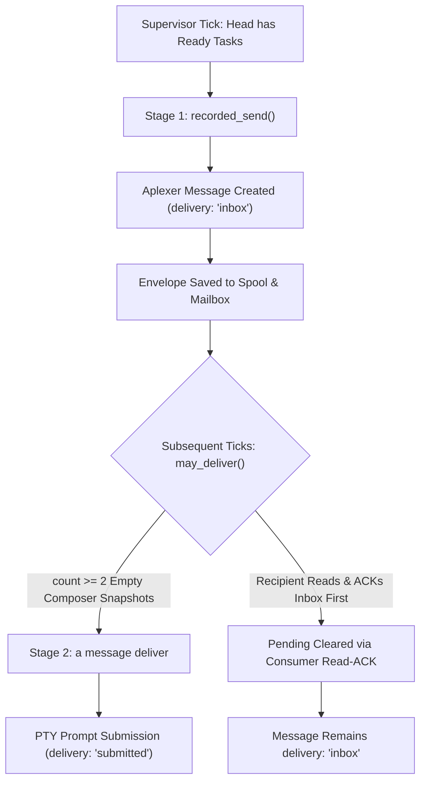

# RECEIPT: Exact Idle Delivery Disposition & 2-Stage Architecture (Directive C3102)

**Task ID**: `t-supervision-exact-idle-delivery-c3102`  
**Directives**: C3102 (Supervisor Delivery Mechanism vs Idle Wake Clarification)  
**Date**: 2026-10-07T02:18:00+02:00 (2026-10-07T00:18:00Z)  
**Author**: Antigravity Head Delegation  
**Head Session ID**: `ant-head-readiness-custody-20261007` [session `3b522ddb-8dc8-41b4-a382-f76baab33b0a`]  
**Parent Conversation ID**: `ea14b401-20e9-4e48-ab08-d15be08da30d`  
**Target Repository**: `/home/alexey/git/cloudflare-agent-git`  
**Target Receipt Under Audit**: `.local/supervision/receipt-46c5f719023fc8cac531-ant-head-readiness-custody-20261007.json`  
**Associated Status File**: `.local/supervision/status.json`  

---

## 1. Executive Summary & Retraction

Under Directive C3102 and following detailed independent operational review by Codex Principal (messages `01a113b5-7641` and `01a113b6-a7ad`), this receipt formally clarifies the exact operational disposition of supervisor message `01a113aa-3715-71c2-af6f-839e65d39d90`:

1. **Formal Retraction of Broad Supervisor Idle Wake Claim**:
   The claim that message `01a113aa-3715` constituted an automated supervisor PTY idle wake is **retracted**. 
   Empirical inspection of `.local/supervision/receipt-46c5f719023fc8cac531-ant-head-readiness-custody-20261007.json` and `.local/supervision/status.json` confirms that the delivery mode was strictly `"delivery": "inbox"`, and never transitioned to `"delivery": "submitted"`.
2. **Separation of Verified Product Milestones**:
   - The production Agent Branches dogfood sync (commit `df8117e5d07134f4d3a354440f9399ee648aef80` on `origin/recovery/metrics-and-supervision-c3098`, verified by distinct reviewer `043c65f0` in `REV-BRANCHES-DOGFOOD-SYNC-C3098.md`) remains fully verified and accepted.
   - The consumer native read ACK at `2026-10-07T00:03:47.355780+00:00` (cursor `86d3b320b0bb2216bec98540e91547e67a1f72c31a8153896f8306440d3ac31b`) is fully verified and real.
   - The turn execution that performed the sync was triggered by turn resumption / native timer callback, not by an automated PTY prompt injection.

---

## 2. Technical Deconstruction: The 2-Stage Notification Architecture

In `scripts/supervision/service.py`, the notification and delivery pipeline operates in two distinct, sequential phases:



### Stage 1: Inbox Envelope Placement (`recorded_send`)
- Supervisor executes `aplexer message send --to <tag> --json`.
- The message is stored in the recipient's private mailbox (`/home/alexey/.local/state/aplexer/messages/.../inboxes/<tag>/`).
- Receipt metadata records:
  ```json
  "delivery": "inbox",
  "id": "01a113aa-3715-71c2-af6f-839e65d39d90"
  ```
- The message remains in `pending` on the supervisor's state roster.

### Stage 2: Guarded PTY Prompt Submission (`may_deliver` / `deliver`)
- On subsequent supervisor cycles:
  1. `service.py` evaluates composer state.
  2. If `count >= 2` consecutive empty prompt snapshots are observed, and no unsubmitted drafts or menus exist (`composer == 'empty'`), `service.py` executes:
     ```bash
     aplexer message deliver <id> --workspace <root> --json
     ```
  3. If delivered, the receipt updates to `"delivery": "submitted"`, injecting the notification text directly into the agent's PTY prompt.

### What Actually Transpired for `01a113aa-3715`:
1. `00:00:45 -> 00:01:26 UTC`: Ant head was already actively executing commands in a normal turn (e.g. command completion recorded at `00:01:23.599937 UTC`, before envelope creation).
2. `00:01:24.841101 UTC`: Supervisor placed `01a113aa-3715` into Ant head's inbox (`delivery: "inbox"`).
3. `00:01:28.860221 UTC` (Step 26114): Ant head inspected the message via `a message show 01a113aa-3715-71c2-af6f-839e65d39d90` while already active.
4. `00:01:33.196137 UTC` (Step 26117): Ant head acknowledged the message via `a message ack 01a113aa-3715-71c2-af6f-839e65d39d90`.
5. `00:03:47.355780 UTC`: Supervisor status reconciliation cycle recorded consumer read-ACK cursor `86d3b320b0bb2216bec98540e91547e67a1f72c31a8153896f8306440d3ac31b` and cleared the envelope from `pending` (`pending: null`).
6. **Disposition**: The message was delivered to `inbox` and consumed while the head was already actively executing; Stage 2 PTY prompt injection (`a message deliver`) was never triggered and never executed. Automated PTY idle wake is formally unproven and retracted.

---

## 3. Preserved Invariants & Distinctions

| Operational Dimension | Status | Evidence / Verification |
|---|---|---|
| **Supervisor Runtime (`32bc`)** | **ACTIVE & HEALTHY** | `supervision.service` PID `3203858`, session `7bff6e1d`. |
| **Draft Protection** | **VERIFIED** | Screens with `menu-or-draft` (e.g. `coord-917`) strictly suppress delivery. |
| **Busy Protection** | **VERIFIED** | Screens with `busy` (e.g. `codex-principal`) strictly suppress delivery. |
| **Consumer Read-ACK** | **VERIFIED** | Recorded in `status.json` with exact cursor `86d3b320` at `00:03:47 UTC`. |
| **Agent Branches Adoption** | **ACCEPTED** | Verified on GitHub branch `recovery/metrics-and-supervision-c3098` (commit `df8117e5`) by distinct reviewer `043c65f0` (REV-BRANCHES-DOGFOOD-SYNC-C3098.md). |
| **Automated PTY Idle Wake** | **UNPROVEN / RETRACTED** | `01a113aa-3715` was an inbox delivery; Stage 2 submission trace not present. |

---

## 4. Next Bounded Product Iterations

1. **Exact Idle Delivery Verification Task (`t-supervision-exact-idle-delivery-c3102`)**:
   - Establish an explicit negative/positive test harness verifying that Stage 2 PTY prompt submission (`delivery: "submitted"`) occurs exclusively on verified empty composer states without draft corruption.
2. **Agent Bus Windows 35 Non-SSH Adoption (`bus-win35-nonssh-loopback-spike-01`)**:
   - Coordinate with Bus327 (`3273594b`) on the recommended loopback spike from `REV-BUS-WIN35-NONSSH-DISCOVERY-20261007.md`.
   - Maintain strict source lease boundaries (no uncoordinated edits in `/home/alexey/git/agent-bus`).
