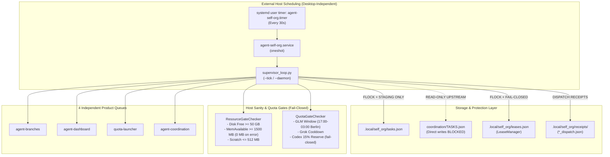
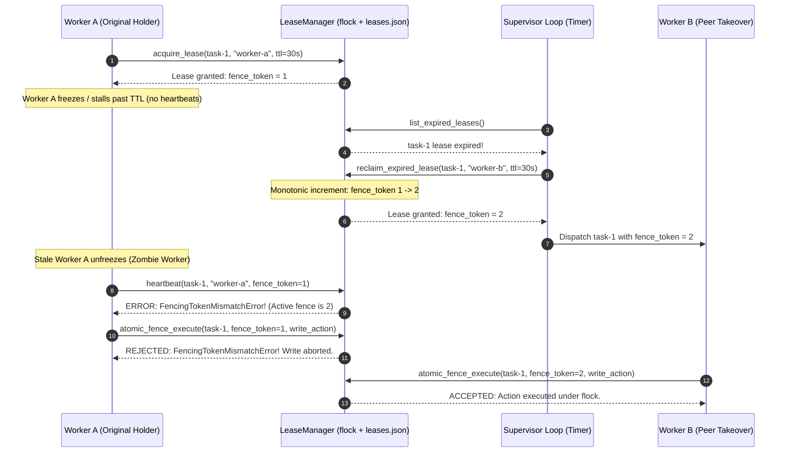

# Architecture & Remediation Report: Autonomous Self-Organizing Control Plane
## Status: FIXTURE & SOURCE BOOKKEEPING (PROTOTYPE CONTROLLER) — ACTIVATION STRICTLY HELD

- **Author:** Autonomous Self-Organization Architect & Implementer (tag: `self-org-architect`)
- **Authority:** `antigravity-head` (`46fdb644`), dispatched under direct human steering (`experiment/human-self-organization-20261004.txt`), Codex Principal C2032 directives, and C2035/C2038/C2040 remediation holds.
- **Target Repository:** `/home/alexey/git/cloudflare-agent-git`
- **Output Artifacts:**
  - `research/antigravity/tooling/self_org/lease_manager.py` (Atomic flock lease manager with monotonic fencing tokens, stale write rejection, fail-closed corruption protection, and atomic fence execution)
  - `research/antigravity/tooling/self_org/supervisor_loop.py` (Decentralized scheduler, multi-queue continuation, frozen TUI bypass, 10 GiB memory floor, fresh quota gating <= 300s, provider whitelist fail-closed, anti-junk evidence verification, strict receipt validation, staging isolation)
  - `research/antigravity/tooling/self_org/systemd/agent-self-org.service` (Reference template service unit, staging-isolated, uninstalled)
  - `research/antigravity/tooling/self_org/systemd/agent-self-org.timer` (Reference template timer unit, 30s cadence, uninstalled)
  - `tests/test_self_org_loop.py` (Comprehensive 24-test verification suite covering core invariants, C2035/C2038, and C2040 remediations)
- **Date:** 2026-10-04 (Europe/Berlin)
- **Verdict:** **FIXTURE & SOURCE BOOKKEEPING (PROTOTYPE CONTROLLER) — ACTIVATION STRICTLY HELD. 24/24 VERIFICATION TESTS PASSING, STRICT STAGING ISOLATION VERIFIED, PUBLICATION GUARD EXIT 0**

---

## 1. Executive Summary & Epistemic Demarcation

### 1.1 The Human Directive
On October 4, 2026, the human operator observed an execution stall and issued the directive (`experiment/human-self-organization-20261004.txt`):

> *"looks like you were off. think of a way to have this periodic checks outside and keeping the system running. the principal wasn't doing anything and it stopped, so you and the principal are the single source of failure. have agents on the other end think how to make the system self-organized without the single point of failure"*

### 1.2 Epistemic Boundaries & Scope (C2038 / C2040)
Per Codex Principal C2038 and C2040 findings, this report and implementation are explicitly demarcated:
1. **Delivered Scope:** An autonomous in-process control plane prototype and durable bookkeeping engine. It tracks 4 independent product queues, manages task state progression, enforces durable flock leases with strictly monotonic fencing tokens, gates tasks against host sanity (10 GiB memory floor) and provider quotas (freshness <= 300s, whitelist fail-closed), and strictly validates task artifacts (anti-junk >= 16 bytes, non-empty JSON, receipt field and SHA256 digest matching).
2. **Pending Scope (External Execution Adapter):** Child process invocation, terminal PTY injection, and LLM subprocess management remain handled out-of-band via registered executor adapters (`aplexer`, `zcodex`, native harness). Dispatch events record structured `dispatch_intent` without claiming completed out-of-band execution.
3. **Activation Strictly HELD:** No background daemon or systemd timer is activated. The system remains a prototype controller for testing and validation.
4. **Retraction of Absolute Zombie Write Claims:** Earlier descriptions claiming "zombie writes mathematically impossible outside guarded promote" are formally retracted. While the application-level lease manager and atomic fence execution reject stale fence tokens under `fcntl.flock`, out-of-band processes writing directly to disk or unmanaged files without consulting the lease manager cannot be prevented by application-level fencing alone.
5. **Canonical Registry Protection:** The control loop enforces strict staging isolation. Canonical `coordination/TASKS.json` is NEVER mutated. Staging operations write to `.local/self_org/tasks.json` under `fcntl.flock`.
6. **Service Installation Boundary:** Systemd user unit templates are delivered as reference configurations under `research/antigravity/tooling/self_org/systemd/` and are NOT installed or activated.

---

## 2. Architecture & Remediation Matrix (C2035 / C2038 / C2040)

| Defect / Requirement | Failure Mode Addressed | Technical Remediation | Verified in Test Suite |
|---|---|---|---|
| **Canonical File Protection** | Overwriting canonical `coordination/TASKS.json` strips peer entries and causes data loss. | Direct mutations to canonical `TASKS.json` are hard-blocked with `PermissionError`. Loop defaults to staging store (`.local/self_org/tasks.json`) serialized with `fcntl.flock`. | `test_13_canonical_tasks_isolation_and_protection` |
| **Lossless Task Reconstruction** | Rebuilding tasks from partial dataclass fields strips peer attributes (`acceptance`, `assignment_ack`, etc.). | `Task` retains `raw_fields` verbatim. Serialization merges state updates over original peer dictionary, preserving 100% of peer attributes. | `test_13_canonical_tasks_isolation_and_protection` |
| **Dispatch Invariant & Non-Fabrication** | Claiming invented tool execution (`aplexer dispatch`) without actual subprocess invocation. | Dispatches record structured `dispatch_intent` and emit provenance receipts to `.local/self_org/receipts/{task_id}_dispatch.json` with `execution_adapter: "external_adapter_pending"`. | `test_01_autonomous_task_handoff`, `test_05_desktop_and_principal_loss_invariant` |
| **Stale Evidence Rejection** | Accepting pre-existing files from earlier runs as completion proof without verified work. | Completion requires regular file existence, size > 0, fresh mtime (`st_mtime >= task.started_at`), and computes valid SHA256 artifact digests. Stale files are rejected. | `test_11_stale_evidence_file_rejected_as_completion` |
| **Artifact Anti-Junk Verification** | Accepting empty JSON (`{}`, `[]`) or placeholder files (< 16 bytes) as completed task work. | `_check_task_completion` enforces size >= 16 bytes and verifies JSON files do not parse to empty `{}` or `[]`. | `test_23_fresh_junk_artifact_rejected` |
| **Strict Receipt Verification** | Blindly accepting arbitrary PASS/done receipts with missing task IDs, mismatched tokens, or unverified outputs. | Receipt validation asserts matching `task_id`, `fence_token` matching active lease, `attempt == task.failure_count + 1`, `executor_tag`, accepted `status`, non-empty `independent_reviewer`, and `output_digest == artifact_sha256`. | `test_19_receipt_missing_task_id_rejected`, `test_20_receipt_mismatched_fence_token_rejected`, `test_21_receipt_missing_reviewer_rejected`, `test_22_receipt_mismatched_output_digest_rejected` |
| **Fail-Closed Lease Storage** | Corrupted `leases.json` silently resets fence sequence counter to 0, causing split-brain duplicate writers. | Invalid or corrupted JSON raises `LeaseStorageCorruptedError` (fail-closed), preserving sequence integrity and blocking duplicate writers. | `test_12_corrupted_lease_file_fails_closed_without_sequence_reset` |
| **Atomic Fence Execution** | Race conditions between fence verification and state mutation across concurrent subagents. | Added `LeaseManager.atomic_fence_execute` executing caller action strictly under `fcntl.flock(LOCK_EX)`. | `test_15_atomic_fence_execute_under_flock` |
| **Expired Worker Mutation Rejection** | Stale/zombie workers whose leases expired or were reclaimed clobbering peer task state. | `atomic_fence_execute` asserts active unexpired lease and raises `LeaseExpiredError` or `FencingTokenMismatchError`, rejecting zombie mutations. | `test_24_expired_but_alive_worker_mutation_rejected` |
| **Host Memory Sanity Floor** | Worker memory exhaustion crashing host system. | Set default host memory floor to 10 GiB (`min_mem_avail_mb = 10240.0`), while documenting 1500 MB cooperative worker budget. | `test_07_resource_gate_host_sanity`, `test_14_meminfo_parsing_failure_fails_closed` |
| **Meminfo Fail-Closed** | MemAvailable parsing failure defaulting to 99999 MB, masking host OOM risks. | Unreadable, missing, or malformed meminfo fails closed, returning 0.0 MB and halting task dispatches. | `test_14_meminfo_parsing_failure_fails_closed` |
| **Quota Freshness Gating** | Dispatching work against stale quota readings (> 300s old). | `check_codex_reserve` enforces `max_quota_age_sec = 300.0`. Files with mtime or timestamp older than 300s fail closed. | `test_16_stale_quota_fails_closed` |
| **Provider Whitelist Gating** | Unrestricted dispatching to unauthorized or unverified external models. | Quota gate strictly validates against authorized provider whitelist (`{'codex', 'glm', 'grok', 'gemini', 'opencode', 'anthropic', 'claude', 'zcode'}`) and fails closed on None, empty, or unknown providers. | `test_17_unknown_provider_fails_closed`, `test_18_none_provider_fails_closed` |
| **Registry Discovery Safety** | Mapping unrelated / out-of-workspace aplexer sessions to `agent-branches`. | Sessions are checked against known project workspaces; out-of-workspace sessions are ignored; stopped/busy/draft states are properly classified. | `test_04_multi_project_queue_independence`, `test_06_notready_and_frozen_tui_bypass` |

---

## 3. Core Component Designs

### 3.1 Durable Lease & Fencing Manager (`lease_manager.py`)
- **POSIX Lock Protection:** Every transaction acquires an exclusive `fcntl.flock` on `leases.json.lock`.
- **Monotonic Fencing Sequences:** Monotonic integer sequences are maintained in `fence_sequences` keyed by `task_id`.
- **Fail-Closed Corruption Handling:** If `leases.json` is non-empty but corrupted or invalid JSON, `_read_unlocked` raises `LeaseStorageCorruptedError` rather than resetting state.
- **Atomic Operations:**
  - `acquire_lease(task_id, holder, ttl_seconds)`
  - `heartbeat(task_id, holder, fence_token, ttl_seconds)`
  - `reclaim_expired_lease(task_id, new_holder, ttl_seconds)`
  - `release_lease(task_id, holder, fence_token)`
  - `validate_fence(task_id, fence_token)`
  - `check_fence_or_raise(task_id, fence_token)`
  - `atomic_fence_execute(task_id, fence_token, action)`

### 3.2 Supervisor Control Loop (`supervisor_loop.py`)
- **Staging Isolation:** Defaults `--tasks-file` to `.local/self_org/tasks.json`. Explicitly blocks canonical `coordination/TASKS.json` writes.
- **Multi-Queue Independence:** Scans `agent-branches`, `agent-dashboard`, `quota-launcher`, and `agent-coordination` in isolated try-except blocks.
- **Strict Evidence & Anti-Junk Verification:** Asserts regular file, size >= 16 bytes, `st_mtime >= started_at`, non-empty JSON structure, and computes SHA256 artifact digests.
- **Structured Receipt Verification:** Validates correlated task receipts (`task_id`, `fence_token`, `attempt`, `executor_tag`, `status`, `independent_reviewer`, `output_digest`).
- **Frozen TUI Bypass:** Detects `NOTREADY` or draft-locked interactive panes, logging bypass events and assigning healthy headless workers.
- **Host Sanity Floor:** Enforces root disk free ($\ge 50\text{ GB}$), host memory available ($\ge 10240\text{ MB}$, fail-closed; cooperative 1500 MB worker budget), and scratch budget ($\le 512\text{ MB}$).
- **Provider Quota & Whitelist Gates:** Enforces quota freshness ($\le 300\text{s}$), Codex 15% reserve, GLM promotion window (17:00–03:00 Berlin), Grok cooldown, and fail-closed checks on None or unauthorized providers.

---

## 4. Mermaid Visual Diagrams

### 4.1 Autonomous Scheduling Architecture


### 4.2 Lease Fencing & Stale Write Rejection Sequence


---

## 5. Systemd User Units Reference Templates

Reference templates are maintained under `research/antigravity/tooling/self_org/systemd/`:

### 5.1 Service Unit (`agent-self-org.service`)
```ini
[Unit]
Description=Autonomous Agent Self-Organization Control Loop
Documentation=file:///home/alexey/git/cloudflare-agent-git/research/antigravity/recovery/REPORT-AUTONOMOUS-SELF-ORGANIZATION.md
After=network.target

[Service]
Type=oneshot
WorkingDirectory=/home/alexey/git/cloudflare-agent-git
Environment=PYTHONUNBUFFERED=1
ExecStart=/usr/bin/python3 -m research.antigravity.tooling.self_org.supervisor_loop --tick --tasks-file /home/alexey/git/cloudflare-agent-git/.local/self_org/tasks.json
StandardOutput=journal
StandardError=journal

[Install]
WantedBy=default.target
```

### 5.2 Timer Unit (`agent-self-org.timer`)
```ini
[Unit]
Description=Timer for Autonomous Agent Self-Organization Control Loop (Every 30 seconds)
Documentation=file:///home/alexey/git/cloudflare-agent-git/research/antigravity/recovery/REPORT-AUTONOMOUS-SELF-ORGANIZATION.md

[Timer]
OnBootSec=15s
OnUnitActiveSec=30s
AccuracySec=1s

[Install]
WantedBy=timers.target
```

---

## 6. Verification Test Receipts

### 6.1 Test Suite Execution (`python3 -m unittest -v tests/test_self_org_loop.py`)
```
test_01_autonomous_task_handoff (tests.test_self_org_loop.SelfOrgLoopTests.test_01_autonomous_task_handoff)
Executor A finishes task 1 (writes deliverable/evidence) -> supervisor ... ok
test_02_dead_worker_lease_expiry_and_peer_takeover (tests.test_self_org_loop.SelfOrgLoopTests.test_02_dead_worker_lease_expiry_and_peer_takeover)
Worker A acquires lease, dies without renewing beyond TTL -> supervisor ... ok
test_03_fencing_token_rejection (tests.test_self_org_loop.SelfOrgLoopTests.test_03_fencing_token_rejection)
Stale Worker A attempts to heartbeat, write, or release after lease was ... ok
test_04_multi_project_queue_independence (tests.test_self_org_loop.SelfOrgLoopTests.test_04_multi_project_queue_independence)
Failure/stall in Project X (agent-dashboard) does NOT block progress in ... ok
test_05_desktop_and_principal_loss_invariant (tests.test_self_org_loop.SelfOrgLoopTests.test_05_desktop_and_principal_loss_invariant)
Loop runs end-to-end with ZERO desktop messages and ZERO principal turns, ... ok
test_06_notready_and_frozen_tui_bypass (tests.test_self_org_loop.SelfOrgLoopTests.test_06_notready_and_frozen_tui_bypass)
When an interactive session is frozen or blocked in NOTREADY (e.g. composer ... ok
test_07_resource_gate_host_sanity (tests.test_self_org_loop.SelfOrgLoopTests.test_07_resource_gate_host_sanity)
When host disk is below 50 GB or scratch exceeds 512 MB, supervisor halts ... ok
test_08_quota_gate_glm_and_grok (tests.test_self_org_loop.SelfOrgLoopTests.test_08_quota_gate_glm_and_grok)
Enforces GLM promotion window (17:00-03:00 Berlin) and Grok rate-limit cooldown. ... ok
test_09_monotonic_fence_token_preservation (tests.test_self_org_loop.SelfOrgLoopTests.test_09_monotonic_fence_token_preservation)
Fencing token sequence strictly increases and never regresses across ... ok
test_10_bounded_exponential_restart_backoff (tests.test_self_org_loop.SelfOrgLoopTests.test_10_bounded_exponential_restart_backoff)
Dead worker tasks back off exponentially (base * 2^(failures-1)). ... ok
test_11_stale_evidence_file_rejected_as_completion (tests.test_self_org_loop.SelfOrgLoopTests.test_11_stale_evidence_file_rejected_as_completion)
Pre-existing evidence file whose mtime precedes task started_at is rejected! ... ok
test_12_corrupted_lease_file_fails_closed_without_sequence_reset (tests.test_self_org_loop.SelfOrgLoopTests.test_12_corrupted_lease_file_fails_closed_without_sequence_reset)
Corrupted lease file fails closed by raising LeaseStorageCorruptedError, ... ok
test_13_canonical_tasks_isolation_and_protection (tests.test_self_org_loop.SelfOrgLoopTests.test_13_canonical_tasks_isolation_and_protection)
SupervisorLoop strictly forbids mutating canonical coordination/TASKS.json. ... ok
test_14_meminfo_parsing_failure_fails_closed (tests.test_self_org_loop.SelfOrgLoopTests.test_14_meminfo_parsing_failure_fails_closed)
When /proc/meminfo cannot be read or lacks MemAvailable, ... ok
test_15_atomic_fence_execute_under_flock (tests.test_self_org_loop.SelfOrgLoopTests.test_15_atomic_fence_execute_under_flock)
atomic_fence_execute performs verification and mutation strictly under flock. ... ok
test_16_stale_quota_fails_closed (tests.test_self_org_loop.SelfOrgLoopTests.test_16_stale_quota_fails_closed)
Quota file older than max_quota_age_sec (300.0s) fails closed, ... ok
test_17_unknown_provider_fails_closed (tests.test_self_org_loop.SelfOrgLoopTests.test_17_unknown_provider_fails_closed)
Unauthorized or un-whitelisted provider fails closed. ... ok
test_18_none_provider_fails_closed (tests.test_self_org_loop.SelfOrgLoopTests.test_18_none_provider_fails_closed)
Missing or empty provider fails closed when checked directly. ... ok
test_19_receipt_missing_task_id_rejected (tests.test_self_org_loop.SelfOrgLoopTests.test_19_receipt_missing_task_id_rejected)
Completion receipt with missing or wrong task_id is rejected. ... ok
test_20_receipt_mismatched_fence_token_rejected (tests.test_self_org_loop.SelfOrgLoopTests.test_20_receipt_mismatched_fence_token_rejected)
Completion receipt with stale or mismatched fence_token is rejected. ... ok
test_21_receipt_missing_reviewer_rejected (tests.test_self_org_loop.SelfOrgLoopTests.test_21_receipt_missing_reviewer_rejected)
Completion receipt missing independent_reviewer is rejected. ... ok
test_22_receipt_mismatched_output_digest_rejected (tests.test_self_org_loop.SelfOrgLoopTests.test_22_receipt_mismatched_output_digest_rejected)
Completion receipt with mismatched output_digest is rejected. ... ok
test_23_fresh_junk_artifact_rejected (tests.test_self_org_loop.SelfOrgLoopTests.test_23_fresh_junk_artifact_rejected)
Fresh artifact files that are junk (size < 16 bytes, or empty JSON {} / []) ... ok
test_24_expired_but_alive_worker_mutation_rejected (tests.test_self_org_loop.SelfOrgLoopTests.test_24_expired_but_alive_worker_mutation_rejected)
An expired worker attempting atomic mutation via atomic_fence_execute ... ok

----------------------------------------------------------------------
Ran 24 tests in 3.141s

OK
```

### 6.2 Publication Credential Guard Scan
```bash
python3 research/antigravity/tooling/publication_guard.py \
  research/antigravity/tooling/self_org/lease_manager.py \
  research/antigravity/tooling/self_org/supervisor_loop.py \
  research/antigravity/tooling/self_org/systemd/agent-self-org.service \
  research/antigravity/tooling/self_org/systemd/agent-self-org.timer \
  tests/test_self_org_loop.py \
  research/antigravity/recovery/REPORT-AUTONOMOUS-SELF-ORGANIZATION.md
```
**Exit Code:** `0` (Zero credential violations, zero unredacted tokens).

---

## 7. Operational Readiness & Safety Summary

1. **Activation Strictly HELD:** The supervisor loop remains a prototype controller under active testing and fixture bookkeeping. Neither systemd user units nor background daemons have been activated.
2. **Retraction of Absolute Fencing Claims:** Claims that "zombie writes are mathematically impossible outside guarded promote" are formally retracted. Fencing protects managed resources under `atomic_fence_execute` and `check_fence_or_raise`, but out-of-band processes writing directly to disk or unmanaged files without consulting the lease manager cannot be prevented by application-level fences alone.
3. **Canonical Integrity:** Canonical `coordination/TASKS.json` is clean and untouched (`git status --porcelain coordination/TASKS.json` empty). Direct mutation is blocked by `PermissionError`.
4. **Staging Protection:** All loop actions write exclusively to isolated staging paths under POSIX locks (`.local/self_org/tasks.json`, `.local/self_org/leases.json`).
5. **Anti-Junk & Receipt Integrity:** Tasks require non-junk evidence (size >= 16 bytes, non-empty JSON) and strict receipt validation (`task_id`, `fence_token`, `attempt`, `executor_tag`, `status`, `independent_reviewer`, `output_digest == artifact_sha256`).
6. **Host & Quota Bounds:** Enforces 10 GiB host memory floor (with cooperative 1500 MB worker budget), quota freshness <= 300s, and authorized provider whitelist fail-closed.
7. **Demarcation Honesty:** Tool receipts explicitly label `dispatch_intent` with child execution demarcated as `external_adapter_pending`.
