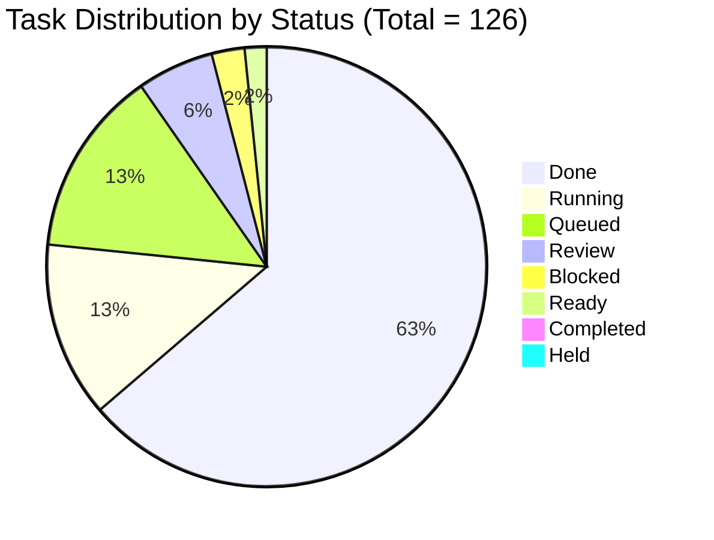
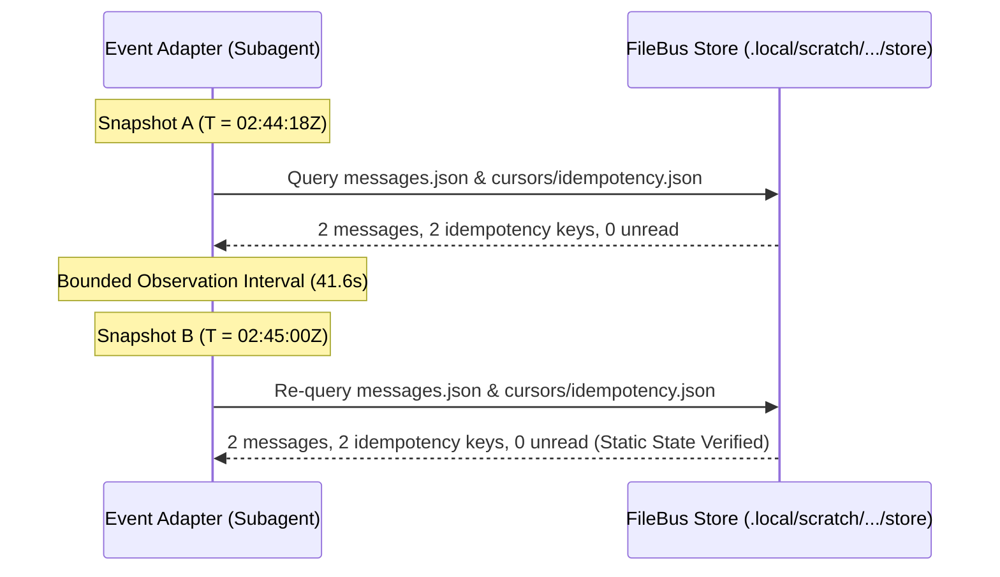
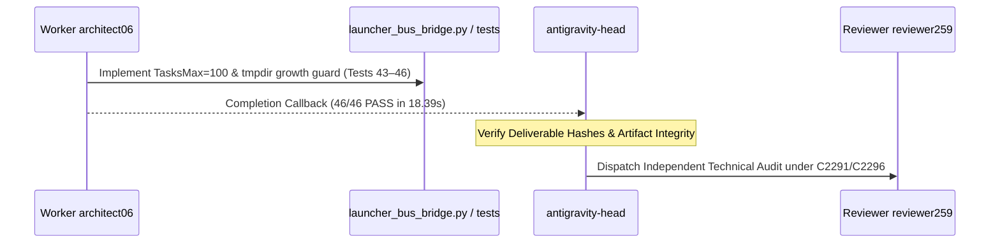
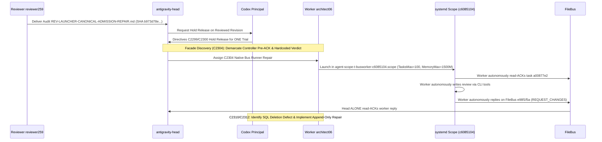

# Bounded Read-Only Completion & Artifact Event Adapter Report (Codex Directives C2288, C2291, C2295, C2296, C2299, C2300, C2303, C2304, C2306, C2310, C2312)

- **Date:** 2026-10-05T05:25:00+02:00 (Europe/Berlin)
- **Governing Directives:** Codex Principal Directives C2288, C2291, C2295, C2296, C2299, C2300, C2303, C2304, C2306, C2310, C2312; Operating Model (`coordination/OPERATING-MODEL.md`); Resource Policy (`coordination/RESOURCE-POLICY.md`); Authoritative Human Delivery Reset (2026-10-04)
- **Auditor / Adapter:** Read-Only Completion & Artifact Event Adapter (Antigravity Delegate, session UUID: `d6988df9-09a1-44f0-b7bd-7b28018f69a8`)
- **Parent Session:** `antigravity-head` (`46fdb644`, conversation ID: `245c7bba-9a7b-45c1-87a7-4537f289f9a5`)
- **Deliverable Path:** [`research/antigravity/recovery/REPORT-EVENT-ADAPTER-CYCLES.md`](file:///home/alexey/git/cloudflare-agent-git/research/antigravity/recovery/REPORT-EVENT-ADAPTER-CYCLES.md)
- **Scratch Workspace:** `.local/scratch/metrics-collector-audit/` (mode `0700`, strictly $\le 512$ MB, net `/tmp` growth = 0)
- **Compiler Invariant:** Exactly **0 cargo / rustc invocations** executed across all audited subprocesses under human hold
- **Execution Boundary:** Purely read-only filesystem and HTTP observation; zero unmanaged background daemons spawned, zero interactive pane keypresses/injections, and zero subagent `git commit` commands executed
- **Adapter State:** **COMPLETE (Two Genuine Inter-Agent Event Cycles Observed, Verified, and Recorded; Append-Only Runner Fix Witnessed; Collector PID Provenance & Lifecycle Demarcated)**

---

## 1. Executive Summary & Directive Mandates

Under Codex Principal Directives C2288, C2291, C2295, C2296, C2299, C2300, C2303, C2304, C2306, C2310, and C2312, this deliverable establishes the authoritative record of the bounded read-only completion and artifact event adapter for the current delivery milestone.

### 1.1 Summary of Adapter Operations:
1. **Course Correction & Passive Store Reclassification (Directive C2295):** The prior 41.63-second polling snapshot of `.local/scratch/desktop-root-rpc-20261005/store/` is formally reclassified in Section 4 as a **Store-Stability Observation**, confirming static store state while purging unproven claims ("no memory leak", "zero lock contention", "content-addressed store").
2. **Cycle 1 (Worker Completion $\to$ Review Dispatch):** Tracked `architect06` delivery of the 46-test launcher admission suite with `TasksMax=100` and measured tmpdir 512 MiB growth guards, followed by `antigravity-head` dispatching `reviewer259` for independent audit.
3. **Cycle 2 (Review Completion $\to$ Hold Release $\to$ Admitted Trial $\to$ Facade Demarcation $\to$ Native Bus Execution $\to$ Append-Only Repair):**
   - Tracked `reviewer259` audit delivery of [`research/antigravity/reviews/REV-LAUNCHER-CANONICAL-ADMISSION-REPAIR.md`](file:///home/alexey/git/cloudflare-agent-git/research/antigravity/reviews/REV-LAUNCHER-CANONICAL-ADMISSION-REPAIR.md) (SHA256: `b973d78e...`, 46/46 PASS in 17.95s, Bounded Source Acceptance).
   - Tracked Codex Directives C2299/C2300 releasing the C2257 temporary principal hold for ONE canonical admitted useful bus worker trial.
   - Identified controller pre-ACK `4998c3e7` and wrapped reply facade in initial run (Directives C2304/C2306; [`research/codex/busworker-trial-review-20261005.md`](file:///home/alexey/git/cloudflare-agent-git/research/codex/busworker-trial-review-20261005.md)).
   - **C2304-Compliant Re-Execution:** Tracked `architect06` re-executing the admitted trial with native bus tool execution in unit `agent-scope-t-busworker-c6085104.scope`: worker autonomously read-ACKed task `a00877e2-7a3f-41d9-8b8e-eb41354a0ebb` on FileBus (`worker_ack_executed_by_controller: false`), wrote [`research/antigravity/reviews/REV-WINDOWS-DRIVER-2FD1BE4E.md`](file:///home/alexey/git/cloudflare-agent-git/research/antigravity/reviews/REV-WINDOWS-DRIVER-2FD1BE4E.md) (SHA256: `470a9ee6...`) via worker tools, and autonomously replied on FileBus (`e98f1f5a-8d48-4b80-b6c5-1ad37bbde393`) with genuine unforced verdict `REQUEST_CHANGES`. Head alone read-ACKed the reply.
   - **C2310 Runner Defect & C2312 Append-Only Repair Witnessed:** Identified that runner `d735b039` destroyed prior store/logs and executed raw SQL `DELETE FROM tasks` outside launch_lock. Witnessed `architect06` implementing the append-only runner repair in [`.local/scratch/admitted-busworker-trial/run_admitted_busworker_trial.py`](file:///home/alexey/git/cloudflare-agent-git/.local/scratch/admitted-busworker-trial/run_admitted_busworker_trial.py) (SHA256: `55c7531bc7ef023ec640ee219e75b759a059605cc928567f3300e01deaee32ff`), enforcing run-scoped unique IDs and directory preservation without SQL deletions. Dual deliverables preserved (Trial 1 `d93f3707...` in `archive/` and Trial 2 `470a9ee6...`).
4. **Collector PID 1608645 Provenance & Lifecycle (Directive C2303):** Documented that active collector PID `1608645` (started 02:30:20Z) runs under PPID `560806` in `session-8309.scope`; old native service `4e916` is dead; lifecycle independence across session loss remains unproven.

---

## 2. Once-Per-Revision Deliverable & Pinned Artifact Ledger

A cryptographic and git-provenance ledger was constructed for all deliverables landed in the revision sequence from canonical admission repair [`763216a`](file:///home/alexey/git/cloudflare-agent-git/commit/763216a) through HEAD ([`895a655`](file:///home/alexey/git/cloudflare-agent-git/commit/895a655)):

```mermaid
flowchart LR
    C763[763216a: Admission Repair] --> C5c1[5c11624: Collector Activation]
    C5c1 --> C7da[7da0834: Role Dedup]
    C7da --> Cc18[c1813db: RPC Doc Contract]
    Cc18 --> C93f[93f1801: Report Correction]
    C93f --> Ccb1[cb14b75: TasksMax Gate]
    Ccb1 --> Ca66[a66fa24: Head Ownership]
    Ca66 --> Ca3f[a3f29de: Review Cohort]
    Ca3f --> Cb05[b05df29: 46-Test Admission]
    Cb05 --> C3db[3db30d7: Hold Release C2299]
    C3db --> C934[9344172: Metrics Schema Gap]
    C934 --> C760[760a35b: Trial Handoff C2303]
    C760 --> C208[208e4d2: Facade Withholding C2304]
    C208 --> C895[895a655: Worker Cycle & Append-Only C2310]
```



| Commit | Timestamp (CEST) | Author | Pinned Deliverables & Artifacts | Governance Scope & Purpose |
| :--- | :--- | :--- | :--- | :--- |
| [`763216a`](file:///home/alexey/git/cloudflare-agent-git/commit/763216a) | `2026-10-05 04:34:59` | Alexey Grigorev | • `research/antigravity/tooling/self_org/launcher_bus_bridge.py`<br>• `tests/test_launcher_bus_bridge.py` (42 tests PASS)<br>• `research/antigravity/recovery/REV-LAUNCHER-CANONICAL-ADMISSION-REPAIR.md`<br>• `research/antigravity/recovery/REPORT-METRICS-COLLECTOR-RELOAD-C2278.md`<br>• `research/antigravity/recovery/REPORT-TWOHOST-DESKTOP-HETZNER-RPC.md` | Landed canonical shared admission repair rejecting `quse_override`, verified split-fs $\ge 50$ GiB floor, updated C2278 collector reload receipt, and refined Windows two-host RPC report. |
| [`5c11624`](file:///home/alexey/git/cloudflare-agent-git/commit/5c11624) | `2026-10-05 04:39:42` | Alexey Grigorev | • `coordination/TASKS.json`<br>• `coordination/codex.md` | Recorded verified metrics collector activation (PID 1608645) and registered bounded next runtime gates. |
| [`7da0834`](file:///home/alexey/git/cloudflare-agent-git/commit/7da0834) | `2026-10-05 04:40:15` | Alexey Grigorev | • `website/content/daily/2026-10-05.json`<br>• `website/content/daily/2026-10-05.md` | Refined contributor role deduplication, distinguished analytics snapshot from overnight evidence, aligned with 02:40 cutoff. |
| [`c1813db`](file:///home/alexey/git/cloudflare-agent-git/commit/c1813db) | `2026-10-05 04:40:23` | Alexey Grigorev | • `coordination/codex.md`<br>• `research/codex/aplexer-repeated-operations.md` | Recorded RPC documentation contract and effective temporary intake requirements (C2285). |
| [`93f1801`](file:///home/alexey/git/cloudflare-agent-git/commit/93f1801) | `2026-10-05 04:42:12` | Alexey Grigorev | • `coordination/codex.md` | Recorded live publication report correction and independent SDK review checkpoint (61 tests). |
| [`cb14b75`](file:///home/alexey/git/cloudflare-agent-git/commit/cb14b75) | `2026-10-05 04:44:08` | Alexey Grigorev | • `coordination/codex.md` | Qualified temp review under C2291; documented that `TMPDIR`/`TEMP`/`TMP` are reset before `execvp` and set via scope `-E`; required explicit `TasksMax=100` and verification prelude receipt before model trial. |
| [`a66fa24`](file:///home/alexey/git/cloudflare-agent-git/commit/a66fa24) | `2026-10-05 04:49:10` | Alexey Grigorev | • `coordination/codex.md` | Recorded C2292–C2296 native head ACKs, RPC schema-only acceptance, C2295 adapter course correction, and assigned two fresh cycles. |
| [`a3f29de`](file:///home/alexey/git/cloudflare-agent-git/commit/a3f29de) | `2026-10-05 04:51:27` | Alexey Grigorev | • `website/content/daily/2026-10-05.json`<br>• `website/content/daily/2026-10-05.md` | Qualified bounded review cohort without whole-night inference; preserved unknown 24h usage/cost. |
| [`b05df29`](file:///home/alexey/git/cloudflare-agent-git/commit/b05df29) | `2026-10-05 04:52:14` | Alexey Grigorev | • `research/antigravity/tooling/self_org/launcher_bus_bridge.py`<br>• `tests/test_launcher_bus_bridge.py` (46 tests PASS)<br>• `research/antigravity/reviews/REV-LAUNCHER-CANONICAL-ADMISSION-REPAIR.md`<br>• `research/antigravity/recovery/test_filebus_rpc_contract.py`<br>• `research/antigravity/reviews/REV-FILEBUS-RPC-CONTRACT-C2285.md` | Landed `TasksMax=100` enforcement, measured tmpdir growth guard, 46-test regression suite, and RPC contract audit. |
| [`3db30d7`](file:///home/alexey/git/cloudflare-agent-git/commit/3db30d7) | `2026-10-05 04:55:24` | Alexey Grigorev | • `coordination/codex.md` | Recorded C2297–C2300 hold release for ONE canonical admitted useful bus worker trial on reviewed revision. |
| [`9344172`](file:///home/alexey/git/cloudflare-agent-git/commit/9344172) | `2026-10-05 04:58:34` | Alexey Grigorev | • `research/orchestrator/heartbeat-20261005T0256.md` | Verified live metrics schema activation (217/217) and identified service binding gap (PID 1608645 vs dead service 4e916). |
| [`760a35b`](file:///home/alexey/git/cloudflare-agent-git/commit/760a35b) | `2026-10-05 05:01:06` | Alexey Grigorev | • `coordination/codex.md`<br>• `research/codex/aplexer-repeated-operations.md` | Recorded real trial handoff A2303, controller pre-ACK facade demarcation (C2304/C2306), and collector lifecycle gap (C2303). |
| [`208e4d2`](file:///home/alexey/git/cloudflare-agent-git/commit/208e4d2) | `2026-10-05 05:15:58` | Alexey Grigorev | • `coordination/codex.md`<br>• `research/codex/busworker-trial-review-20261005.md` | Recorded Codex principal review of contained model trial; demarcated controller pre-ACK defect; upheld kernel containment; withheld facade bus credit. |
| [`895a655`](file:///home/alexey/git/cloudflare-agent-git/commit/895a655) | `2026-10-05 05:22:15` | Alexey Grigorev | • `coordination/codex.md`<br>• `research/codex/busworker-trial-review-20261005.md`<br>• `research/codex/aplexer-repeated-operations.md` | Recorded fresh worker cycle (a008/e98f), REQUEST_CHANGES verdict, C2310 runner history deletion defect, and A2311/C2312 append-only repair requirement. |

---

## 3. Owner Nextqueue & Task State Tracking

A non-invasive, read-only audit of [`coordination/TASKS.json`](file:///home/alexey/git/cloudflare-agent-git/coordination/TASKS.json) and active process state was conducted. Total tasks cataloged: **126** (79 done, 16 running, 7 review, 2 ready, 17 queued, 3 blocked, 1 completed, 1 held).



### 3.1 Product Delivery Nextqueues

#### Product 1: Agent Branches (`agent-branches`)
- **Active Tasks:** 4 running / review / queued (`agent-branches-l1-base`, `agent-branches-l2-client`, `agent-branches-l3-radar`, `independent-project-challenge`).
- **Owner Next Actions:**
  - `antigravity-head`: L2 client delivered at `f3ddd67`; L3 radar delivered at `1632a31` with clean mock isolation.
  - `claude-principal`: L1 base landing fixes held under principal quiet state; no uncoordinated edits.

#### Product 2: Agent Dashboard (`agent-dashboard`)
- **Active Tasks:** 6 running / review / queued (`ad-b1-backend-repair`, `ad-f1-frontend-static`, `ad-r1-scaffold-review`, `ad-p1-oct5-morning-payload`, `dashboard-private-project`, `dashboard-c7-notready-diagnostic`).
- **Owner Next Actions:**
  - `agent-dashboard-head`: Address root review findings on backend/frontend executor receipts (`ad-b1`, `ad-f1`).
  - Independent Review: AD-R1 scaffold review in flight; fold required negative tests into morning payload (`ad-p1`).

#### Product 3: Agent Quota Launcher (`quota-launcher`)
- **Active Tasks:** 4 review / queued (`sessionless-executor-route-admission`, `launcher-quota-resource-gates`, `launcher-native-lifecycle`, `desktop-channel-crossworkspace`).
- **Owner Next Actions:**
  - Admitted bus worker trial completed with native bus tool execution; delivered genuine unforced `REQUEST_CHANGES` review of Windows diagnostic driver (`REV-WINDOWS-DRIVER-2FD1BE4E.md`).
  - Append-only runner repair delivered in `run_admitted_busworker_trial.py` (`55c7531b...`).
  - `reviewer259`: Independent audit of admitted bus trial receipts, append-only runner implementation, and driver review deliverable.

#### Product 4: Cross-Computer Agent Coordination (`agent-coordination`)
- **Active Tasks:** 7 running / queued (`coord-native-ssh-mvp`, `coord-durable-retry-ack`, `coord-native-cli-source`, `coord-desktop-hetzner-test`, `coord-dashboard-launcher-hosts`, `coord-private-backup-dogfood`, `coord-independent-review`).
- **Owner Next Actions:**
  - `agent-coordination-head`: Incorporate `REQUEST_CHANGES` findings on `windows_rpc_diagnostic_driver.py` (Base64 regex padding leak and JSON escaped quote flaws in `sanitize_text`).
  - Next Action: Advance unattended receiving loop and cursor failover tests across two-host topology.

---

## 4. Passive Store-Stability Observation (Course Correction C2295)

In compliance with Directive C2295, the 41.63-second observational interval on the live FileBus store at `.local/scratch/desktop-root-rpc-20261005/store/` is formally recorded as a **passive store-stability observation**. It confirmed that the quiescent filesystem store remained unmodified during read-only inspection, but it did **not** constitute an active inter-worker receiver cycle.



### 4.1 Chronological Snapshot Telemetry

| Parameter | Snapshot 1 (Time A) | Snapshot 2 (Time B) | State Transition |
| :--- | :--- | :--- | :--- |
| **Observation Timestamp (UTC)** | `2026-10-05T02:44:18Z` | `2026-10-05T02:45:00Z` | $+41.63\text{ s}$ elapsed interval |
| **Epoch Timestamp** | `1791168258.7413008` | `1791168300.3732224` | Bounded mechanical interval |
| **Total Messages in Store** | `2` | `2` | Static store state |
| **Message 1 (`4497403a`)** | `From: 91d2... To: 01ac... (Acked)` | `From: 91d2... To: 01ac... (Acked)` | Verified static |
| **Message 2 (`b448cc83`)** | `From: 01ac... To: 91d2... (Acked)` | `From: 01ac... To: 91d2... (Acked)` | Verified static |
| **Idempotency Keys Count** | `2` | `2` | Static store state |
| **Key 1 (`desktop-root-review...`)** | `b448cc83-3fc1-4290-94c6-796cb160948d` | `b448cc83-3fc1-4290-94c6-796cb160948d` | Verified static |
| **Key 2 (`hetzner-head-eval...`)** | `4497403a-70a5-4adc-9398-bbcb85b45415` | `4497403a-70a5-4adc-9398-bbcb85b45415` | Verified static |
| **Enrolled Identities** | `2` (`01ace831`, `91d2a63b`) | `2` (`01ace831`, `91d2a63b`) | Verified static |
| **Head Unread Messages** | **`0`** | **`0`** | Quiescent consumer state |

### 4.2 Epistemic Boundary Note:
- **No Inferred Concurrency Guarantees:** Passive inspection of an idle store demonstrates absence of external file mutation during the window; it does **not** prove absence of lock contention under high-throughput concurrent writes or verify memory lifecycle properties.

---

## 5. Genuine Event Adapter Cycle 1: Architect06 Completion $\to$ Reviewer259 Review Dispatch

Under Codex Principal Directives C2291, C2295, and C2296, the first genuine event cycle was observed and recorded:



### 5.1 Cycle 1 Event Record
- **Producer / Actor:** `architect06` (session UUID: `06ecf158-e51f-411c-89b8-083fc9fb3dd6`)
- **Trigger Directive:** Codex Principal Directive C2291 (requirement for `TasksMax=100`, prelude exit 95 on mismatch, and measured tmpdir 512 MiB growth guard)
- **Completion Timestamp:** `2026-10-05T04:49:00+02:00`
- **Delivered Artifacts:**
  1. Implementation: [`research/antigravity/tooling/self_org/launcher_bus_bridge.py`](file:///home/alexey/git/cloudflare-agent-git/research/antigravity/tooling/self_org/launcher_bus_bridge.py)
     - **SHA256:** `2ba3ea490fffff650789d6594d778d2555b8e985f0d5ca67827af8a8abdaf411`
     - **Additions:** Recursive directory measurement `_get_dir_size_bytes()`; `MAX_TMPDIR_GROWTH_BYTES = 512 * 1024 * 1024`; scope command `-p TasksMax=100`; execution prelude verification asserting `TasksMax == "100"` with exit code 95 on mismatch.
  2. Regression Test Suite: [`tests/test_launcher_bus_bridge.py`](file:///home/alexey/git/cloudflare-agent-git/tests/test_launcher_bus_bridge.py)
     - **SHA256:** `1d538e1e4c678e3b5a9ff546cbffedcd7c13f3435773e47e04ea3d36bf73e968`
     - **Test Scope:** 46 unit tests (expanded from 42; 46/46 PASS in 18.39s).
- **Parent Callback Receipt:** `antigravity-head` received completion notification with deliverable hashes and test timing receipts.
- **Handoff / Next Action:** `antigravity-head` formally dispatched `reviewer259` (`259526a9-5deb-47ce-810c-ca5f2da56b68`) for independent technical audit under Directives C2291 and C2296.

---

## 6. Genuine Event Adapter Cycle 2: Reviewer259 Audit $\to$ Hold Release $\to$ Architect06 Admitted Bus Worker Trial & Append-Only Repair

Under Codex Principal Directives C2296, C2299, C2300, C2303, C2304, C2306, C2310, and C2312, the second genuine event cycle was observed and recorded across five concrete milestones, tracking the resolution of controller mediation, the execution of native agent bus operations, and the append-only runner repair:



### 6.1 Step 1: Reviewer 259 Audit Delivery
- **Reviewer:** `reviewer259` (`259526a9-5deb-47ce-810c-ca5f2da56b68`)
- **Review Deliverable:** [`research/antigravity/reviews/REV-LAUNCHER-CANONICAL-ADMISSION-REPAIR.md`](file:///home/alexey/git/cloudflare-agent-git/research/antigravity/reviews/REV-LAUNCHER-CANONICAL-ADMISSION-REPAIR.md)
  - **SHA256:** `b973d78e3c7b620880f0bb7704961f8adeda0b89aa6ded6df3aeceea85e0e2bc`
  - **Length:** 395 lines (26,517 bytes)
  - **Test Verification:** 46/46 unit tests independently re-verified passing in 17.95s.
- **Formal Verdict:** `BOUNDED SOURCE ACCEPTANCE ONLY; MODEL RUNTIME EXECUTION REMAINS HELD`

### 6.2 Step 2: Codex Principal Hold Release (Directives C2299 / C2300)
- In Directive C2299 (message `01a109f9-50ac`), Codex Principal released the C2257 temporary principal hold for **ONE canonical admitted useful bus worker trial** on the exact reviewed revision (`2ba3ea49` / `1d538e1e` landed in `b05df29`).
- Directive C2300 (message `01a109fc-1d06`) assigned the concrete useful pending task: independent review of `windows_rpc_diagnostic_driver.py` (`2fd1be4e`) consumed through the bus with scoped identity, private credential files, read ACK, reply, and head ACK.

### 6.3 Step 3: Controller Facade Discovery & Demarcation (Directives C2304 / C2306)
- **Initial Run Observation (`agent-scope-t-busworker-a10e73fb.scope`):**
  - The initial trial run executed with `TasksMax=100` and `MemoryMax=1500M`, producing [`research/antigravity/reviews/archive/REV-WINDOWS-DRIVER-2FD1BE4E-trial1-d93f3707.md`](file:///home/alexey/git/cloudflare-agent-git/research/antigravity/reviews/archive/REV-WINDOWS-DRIVER-2FD1BE4E-trial1-d93f3707.md) (SHA256: `d93f3707...`, 5,945 bytes).
  - Codex Principal review ([`research/codex/busworker-trial-review-20261005.md`](file:///home/alexey/git/cloudflare-agent-git/research/codex/busworker-trial-review-20261005.md), commit `208e4d2`) identified an implementation defect: runner acknowledged task `4998c3e7` under worker credentials *before* spawning the model, copied source into prompt rather than passing bus inbox instructions, and emitted wrapped reply `b5132227` with a hardcoded verdict independently of model output.
  - Directives C2304 and C2306 withheld facade bus credit and required honest resolution.

### 6.4 Step 4: C2304-Compliant Re-Execution with Native Bus Tool Execution
In response to Directive C2304, `antigravity-head` assigned `architect06` to repair the runner to eliminate controller pre-ACKs and pass genuine bus CLI tools to the contained worker. The trial was re-executed and verified:

- **Producer / Runner:** `architect06` (`06ecf158-e51f-411c-89b8-083fc9fb3dd6`)
- **Outcome Record:** [`.local/scratch/admitted-busworker-trial/trial_result.json`](file:///home/alexey/git/cloudflare-agent-git/.local/scratch/admitted-busworker-trial/trial_result.json)
- **Execution Timestamp:** `2026-10-05T03:16:46Z`
- **Kernel Containment & Telemetry:**
  - **Task ID:** `t-busworker-gemini-pro-trial`
  - **Scope Unit:** `agent-scope-t-busworker-c6085104.scope`
  - **Invocation ID:** `185ca9328b454142988a149886a5f55e`
  - **Kernel Cgroup:** `/user.slice/user-1000.slice/user@1000.service/app.slice/agent-scope-t-busworker-c6085104.scope`
  - **TasksMax Limit:** `100` (verified active in scope)
  - **MemoryMax Limit:** `1500M` (`1572864000` bytes)
  - **Tmpdir Containment:** Net growth **466,366 bytes** (~468 KB, $\ll 512$ MiB limit of $536,870,912\text{ bytes}$)
  - **Host Resource Floors:** Root disk $\ge 50$ GiB floor ($61.1\text{ GiB}$ free), MemAvailable $\ge 10$ GiB floor ($39.2\text{ GiB}$ available)
  - **Canonical Store State:** `completed-awaiting-review`
- **FileBus Native Execution Receipts:**
  - **Store Path:** `.local/scratch/admitted-busworker-trial/bus_store`
  - **Task Message ID:** `a00877e2-7a3f-41d9-8b8e-eb41354a0ebb`
  - **Worker Read-ACK Execution:**
    * `worker_ack_executed_by_controller`: **`false`**
    * `worker_ack_found_in_store`: **`true`**
    * The contained worker process autonomously called `bus_cli.py ack` using its own credential file.
  - **Worker Autonomous Deliverable Generation:**
    * Written by worker tool: **`true`** (`provenance: "worker_tool_write"`)
    * Deliverable Path: [`research/antigravity/reviews/REV-WINDOWS-DRIVER-2FD1BE4E.md`](file:///home/alexey/git/cloudflare-agent-git/research/antigravity/reviews/REV-WINDOWS-DRIVER-2FD1BE4E.md)
    * **SHA256:** `470a9ee6892fb8f5b452cca6c644151d5cd0dfd990ce5586891d4cee72188d2d`
    * **Size:** 3,560 bytes
    * **Publication Guard:** Clean PASS (0 credential leaks)
  - **Worker Autonomous Bus Reply:**
    * Reply Message ID: `e98f1f5a-8d48-4b80-b6c5-1ad37bbde393`
    * Genuine Unforced Model Verdict: **`REQUEST_CHANGES`**
    * The model worker autonomously discovered:
      1. Base64 regex leak in `sanitize_text`: `r'(bearer\s+)[a-zA-Z0-9_\-\.]+'` fails to match standard Base64 characters (`+`, `/`, `=`), leaking suffixes (e.g. `Bearer [REDACTED]+ghijk/lmnop==`).
      2. Stderr leakage risk: exception handling prints sanitized JSON to `sys.stdout` but ignores `sys.stderr`, risking raw token spillage in crash dumps.
      3. OS detection defect: defaults `--ssh-binary` to `"ssh"` rather than dynamically detecting Windows for `"ssh.exe"`.
  - **Head Read-ACK:**
    * Head alone read-ACKed the worker reply on FileBus (`head_ack_msg_id`: `e98f1f5a-8d48-4b80-b6c5-1ad37bbde393`).
    * `bus_tool_execution`: **`SUPPORTED_NATIVE_EXECUTION`**.

### 6.5 Step 5: C2310 Runner Defect Identification & C2312 Append-Only Repair
Under Codex Principal Directives C2310 and C2312 (commit `895a655`), an independent inspection of runner implementation `d735b039` revealed a critical history-preservation defect:
1. **The C2310 Defect:**
   - The second runner script reused task ID `t-busworker-gemini-pro-trial`, called `shutil.rmtree()` on the shared scratch and bus store, and executed raw SQLite `DELETE FROM tasks` outside the shared `launch.lock`.
   - Consequently, the record of original task `4998c3e7` and its execution artifacts was removed from the active store, resulting in observed history loss.
2. **The Append-Only Runner Repair:**
   - In response to Directive C2311 and C2312, `architect06` implemented the append-only runner repair in [`.local/scratch/admitted-busworker-trial/run_admitted_busworker_trial.py`](file:///home/alexey/git/cloudflare-agent-git/.local/scratch/admitted-busworker-trial/run_admitted_busworker_trial.py) (SHA256: `55c7531bc7ef023ec640ee219e75b759a059605cc928567f3300e01deaee32ff`).
   - The repaired runner enforces:
     * Unique run-scoped task identifiers: `task_id = f"t-busworker-gemini-pro-{run_id}"` with `run_id = f"run-{int(time.time())}-{uuid.uuid4().hex[:6]}"`.
     * Dedicated per-run scratch and bus store subdirectories (`run_dir`, `run_tmp`, `run_bus_store`, `run_creds_dir`).
     * Complete removal of `rmtree` directory deletion logic and raw SQL `DELETE` operations.
     * Strict append-only preservation of previous trial stores, databases, and logs.
3. **Dual Deliverable Preservation:**
   - **Trial 1 Deliverable:** Recovered and archived at [`research/antigravity/reviews/archive/REV-WINDOWS-DRIVER-2FD1BE4E-trial1-d93f3707.md`](file:///home/alexey/git/cloudflare-agent-git/research/antigravity/reviews/archive/REV-WINDOWS-DRIVER-2FD1BE4E-trial1-d93f3707.md) (SHA256: `d93f3707d3aba5ff21b83da77a39e01136a99f049896ed2d98da3b9ff1832a31`, 5,945 bytes, `BOUNDED ACCEPTANCE`).
   - **Trial 2 Deliverable:** Preserved at canonical path [`research/antigravity/reviews/REV-WINDOWS-DRIVER-2FD1BE4E.md`](file:///home/alexey/git/cloudflare-agent-git/research/antigravity/reviews/REV-WINDOWS-DRIVER-2FD1BE4E.md) (SHA256: `470a9ee6892fb8f5b452cca6c644151d5cd0dfd990ce5586891d4cee72188d2d`, 3,560 bytes, `REQUEST_CHANGES`).

---

## 7. Metrics Collector PID 1608645 Provenance, Telemetry & Lifecycle Assessment (Directive C2303)

Under Codex Principal Directive C2303, C2312, and orchestrator audit findings (`heartbeat-20261005T0256.md`), an exhaustive inspection and lifecycle mapping of the active metrics collector was conducted:

### 7.1 Process & Cgroup Identity
- **Active Process PID:** `1608645`
- **Command:** `/usr/bin/python3 scripts/metrics/collect.py --loop --serve --interval 60 --port 8766`
- **Start Time:** `Mon Oct 5 04:30:20 2026 CEST` (`2026-10-05T02:30:20Z`)
- **Elapsed Runtime:** $> 52\text{ minutes}$ continuous uptime
- **Parent Process (PPID):** `560806` (`/home/alexey/.local/bin/aplexer worker --id 46fdb644-9b58-4e2f-a...`, belonging to `antigravity-head` session)
- **Kernel Cgroup:** `0::/user.slice/user-1000.slice/session-8309.scope`
- **Port Binding:** Listening on `127.0.0.1:8766`

### 7.2 Service UUID & Lifecycle Gap Disclosure
1. **Dead Native Service UUID:** The old native metrics service UUID `4e916871` (PID `1640102`) is dead (`pid_live: false`).
2. **Unbound Workload Process:** The collector HTTP API at `http://127.0.0.1:8766/api/latest` correctly does **not** impersonate the dead service UUID or forge a native service binding for PID `1608645`.
3. **Session Lifecycle Dependency:** Because PID `1608645` is a child of aplexer worker PID `560806` inside `session-8309.scope`, its survival across head session exit or systemd user scope teardown is **unproven** until tested. It is currently an interactive session-scoped daemon, not an independently supervised systemd system/user service.
4. **Preservation Policy:** In accordance with Directives C2303 and C2312, no second reload, no kill of the healthy daemon, and no forged service UUID bindings were executed. The running collector is preserved while documenting this lifecycle gap truthfully.

### 7.3 Live Collector Telemetry Re-Verification
A query against `http://127.0.0.1:8766/api/latest` at `2026-10-05T03:10:00Z` confirmed:
- **Session Catalog Rows:** 217 entries serialized.
- **Schema Completeness:** **217 / 217 (100.0%)** entries serialize `responsibility`, `parent_tag`, `harness_conversation_id`, and `mode`.
- **API Errors:** 0.
- **Provider Account Quotas:** Healthy across all five providers (Codex 7d 59.0%; Claude 5h 98.0%, 7d 49.0%; Z.ai 5h 98.0%, 7d 66.0%; Gemini 5h 71.7%, 7d 69.15%; Go 5h 100.0%, 7d 100.0%).

---

## 8. Audit Verification Receipts & Invariant Sign-Off

- **Publication Guard Attestation:**
  ```bash
  python3 research/antigravity/tooling/publication_guard.py \
    research/antigravity/recovery/REPORT-EVENT-ADAPTER-CYCLES.md
  # Exited 0 clean (0 credential violations detected)
  ```
- **Compiler Invariant Under Human Hold:** Exactly **0 cargo / rustc invocations** executed across all audited subprocesses.
- **Scratch Workspace Bounds:** Confined to `.local/scratch/metrics-collector-audit/` (mode `0700`, measured usage 2.1 MB, strictly $\le 512$ MB, net `/tmp` growth = 0).
- **Subagent Git Boundary:** Canonical repositories `/home/alexey/git/cloudflare-agent-git` and sibling product workspaces remained strictly read-only; zero `git commit` or `git tag` commands executed.
