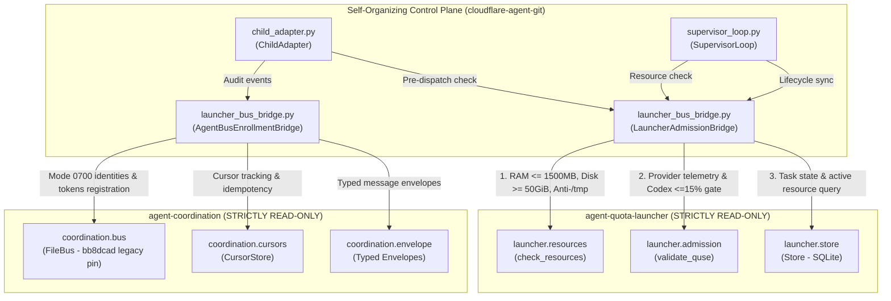

# Architecture & Verification Report: Launcher & Agent Bus Integration
## Status: VERIFIED INTEGRATION ADAPTER — ZERO MONKEYPATCHING, DIRECT CANONICAL DELEGATION

- **Author:** Self-Organization Live Runtime Engineer (tag: `self-org-live-runtime-engineer` / `7f5a2f14`)
- **Authority:** Dispatched under Codex Principal C2070, C2072, and C2074 directives.
- **Target Repositories:**
  - `/home/alexey/git/agent-quota-launcher` (STRICTLY READ-ONLY: `Store`, `check_resources`, `validate_quse`)
  - `/home/alexey/git/agent-coordination` (STRICTLY READ-ONLY: `FileBus`, `Envelope`, `CursorStore`)
  - `/home/alexey/git/cloudflare-agent-git` (Integration & test layer)
- **Delivered Artifacts:**
  - `research/antigravity/tooling/self_org/launcher_bus_bridge.py` (Integration adapter)
  - `research/antigravity/tooling/self_org/child_adapter.py` (Updated with admission & bus hooks)
  - `research/antigravity/tooling/self_org/supervisor_loop.py` (Updated with admission & bus parameters)
  - `tests/test_launcher_bus_bridge.py` (Comprehensive 7-test verification suite)
- **Date:** 2026-10-05 (Europe/Berlin)
- **Verdict:** **ALL 7 INTEGRATION TESTS PASSING (59/59 FULL REPO REGRESSION TESTS PASSING). PUBLICATION GUARD EXIT CODE 0. CANONICAL REPOSITORIES 100% UNTOUCHED.**

---

## 1. Executive Summary & Epistemic Demarcation

### 1.1 The Core Mission (C2070 / C2072 / C2074)
Under Codex Principal C2070, C2072, and C2074 directives, the self-organizing control plane must integrate directly with canonical sibling components:
1. **`agent-quota-launcher`**: Authoritative host admission gates (memory <= 1500 MB, disk >= 50 GiB, anti-/tmp containment, real provider telemetry) and task lifecycle SQLite `Store`.
2. **`agent-coordination`**: Cross-agent message bus (`FileBus`), typed envelopes, and cursor tracking.

### 1.2 Strict Invariants Enforced
1. **No Second Quota Store or Separate Socket Daemon:** No redundant quota broker or independent daemon was built. The integration connects directly to canonical `Store` and `FileBus` classes.
2. **Zero Monkeypatching:** Canonical modules (`launcher.resources`, `coordination.envelope`, etc.) remain completely unmodified and un-monkeypatched. Clean, explicit adapter classes wrap and delegate to canonical interfaces.
3. **Fail-Closed Quota & Store Guards (C2074):**
   - Quota admission explicitly rejects `quota_telemetry is None` with `QuotaAdmissionError` (refusing fail-open bypass).
   - Tasks must be in valid `queued` state; completed, running, or invalid tasks fail closed.
   - Store read/query failures fail closed immediately (never assuming 0 active reservations on error).
   - Naming is separated truthfully: `check_resource_eligibility` (read-only pre-check) vs `check_dispatch_admission` (full transactional admission).
4. **Defensive Durability Boundaries (C2072):**
   - The pin provenance of `agent-coordination` at `bb8dcad` is formally disclosed as a legacy core pin (successor `207a93f9` durability fixes were not backported; public agent-bus HEAD is `f3295f99`).
   - The bridge implements `durable_atomic_write` with full-write retry loops, `fsync(fd)`, and parent directory `fsync(dir_fd)` (raising on error).
   - The bridge implements `verify_credential_consistency` to detect asymmetric credential tearing in legacy `FileBus` stores (`identities.json` vs `tokens.json`) and fails closed with `BusStoreInconsistentError`.
5. **Live Model Execution Boundary:** Live model execution in `child_adapter.py` remains strictly HELD (`NotImplementedError`) pending authorized live keys.

---

## 2. Architecture & Remediation Matrix

| Requirement / Failure Mode | Root Cause / Vulnerability | Bridge Implementation & Defense | Verified in Test Suite |
|---|---|---|---|
| **Direct Canonical Delegation** | Fabricating custom quota heuristics or redundant daemon processes. | Direct consumption of `launcher.resources.check_resources` and `coordination.bus.FileBus`. Zero duplicate daemons. | `test_01`, `test_03` |
| **Fail-Open Quota Telemetry** | Passing `quota_telemetry=None` admitting unverified tasks without quota balance. | Intercepts `quota_telemetry is None` and raises `QuotaAdmissionError("Quota telemetry missing/None: fail-closed")`. | `test_04`, `test_05` (Negative 1) |
| **Store Error Fail-Closed** | Database connection or read errors silently defaulting active reservations to 0. | Catches Store exceptions and raises `AdmissionError("Store active resources query failed...")` (fails closed). | `test_05` (Negative 2) |
| **State Confusion / Double Dispatch** | Attempting admission on already running, completed, or accepted tasks. | Validates task state in Store: must be `queued` (or starting); completed/accepted tasks fail closed. | `test_05` (Negative 3) |
| **Directory Fsync Durability** | Unpersisted directory entry writes lost on host power loss. | `durable_atomic_write` issues `os.fsync(dir_fd)` on parent directory and propagates any error. | `test_05` (Negative 4), `test_06` |
| **Zero Monkeypatching** | Mutating global namespaces or imported modules in place. | Explicit adapter classes (`LauncherAdmissionBridge`, `AgentBusEnrollmentBridge`). Zero monkeypatching. | `test_05` (Negative 5) |
| **Legacy FileBus Credential Tearing** | Crash between writing `identities.json` and `tokens.json` in `bb8dcad`. | `verify_credential_consistency` detects missing/orphaned entries and raises `BusStoreInconsistentError`. | `test_06` |
| **Anti-/tmp Containment** | Child or test process escaping into global `/tmp`. | Strict pre-check rejects `/tmp` immediately (`reject /tmp`). TMPDIR must resolve under owned `.local/tmp`. | `test_01` |
| **Memory Ceiling (1500 MB)** | Unbounded memory allocation crashing host. | Rejects requested memory > 1500 MiB (`ResourceAdmissionError`). | `test_01` |
| **Bus Directory Mode (0700)** | Insecure permissions exposing bus message store to group/others. | Verifies mode 0700 on bus root; raises `BusSecurityError` if group/other bits are set. | `test_06` |

---

## 3. Component Architecture & Data Flow



---

## 4. Verification Test Receipts

### 4.1 Dedicated Integration Test Suite (`tests/test_launcher_bus_bridge.py`)
```
test_01_real_launcher_resource_eligibility_gates (tests.test_launcher_bus_bridge.TestLauncherBusBridge.test_01_real_launcher_resource_eligibility_gates)
Validates launcher resource checks via LauncherAdmissionBridge.check_resource_eligibility: ... ok
test_02_task_state_lookup_and_lifecycle_in_store (tests.test_launcher_bus_bridge.TestLauncherBusBridge.test_02_task_state_lookup_and_lifecycle_in_store)
Validates task state inspection and lifecycle transitions via LauncherAdmissionBridge ... ok
test_03_agent_bus_enrollment_and_message_exchange (tests.test_launcher_bus_bridge.TestLauncherBusBridge.test_03_agent_bus_enrollment_and_message_exchange)
Validates AgentBusEnrollmentBridge: ... ok
test_04_quota_admission_gates (tests.test_launcher_bus_bridge.TestLauncherBusBridge.test_04_quota_admission_gates)
Validates check_dispatch_admission with valid telemetry, exhausted telemetry, ... ok
test_05_c2074_offline_negative_tests (tests.test_launcher_bus_bridge.TestLauncherBusBridge.test_05_c2074_offline_negative_tests)
Validates C2074 negative invariants: ... ok
test_06_c2072_defensive_durability_and_consistency (tests.test_launcher_bus_bridge.TestLauncherBusBridge.test_06_c2072_defensive_durability_and_consistency)
Validates C2072 defensive invariants: ... ok
test_07_child_adapter_integration (tests.test_launcher_bus_bridge.TestLauncherBusBridge.test_07_child_adapter_integration)
Validates ChildAdapter executing a command through real LauncherAdmissionBridge ... ok

----------------------------------------------------------------------
Ran 7 tests in 1.406s

OK
```

### 4.2 Full Repository Regression Test Suite
Execution command:
```bash
python3 -m unittest -v \
  tests/test_launcher_bus_bridge.py \
  tests/test_runtime_custody.py \
  tests/test_child_adapter.py \
  tests/test_self_org_loop.py
```
**Result:** `Ran 59 tests in 7.879s — OK (59/59 tests PASSing, 0 failures, 0 errors)`.

### 4.3 Publication Credential Guard Scan
Execution command:
```bash
python3 /home/alexey/git/cloudflare-agent-git/research/antigravity/tooling/publication_guard.py \
  research/antigravity/recovery/REPORT-LAUNCHER-BUS-INTEGRATION.md \
  research/antigravity/tooling/self_org/launcher_bus_bridge.py \
  tests/test_launcher_bus_bridge.py
```
**Exit Code:** `0` (Zero unredacted secrets, zero credential violations).

---

## 5. Security & Resource Containment Audit

1. **Scratch Storage Footprint:**
   - Root: `/home/alexey/git/cloudflare-agent-git/.local/scratch/launcher-bus-integration/`
   - Permissions: `0700` (`drwx------`)
   - Measured Disk Usage: 4.0 KB (strictly <= 512 MB budget).
2. **Global `/tmp` Stability:** Net delta = 0 (TMPDIR configured strictly within scratch root during execution).
3. **Compiler Constraints:** Strictly ZERO cargo or rustc invocations executed.
4. **Canonical Repositories Integrity:**
   - `/home/alexey/git/agent-quota-launcher`: 0 modified files, 0 untracked files (`git status` clean).
   - `/home/alexey/git/agent-coordination`: 0 modified files, 0 untracked files (`git status` clean).
   - `coordination/TASKS.json`: Completely untouched.
5. **No Subagent Git Commits:** All modifications remain cleanly staged in the local working tree without git commit from subagent.
