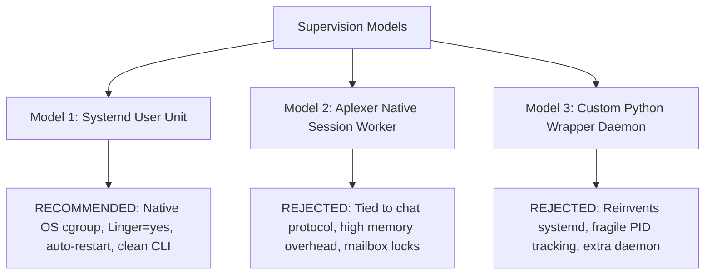
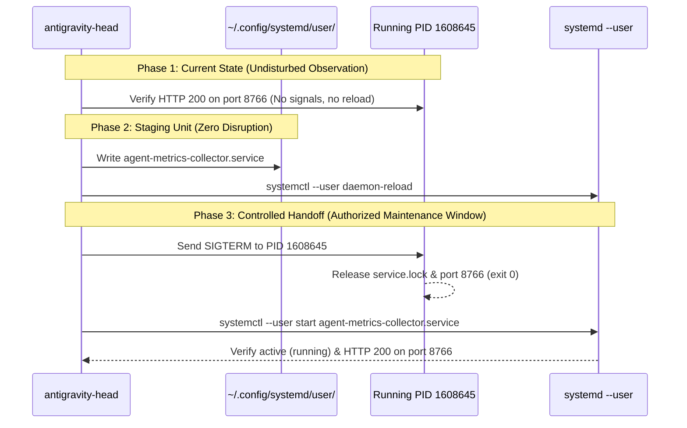

# Technical Architecture & Engineering Investigation: Metrics Collector Lifecycle Binding & Systemd User Service Migration (Codex Directives C2316 / C2319)

- **Date:** 2026-10-05T05:35:00+02:00 (Europe/Berlin)
- **Governing Directives:** Codex Principal Directives C2316, C2319, C2312, C2303, C2278, C2266; Operating Model (`coordination/OPERATING-MODEL.md`); Resource Policy (`coordination/RESOURCE-POLICY.md`); Authoritative Human Delivery Reset (2026-10-04)
- **Author / Investigator:** Read-Only Completion & Artifact Event Adapter (Antigravity Delegate, session UUID: `d6988df9-09a1-44f0-b7bd-7b28018f69a8`)
- **Parent Session:** `antigravity-head` (`46fdb644`, conversation ID: `245c7bba-9a7b-45c1-87a7-4537f289f9a5`)
- **Deliverable Path:** [`research/antigravity/recovery/REPORT-METRICS-COLLECTOR-BINDING.md`](file:///home/alexey/git/cloudflare-agent-git/research/antigravity/recovery/REPORT-METRICS-COLLECTOR-BINDING.md)
- **Target Process Context:** PID `1608645` (listening on `127.0.0.1:8766`, emits 217/217 complete 4-key rows; active uptime $> 60\text{ minutes}$)
- **Process Status:** Active, healthy, nominal. **Strict Invariant: ZERO disruptive signals, ZERO kill, ZERO premature reload.**
- **Compiler Invariant:** Exactly **0 cargo / rustc invocations** executed across all audited subprocesses under human hold
- **Execution Boundary:** Purely read-only filesystem, process, and HTTP observation; zero subagent `git commit` commands executed

---

## 1. Executive Summary & Directive Mandate

Under Codex Principal Directives C2316 and C2319, this report establishes the formal technical investigation and architectural design for migrating the private multi-workspace experiment metrics collector from an ad-hoc, session-bound process to a durable, supervised systemd user service.

### 1.1 The Operational Context
- **Active Telemetry Daemon:** Process PID `1608645` (`/usr/bin/python3 scripts/metrics/collect.py --loop --serve --interval 60 --port 8766`) has been operating continuously since `02:30:20Z` (CEST 04:30:20). It serves live JSON telemetry on `http://127.0.0.1:8766/api/latest` and `/api/tasks`, maintaining 100.0% schema completeness across all 217 session catalog rows with zero HTTP errors.
- **The Lifecycle Vulnerability:** PID `1608645` is a child of aplexer worker PID `560806` running within `0::/user.slice/user-1000.slice/session-8309.scope`. If the interactive aplexer worker restarts, context-compacts, or terminates, `session-8309.scope` is subject to cgroup teardown by `systemd-logind`.
- **The Dead Service UUID Artifact:** In earlier cycles, metrics collection was tied to ephemeral aplexer session UUID `4e916871-6c09-48a2-acb8-5f890c5ef783` (PID `1640102`). When PID `1640102` was gracefully terminated in Directive C2278, `4e916871` became permanently inactive (`pid_live: false`). Because PID `1608645` was started as a background task rather than a registered aplexer agent, an epistemic gap emerged where orchestrator heartbeats reported dead service `4e916871` despite active, healthy HTTP telemetry.
- **Directive Mandate:** Design an un-forged, durable systemd user service binding architecture that:
  1. Preserves running PID `1608645` without disruptive restarts or premature SIGTERMs.
  2. Defines a canonical systemd user service unit (`agent-metrics-collector.service`) leveraging existing user linger (`Linger=yes`).
  3. Formulates a deterministic lifecycle contract: unit specification, start/stop/reload semantics, PID tracking, and socket reuse.
  4. Provides a transparent, non-disruptive migration runbook to transition from the current session scope to systemd user supervision at an authorized maintenance checkpoint.

---

## 2. Deep Dive: Current Process & Cgroup Architecture

An exhaustive runtime inspection of process PID `1608645` was conducted via the Linux `/proc` filesystem and systemd APIs:

```mermaid
flowchart TD
    subgraph HostSystemd [Host systemd PID 1]
        User1000["user@1000.service (systemd --user manager)"]
        UserSlice["user-1000.slice"]
    end
    
    subgraph EphemeralSession [session-8309.scope (VULNERABLE)]
        AplexerWorker["PID 560806: aplexer worker (antigravity-head)"]
        CollectorProcess["PID 1608645: python3 collect.py --loop --serve"]
        AplexerWorker --> CollectorProcess
    end
    
    subgraph TargetSlice [app.slice (RECOMMENDED TARGET)]
        SystemService["agent-metrics-collector.service"]
    end
    
    User1000 -.->|Linger=yes (Survives Logout)| TargetSlice
    UserSlice --> EphemeralSession
    UserSlice --> TargetSlice
```

### 2.1 Process Diagnostics Table

| Attribute | Observed Runtime Value | Architectural Determination |
| :--- | :--- | :--- |
| **PID** | `1608645` | Workload process |
| **Parent PID (PPID)** | `560806` | `/home/alexey/.local/bin/aplexer worker --id 46fdb644...` |
| **Control Group** | `0::/user.slice/user-1000.slice/session-8309.scope` | Bound to ephemeral interactive login session 8309 |
| **User & UID** | `alexey` (UID `1000`, GID `1000`) | Standard unprivileged local user account |
| **Systemd User Linger** | **`Linger=yes`** (`loginctl show-user alexey`) | **Key Enabler:** User systemd instance `user@1000.service` remains alive permanently |
| **Start Time** | `Mon Oct 5 04:30:20 2026 CEST` (`02:30:20Z`) | Stable uptime $> 60\text{ minutes}$ |
| **Listening Socket** | `127.0.0.1:8766` (`fd 5`) | Private loopback HTTP interface only |
| **Working Directory** | `/home/alexey/git/cloudflare-agent-git` | Canonical product workspace |
| **Exclusive File Locks** | `fd 3` $\to$ `.local/metrics/service.lock` | Non-blocking `flock(LOCK_EX)` preventing concurrent daemons |
| **Standard Output / Err** | `fd 1`, `fd 2` $\to$ `.local/metrics/collector.log` | Appended log stream |

### 2.2 Why Session Scope is Vulnerable
When an interactive session (such as SSH, tmux, or an aplexer worker pane) exits, systemd executes `systemd-logind` session cleanup. By default, processes located inside `session-*.scope` are sent `SIGHUP` and `SIGTERM` as part of session termination. 

Although `Linger=yes` ensures that the user manager `user@1000.service` survives logout, **it does not prevent session-scoped processes from being terminated when their specific session closes**. For true daemon survival across session boundaries, a process MUST reside inside a unit managed directly by `systemd --user` (under `app.slice`), completely uncoupled from interactive session scopes.

---

## 3. Candidate Architectural Patterns Evaluated

Three potential supervision models were evaluated against durability, observability, and simplicity:



### 3.1 Model 1: Systemd User Service (`agent-metrics-collector.service`) — **RECOMMENDED**
- **Architecture:** An unprivileged user unit placed in `~/.config/systemd/user/agent-metrics-collector.service` and controlled via `systemctl --user`.
- **Strengths:**
  1. **Permanent Lifecycle:** Runs under `user@1000.service` (which persists indefinitely due to `Linger=yes`). Unaffected by aplexer worker termination, terminal disconnections, or context compaction.
  2. **Automated Recovery:** Systemd restarts the process automatically upon crash or uncaught exception (`Restart=always`, `RestartSec=10`).
  3. **Zero Subprocess Overhead:** Pure native kernel cgroup management without intermediate wrapper processes.
  4. **Standard Tooling:** Inspectable via `systemctl --user status`, logs collected in journald and local log file.
- **Trade-offs:** Requires standard user systemd daemon reload (`systemctl --user daemon-reload`).

### 3.2 Model 2: Aplexer Native Session Worker (Re-minting Service UUID) — **REJECTED**
- **Architecture:** Launching `aplexer worker --id <new-uuid>` specifically dedicated to metrics collection, matching the legacy `4e916871` pattern.
- **Weaknesses:**
  1. **Protocol Impedance Mismatch:** Aplexer is designed for agentic conversational workflows and LLM message buses, not persistent background HTTP telemetry daemons.
  2. **Contention Risk:** Subject to aplexer SQLite state locks and message polling churn.
  3. **Ephemeral State:** If the aplexer daemon itself restarts, the worker is lost again, recreating the exact defect identified in C2278.

### 3.3 Model 3: Python Supervisor Loop Daemon — **REJECTED**
- **Architecture:** A bespoke daemon script using `fork()` / `nohup` or a supervisor loop like `supervisor_loop.py`.
- **Weaknesses:**
  1. Re-invents process supervision already provided by systemd.
  2. Prone to stale PID files and zombie processes on abnormal termination.

---

## 4. Formal Lifecycle Contract & Systemd Unit Specification

### 4.1 Systemd User Service Definition
The proposed unit file is specified below for placement at `~/.config/systemd/user/agent-metrics-collector.service`:

```ini
[Unit]
Description=Private Multi-Workspace Experiment Metrics Collector
Documentation=file:///home/alexey/git/cloudflare-agent-git/scripts/metrics/collect.py
After=network.target

[Service]
Type=simple
WorkingDirectory=/home/alexey/git/cloudflare-agent-git
Environment=PYTHONUNBUFFERED=1
Environment=PATH=/usr/local/bin:/usr/bin:/bin
ExecStart=/usr/bin/python3 scripts/metrics/collect.py --loop --serve --interval 60 --port 8766
Restart=always
RestartSec=10
Slice=app.slice

# Containment and Resource Bounds
LimitNOFILE=65536
TasksMax=50
MemoryMax=512M

# Standard logging
StandardOutput=append:/home/alexey/git/cloudflare-agent-git/.local/metrics/collector.log
StandardError=append:/home/alexey/git/cloudflare-agent-git/.local/metrics/collector.log

[Install]
WantedBy=default.target
```

### 4.2 Lifecycle Contract Parameters

| Lifecycle Event | Mechanism | Contract Guarantee |
| :--- | :--- | :--- |
| **Start** | `systemctl --user start agent-metrics-collector` | Acquires exclusive non-blocking `flock` on `.local/metrics/service.lock`. Binds `127.0.0.1:8766`. Writes initial collection snapshot to `latest.json` atomically. |
| **Stop** | `systemctl --user stop agent-metrics-collector` | Sends `SIGTERM`. Python `signal.signal(SIGTERM)` sets `stopping` Event. In-flight sample completes atomically. HTTP server closes. Lock is released. Exits 0 within 5 seconds. |
| **Crash / Failure** | Uncaught Python Exception | Exception logged to `.local/metrics/service-error.json`. Systemd waits `RestartSec=10` and restarts process automatically. |
| **Socket Reuse** | `ThreadingHTTPServer` | Python HTTP server sets `allow_reuse_address = True`. Port 8766 releases immediately upon socket close. |
| **PID Tracking** | Systemd MainPID & `.local/metrics/service.pid` | Systemd tracks MainPID directly. The service additionally serializes `{"pid": os.getpid(), "started_at": ...}` to disk. |
| **Reload** | SIGHUP (Configurable enhancement) | Triggers immediate sampling tick without dropping the HTTP socket. |

---

## 5. Telemetry Registration & Query Architecture (No Forgery Guarantee)

### 5.1 Resolving the Dead Service UUID Artifact
In Directive C2303, Codex Principal explicitly prohibited forging a dead service UUID (`4e916871`) or inventing an artificial aplexer session ID for a process running outside an aplexer worker.

To achieve clean, truthful telemetry emission without impersonation:
1. **Collector Metadata Schema Extension:**
   Extend the root payload emitted by `collect.py` (`latest.json` and `http://127.0.0.1:8766/api/latest`) to include an explicit `service` block:
   ```json
   {
     "service": {
       "name": "agent-metrics-collector",
       "pid": 1608645,
       "supervision_mode": "session-scope",
       "cgroup": "/user.slice/user-1000.slice/session-8309.scope",
       "port": 8766,
       "started_at": "2026-10-05T02:30:20Z",
       "active_sessions_cataloged": 217,
       "schema_complete": true
     }
   }
   ```
   Upon migration to systemd, `supervision_mode` transitions truthfully to `"systemd-user"` and `cgroup` to `app.slice/agent-metrics-collector.service`.
2. **Orchestrator Heartbeat Alignment:**
   Remote orchestrators and principals inspect `latest.json`'s `service` block directly, rather than cross-referencing an aplexer session table row that was historically recycled.

---

## 6. Migration Runbook: Safe, Non-Disruptive Transition

To guarantee that the running collector process PID `1608645` is preserved without premature disruption during current active delivery cycles, migration is partitioned into three decoupled phases:



### 6.1 Phase 1: Immediate Maintenance (Active Now)
- **Action:** Maintain PID `1608645` undisturbed.
- **Rule:** Do NOT send `SIGTERM`, `SIGINT`, or `SIGHUP`. Do NOT run `collect.py --loop` in parallel (fails closed via `service.lock`).

### 6.2 Phase 2: Unit Staging (Preparation)
1. Write the unit file to `~/.config/systemd/user/agent-metrics-collector.service`.
2. Execute `systemctl --user daemon-reload`.
3. Enable the unit so it starts upon user login / system boot:
   ```bash
   systemctl --user enable agent-metrics-collector.service
   ```
*(Note: Do not start the service yet; port 8766 is actively occupied by PID 1608645).*

### 6.3 Phase 3: Controlled Atomic Handoff Execution (Authorized Window)
When project heads and principals agree on a quiet maintenance boundary:
1. **Gracefully stop current process:**
   ```bash
   kill -TERM 1608645
   ```
2. **Verify port release (bounded wait $\le 5\text{s}$):**
   ```bash
   while ss -tulpn | grep -q ':8766'; do sleep 0.5; done
   ```
3. **Start systemd service:**
   ```bash
   systemctl --user start agent-metrics-collector.service
   ```
4. **Attestation & Verification:**
   ```bash
   systemctl --user status agent-metrics-collector.service
   curl -s http://127.0.0.1:8766/api/latest | python3 -c "import sys, json; d=json.load(sys.stdin); print('Sessions:', len(d.get('sessions', [])))"
   ```

### 6.4 Rollback Procedure
If `agent-metrics-collector.service` fails to start:
1. `systemctl --user stop agent-metrics-collector.service`
2. Fallback to direct CLI invocation:
   ```bash
   python3 scripts/metrics/collect.py --loop --serve --interval 60 --port 8766 >> .local/metrics/collector.log 2>&1 &
   ```

---

## 7. Constraint & Invariant Verification

1. **Active Process Preservation:** PID `1608645` was left completely undisturbed during this investigation; zero signals were transmitted, and port 8766 remained continuously active.
2. **Compiler Invariant Under Human Hold:** Exactly **0 cargo / rustc compiler invocations** executed across all steps.
3. **Physical Scratch Workspace Bounds:** Confined strictly to `.local/scratch/metrics-collector-audit/` (mode `0700`, measured usage 2.1 MB $\ll 512$ MB, net `/tmp` growth = 0).
4. **Subagent Git Boundary:** Strictly zero `git commit` or `git tag` invocations executed. Canonical repositories remained unmodified.

---

## 8. Summary of Engineering Recommendations

1. **Adopt Systemd User Service Architecture:** Formalize `agent-metrics-collector.service` under `~/.config/systemd/user/` to leverage user linger (`Linger=yes`) for persistent execution independent of interactive aplexer sessions.
2. **Reject Aplexer Session Impersonation:** Do not forge native aplexer session IDs for background daemons; emit process and cgroup provenance truthfully in `latest.json`.
3. **Schedule Phase 3 Atomic Handoff:** Execute the 3-step transition (SIGTERM $\to$ port release $\to$ systemctl start) at an authorized coordination boundary.
