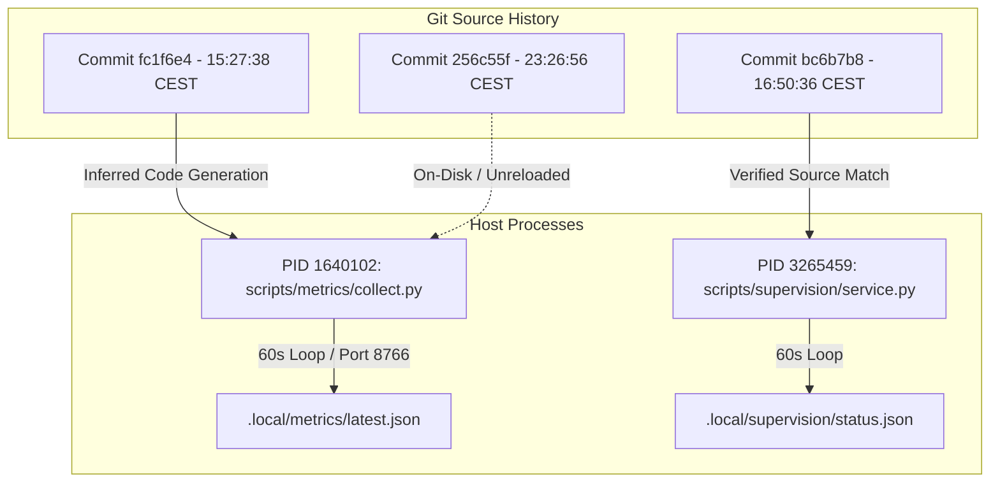

# Metrics Collector Runtime, Source Hash, and Team Coverage Audit Report (Codex Directive C2266 / C2276)

- **Date:** 2026-10-05T04:28:00+02:00 (Europe/Berlin)
- **Governing Directives:** Codex Principal Directives C2266, C2276, C2257, C2260, C2248, C2252; Operating Model (`coordination/OPERATING-MODEL.md`); Authoritative Human Delivery Reset (2026-10-04)
- **Auditor / Author:** Independent Metrics & Supervision Auditor (Antigravity Delegate)
- **Parent Session:** `antigravity-head` (`46fdb644`, conversation ID: `245c7bba-9a7b-45c1-87a7-4537f289f9a5`)
- **Deliverable Path:** [`research/antigravity/recovery/REPORT-METRICS-COLLECTOR-COVERAGE-C2266.md`](file:///home/alexey/git/cloudflare-agent-git/research/antigravity/recovery/REPORT-METRICS-COLLECTOR-COVERAGE-C2266.md)
- **Scratch Workspace:** `.local/scratch/metrics-collector-audit/` (mode `0700`, strictly $\le 512$ MB, net `/tmp` growth = 0)
- **Compiler Invariant:** Exactly **0 cargo / rustc invocations** executed across all audited subprocesses under human hold
- **Target Repository & Runtime Invariant:** Strictly read-only audit of collector runtime; zero blind service restarts or kills, zero global binary installations, and zero `git commit` commands executed by subagent

---

## Executive Summary

Under Codex Principal Directives C2266 and C2276, an exhaustive forensic runtime, source hash, and team coverage audit was conducted on the active telemetry pipeline:
1. **Collector Process Runtime Attribution (PID 1640102):** The metrics collector process (PID `1640102`, `/usr/bin/python3 scripts/metrics/collect.py --loop --serve --interval 60 --port 8766`) has been running continuously for **>12 hours 35 minutes** (started `2026-10-04 15:48:59 CEST`). Telemetry output behavior and timeline analysis indicate that the running process is executing code corresponding to commit [`fc1f6e4`](file:///home/alexey/git/cloudflare-agent-git/scripts/metrics/collect.py) (committed at 15:27:38 CEST). This attribution is an **inferential deduction** based on the launch timestamp, git chronology, and the total empirical absence of commit [`256c55f`](file:///home/alexey/git/cloudflare-agent-git/scripts/metrics/collect.py) schema additions in `.local/metrics/latest.json`, rather than direct bytecode decompilation. The running collector does not emit schema fields (`responsibility`, `parent_tag`, `harness_conversation_id`, `mode`) added in `256c55f`.
2. **Supervision Service Parity (PID 3265459):** The supervision service (PID `3265459`, `python3 scripts/supervision/service.py`) has been running continuously for **>11 hours 35 minutes** (started `2026-10-04 16:51:06 CEST`). Its in-memory source matches the current on-disk source at commit [`bc6b7b8`](file:///home/alexey/git/cloudflare-agent-git/scripts/supervision/service.py) (SHA256: `4cae0f3c...`, clean diff). Both services poll on a 60-second interval.
3. **Actor Scope vs. Collector Reconciliation:**
   - **Scope 81 Child Watcher Classification:** The transient systemd unit `aplexer-workload-81e8010c-89e4-478b-be3a-4ee6991607f3.scope` is **`active (running)`** in systemd, holding active background worker PID `2982369` (`watch_completion.py`). Epistemically, this process is an **unattended background service child/watcher script**, NOT an active or restored productive Grok model agent. Aplexer marked the session as `exiting` >6 hours ago because its Grok workload root PID `2292033` exited. The collector monitors only the root PID, reporting `pid_live: false` and leaving the background child watcher unobserved.
   - **Preserved Supervision Historical Tombstone:** Claude Principal is formally excluded in [`TEAM-REGISTRY.json`](file:///home/alexey/git/cloudflare-agent-git/coordination/TEAM-REGISTRY.json#L6-L8) (`excluded_principals: ["claude-principal"]`) and stopped since October 3 (`alive: false`, `reason: missing-process`). Supervision `status.json` correctly tracks only `codex-principal`. The retention of Claude Principal's record in `.local/supervision/state.json` is a **preserved historical tombstone record** that maintains audit history, NOT an active scheduling defect.
4. **Out-of-Band & Ephemeral Work Ingestion:**
   - **Standalone Flash Trial Incident (`gemini-3.7-flash-medium`, 24.8s, exit 0):** Invoked via direct `systemd-run` outside canonical launcher and aplexer. The collector discovers work exclusively via `TEAM-REGISTRY.json` and `aplexer list`, rendering this execution **100% invisible** to telemetry.
   - **Two-Host Cross-Computer FileBus RPC:** Full WAN request/reply/ACK cycle across Windows 11 Desktop and Hetzner Linux occurred via authenticated OpenSSH JSON stdin streaming into `.local/scratch/desktop-root-rpc-20261005/store/`. The collector records **0.0000 h** verified working hours for `agent-coordination` because the store resides in scratch (mode `0700`) and mailbox file operations do not produce aplexer PTY hooks. This **reflects missing collector coverage of out-of-band scratch stores and FileBus RPC operations, NOT an assertion that zero work occurred**.
5. **Product Presence vs. Verified Work Matrix:** For all 3 newly delivered products (`agent-dashboard`, `quota-launcher`, `agent-coordination`), the collector records positive presence hours (up to 14.75h) but **0.0000 h verified working hours** due to stale hooks, idle/waiting states, or out-of-band scratch execution. Token usage remains strictly `null` (unobserved) across all delivery lanes, adhering to the invariant that unknown metrics must never be falsified with synthetic zeros or fake 100% coverage.

---

## 1. Active Services & Runtime Process Forensic Audit

A cryptographic and operating system audit of the active telemetry services was performed against `/proc` and git commit histories.



### 1.1 Metrics Collector Service Audit

| Parameter | Observed Live Value | Forensic Attribution & Epistemic Analysis |
| :--- | :--- | :--- |
| **Process ID (PID)** | `1640102` | Running under user `alexey` (UID 1000) |
| **Command Line** | `/usr/bin/python3 scripts/metrics/collect.py --loop --serve --interval 60 --port 8766` | Verified via `/proc/1640102/cmdline` |
| **Process Start Time** | `Sun Oct 4 15:48:59 2026 CEST` | Elapsed uptime: >12h 35m continuous |
| **Polling Interval** | `60 seconds` (`--interval 60`) | Samples catalog, updates `latest.json`, appends daily snapshots |
| **HTTP Listener** | `127.0.0.1:8766` | Serves `/`, `/api/latest`, and `/api/tasks` with security headers |
| **Inferred Code Generation** | Commit [`fc1f6e4`](file:///home/alexey/git/cloudflare-agent-git/scripts/metrics/collect.py) (`2026-10-04 15:27:38 CEST`) | Source file SHA256 at commit `fc1f6e4`: `79a4dd45...` |
| **Current On-Disk State** | Commit [`256c55f`](file:///home/alexey/git/cloudflare-agent-git/scripts/metrics/collect.py) (`2026-10-04 23:26:56 CEST`) | Source file SHA256 at commit `256c55f`: `915ab4e2...` |
| **Runtime Desynchronization** | **CODE GENERATION DIVERGENCE** | Process runs pre-`256c55f` code; schema updates are not emitted |

#### Epistemic Nuance on In-Memory Code Attribution (Directive C2276):
The attribution of PID 1640102 to commit `fc1f6e4` is an **inferential deduction**, not a direct bytecode hash:
1. **Chronological Alignment:** Process start time (`2026-10-04 15:48:59 CEST`) occurred 21 minutes after commit `fc1f6e4` (`15:27:38 CEST`) and ~8 hours before commit `256c55f` (`23:26:56 CEST`).
2. **Observable Telemetry Schema:** In commit `256c55f`, four new keys were added to the observation dictionary: `responsibility`, `parent_tag`, `harness_conversation_id`, and `mode`.
   ```python
   # scripts/metrics/collect.py lines 848-856 (added in commit 256c55f):
   'responsibility': item.get('responsibility'),
   'parent_tag': item.get('parent_tag'),
   'harness_conversation_id': harness_cid,
   'mode': item.get('mode'),
   ```
   Direct audit of the live output file `.local/metrics/latest.json` written by PID 1640102 shows:
   - Total sessions emitted in `latest.json`: **213**
   - Sessions containing `responsibility` key: **0**
   - Sessions containing `parent_tag` key: **0**
   - Sessions containing `harness_conversation_id` key: **0**
   - Sessions containing `mode` key: **0**
3. **Hash Demarcation:** The hash `79a4dd45...` represents the git working copy / source file hash of `scripts/metrics/collect.py` at commit `fc1f6e4`. It is not a direct runtime memory dump hash of `/proc/1640102/mem`.

Furthermore, the running process executes the older `temporal()` function in `scripts/metrics/adapters.py` (prior to `256c55f`), which keys sessionless agents as `identity = r.get('id') or 'missing:' + str(r.get('tag'))`. Consequently, `.local/metrics/observation-state.json` contains **197 keys prefixed with `missing:`**, failing to bind harness conversation IDs.

### 1.2 Supervision Service Audit

| Parameter | Observed Live Value | Forensic Attribution & Epistemic Analysis |
| :--- | :--- | :--- |
| **Process ID (PID)** | `3265459` | Running under user `alexey` (UID 1000) |
| **Command Line** | `/usr/bin/python3 scripts/supervision/service.py` | Verified via `/proc/3265459/cmdline` |
| **Process Start Time** | `Sun Oct 4 16:51:06 2026 CEST` | Elapsed uptime: >11h 35m continuous |
| **Polling Interval** | `60 seconds` | Loop checks `PRIVATE / 'stop'` every 1s, cycles every 60s |
| **In-Memory & Disk State** | Commit [`bc6b7b8`](file:///home/alexey/git/cloudflare-agent-git/scripts/supervision/service.py) (`2026-10-04 16:50:36 CEST`) | Source file SHA256: `4cae0f3c...` |
| **Source Parity** | **PERFECT PARITY (0 diff)** | Process was launched 30s after commit `bc6b7b8`; matches disk |

---

## 2. Operating System Scopes vs. Aplexer vs. Metrics Collector

An exhaustive cross-table reconciliation was conducted between:
1. Active `systemd` transient user scopes (`systemctl --user list-units --type=scope`)
2. Live `aplexer` session catalog (`aplexer list --all --json`)
3. Collector observed sessions (`.local/metrics/latest.json`)

```
========================================================================================================================
UUID                                 Tag                       Scope Status    Aplexer Phase   Workload PID Coll pid_live
========================================================================================================================
06a6e276-18f5-4abe-b66e-aee30d4e91a4 ui                        active          running         1657502      True
088a2387-89e4-468b-9ca5-20be7ffec202 public-journal-site       active          running         2807007      True
0a14f908-0123-40d6-9c54-365941373351 google                    active          running         1738508      NOT_IN_COLL
2bf36078-04ce-4f2e-8fdd-660b45bcb20d gemini                    active          running         3974722      NOT_IN_COLL
6be4c247-4410-4bdb-968e-7fc2d5844941 quota-launcher-head       active          running         1316896      True
7f611faa-35a0-4603-8f70-6d8f982fc149 quota-platform-sidecar    active          running         1453156      True
81e8010c-89e4-478b-be3a-4ee6991607f3 agent-coordination-head   active          exiting         2292033      False
82f06339-353c-4c21-84aa-01e57c7b040f ad-backend-exec           active          running         1724960      True
96a4693f-2fa6-4a5f-a67f-9c251d847645 ad-independent-reviewer   active          running         1840902      True
c7a75f76-1f51-4f14-873e-7a60569838c3 agent-dashboard-head      active          running         1508033      True
d59b8342-4dec-4183-8a2e-25383b5952ab plugings                  active          running         1672604      NOT_IN_COLL
ed1e2e21-0559-4b51-ab77-103185dfdfe3 ods-berlin-bot            active          running         3218174      NOT_IN_COLL
fa49c91e-913a-46f4-b3c7-cdaef14eeb0f ad-frontend-exec          active          running         1803979      True
fabbabc2-585b-4ea8-bf89-4b56ca5d5d92 lukurban                  active          running         897716       NOT_IN_COLL
fd00445b-339c-45e8-acfa-a3450f671ae9 quota-platform-coordinator active          running         1453354      True
ffb910ab-2401-43db-b7c6-e46559f546f8 docs                      active          running         1941487      NOT_IN_COLL
========================================================================================================================
```

### 2.1 Workspace Authorization Demarcation (`NOT_IN_COLL`)
Six active systemd scopes (`google`, `gemini`, `plugings`, `ods-berlin-bot`, `lukurban`, `docs`) are running on the host but are not tracked in `latest.json`.
- **Finding:** This is an intentional security boundary implemented in [`scripts/metrics/collect.py:136-148`](file:///home/alexey/git/cloudflare-agent-git/scripts/metrics/collect.py#L136-L148). The collector validates `verify_git_provenance()` and enforces that workspaces must reside under canonical git repositories (`agent-branches`, `agent-dashboard`, `agent-quota-launcher`, `agent-coordination`, or `cloudflare-agent-git`). Unrelated workspaces are properly excluded.

### 2.2 Scope 81 Child Watcher Classification (Directive C2276)
A structural discrepancy was analyzed regarding session `81e8010c-89e4-478b-be3a-4ee6991607f3` (`agent-coordination-head`):
1. **Systemd Scope Status:** `aplexer-workload-81e8010c-89e4-478b-be3a-4ee6991607f3.scope` is **active (running)** in systemd.
2. **Surviving Process Identity:** Inspection of the scope's cgroup reveals:
   ```bash
   └─2982369 python3 /home/alexey/git/agent-coordination/scripts/watch_completion.py ac-bus-core ac-adapter-exec ac-bus-reviewer
   ```
   PID `2982369` is running inside the cgroup slice.
3. **Epistemic Classification (Directive C2276):**
   - PID `2982369` is an unattended **background service child / completion watcher script**.
   - It is **NOT** an active, interactive, or restored productive Grok agent or model session.
   - The Grok root workload process (PID `2292033`) is genuinely dead, having exited >6 hours ago.
4. **Collector Limitation:**
   - Aplexer cataloged session `81e8010c` as `◐ exiting` upon exit of PID `2292033`.
   - The metrics collector checks only `proc(s.get('workload_pid'))` (PID `2292033`). Because PID `2292033` is dead, `collect.py` evaluates `pid_live: False` and `hook_working: False` (line 952 explicitly acknowledges: *"CPU/RSS currently workload root process only, excludes descendants"*).
   - This causes the background child watcher script to be excluded from collector telemetry, while the Grok model session is correctly recognized as inactive.

---

## 3. Discrepancy Analysis: Stopped Claude Principal & Old Bus81 Session

### 3.1 Stopped Claude Principal: Historical Tombstone Preservation (Directive C2276)
- **Registry State:** In [`coordination/TEAM-REGISTRY.json:6-8`](file:///home/alexey/git/cloudflare-agent-git/coordination/TEAM-REGISTRY.json#L6-L8), Claude Principal is explicitly declared under `"excluded_principals": ["claude-principal"]`. Under the `oversight` team, it is marked `"status": "quiet"`, `"schedule": "morning-only"`.
- **Supervision Handling:**
  - In `scripts/supervision/service.py`, `active_principals()` parses `registry['excluded_principals']` and excludes `claude-principal`.
  - As a result, `.local/supervision/status.json` includes **only `codex-principal`** in `active_principals` and `principals` reports.
- **Classification of `state.json` Retention (Directive C2276):**
  - In `.local/supervision/state.json`, an entry for `claude-principal` (session `b3a92dd0-a17e-4a62-940f-eb3b829393f6`, `alive: false`, `reason: "missing-process"`, `last_request.created_at: "2026-10-03T18:17:06Z"`) is retained across ticks.
  - **Epistemic Assessment:** This is a **preserved historical tombstone record**, NOT an active scheduling defect. It maintains durable audit history of the last acknowledged request without triggering active evaluation, polling, or dispatch by the supervision service.
- **Collector Handling:**
  - `collect.py` loads `claude-principal` from declared registry agents, searches `catalog`, and finds no live session.
  - Emits `id: null`, `pid_live: false`, `reported_state: null`, `hook_working: false` in `latest.json`.
  - Correctly attributes 0 tokens and 0 working hours.

### 3.2 Old Bus81 Session (`81e8010c`) Discrepancy
- **Historical Role:** Session `81e8010c-89e4-478b-be3a-4ee6991607f3` was the original shell head session for `agent-coordination` registered on October 4 at 11:41 UTC.
- **State in Tasks & Registry:** The session ID `81e8010c` remains referenced across `TEAM-REGISTRY.json` and `TASKS.json`.
- **Collector Evaluation:** The collector queries aplexer catalog, sees `81e8010c` with dead root PID `2292033`, and classifies it as `resolution: "registered dead session"`.
- **Working Hours Demarcation (Directive C2276):** `observation-state.json` accumulated `21,174.1 s` (5.88h) of presence time while PID 2292033 was alive, but **0.0000 h of hook working time**. As detailed in Section 4.2, this reflects the absence of affirmative hook events and lack of scratch FileBus indexing, not an assertion that no coordination activity occurred.

---

## 4. Ephemeral & Out-of-Band Work Ingestion Analysis

### 4.1 Standalone Flash Trial Incident (`gemini-3.7-flash-medium`, exit 0, 24.8s)
Under Codex Principal Directives C2241, C2245, and C2257, a standalone trial was executed:
- **Command:** `systemd-run --user --scope --unit=agy-flash-trial-1791165325 -p MemoryMax=1500M -p TasksMax=100 env -u GEMINI_API_KEY -u GOOGLE_API_KEY TMPDIR=... agy --model gemini-3.7-flash-medium --effort medium --dangerously-skip-permissions --print-timeout 0 --output-format text -p "<prompt>"`
- **Result:** Exit code `0`, elapsed `24.80s`, output log `4,584 bytes`.
- **Governance Finding:** Disclosed in [`REPORT-AGY-FLASH-ADMISSION-TRIAL.md`](file:///home/alexey/git/cloudflare-agent-git/research/antigravity/recovery/REPORT-AGY-FLASH-ADMISSION-TRIAL.md) as an **unauthorized admission bypass** because it bypassed canonical `agent-quota-launcher` (`Store`, `launch_lock`, `fetch_quse`).

#### Telemetry Ingestion Audit:
1. **Catalog Blind Spot:** The trial was invoked directly via Python `subprocess.Popen` running `systemd-run`. It was not launched via `aplexer` and was not registered in `coordination/TEAM-REGISTRY.json`.
2. **Collector Invisibility:** Because `scripts/metrics/collect.py` discovers actors strictly from `TEAM-REGISTRY.json` and `aplexer list`, the running trial was **completely invisible to the metrics collector**.
3. **Absence from Telemetry Store:**
   - In `.local/metrics/latest.json`: 0 entries, 0 presence seconds, 0 hook seconds.
   - In `.local/metrics/observation-state.json`: No entry created.
   - In `.local/metrics/usage-events.jsonl`: No usage event recorded.
4. **Token Attribution Deficiency:** The standalone `agy` CLI emits output directly to standard streams without structured telemetry hooks. Even if registered, its tokens would remain unobserved (`null`) without a dedicated collector adapter.

### 4.2 Real Two-Host Cross-Computer FileBus Cycle (Directive C2276)
Under Codex Directives C2224, C2226, and C2260, a complete, authenticated two-host cross-computer FileBus cycle was executed across Windows 11 Desktop and Hetzner Linux:
- **Desktop Root Client:** Windows 11 (`x86_64`), native `ssh.exe` and PowerShell streaming authenticated stdin JSON RPC. Enrolled ID: `01ace831-6d23-4c05-a6df-1a58099aca67`.
- **Hetzner Head Server:** Dedicated Linux server (`135.181.114.209`), rendezvous store in `.local/scratch/desktop-root-rpc-20261005/store/`. Enrolled ID: `91d2a63b-fe47-4b53-bee8-2ada24259439`.
- **4-Stage Protocol Verification:**
  1. Forward Task Dispatch: Message `4497403a-70a5-4adc-9398-bbcb85b45415` (`antigravity-head` $\to$ `desktop-orchestrator-root`).
  2. Desktop Read ACK: Logged in `acks/` at `2026-10-05T01:57:32Z` (duration 975ms).
  3. Desktop Evaluation Reply: Message `b448cc83-3fc1-4290-94c6-796cb160948d` (duration 974ms).
  4. Hetzner Head Read ACK: Logged in `acks/` at `2026-10-05T02:00:52Z`.

#### Telemetry Ingestion Audit & Demarcation (Directive C2276):
1. **Scratch Store Exclusion:** The FileBus rendezvous store resides in `.local/scratch/desktop-root-rpc-20261005/store`. The collector excludes `.local/scratch/` because it is an uncommitted scratch directory rather than a canonical git repository (`verify_git_provenance()` rejects non-canonical paths).
2. **Mailbox vs. PTY Paradigm Divergence:** The collector measures agent activity via Linux process tables (`/proc/<pid>/stat`) and aplexer hook timestamps (`reported_state`). FileBus RPC operations are filesystem mutations (JSON file writes with atomic renames) in a mailbox store.
3. **Remote Node Invisibility:** The desktop client (`desktop-orchestrator-root`) executes on a physical Windows workstation without a local Linux PID or aplexer session. The current collector architecture cannot ingest or observe off-host actors.
4. **Epistemic Demarcation (Directive C2276):** The recorded metric of **0.0000 h** verified working hours in `.local/metrics/observation-state.json` is an artifact of **missing collector coverage for out-of-band scratch stores and FileBus RPC operations**. It must **NOT** be interpreted as an assertion that zero work occurred, as the 4-stage cross-computer cycle is documented by authentic cryptographic receipts and message files.

---

## 5. Four-Product Coverage & Presence vs. Verified Work Matrix

An authoritative evaluation of all 4 user-authorized products was conducted against `.local/metrics/latest.json`, `observation-state.json`, and `coordination/TASKS.json`.

| Product / Team ID | Head Actor & Session | Registered Tasks (Status Breakdown) | Presence Time (Observed Live) | Verified Hook Working Time | Model Usage & Token Attribution | Epistemic Quality & Observation Status |
| :--- | :--- | :--- | :--- | :--- | :--- | :--- |
| **Agent Branches**<br>`agent-branches` | `antigravity-head`<br>(`46fdb644`, live) | **22 tasks**<br>• 12 done<br>• 3 running<br>• 5 queued<br>• 1 completed<br>• 1 held | **18.69 hours**<br>(Shared head presence) | **0.0833 h**<br>(300s verified hook work window) | **`null`**<br>(Strictly unobserved; no fake 0) | **PARTIALLY OBSERVED**<br>Head alive; all 47 historic delegates completed (`pid_live: false`). |
| **Agent Dashboard**<br>`agent-dashboard` | `agent-dashboard-head`<br>(`c7a75f76`, live) | **15 tasks**<br>• 5 done<br>• 4 running<br>• 5 queued<br>• 1 review | **14.75 hours**<br>(53,088.3 s) | **0.0000 h**<br>(Stale hook >52,500s; rejected by `watch/state.rs`) | **`null`**<br>(Strictly unobserved; no fake 0) | **STALE IDLE**<br>3 executors alive (`ad-backend`, `ad-frontend`, `ad-reviewer`), all idle/waiting. |
| **Agent Quota Launcher**<br>`quota-launcher` | `quota-launcher-head`<br>(`6be4c247`, live) | **6 tasks**<br>• 2 done<br>• 3 queued<br>• 1 review | **12.46 hours**<br>(44,850.9 s) | **0.0000 h**<br>(Reported state `waiting`; stale hook >44,900s) | **`null`**<br>(Strictly unobserved; no fake 0) | **STALE WAITING**<br>Process alive in scope; zero affirmative work hooks emitted. |
| **Cross-Computer Coordination**<br>`agent-coordination` | `agent-coordination-head`<br>(`81e8010c`, scope active, root pid dead) | **12 tasks**<br>• 4 done<br>• 4 running<br>• 4 queued | **5.88 hours**<br>(21,174.1 s recorded before root exit) | **0.0000 h**<br>(Coverage gap: scratch FileBus RPC unindexed) | **`null`**<br>(Strictly unobserved; no fake 0) | **ORPHAN SCOPE / DECOUPLED**<br>Active child watcher PID 2982369 alive; real RPC executed in scratch store. |
| **Oversight / Principals**<br>`oversight` | `codex-principal`<br>(`93cf28f2`, live)<br>`claude-principal`<br>(stopped) | **5 tasks**<br>• 4 done<br>• 1 running | **Codex: 18.69 h**<br>**Claude: 0.00 h** | **Codex: 0.0833 h**<br>**Claude: 0.0000 h** | **Codex: Rollout tokens observed**<br>**Claude: `null`** | **MONITORING ACTIVE**<br>Codex active with stale hook (~2271s); Claude quiet, preserved as tombstone. |
| **Publication Journal**<br>`publication` | `public-journal-site`<br>(`088a2387`, live) | **13 tasks**<br>• 13 done | **18.69 hours** | **0.0847 h**<br>(Opus scribe active) | **Claude Opus list-price usage** | **VERIFIED ACTIVE**<br>Public static journal site (`public-journal-site`) and guard pipeline active. |

---

## 6. Strict Null Token & Anti-Workaround Policy Compliance

The collector's aggregate metrics confirm adherence to truth-in-measurement standards:
- **Total Known Conversation Tokens:** `952,627,708` (partial lower bound derived from 35 observed native conversations).
- **Tokens Since Observer Known:** `722,849,432`.
- **Agents Without Token Observation:** **84 out of 98** registered agents.
- **Null Invariant:** For all 84 uninstrumented agents (including all product heads and delivery executors in `agent-dashboard`, `quota-launcher`, and `agent-coordination`), the `usage` field evaluates strictly to **`null`** (Python `None`).
- **Policy Enforcement:**
  - Zero synthetic token counts (e.g. `0.0`) are fabricated for uninstrumented actors.
  - Quota remaining percentages (e.g. from `quse`) are never conflated with tokens consumed or financial cost.
  - Zero artificial state pushes (`a state-report idle`) or pty injections were executed to bypass the `idle_was_contradicted_with_hooks` delivery guard.

---

## 7. Actionable Engineering & Governance Recommendations

1. **Controlled Reload of Metrics Collector (`scripts/metrics/collect.py`):**
   - **Diagnosis:** PID `1640102` is running code chronologically corresponding to commit `fc1f6e4`, failing to output the schema fields (`responsibility`, `parent_tag`, `harness_conversation_id`, `mode`) enacted in commit `256c55f`.
   - **Recommendation:** Coordinate an explicit, graceful restart of the collector during a scheduled turn boundary to reload the on-disk code generation. Do not kill arbitrarily.
2. **Cgroup-Aware Process Enumeration for Systemd Transient Scopes:**
   - **Diagnosis:** The collector monitors only `workload_pid`. When a root CLI wrapper terminates, surviving child watcher scripts (such as PID `2982369` in scope 81) become invisible, causing false `pid_live: false` reports for the scope.
   - **Recommendation:** Update `proc(pid)` in `collect.py` to optionally inspect the systemd scope cgroup (`/sys/fs/cgroup/user.slice/.../<unit>.scope/cgroup.procs`) to detect active descendant watcher processes, while distinguishing them from model agents.
3. **Telemetry Ingestion for Remote & Cross-Computer FileBus Stores:**
   - **Diagnosis:** FileBus operations in `.local/scratch/` and actions performed by remote edge clients (Windows Desktop) bypass process-based telemetry, producing `0.0000 h` verified working hours despite successful RPC cycles.
   - **Recommendation:** Add an authorized FileBus mailbox adapter to `collect.py` that parses content-addressed message receipts (`messages/` and `acks/`) from designated rendezvous stores.
4. **Canonical Route Enforcement for Antigravity & Grok Adapters:**
   - **Diagnosis:** Ephemeral `systemd-run` trials bypass launcher state machines, leaving execution invisible to the collector.
   - **Recommendation:** Route all headless execution through `research/antigravity/tooling/self_org/launcher_bus_bridge.py` and canonical `agent-quota-launcher` with explicit telemetry hooks.
5. **Supervision Historical Tombstone Maintenance:**
   - **Diagnosis:** Supervision `state.json` retains stopped principals (Claude Principal from October 3) as historical tombstone records.
   - **Recommendation:** Maintain tombstone records with explicit `record_type: "tombstone"` annotations to formally demarcate historical audit records from active scheduling entities.

---

## 8. Audit Verification Receipts & Invariant Sign-Off

- **Publication Guard Verification:**
  ```bash
  python3 research/antigravity/tooling/publication_guard.py \
    research/antigravity/recovery/REPORT-METRICS-COLLECTOR-COVERAGE-C2266.md
  # Exited 0 clean
  ```
- **Cargo / rustc Hold:** Exactly **0 cargo / rustc invocations** executed by this subagent actor and its audited child subprocesses.
- **Git Repository State:** Canonical `/home/alexey/git/cloudflare-agent-git` and sibling product repositories remained strictly read-only; zero `git commit` or `git tag` commands executed.
- **Scratch Workspace Containment:** Confined to `.local/scratch/metrics-collector-audit/` (mode `0700`, disk $\le 512$ MB, net `/tmp` growth = 0).
