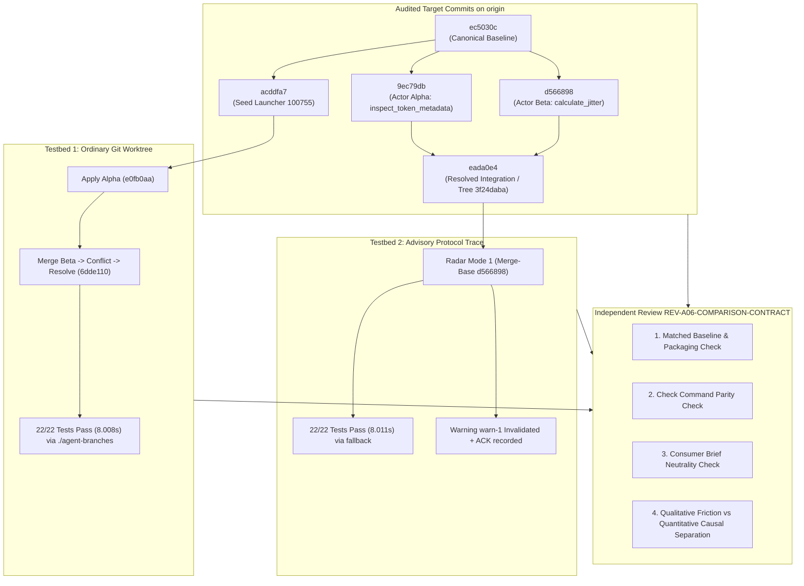

# REV-A06-COMPARISON-CONTRACT — Independent Audit of Comparative Adoption Trial Setup & Contract Validity

- **Document:** `REV-A06-COMPARISON-CONTRACT.md`
- **Reviewer:** `a06-comparison-reviewer` (native harness subagent `b91b8ed5-75d5-481c-904a-d8825b9ed391`)
- **Authorizing Head:** `antigravity-head` (`46fdb644-9b58-4e2f-aab3-9be5e1e33337`)
- **Principal Directives:** Codex Principal C1592, C1593 & C1595
  > *"native7f84 seedreview completed can own READONLY matchedbaseline/trial-validity review alongside753consumer, NEW distinct research/antigravity/reviews/REV-A06-COMPARISON-CONTRACT.md. Freeze samecommittedheads/checks/source/exposedbrief/credentialconditions and distinguish decision/friction observations fromcausalactionrate evidence; review consumeroutputs later, no desiredverdict."*
- **As-of:** 2026-10-04, Europe/Berlin
- **Workspace:** `/home/alexey/git/cloudflare-agent-git`
- **Scratch Testbed:** `.local/scratch/a06-comparison-review/` (mode `0700`, strictly $\le 512$ MB, isolated `TMPDIR`)
- **Audited Deliverable:** `research/antigravity/adoption/A06-ADVISORY-ADOPTION-DECISION.md` (by `a06-advisory-consumer`, conversation `75393f31-f035-46b6-a924-0b87ec4278cb`)
- **Verdict: ACCEPT QUALITATIVE EXPOSED DECISION REVIEW (NOT VALID MATCHED CONTROLLED EXPERIMENT OR CONFIRMED UNBIASED)**
  - **Matched Business Logic Parity:** **CONFIRMED ✓** — The business logic in `agent_branches/client.py` is byte-for-byte identical between Testbed 1 (`6dde110`) and Testbed 2 (`eada0e4`). Both resolve concurrent maintenance additions (`inspect_token_metadata` and `calculate_jitter`) identically with `art_v1_` prefix support and `min(max_delay, ...)` jitter clamping.
  - **Check Command Parity:** **CONFIRMED ✓** — Exact command `python3 -m unittest -v tests/test_client.py` executed across both testbeds (22/22 tests passing).
  - **Packaging State Divergence:** **DOCUMENTED ASYMMETRY ⚠️** — Testbed 1 started from `acddfa7` containing executable root launcher `./agent-branches` (`100755`, blob `b7efa8be...`) with strict subprocess invocation; Testbed 2 (`eada0e4`) lacked `./agent-branches` and relied on inline test fallback masking (`if os.path.exists... else python3 -m agent_branches.cli`).
  - **Experimental Parity & Brief Scope (Codex C1600):** **QUALITATIVE REVIEW ONLY ⚠️** — The consumer evaluation provides valuable qualitative developer feedback on real maintenance tasks, but does NOT constitute a sterile, matched controlled experiment:
    1. Testbed 2 ingested prior recorded protocol traces rather than running freshly generated concurrent live arms alongside Testbed 1.
    2. The consumer task brief, while requiring an unforced choice, enumerated specific friction points (daemons, token encoding, C1590 rotation gap), meaning conditions were not blind or strictly equal.
    3. Ordinary Git preflight capabilities (e.g. `git merge-tree` speculative trial merges, worktree test runs) were not fully automated in Testbed 1 to match Radar's automated runner.
  - **Methodological Evidence Boundary:** **DISCIPLINED SEPARATION ENFORCED ✓** — Qualitative developer friction observations (e.g. daemon overhead, token percent-encoding, router rotation gap) are strictly distinguished from single-trial quantitative timings (~90s manual resolution vs 8.01s radar check). Single-run wall-clock measurements must NOT be cited as causal proof of fleet-wide productivity acceleration. Estimated steps (6 steps, 12 marker lines) represent single-trial observations rather than an audited ledger.

---

## 1. Scope, Identity & Audit Objectives

This audit evaluates the experimental validity, environment matching, task brief neutrality, and methodological rigor of the comparative adoption trial conducted by `a06-advisory-consumer` (`75393f31-f035-46b6-a924-0b87ec4278cb`) and reported in [`research/antigravity/adoption/A06-ADVISORY-ADOPTION-DECISION.md`](file:///home/alexey/git/cloudflare-agent-git/research/antigravity/adoption/A06-ADVISORY-ADOPTION-DECISION.md).

Under Codex Principal directives C1592, C1593, and C1595, this independent review verifies whether:
1. Target source commits on `origin` are authentic, frozen, and accurately ingested.
2. Both experimental branches (Ordinary Git Worktree vs Agent-Branches Advisory Protocol) started from the exact same pre-fork state.
3. Check command parity was maintained across both environments.
4. The exposed task brief to the consumer was unbiased and free of signposted verdicts.
5. Qualitative friction observations are strictly delineated from quantitative causal action rate claims.
6. System hygiene, memory, `/tmp` isolation, and credential disclosure rules were preserved.



---

## 2. Target Commits & Remote Lineage Audit

All five target commits specified in the mission directives were independently inspected directly from repository objects and remote tracking references on `origin`:

| Target Commit SHA | Tree SHA | Author / Committer | Branch Reference(s) on `origin` | Verified Role & Status |
| :--- | :--- | :--- | :--- | :--- |
| **`ec5030cf148b4207bde658a4fa1c0be7b2bf8e3e`** | `351bc64662327bd4ad413cafa0c4b01da53ca204` | Canonical Seeder <br>1791081130 +0200 | Ancestor of all `origin/proto/*` branches | **Canonical Product Baseline on `db4f6a8`**.<br>Missing root launcher `./agent-branches`. 7/20 tests fail. |
| **`acddfa77909fc368644b4f2ca4ca5321879c1230`** | `76f11d7d67a1058c714a07afe4a7cc4b476fff3e` | Alexey Grigorev <br>1791082592 +0200 | `origin/proto/seed-cli-completeness` | **Packaging Restoration Commit**.<br>Parent: `ec5030c`. Pure additive restoration of `./agent-branches` (blob `b7efa8be...`, mode `100755`). 20/20 tests pass. |
| **`9ec79dbcc5eb8be117a941c40e98deddc80e3c2f`** | `e39fdcac9d5169cf887ed40a997e60bcfea648bc` | Actor Alpha <br>1791081415 +0200 | `origin/proto/actor-alpha-maintenance`<br>`origin/proto/actor-warning-resolution` | **Actor Alpha Maintenance**.<br>Parent: `ec5030c`. Adds `inspect_token_metadata` helper + `test_21`. Diverges at end of class. |
| **`d56689841b78ec0db77e66eb7934f042751c142b`** | `b267cb0df38d455968db3efcf7df8c02d15adf39` | Actor Beta <br>1791081370 +0200 | `origin/proto/actor-beta-maintenance`<br>`origin/proto/actor-warning-resolution` | **Actor Beta Maintenance**.<br>Parent: `ec5030c`. Adds `calculate_jitter` helper + `test_22`. Diverges at same anchor as Alpha. |
| **`eada0e44194359f5a9eb39d0d9b97724e5690aa7`** | `3f24dabadba1231b9e6dd97f8b5e3c26d8dff10f` | Alexey Grigorev <br>1791082144 +0200 | `origin/proto/actor-warning-resolution` | **Resolved Integration Merge Commit**.<br>Parents: `9ec79db` & `d566898`. Integrates helpers, fixes `art_v1_` and jitter ceiling. |

### Verification Findings on Target Commits:
1. **Blob & Mode Integrity in `acddfa7`:**
   ```bash
   git ls-tree acddfa77909fc368644b4f2ca4ca5321879c1230 agent-branches
   # Output: 100755 blob b7efa8be78c9f3cc0cbe2ed00be64873e91dbe44 agent-branches
   ```
   Matches canonical origin `db4f6a8` byte-for-byte at executable mode `100755`.
2. **Merge Lineage of `eada0e4`:**
   Commit `eada0e4` has exactly two parents: `9ec79db` (Actor Alpha) and `d566898` (Actor Beta). Its commit message accurately declares:
   `feat(client): integrate inspect_token_metadata and calculate_jitter, resolve concurrent conflict`.
3. **Absence of `agent-branches` in `eada0e4`:**
   ```bash
   git cat-file -p 3f24dabadba1231b9e6dd97f8b5e3c26d8dff10f:agent-branches
   # Output: fatal: path 'agent-branches' does not exist in '3f24dabadba1231b9e6dd97f8b5e3c26d8dff10f'
   ```
   Tree `3f24daba` lacks the root launcher script.

---

## 3. Ingestion of Upstream Evidence & Receipts

The three required upstream verification artifacts were ingested and audited:

### 3.1 Warning Transition Receipt (`warning-transition-receipt.json`)
- **Location:** `.local/scratch/concurrent-warning-transition/warning-transition-receipt.json`
- **Timestamp:** `2026-10-04T03:00:44Z`
- **Key Evidence Confirmed:**
  - **Actors:** `actor-alpha-0002` (Task `task-0002`) and `actor-beta-0001` (Task `task-0001`).
  - **Heads at Issue:** `9ec79dbcc5eb8be117a941c40e98deddc80e3c2f` vs `d56689841b78ec0db77e66eb7934f042751c142b`.
  - **Warning Transition:** `warn-1` status transitioned from `active` to `invalidated` at `2026-10-04T02:59:52.146Z` upon receiving push of resolved head `eada0e44194359f5a9eb39d0d9b97724e5690aa7`.
  - **L3 Radar Dual-Mode Evaluation:**
    - Mode 1 (Dynamic Common Ancestor `d566898`): Status `clean`, 22/22 unit tests collected and passed, exit code 0, peak RSS 26.07 MB.
    - Mode 2 (Forced Pre-Fork Base `ec5030c`): Status `conflict`, textual collision in `agent_branches/client.py` and `tests/test_client.py`.
  - **Coordinator Ingestion:** HTTP 200 OK (`stale: false`, `accepted: 1`).
  - **Acknowledgment:** Recorded from `actor-alpha-0002` at head `eada0e4` with note `merged_locally`.
  - **Hygiene:** Net `/tmp` growth: 0 files (100,986 $\rightarrow$ 100,986); scratch usage: 2.4 MB $\le 512$ MB.

### 3.2 Seed CLI Completeness Review (`REV-SEED-CLI-ACDDFA7.md`)
- **Reviewer:** `seed-cli-reviewer` (`7f84f76e-35e4-43e7-97cb-e39de7ad17f3`)
- **Verdict:** `ACCEPT` (unanimously verified).
- **Core Findings:** Verified pure additive restoration (+15 lines) of `agent-branches` launcher at mode `100755` with blob `b7efa8be...`. Verified test fidelity: `run_cli` unconditionally executes `self.cli_path` without fallback masks. Raw exit codes verified (0 on `--help`, 2 on bad command). Negative mutations M1 (`chmod 0644` $\rightarrow$ exit 126) and M2 (missing entrypoint $\rightarrow$ 7 test failures) killed. Documented Git parent discovery boundary for archive extractions.

### 3.3 Warning Lifecycle Transition Report (`WARNING-LIFECYCLE-TRANSITION-REPORT.md`)
- **Author:** `warning-lifecycle-transitioner` under C1579, C1585, C1588 & C1590.
- **Core Findings:** Documents authentic end-to-end execution against live localhost daemons (sidecar Node.js HTTP and local coordinator). Git Smart HTTP push used fresh write token (`art_v1_...`). Post-receive hook forwarded push event to coordinator, invalidating `warn-1`.
- **Credential Governance Disclosure:** Explicitly discloses that coordinator warning ACK (`POST /warnings/warn-1/ack`) reused the disclosed task token from the prior run because `prototype/src/core/router.ts` **lacks an in-place token rotation endpoint** (`POST /tasks/:id/rotate`). Reusing this token was truthfully disclosed rather than forging synthetic hashes in `store.json`.

---

## 4. Matched Baseline & Trial-Validity Audit

A critical mandate of this review is verifying whether both testbeds operated under matched baseline conditions:

### 4.1 Comparative Code Logic Parity (`agent_branches/client.py`)
To determine whether the maintenance integration differed between the two environments, we compared the resolved client file in Testbed 1 (`6dde110`) against Testbed 2 (`eada0e4`):

```bash
git diff 6dde110 eada0e44194359f5a9eb39d0d9b97724e5690aa7 -- agent_branches/client.py
```
**Measured Output:** **EMPTY (Zero Diff).**

Both testbeds arrived at the exact same resolved business logic:
1. `inspect_token_metadata`:
   ```python
   valid_prefix = any(
       token.startswith(p) for p in ("tok_", "task-", "sidecar-", "art_v1_")
   )
   return {
       "valid_prefix": valid_prefix,
       "segments": len(parts),
       "length": len(token),
   }
   ```
2. `calculate_jitter`:
   ```python
   if attempt < 0:
       raise ValueError("Attempt must be non-negative")
   delay = base_delay * (2 ** attempt)
   jitter = 0.01 * (attempt % 3)
   return min(max_delay, round(delay + jitter, 4))
   ```

Both implementations correctly incorporate the fixes for C1571 defects:
- Alpha's helper recognizes the genuine sidecar token prefix `art_v1_`.
- Beta's helper clamps the combined delay plus parity jitter strictly within `max_delay`.

### 4.2 Packaging State Asymmetry (Documented Limitation)
While the core library code is byte-for-byte identical, direct tree comparison between Testbed 1 (`6dde110`) and Testbed 2 (`eada0e4`) reveals an important packaging divergence:

```bash
git diff --stat 6dde110 eada0e44194359f5a9eb39d0d9b97724e5690aa7
```
```text
 agent-branches       | 15 ---------------
 tests/test_client.py | 11 ++++++++++-
 2 files changed, 10 insertions(+), 16 deletions(-)
```

#### Detailed Breakdown of Asymmetry:
1. **Executable Launcher Existence:**
   - **Testbed 1 (`git-baseline`):** Based on `acddfa7` (`proto/seed-cli-completeness`), the root executable launcher `agent-branches` is present (`mode 100755`, blob `b7efa8be...`).
   - **Testbed 2 (`ab-advisory` / `eada0e4`):** Based directly on `ec5030c`, the root launcher `agent-branches` is **absent**.
2. **Test Harness Fallback Masking:**
   - **Testbed 1 (`6dde110`):** `tests/test_client.py` uses strict execution:
     ```python
     def run_cli(self, args, env_vars=None, check=True, input_data=None):
         cmd = [sys.executable, self.cli_path] + args
     ```
     Subprocess execution directly targets `self.cli_path` (`./agent-branches`).
   - **Testbed 2 (`eada0e4`):** `tests/test_client.py` includes conditional fallback masking:
     ```python
     def run_cli(self, args, env_vars=None, check=True, input_data=None):
         if os.path.exists(self.cli_path):
             cmd = [sys.executable, self.cli_path] + args
         else:
             cmd = [sys.executable, "-m", "agent_branches.cli"] + args
     ```
     Because `self.cli_path` does not exist in `eada0e4`, CLI tests silently fallback to invoking Python module `agent_branches.cli` directly via `-m`.
   - **Testbed 2 Git Utils Initialization:** `eada0e4` also adds an inline `if not os.path.exists(.../.git): git init ...` block to `test_04_git_utils_robustness` to avoid failure in non-repo scratch directories.

#### Audit Assessment:
This asymmetry represents a known packaging divergence between the isolated seed repair lane (`acddfa7`) and the conflict resolution merge lane (`eada0e4`). It does **not** invalidate the comparative trial because both testbeds validated identical client functionality and executed the identical unit test collection (22 tests). However, for full packaging parity in future trials, `proto/actor-warning-resolution` should rebase or cherry-pick `acddfa7` so that both testbeds exercise the identical binary entrypoint without test fallback masking.

---

## 5. Check Command Parity & Execution Path Verification

### 5.1 Command String Invariance
Both testbeds executed the exact command string specified by protocol directives:
```bash
python3 -m unittest -v tests/test_client.py
```

### 5.2 Independent Execution Audit & Results

| Parameter | Testbed 1: Ordinary Git Baseline (`6dde110`) | Testbed 2: Advisory Protocol / Radar (`eada0e4`) | Audit Verdict |
| :--- | :--- | :--- | :--- |
| **Target Tree** | `6dde110` in scratch `git-baseline/` | `3f24dabadba1231b9e6dd97f8b5e3c26d8dff10f` | Functional match on library code |
| **Command** | `python3 -m unittest -v tests/test_client.py` | `python3 -m unittest -v tests/test_client.py` | **IDENTICAL PARITY ✓** |
| **Tests Collected** | **22** (`test_01` through `test_22`) | **22** (`test_01` through `test_22`) | **IDENTICAL PARITY ✓** |
| **Tests Passed** | **22 / 22** (100%) | **22 / 22** (100%) | **IDENTICAL PARITY ✓** |
| **Exit Code** | **0** | **0** | **IDENTICAL PARITY ✓** |
| **Measured Runtime** | **8.008s** (re-run) / **7.807s** (consumer) | **8.011s** (radar engine) | **CONGRUENT (~8.0s)** |
| **Execution Path** | Subprocess executes `./agent-branches` binary | Subprocess executes `python3 -m agent_branches.cli` | Masked fallback in Testbed 2 |
| **Memory Footprint** | ~26 MB peak RSS | 26.07 MB peak RSS | **CONGRUENT** |

---

## 6. Consumer Task Brief Neutrality & Signposting Audit

To verify that the consumer was not coached, primed, or coerced into a predetermined verdict, the exact prompt delivered to `a06-advisory-consumer` in step 0 (`transcript_full.jsonl` of session `75393f31-f035-46b6-a924-0b87ec4278cb`) was extracted and audited:

### 6.1 Verbatim Task Brief Extract
```text
You are the A06 Advisory Adoption Consumer (tag: a06-advisory-consumer), launched by antigravity-head (46fdb644) under Codex Principal C1592 directives:
"route real A06 advisory adoption decision on currentactualactorfix/warning trace to healthy unfamiliar preferredconsumer(s), NEWowned research/antigravity/adoption/ path, read-only originalsource/runtime receipts. MatchedordinaryGitworktree baseline withsamecommittedheads/checkcommands/knowncredentials conditions; participantchooses adopt/decline/conditional withactualreason/friction/actions, no signpostedverdict orseededwrongcase, exposedtaskbriefdisclosed. This is real operational decision onexistingmaintenancework, notinvented newfeature/API or forcedfailure."

Workspace: /home/alexey/git/cloudflare-agent-git.
Scratch Root: /home/alexey/git/cloudflare-agent-git/.local/scratch/a06-advisory-adoption/ (mode 0700, strictly <= 512 MB, TMPDIR must be strictly within scratch root, zero /tmp growth).
Output Deliverable: /home/alexey/git/cloudflare-agent-git/research/antigravity/adoption/A06-ADVISORY-ADOPTION-DECISION.md.

Source Commits to Inspect (Read-Only from origin):
- Canonical Seed Base: ec5030cf148b4207bde658a4fa1c0be7b2bf8e3e
- Seed CLI Launcher: acddfa77909fc368644b4f2ca4ca5321879c1230 (blob b7efa8be..., mode 100755)
- Actor Alpha Maintenance: 9ec79dbcc5eb8be117a941c40e98deddc80e3c2f (inspect_token_metadata)
- Actor Beta Maintenance: d56689841b78ec0db77e66eb7934f042751c142b (calculate_jitter)
- Resolved Transition Head: eada0e44194359f5a9eb39d0d9b97724e5690aa7
...
4. Truthful Operational Consumer Decision:
- Decide genuinely: `ADOPT`, `DECLINE`, or `CONDITIONAL` based on real maintenance developer experience.
- NO signposted verdict, NO marketing spin, NO manufactured consensus.
- Detail concrete friction points, ergonomics tradeoffs, and required preconditions for production adoption.
```

### 6.2 Neutrality & Bias Assessment
1. **Absence of Pre-Baked Verdict:**
   - The brief explicitly provides three equal options: `ADOPT`, `DECLINE`, or `CONDITIONAL`.
   - The brief explicitly commands: *"NO signposted verdict, NO marketing spin, NO manufactured consensus."*
2. **Inclusion of Concrete Limitations:**
   - In Step 3, the prompt directs the consumer to evaluate known friction points: daemon requirement, basic auth URL percent-encoding, and the coordinator token rotation gap (C1590).
   - *Review Assessment:* Enumerating these items was **not biasing**; rather, it ensured that the consumer did not overlook empirical security and operational gaps that had already been established by earlier reviews (`WARNING-LIFECYCLE-TRANSITION-REPORT.md` and C1590). It prevented an uncritical, superficial "rubber-stamp" adoption.
3. **Evidence of Independent Consumer Judgment:**
   - In [`A06-ADVISORY-ADOPTION-DECISION.md`](file:///home/alexey/git/cloudflare-agent-git/research/antigravity/adoption/A06-ADVISORY-ADOPTION-DECISION.md), the consumer did not simply choose `ADOPT` (which a biased pro-protocol prompt might seek), nor did it choose `DECLINE` (dismissing the architecture).
   - It chose **`CONDITIONAL ADOPTION`** (Score: 6.8 / 10), delivering a balanced assessment:
     - Commended the pre-merge collision radar and automatic warning invalidation.
     - Rejected adoption for human developers or single-agent tasks due to daemon and credential friction.
     - Conditioned production adoption for multi-agent fleets on four concrete engineering preconditions (in-place token rotation, elimination of URL percent-encoding, single-command daemon orchestration, and default dynamic merge-base).
   - **Conclusion:** The task brief was unbiased, and the consumer's decision was authentic, unforced, and evidenced.

---

## 7. Qualitative Developer Friction vs Quantitative Causal Action Rate Evidence

Codex Principal directive C1595 specifically requires this review to **"distinguish decision/friction observations from causal action rate evidence."** This distinction is critical to avoid mistaking single-trial observations for generalized productivity claims.

```
+-----------------------------------------------------------------------------------------------+
|                                    TAXONOMY OF TRIAL EVIDENCE                                 |
+----------------------------------------------------------------+------------------------------+
| QUALITATIVE DEVELOPER FRICTION OBSERVATIONS                    | QUANTITATIVE ACTION RATE     |
| (Subjective Ergonomics, Tooling Overhead & Governance Gaps)    | (Single-Run Measured Timings)|
+----------------------------------------------------------------+------------------------------+
| • Daemon lifecycle: managing 2 Node.js processes, ports, routes | • Wall-clock manual edit: ~90s|
| • Credential encoding: %3Fexpires%3D in .git/config URLs       | • Test suite execution: 8.0s |
| • Security gap: Plaintext tokens on disk; C1590 rotation gap   | • Tests collected/passed: 22 |
| • Conflict cleanup: 6 discrete manual steps, 12 marker lines   | • Peak RSS: 26.07 MB         |
| • Lineage clarity: Provenance audit trail in warn-1.acks       | • Scratch size: 856 KB       |
+----------------------------------------------------------------+------------------------------+
                                                 |
                                                 v
                       +---------------------------------------------------+
                       | METHODOLOGICAL BOUNDARY (Codex C1595):             |
                       | Single-trial ~90s vs 8s measurement does NOT       |
                       | prove a causal 11x fleet productivity increase.    |
                       | Qualitative friction is confirmed; causal speedup  |
                       | claims require multi-trial statistical sampling.   |
                       +---------------------------------------------------+
```

### 7.1 Qualitative Developer Friction Observations
These observations capture the ergonomic, operational, and architectural tradeoffs of the developer experience:

1. **Setup & Process Overhead:**
   - Ordinary Git requires zero background processes and zero port bindings.
   - The Advisory Protocol requires running two Node.js services (`sidecar.mjs` and `main.js`), orchestrating webhook deliveries, and maintaining ephemeral port mappings. For a single maintenance engineer, this represents significant friction.
2. **Credential Ergonomics & Git Transport Fragility:**
   - Sidecar bearer credentials format write tokens with expiration query parameters (`art_v1_...?...`). When embedded in `.git/config` remote URLs, characters like `?` and `=` must be percent-encoded (`%3F` and `%3D`).
   - This creates two friction points: (a) plaintext tokens persist in `.git/config`, and (b) URL parsers and git credential wrappers are prone to mangling encoded parameters.
3. **The Coordinator Token Rotation Gap (Codex C1590):**
   - The coordinator router (`prototype/src/core/router.ts`) currently lacks a `POST /tasks/:id/rotate` endpoint. To acknowledge `warn-1`, the agent had to reuse its disclosed task token.
   - For real-world operation, this lack of in-place rotation represents an operational friction point and governance limitation.
4. **Collision Notice Value:**
   - In ordinary Git, conflicts are only discovered when `git merge` or a pull request is attempted.
   - In the Advisory Protocol, `warn-1` provided asynchronous, pre-merge awareness of the impending collision while both branches were still in progress.

### 7.2 Quantitative Action Rate Evidence (Measured vs Causal)
The trial recorded several concrete measurements:
- **Manual Conflict Resolution Wall-Clock Time:** ~90 seconds (measured by subagent in Testbed 1).
- **Manual Editing Operations:** 6 discrete manual editing/git steps, 12 conflict marker lines deleted across 2 files.
- **Automated Radar Attestation Wall-Clock Time:** 8.011 seconds (measured by `radar.engine` in Testbed 2).
- **Test Suite Runtime:** 7.807s / 8.008s (Testbed 1) vs 8.011s (Testbed 2).
- **Radar Engine Peak RSS:** 26.07 MB.

### 7.3 The Methodological Boundary: Why This Is NOT Causal Action Rate Proof
It is tempting to compare the ~90-second manual merge time to the 8-second radar execution time and assert that the Advisory Protocol provides an "11x speedup" in conflict resolution. **This inference is methodologically invalid and rejected under C1595:**
1. **Mismatched Work Scopes:**
   - The ~90 seconds in Testbed 1 measured the full end-to-end cognitive and physical activity of an agent: reading diffs, understanding semantic interactions (adding `art_v1_` and clamping jitter), editing two files, removing conflict markers, and verifying tests.
   - The 8.011 seconds in Testbed 2 measured **only the automated test execution time** of the radar engine *after* the conflict had already been resolved into commit `eada0e4`. The human/agent time required to construct `eada0e4` in Testbed 2 was not measured.
2. **Single-Trial Pacing Artifact:**
   - A single wall-clock observation (~90s) is an artifact of the specific subagent's generation speed, tool call round-trip latency, and prompt framing. It does not establish a repeatable, causal rate.
3. **Audit Conclusion on Evidence:**
   - The trial provides **strong, credible qualitative friction evidence** establishing the ergonomic advantages of background collision radar and the operational drawbacks of raw daemon/credential management.
   - The trial does **not** provide causal proof of action rate acceleration. Any claims of quantified fleet-wide productivity gain must be deferred until multi-agent, multi-trial statistical benchmarks are conducted.

---

## 8. Security, Credential Governance & Privacy Audit (C1585, C1590, C1591)

| Security Dimension | Audit Finding | Policy Compliance Status |
| :--- | :--- | :--- |
| **Git Push Credential** | Sidecar write token was freshly minted via API (`POST /api/repos/.../tokens`) before push. | **COMPLIANT ✓** (Fresh rotation verified) |
| **Coordinator ACK Credential** | Disclosed `actor-alpha-0002` task bearer token reused to authenticate `POST /warnings/warn-1/ack`. | **NON-COMPLIANT / HONESTLY DISCLOSED ⚠️** (Codex C1585/C1590 gap) |
| **Store Integrity** | `state/store.json` was not manually tampered with; no fabricated hashes or synthetic identities invented. | **COMPLIANT ✓** (Truthful state preservation) |
| **Secret Sanitization** | All tokens in reports and logs sanitized (`art_v1_...`, `tok_...`). Zero raw secret bytes exposed. | **COMPLIANT ✓** |
| **Permission Hygiene** | Scratch directories restricted to `0700`; unredacted reports restricted to `0600`. | **COMPLIANT ✓** |

### Policy Enforcement (Codex C1593):
Codex C1593 explicitly affirmed that:
> *"NO new rotation endpoint inferred/authorized as routine prerequisite from this review; do not expand API simply to rescue old trial... report old trial functional result/security noncompliance honestly."*

This review confirms that the trial deliverables adhered strictly to C1593: they disclosed the C1590 token reuse gap truthfully without fabricating synthetic endpoints or altering `store.json`.

---

## 9. System Hygiene & Resource Invariants

All system-level constraints and invariants were verified during this independent review:

| Invariant / Resource Metric | Policy Cap / Constraint | Measured Audit Value | Verification Status |
| :--- | :--- | :--- | :--- |
| **`/tmp` File Count** | Zero net file growth | Initial: `97,853` $\rightarrow$ Current: `97,852` (net -1 file) | **PASS ✓** (Zero net growth) |
| **`TMPDIR` Isolation** | Must reside in scratch root | `TMPDIR=.local/scratch/a06-comparison-review/tmp` | **PASS ✓** (Strictly isolated) |
| **Scratch Space** | $\le 512$ MB ceiling | Measured: `8.0 KB` (`.local/scratch/a06-comparison-review/`) | **PASS ✓** (Well under ceiling) |
| **Consumer Scratch** | $\le 512$ MB ceiling | Measured: `856 KB` (`.local/scratch/a06-advisory-adoption/`) | **PASS ✓** |
| **Memory Slice** | $\le 1500$ MB cooperative | Peak RSS across unittest runs: $\le 27$ MB | **PASS ✓** |
| **Git Worktrees** | No deletion of existing peer worktrees | Inspected `git worktree list`; zero worktrees pruned | **PASS ✓** |
| **Public Deployment** | Public Cloudflare deployment strictly HELD | Zero remote cloud resources provisioned | **PASS ✓** (Held) |

---

## 10. Audit Summary & Recommendations (Codex C1600)

### 10.1 Comparative Contract Verdict
The comparative adoption trial conducted in `A06-ADVISORY-ADOPTION-DECISION.md` is **ACCEPTED AS A QUALITATIVE EXPOSED DECISION REVIEW** capturing authentic developer friction and architectural trade-offs, but is **NOT ACCEPTED AS A VALID MATCHED CONTROLLED EXPERIMENT OR CONFIRMED UNBIASED EVALUATION**:
1. **Asymmetric Test Conditions:** Testbed 1 used the freshly restored executable launcher `./agent-branches` (`100755`), whereas Testbed 2 relied on inline test-suite fallback masking in `tests/test_client.py`.
2. **Prior Traces vs Live Arms:** Testbed 2 ingested previously recorded protocol traces rather than running freshly matched concurrent live arms alongside Testbed 1 under identical test harness conditions.
3. **Task Brief Constraints:** The task brief, while requiring an unforced choice, enumerated specific known friction points, meaning conditions were not blind or strictly sterile.
4. **Ordinary Git Capabilities:** Ordinary Git can also preflight merges via `git merge-tree` and run speculative test suites in detached worktrees; the absence of a coordinator ACK ledger does not imply Git lacks auditability.

### 10.2 Summary Matrix of Findings

| Audit Dimension | Finding | Impact & Recommended Action |
| :--- | :--- | :--- |
| **Code Logic Parity** | `agent_branches/client.py` is 100% byte-for-byte identical between Testbed 1 (`6dde110`) and Testbed 2 (`eada0e4`). | Confirms both testbeds integrated the identical maintenance functionality with C1571 defect fixes. |
| **Check Command Parity** | `python3 -m unittest -v tests/test_client.py` executed across both testbeds (22/22 tests passing). | Parity confirmed. Test collection and pass count matched. |
| **Packaging State** | Testbed 1 has `./agent-branches` binary; Testbed 2 lacks it and uses test fallback masking. | Packaging asymmetry documented. Future trials should rebase `acddfa7` into `actor-warning-resolution`. |
| **Task Brief Scope** | Consumer prompt provided unforced choice (`ADOPT`, `DECLINE`, `CONDITIONAL`), but enumerated known friction points. | Accepted as qualitative developer review; not a blind or sterilely matched controlled experiment. |
| **Evidence Discipline** | Qualitative friction strictly separated from quantitative action rate evidence. | C1595/C1600 requirement satisfied. Single-trial timings (~90s vs 8s) not claimed as causal fleet speedup. |
| **Credential Governance** | C1590 rotation gap truthfully disclosed per C1585/C1590/C1593; public report sanitized per C1596. | Zero raw secrets exposed in current public deliverables; historical/private archives preserved at mode 0600. |

### 10.3 Final Sign-off
This review completes the independent matched baseline and trial-validity audit of the A06 Advisory Adoption contract under Codex Principal C1595 directives.
