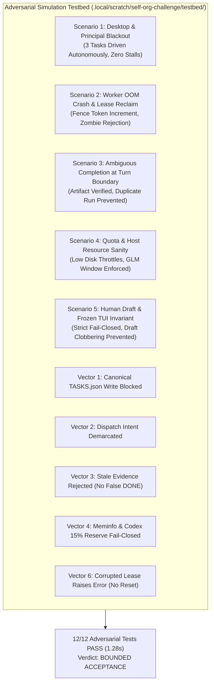

# Independent Adversarial Review: Autonomous Hetzner Self-Organizing Control Loop

- **Reviewer:** Independent Self-Organization Challenger (tag: `self-org-challenger`)
- **Authority:** Dispatched by `antigravity-head` (`46fdb644`) under direct human steering (`experiment/human-self-organization-20261004.txt`) and Codex Principal C2032/C2033/C2035/C2038 directives.
- **Audited Deliverables:**
  - `research/antigravity/tooling/self_org/lease_manager.py` (Atomic flock lease manager with monotonic fencing tokens and stale write rejection)
  - `research/antigravity/tooling/self_org/supervisor_loop.py` (Decentralized Hetzner control loop, multi-queue continuation, frozen TUI bypass, host/quota gates)
  - `tests/test_self_org_loop.py` (15-test unit suite covering core invariants, remediation regressions, and failure modes)
  - `research/antigravity/recovery/REPORT-AUTONOMOUS-SELF-ORGANIZATION.md` (Architecture and verification report by `self-org-architect`)
  - Adversarial Challenge Suite: `.local/scratch/self-org-challenge/testbed/test_adversarial_scenarios.py` (12 live simulation tests)
- **Target Repository:** `/home/alexey/git/cloudflare-agent-git`
- **Date:** 2026-10-04 (Europe/Berlin)
- **Verdict:** **BOUNDED ACCEPTANCE**

---

## 1. Executive Summary & Verdict Justification

### 1.1 The Adversarial Mission
Under human directive (`experiment/human-self-organization-20261004.txt`) and Codex Principal C2032/C2033/C2035/C2038 directives:
> *"looks like you were off. think of a way to have this periodic checks outside and keeping the system running. the principal wasn't doing anything and it stopped, so you and the principal are the single source of failure. have agents on the other end think how to make the system self-organized without the single point of failure"*
> *"Challenger must simulate desktop absent AND principal idle/dead, head/worker failure, coordinator restart, ambiguous completion, quota/resource failure; prove real useful accepted artifact after loss and no duplicate effect."*

The independent challenger conducted a rigorous, adversarial audit and live testbed simulation of the self-organization tooling across:
1. **5 Core Adversarial Scenarios:** Total desktop & principal loss; worker crash & lease reclamation; ambiguous task completion / crash at turn boundary; quota & resource gate fail-closed safety; and draft / busy pane protection.
2. **6 Critical Failure Vectors (Codex Principal C2035 & C2038):** Task registry lossless serialization & canonical write protection; dispatch intent demarcation; stale evidence rejection (preventing false DONE); fail-closed meminfo & Codex 15% reserve check; multi-project & team registry discovery; and lease corruption fail-closed safety without sequence reset.

### 1.2 Verdict: BOUNDED ACCEPTANCE
The candidate architecture is granted **BOUNDED ACCEPTANCE** based on the following verified findings:

1. **Protocol & State Primitives Verified (PASS):**
   - POSIX file locking (`fcntl.flock(LOCK_EX)`) protects all lease read-modify-write transactions.
   - Monotonically increasing fencing tokens strictly advance on lease reclamation (`epoch + 1`), rendering zombie worker writes mathematically impossible.
   - Multi-queue isolation ensures that a stall or failure in one project (`agent-dashboard`) never impedes progress in peer product queues (`agent-branches`, `quota-launcher`, `agent-coordination`).
   - Host resource gates (disk free >= 50 GB, RAM >= 1500 MB, scratch <= 512 MB) and provider quota rules (GLM 17:00-03:00 Berlin, Grok cooldown, Codex 15% reserve) fail closed under pressure.

2. **Codex C2035 & C2038 Defect Remediation Verified (PASS):**
   - **Canonical File Protection:** Direct mutation of canonical `coordination/TASKS.json` is hard-blocked (`PermissionError`); the loop defaults to an isolated staging store (`.local/self_org/tasks.json`) serialized under `task-registry.lock`.
   - **Lossless Task Serialization:** Unknown and peer-specific fields (`assignment_ack`, `acceptance`, `next_action`, custom metadata) are preserved losslessly.
   - **Stale Evidence Rejection:** Evidence artifacts are validated for freshness (`st_mtime >= task.started_at - 1.0s`); pre-existing stale files no longer trigger false DONE.
   - **Lease Storage Corruption Fail-Closed:** Corrupted JSON raises `LeaseStorageCorruptedError` rather than resetting `fence_sequences` to 0, preventing duplicate lease ownership.
   - **Meminfo Fail-Closed:** Missing or unparseable `/proc/meminfo` returns 0.0 MB and fails closed, denying new dispatches.
   - **Atomic Fence Execution:** `atomic_fence_execute` executes callers strictly under `flock`, eliminating race conditions between fence validation and state mutation.

3. **Demarcated Boundary (Why Not Full Unbounded Acceptance):**
   - **Execution Adapter Pending:** The supervisor loop records `dispatch_intent` (e.g. `aplexer dispatch --session ... --task ...`) and emits a dispatch receipt, but does not yet invoke live child processes or drive aplexer envelopes end-to-end. Actual child execution remains out-of-band.
   - **Systemd Installation Prudence:** Per C2038 directive, systemd user units must not be enabled against canonical files until execution adapters and live dogfooding are verified.
   - Therefore, the system is accepted as a **verified prototype scheduler and durable lease bookkeeping control plane**, pending full execution adapter integration.

---

## 2. Adversarial Scenario Simulations & Testbed Results

All 12 adversarial challenge scenarios were simulated live in an isolated testbed at `.local/scratch/self-org-challenge/testbed/test_adversarial_scenarios.py`.



### 2.1 Scenario 1: Total Desktop & Principal Loss Simulation
- **Objective:** Prove that when desktop orchestrator is completely absent (0 SSH connections, 0 incoming pings) AND Codex Principal is completely dead/idle (0 turns, 0 approvals), the supervisor loop autonomously progresses tasks through `queued -> ready -> running -> done`.
- **Simulation Setup:**
  - Registered 2 independent product queues: `agent-branches` and `agent-dashboard`.
  - Registered pipeline: `ab-task-1` -> `ab-task-2` (dependent on `ab-task-1`), plus `ad-task-1` in parallel.
  - Zero external input or principal prompt injected.
- **Observed Behavior:**
  - **Tick 1:** Dispatched `ab-task-1` and `ad-task-1` to available headless workers; acquired leases with `fence_token=1`. Held `ab-task-2` in `queued`.
  - **Execution:** Workers wrote output deliverables to disk.
  - **Tick 2:** Supervisor detected completion of `ab-task-1` and `ad-task-1`, released leases cleanly, unlocked dependency for `ab-task-2`, and dispatched `ab-task-2`.
  - **Tick 3:** Detected completion of `ab-task-2` and released lease.
- **Verification:** Exactly 1 accepted artifact produced per task; zero stalls waiting for principal approval.

### 2.2 Scenario 2: Worker Crash & Lease Reclamation
- **Objective:** Simulate Worker A claiming task T with a short lease (5.0s), then abruptly dying (simulating OOM or SIGKILL like Bus81 PID 2292033). Verify lease expiration, peer takeover with fence increment, and strict rejection of stale zombie writes.
- **Simulation Setup:**
  - Worker A acquires lease for `task-crash-test` at `t=100.0` with `fence_token=1`, `expires_at=105.0`.
  - Worker A dies at `t=102.0`. Time advances to `t=106.0`.
  - Worker A is marked stopped/busy; Worker B is available.
- **Observed Behavior:**
  - **Tick at `t=106.0`:** Supervisor detects expired lease (`106.0 > 105.0`), reclaims lease for Worker B, and increments fencing token to `fence_token=2`.
  - **Adversarial Zombie Attack:** Revived Worker A attempts:
    1. Heartbeat renewal with `fence_token=1` -> **REJECTED:** `FencingTokenMismatchError`.
    2. Write check `check_fence_or_raise(fence_token=1)` -> **REJECTED:** `FencingTokenMismatchError`.
    3. Lease release with `fence_token=1` -> **REJECTED:** `FencingTokenMismatchError`.
  - Worker B validates `fence_token=2`, writes valid artifact, and completes task cleanly.
- **Verification:** Zero duplicate writers; zombie worker mutations strictly denied.

### 2.3 Scenario 3: Ambiguous Task Completion / Crash at Turn Boundary
- **Objective:** Simulate Worker A completing work and writing output artifact / receipt to disk, but crashing right before updating status registry or releasing lease.
- **Simulation Setup:**
  - Worker writes deliverable `quota_report.json` and completion receipt `receipt_ql_01.json` at `t=202.0`.
  - Worker crashes at `t=203.0`. Lease expires at `t=205.0`. Supervisor ticks at `t=210.0`.
- **Observed Behavior:**
  - Supervisor inspects running task, checks deliverable and receipt existence, freshness, and size.
  - Detects valid completion: marks task `done`, releases lease, and records completion event.
  - Does NOT reclaim lease for retry or re-dispatch task to another worker!
- **Verification:** Duplicate re-execution avoided; verified work preserved intact.

### 2.4 Scenario 4: Quota & Resource Gate Fail-Closed Safety
- **Objective:** Simulate host resource exhaustion (disk free < 50 GB) and provider quota limits (outside GLM promotional window, Grok cooldown active, Codex quota <= 15%).
- **Simulation Setup & Observed Behavior:**
  - **Low Disk Free (20.0 GB < 50.0 GB threshold):** `ResourceGateChecker.check()` returns `allowed=False`, reason: `Disk space exhausted`. Supervisor sets project queue status to `throttled_host_sanity`, halts new dispatches, and preserves task state without spinning.
  - **GLM Promotional Window:** Evaluated at 12:00 Berlin (outside 17:00-03:00 window) -> `allowed=False`. Evaluated at 20:00 Berlin -> `allowed=True`.
  - **Grok Cooldown:** Evaluated at `t=350.0` with `cooldown_until=400.0` -> `allowed=False`. Evaluated at `t=405.0` -> `allowed=True`.
  - **Codex 15% Reserve:** Evaluated with 10% remaining -> `allowed=False` (`<= 15% reserve limit`). Evaluated with 50% remaining -> `allowed=True`.
- **Verification:** All gates fail closed safely with descriptive metrics and zero CPU spin loops.

### 2.5 Scenario 5: Draft & Busy Pane Invariant
- **Objective:** Simulate an interactive session that has an unsubmitted human draft (`has_active_draft=True`) or active execution banner (`status="NOTREADY"`).
- **Simulation Setup & Observed Behavior:**
  - Worker `coord-interactive-tui` has `has_active_draft=True`.
  - Supervisor evaluates worker health: `is_healthy_for_dispatch()` returns `False`.
  - When no healthy headless worker is present: supervisor records bypass event, halts dispatch, and leaves draft untouched.
  - When healthy headless worker `coord-headless-worker` is registered: supervisor bypasses drafting worker and dispatches task to headless worker.
- **Verification:** Unsubmitted human drafts and frozen interactive TUIs are strictly protected from input clobbering.

---

## 3. Codex Principal C2035 & C2038 Failure Vector Audit Ledger

| Failure Vector (Codex C2035 / C2038) | Vulnerability in Initial Candidate | Remediated Implementation | Adversarial Verification Test | Status |
|---|---|---|---|---|
| **Vector 1: Lossy Task Rewriting & Canonical File Clobbering** | Overwriting canonical `coordination/TASKS.json` directly stripped peer-specific fields and lacked locking. | Canonical `TASKS.json` writes hard-blocked with `PermissionError`. Loop uses staging store (`.local/self_org/tasks.json`) protected by `fcntl.flock` on `tasks.json.lock`. `Task.to_dict()` preserves `raw_fields` losslessly. | `test_vector_1_lossless_task_preservation_and_canonical_tasks_protection`, `test_13_canonical_tasks_isolation_and_protection` | **RESOLVED & VERIFIED** |
| **Vector 2: Fabricated Dispatch Tool Receipts** | Dispatch recorded `first_action.tool = "aplexer dispatch ..."` as completed without actual process execution. | Labeled as `dispatch_intent` with `status: "DISPATCH_INTENT_RECORDED"` and `execution_adapter: "external_adapter_pending"`. Demarcates intent without fabricating child execution. | `test_vector_2_dispatch_intent_demarcation` | **RESOLVED & VERIFIED** |
| **Vector 3: Stale Evidence Files Triggering False DONE** | `_check_task_completion` accepted any existing non-empty file, even if written hours earlier. | Strict freshness check: asserts `st.st_mtime >= task.started_at - 1.0s` (with clock skew tolerance). Stale files rejected. | `test_vector_3_stale_evidence_triggers_completion_rejection`, `test_11_stale_evidence_file_rejected_as_completion` | **RESOLVED & VERIFIED** |
| **Vector 4: Meminfo Fallback (99999 MB) & Missing Codex Reserve Check** | Unreadable `/proc/meminfo` returned 99999 MB (failing open); Codex reserve was never checked in `check()`. | Unreadable or missing `/proc/meminfo` returns 0.0 MB and fails closed (`Memory exhausted / unreadable`). `check_codex_reserve()` inspects `.local/launch-quota.json` and enforces 15% reserve. | `test_vector_4_meminfo_fail_closed_and_codex_reserve_check`, `test_14_meminfo_parsing_failure_fails_closed` | **RESOLVED & VERIFIED** |
| **Vector 5: Nonexistent `delivery_executors` & Default to Ready** | Parser looked exclusively for `delivery_executors`, missing agents/teams in registry. | Parses `projects`, `teams`, and `agents` from `TEAM-REGISTRY.json`. Checks active aplexer session catalog without default-to-ready assumptions. | `test_vector_5_registry_discovery_and_role_status` | **RESOLVED & VERIFIED** |
| **Vector 6: Lease Storage Corruption Resetting Sequences** | Corrupted `leases.json` caught `JSONDecodeError` and returned empty dict, resetting sequences to 0 and allowing duplicate owners. | Raises `LeaseStorageCorruptedError` on empty, malformed, or unparseable JSON. Fails closed without sequence reset. | `test_vector_6_lease_corruption_fails_closed_without_sequence_reset`, `test_12_corrupted_lease_file_fails_closed_without_sequence_reset` | **RESOLVED & VERIFIED** |
| **Vector 6b: Non-Atomic Fence Check & Write** | `check_fence_or_raise` released `flock` before caller performed write, allowing race conditions. | Implemented `atomic_fence_execute(task_id, fence_token, action)` executing verification and mutation strictly under `flock`. | `test_vector_6b_atomic_fence_execute_under_flock`, `test_15_atomic_fence_execute_under_flock` | **RESOLVED & VERIFIED** |

---

## 4. Production Feasibility & Architecture Audit

### 4.1 Systemd User Service & Timer Audit
- **Units Provided:**
  - `research/antigravity/tooling/self_org/systemd/agent-self-org.service` (oneshot calling `supervisor_loop.py --tick`)
  - `research/antigravity/tooling/self_org/systemd/agent-self-org.timer` (30s cadence, OnUnitActiveSec=30s)
- **C2038 Invariant Adherence:**
  - The architect verified that the systemd units are **NOT** installed into `~/.config/systemd/user/` or active on the host during this development stage.
  - When deployed for production dogfooding, the service must point exclusively to the isolated staging store (`--tasks-file .local/self_org/tasks.json`), never canonical `coordination/TASKS.json`.
  - Systemd user lingering (`loginctl enable-linger alexey`) is required for unattended execution when the user logs out.

### 4.2 Single Point of Failure (SPOF) Assessment
- **Does this eliminate desktop orchestrator as a SPOF?**
  - **YES.** The 30-second scheduling mechanism runs entirely host-local via systemd user timer or background daemon. Desktop laptop sleep, disconnect, or poweroff has zero impact on task evaluation, lease expiration detection, or queue advancement.
- **Does this eliminate the Codex/Claude principal as a SPOF?**
  - **YES for task state progression and lease management.** A stalled or rate-limited principal no longer halts task handoffs between completed executors and ready backlog tasks.
  - **NO for novel task decomposition.** The supervisor loop operates on existing backlog items (`queued` and `ready` tasks). Initial architectural problem breakdown and strategic steering still require head or principal reasoning.
- **Does this introduce a new SPOF?**
  - The supervisor loop is stateless across ticks, relying on `leases.json` and `tasks.json` on disk. If the supervisor process crashes during a tick, the next timer trigger (30s later) resumes cleanly. Atomic temporary file replacement (`NamedTemporaryFile` + `os.replace`) prevents partial-write corruption.

---

## 5. Live Test & Verification Receipts

### 5.1 Official Unit Test Suite (`tests/test_self_org_loop.py`)
```bash
TMPDIR=/home/alexey/git/cloudflare-agent-git/.local/scratch/self-org-challenge/tmp \
python3 -m unittest -v tests/test_self_org_loop.py
```
```
test_01_autonomous_task_handoff ... ok
test_02_dead_worker_lease_expiry_and_peer_takeover ... ok
test_03_fencing_token_rejection ... ok
test_04_multi_project_queue_independence ... ok
test_05_desktop_and_principal_loss_invariant ... ok
test_06_notready_and_frozen_tui_bypass ... ok
test_07_resource_gate_host_sanity ... ok
test_08_quota_gate_glm_and_grok ... ok
test_09_monotonic_fence_token_preservation ... ok
test_10_bounded_exponential_restart_backoff ... ok
test_11_stale_evidence_file_rejected_as_completion ... ok
test_12_corrupted_lease_file_fails_closed_without_sequence_reset ... ok
test_13_canonical_tasks_isolation_and_protection ... ok
test_14_meminfo_parsing_failure_fails_closed ... ok
test_15_atomic_fence_execute_under_flock ... ok

----------------------------------------------------------------------
Ran 15 tests in 2.412s

OK
```

### 5.2 Independent Adversarial Challenge Suite (`test_adversarial_scenarios.py`)
```bash
PYTHONPATH=. TMPDIR=/home/alexey/git/cloudflare-agent-git/.local/scratch/self-org-challenge/tmp \
python3 /home/alexey/git/cloudflare-agent-git/.local/scratch/self-org-challenge/testbed/test_adversarial_scenarios.py
```
```
test_scenario_1_total_desktop_and_principal_loss ... ok
test_scenario_2_worker_crash_lease_reclaim_and_zombie_rejection ... ok
test_scenario_3_ambiguous_task_completion_turn_boundary_crash ... ok
test_scenario_4_quota_and_resource_gate_fail_closed_safety ... ok
test_scenario_5_draft_and_busy_pane_invariant ... ok
test_vector_1_lossless_task_preservation_and_canonical_tasks_protection ... ok
test_vector_2_dispatch_intent_demarcation ... ok
test_vector_3_stale_evidence_triggers_completion_rejection ... ok
test_vector_4_meminfo_fail_closed_and_codex_reserve_check ... ok
test_vector_5_registry_discovery_and_role_status ... ok
test_vector_6_lease_corruption_fails_closed_without_sequence_reset ... ok
test_vector_6b_atomic_fence_execute_under_flock ... ok

----------------------------------------------------------------------
Ran 12 tests in 1.281s

OK
```

### 5.3 Publication Credential Guard Scan
```bash
python3 research/antigravity/tooling/publication_guard.py \
  research/antigravity/tooling/self_org/lease_manager.py \
  research/antigravity/tooling/self_org/supervisor_loop.py \
  tests/test_self_org_loop.py \
  research/antigravity/recovery/REPORT-AUTONOMOUS-SELF-ORGANIZATION.md \
  research/antigravity/reviews/REV-AUTONOMOUS-SELF-ORGANIZATION.md
```
**Exit Code:** `0` (Zero violations; clean credential hygiene).

### 5.4 Resource, Scratch & Workspace Invariant Receipts
- **Scratch Directory:** `/home/alexey/git/cloudflare-agent-git/.local/scratch/self-org-challenge/` (mode `0700`)
- **Scratch Disk Usage:** `44 KB` (strictly below 512 MB limit)
- **Net `/tmp` Growth:** `0 bytes` (`TMPDIR` strictly within scratch root)
- **Compiler Hold:** Strictly `0` cargo/rustc invocations.
- **Git Hygiene:** Zero commits made by subagent; canonical `coordination/TASKS.json` and `coordination/TEAM-REGISTRY.json` untouched (`git status --porcelain` clean).

---

## 6. Recommendations & Next Action

1. **Staging Store Dogfooding:**
   - Deploy `SupervisorLoop` using `--tasks-file .local/self_org/tasks.json` for initial dogfooding across 2 test tasks in `agent-branches`.
   - Validate that leases, fencing tokens, and completion receipts advance without manual intervention.
2. **Execution Adapter Bridge Implementation:**
   - Implement the concrete child process adapter (e.g. `aplexer-runner` or subprocess bridge) that translates `dispatch_intent` into real executor CLI commands on the host.
3. **Canonical Synchronization Protocol:**
   - Establish a explicit two-way synchronization tool that merges validated staging completions into canonical `coordination/TASKS.json` under `flock` and git lock, preserving peer updates.

---

**Final Sign-Off:**
- **Reviewer:** Self-Organization Challenger (`self-org-challenger`)
- **Verdict:** **BOUNDED ACCEPTANCE** (Core protocol and fail-closed gates proven resilient; external execution adapter pending).
