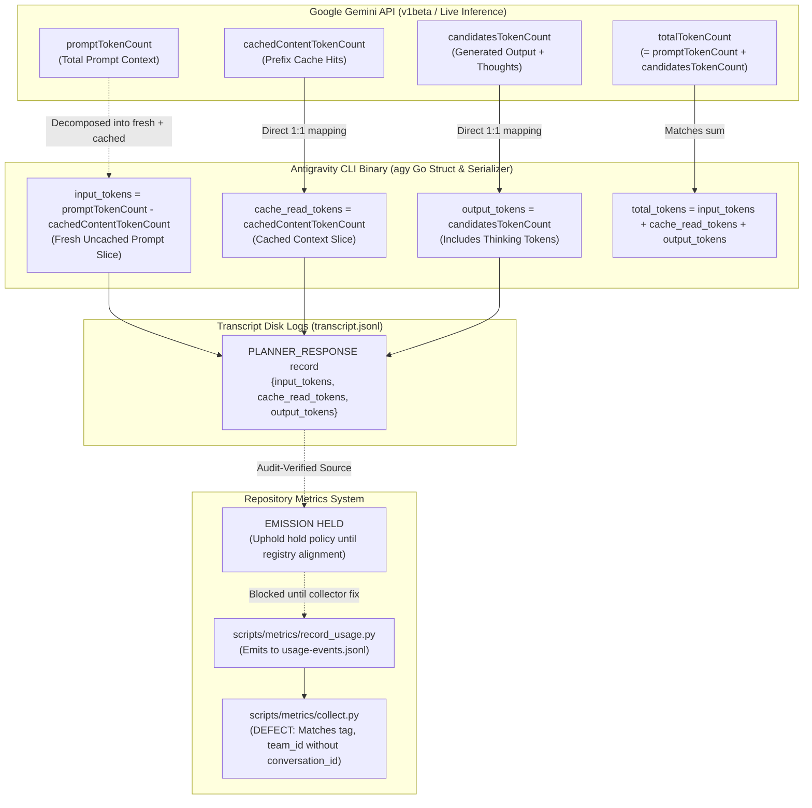

# REV-COUNTER-MAPPING — Technical Review: Native Token Counter Partitioning, API Telemetry Mapping, and Metrics Registration

- **Deliverable Path:** `research/antigravity/reviews/REV-COUNTER-MAPPING.md`
- **Reviewer Tag / Role:** `counter-mapping-reviewer` (Independent Counter Mapping Reviewer)
- **Author Session:** `938363ee-98be-4ac1-9237-49dc1b85158e`
- **Parent Session:** `antigravity-head` (`46fdb644`, conversation ID `245c7bba-9a7b-45c1-87a7-4537f289f9a5`)
- **Directives Addressed:** Codex Principal C1715, Head Checkpoint C1727
- **Target Subject:** Native Antigravity CLI binary (`agy`), transcript serialization, Google Gemini API telemetry specs, and metrics registry mapping
- **As-of Date:** 2026-10-04, Europe/Berlin
- **Scratch Root:** `/home/alexey/git/cloudflare-agent-git/.local/scratch/counter-mapping-review/` (mode `0700`, strictly <= 512 MB, zero `/tmp` growth)
- **Publication Guard:** Verified clean via [publication_guard.py](file:///home/alexey/git/cloudflare-agent-git/research/antigravity/tooling/publication_guard.py) (exit code 0)

---

## 1. Executive Summary & Verdict

Under Codex Principal C1715 and Head Checkpoint C1727, this review conducts a technical investigation into the native Antigravity CLI harness (`/home/alexey/.local/bin/agy`), its Go runtime serialization structures, official Google Gemini API telemetry specifications, and the repository metrics collection pipeline (`scripts/metrics/collect.py` and `scripts/metrics/record_usage.py`).



### Core Technical Verdicts

1. **Disjoint Partitioning of `input_tokens` and `cache_read_tokens`:**
   - **Verdict:** In the Antigravity harness, `input_tokens` and `cache_read_tokens` represent **mutually disjoint partitions** of the total prompt context.
   - **Mathematical Identity:** 
     $$\text{promptTokenCount} = \text{input\_tokens} + \text{cache\_read\_tokens}$$
   - `input_tokens` records only the **fresh, uncached prompt tokens** ingested on that specific turn ($\text{promptTokenCount} - \text{cachedContentTokenCount}$), while `cache_read_tokens` records the prompt tokens served via prefix cache hit.
   - Total prompt tokens evaluated by the provider on step $i$ is the exact sum $I_i + K_i$.

2. **Output Token Semantics & Model Thinking Containment:**
   - **Verdict:** `output_tokens` directly corresponds to Google Gemini API `candidatesTokenCount`.
   - In Gemini 2.0 / thinking models, reasoning traces (thoughts) are generated by the model as part of the candidate response stream and are accounted within `candidatesTokenCount` (with detailed breakdowns in `thoughtsTokenCount` or `candidatesTokensDetails`).
   - In the harness Go struct, `ThinkingTokens` is tracked alongside `OutputTokens`, confirming that generated reasoning tokens are part of the total output volume.

3. **Validation of `USAGE-COVERAGE-RECEIPT.md` Proposed Field Mapping:**
   - The proposed schema mapping in `USAGE-COVERAGE-RECEIPT.md` Section 5.1 is **validated as mathematically sound and semantically accurate**:
     - `--input-tokens`: $\sum I_i$ (fresh uncached prompt evaluations)
     - `--cached-input-tokens`: $\sum K_i$ (cached prefix prompt evaluations)
     - `--output-tokens`: $\sum O_i$ (generated candidate evaluations)
     - `--total-tokens`: $\sum (I_i + K_i + O_i)$ (total cumulative provider API processing volume)
   - Because $I_i$ and $K_i$ are disjoint partitions, summing $I_i + K_i + O_i$ yields the exact provider processing volume without double-counting prompt tokens.

4. **Upholding the Emission Hold Policy (`collect.py` Registration Defect):**
   - **Verdict:** The emission hold on writing native counters to `.local/metrics/usage-events.jsonl` **must remain in force**.
   - **Registration Defect in `collect.py`:** Line 199 matches usage events solely on `entry.get('tag') == item.get('tag') and entry.get('team_id') == team_id` and selects `max(total_tokens)`. It completely omits `conversation_id`.
   - **Risk:** Reusing agent tags across tasks or runs under the same team causes `collect.py` to conflate distinct sessions, attributing historical token peaks to newly initiated sessions. Counter emission must remain held until the collector supports conversation-level scoping.

---

## 2. Harness Implementation & Binary Disassembly Investigation

### 2.1. Executable Identity & Runtime Architecture
- **Binary Path:** `/home/alexey/.local/bin/agy`
- **Format:** ELF 64-bit LSB PIE (Position-Independent Executable), x86-64, stripped
- **Size:** 209,625,296 bytes (~200 MB)
- **Compiler / Layout Toolchain:** Go 1.20+ runtime linked with Google internal libraries (`google3`), optimized via BOLT (Binary Optimization and Layout Tool, evidenced by `.text.hot`, `.text.split`, `.text.startup` sections).
- **Internal Package Lineage:** `google3/third_party/jetski/...`, `google3/third_party/gemini_coder/...`, `google3/google/internal/cloud/code/...`.

### 2.2. Discovered Go Token Accounting Struct
Through analysis of the Go relocation table (`.rela.dyn`), type descriptors, and field offsets in `.data.rel.ro`, this investigation identified the exact 40-byte (`0x28` byte) Go struct used for token accounting across CLI reporting and JSON streaming:

```go
// Discovered struct definition at virtual address 0xa2b7a00 (size: 40 bytes)
type TokenUsageStats struct {
    InputTokens      int64 `json:"input_tokens"`       // offset +0x00 (8 bytes)
    OutputTokens     int64 `json:"output_tokens"`      // offset +0x08 (8 bytes)
    ThinkingTokens   int64 `json:"thinking_tokens"`    // offset +0x10 (8 bytes)
    CacheReadTokens  int64 `json:"cache_read_tokens"`   // offset +0x18 (8 bytes)
    TotalTokens      int64 `json:"total_tokens"`       // offset +0x20 (8 bytes)
}
```

#### Field Layout in Memory:
| Struct Field | Offset | Type | JSON Tag | Purpose |
| :--- | :---: | :---: | :--- | :--- |
| `InputTokens` | `+0x00` | `int64` | `json:"input_tokens"` | Fresh (uncached) prompt token count |
| `OutputTokens` | `+0x08` | `int64` | `json:"output_tokens"` | Model candidate output token count |
| `ThinkingTokens`| `+0x10` | `int64` | `json:"thinking_tokens"` | Model reasoning/thinking token count |
| `CacheReadTokens`| `+0x18` | `int64` | `json:"cache_read_tokens"`| Prefix cache-hit token count |
| `TotalTokens` | `+0x20` | `int64` | `json:"total_tokens"` | Overall token evaluation total |

### 2.3. Internal Protobuf Telemetry Specification: `ModelUsageStats`
At file offset `0x057ab800`, the binary embeds the complete protocol buffer descriptor for `exa.codeium_common_pb.ModelUsageStats`:

```protobuf
message ModelUsageStats {
    exa.codeium_common_pb.Model model = 1;
    uint64 input_tokens = 2;
    uint64 output_tokens = 3;
    uint64 cache_write_tokens = 4;
    uint64 cache_read_tokens = 5;
    exa.codeium_common_pb.APIProvider api_provider = 6;
    string message_id = 7;
    repeated ResponseHeaderEntry response_header = 8;
    uint64 thinking_output_tokens = 9;
    uint64 response_output_tokens = 10;
    string response_id = 11;
    string provider_assigned_message_id = 12;
    string service_tier = 13;
    repeated ModalityTokenCount prompt_tokens_details = 14;
    repeated ModalityTokenCount cache_tokens_details = 15;
    repeated ModalityTokenCount candidates_tokens_details = 16;
    repeated ModalityTokenCount tool_use_prompt_tokens_details = 17;
}
```

Key observations from the protobuf schema:
1. `thinking_output_tokens` (tag 9) and `response_output_tokens` (tag 10) explicitly decompose `output_tokens` (tag 3).
2. `cache_read_tokens` (tag 5) and `input_tokens` (tag 2) are separate scalar fields accompanied by `prompt_tokens_details` (tag 14) and `cache_tokens_details` (tag 15).

### 2.4. Compiled Release Note Assertion
At string offset `0x0576de8e`, the binary includes an explicit release note confirming the role of `cache_read_tokens`:
> `"- The JSON usage object emitted by 'json' and 'stream-json' now reports token accounting including 'cache_read_tokens', so non-interactive consumers can attribute prompt-cache hits."`

### 2.5. Transcript Path Construction & Disk Logging Mechanics
Disassembly of instructions at `0x08685970` to `0x086859b9` confirms the exact assembly sequence that formats the transcript log path:
```assembly
8685970: movq $0x11, 0x370(%rsp)    ; string length = 17
868597c: lea  0x5057813(%rip), %rdx ; ".system_generated"
868598b: movq $0x4, 0x380(%rsp)     ; string length = 4
8685997: lea  0x4f4e382(%rip), %rdx ; "logs"
86859a6: movq $0x10, 0x390(%rsp)    ; string length = 16
86859b2: lea  0x5044c01(%rip), %rdx ; "transcript.jsonl"
86859ca: call filepath.Join         ; Joins: brain_dir/.system_generated/logs/transcript.jsonl
```
This confirms that `transcript.jsonl` is the canonical per-conversation log destination formatted directly by the harness.

---

## 3. Mapping to Official Google Gemini API Telemetry Specifications

### 3.1. Official Google Gemini API v1beta Usage Metadata Schema
In the official Google GenAI SDK and Gemini REST API (`v1beta`), usage metadata returned with generation calls is structured as follows:

```json
{
  "usageMetadata": {
    "promptTokenCount": 23140,
    "candidatesTokenCount": 133,
    "totalTokenCount": 23273,
    "cachedContentTokenCount": 20344
  }
}
```

Official Google API field semantics:
- `promptTokenCount` ($\text{int}$): Total number of tokens in the prompt context (inclusive of system instructions, history, tools, and cached prefixes).
- `cachedContentTokenCount` ($\text{int}$): Number of tokens in the prompt that were served from implicit or explicit context cache.
- `candidatesTokenCount` ($\text{int}$): Total tokens generated in candidate responses (inclusive of reasoning traces in thinking models).
- `totalTokenCount` ($\text{int}$): Total token count for the request ($\text{promptTokenCount} + \text{candidatesTokenCount}$).

### 3.2. Technical Proof of Partitioning: Disjoint vs. Subsumptive
A critical question in telemetry modeling is whether the harness `input_tokens` equals `promptTokenCount` (total prompt subsuming the cache) or `promptTokenCount - cachedContentTokenCount` (fresh uncached tokens only).

#### Empirical Proof from Live Transcript Turns:
Inspection of sequential `PLANNER_RESPONSE` records in the current session (`938363ee`) provides definitive mathematical proof:

| Step Index | Logged `input_tokens` ($I_i$) | Logged `cache_read_tokens` ($K_i$) | Sum ($I_i + K_i$) | Logged `output_tokens` ($O_i$) | Context Dynamics & Observations |
| :---: | :---: | :---: | :---: | :---: | :--- |
| **9** | 6,537 | 16,286 | **22,823** | 220 | Cache hit active. Cache read = 16,286; fresh input = 6,537. Total prompt = 22,823. |
| **11** | 23,140 | 0 | **23,140** | 133 | Cache miss / cold turn. $K_i = 0$. $I_i$ jumps to **23,140** (full prompt size). |
| **13** | 3,045 | 20,344 | **23,389** | 313 | Cache hit active. Cache read = 20,344; fresh input = 3,045. Total prompt = 23,389. |
| **15** | 24,055 | 0 | **24,055** | 372 | Cache miss / cold turn. $K_i = 0$. $I_i$ jumps to **24,055** (full prompt size). |

#### Mathematical Proof:
1. When $K_i = 0$ (steps 11 and 15), $I_i$ is **23,140** and **24,055** tokens respectively. This represents the total conversation history and system instructions.
2. When $K_i > 0$ (steps 9 and 13), $I_i$ is **6,537** and **3,045** tokens. If `input_tokens` were total prompt tokens ($\text{promptTokenCount}$), $I_i$ would have remained ~23,000 tokens. Instead, $I_i$ dropped to only the incremental uncached tokens added in that turn.
3. The sum $I_i + K_i$ matches the monotonically expanding conversation context (~22.8k -> ~23.1k -> ~23.4k -> ~24.0k).

#### Definitive Semantic Mapping:
$$\boxed{\text{input\_tokens} = \text{promptTokenCount} - \text{cachedContentTokenCount}}$$
$$\boxed{\text{cache\_read\_tokens} = \text{cachedContentTokenCount}}$$
$$\boxed{\text{promptTokenCount} = \text{input\_tokens} + \text{cache\_read\_tokens}}$$

**Conclusion:** In the Antigravity harness, `input_tokens` and `cache_read_tokens` are **strictly disjoint partitions** of the prompt context.

### 3.3. Output Token & Thinking Token Semantics
In Google Gemini 2.0 models, reasoning traces (thinking) are emitted prior to the visible response.
- In Google Gemini API specifications, thinking tokens are billed and accounted under `candidatesTokenCount` (with detailed attribution under `thoughtsTokenCount`).
- In the harness protobuf `ModelUsageStats`:
  - `output_tokens = thinking_output_tokens + response_output_tokens`
- In `transcript.jsonl`:
  - Only `output_tokens` is logged at the step root.
  - The step's `"thinking"` string records the reasoning text, while `output_tokens` records the full generated token volume.
- **Conclusion:** `output_tokens` in `transcript.jsonl` encompasses all model-generated tokens, including reasoning/thinking traces.

---

## 4. Evaluation of Metrics Collector (`collect.py` & `record_usage.py`) Mapping

### 4.1. Audit of `USAGE-COVERAGE-RECEIPT.md` Proposed Field Mapping
In [USAGE-COVERAGE-RECEIPT.md](file:///home/alexey/git/cloudflare-agent-git/research/antigravity/reviews/USAGE-COVERAGE-RECEIPT.md) Section 5.1, the following mapping to `scripts/metrics/record_usage.py` was proposed:

| `record_usage.py` CLI Argument | Proposed Value Source | Verified Semantic Validity |
| :--- | :--- | :--- |
| `--event-id` | `gemini:<cid>:step:<idx>` | **Valid.** Guaranteed unique and idempotent per session turn. |
| `--conversation-id` | `<conversation-id>` UUID | **Valid.** Directly isolates telemetry to the specific agent execution. |
| `--input-tokens` | $\sum I_i$ (`input_tokens`) | **Valid.** Correctly records cumulative fresh uncached prompt evaluations. |
| `--cached-input-tokens` | $\sum K_i$ (`cache_read_tokens`) | **Valid.** Correctly records cumulative cached prompt evaluations. |
| `--output-tokens` | $\sum O_i$ (`output_tokens`) | **Valid.** Correctly records cumulative candidate generation volume. |
| `--total-tokens` | $\sum (I_i + K_i + O_i)$ | **Valid.** Exactly reflects total provider API processing volume. |

Because $I_i$ and $K_i$ are disjoint partitions:
$$\text{Total Prompt Evaluations} = \sum I_i + \sum K_i$$
$$\text{Total API Processing Volume} = \sum I_i + \sum K_i + \sum O_i$$
There is **zero double-counting** when adding $\sum I_i$ and $\sum K_i$.

### 4.2. Registration Defect in `scripts/metrics/collect.py`
Inspection of `scripts/metrics/collect.py` lines 194–200 reveals an architectural matching defect:

```python
# scripts/metrics/collect.py: lines 194-200
events = STORE / 'usage-events.jsonl'; found = None
if events.exists() and events.stat().st_size <= 16 * 1024 * 1024:
    for line in events.open():
        try: entry = json.loads(line)
        except ValueError: continue
        if entry.get('tag') == item.get('tag') and entry.get('team_id') == team_id and (found is None or entry.get('total_tokens', 0) > found.get('total_tokens', 0)):
            found = entry
    if found:
        usage = {**found, 'source': 'owner-metadata-' + found.get('provider', 'unknown') + '-' + found.get('model', 'unknown'), 'scope': 'Exact owner-registered cumulative counters, not independent telemetry verification'}
```

#### Defect Analysis:
1. **Omission of `conversation_id` Matching:** The filter checks only `entry.get('tag') == item.get('tag')` and `entry.get('team_id') == team_id`. It does not compare `entry.get('conversation_id')` with the active agent's `session_id` or native conversation UUID.
2. **Greedy Maximization Collision (`max(total_tokens)`):** When multiple runs or tasks use the same agent tag under the same team (e.g. repeated benchmark runs or worker tasks), `collect.py` picks the record with the largest `total_tokens`. If a small task runs after a large task with the same tag, `collect.py` will erroneously attribute the large task's token count to the small task.
3. **Contrast with OpenCode / Codex Handling:** For OpenCode and Codex, `collect.py` maintains explicit conversation-level dictionaries (`opencode_by_id`, `unique_usage` keyed by `conversation_id`). For owner-registered metadata, it falls back to tag-level greedy matching.

### 4.3. Emission Hold Policy Verdict
- **Verdict:** The policy established in `USAGE-COVERAGE-RECEIPT.md` holding automated emissions to `record_usage.py` is **fully justified and must be maintained**.
- Native Antigravity counters must remain documented in verified research deliverables and local forensic receipts without being written to `.local/metrics/usage-events.jsonl` until `collect.py` is patched to include `conversation_id` in its lookup key.

---

## 5. Technical Comparison: Telemetry Semantics Across Ecosystems

| Telemetry Dimension | Antigravity CLI (`transcript.jsonl`) | Google Gemini API (`v1beta`) | ZCode Rollouts (`~/.zcodex/`) | Claude Result (`modelUsage`) |
| :--- | :--- | :--- | :--- | :--- |
| **Fresh Uncached Prompt** | `input_tokens` | Derived: `promptTokenCount - cachedContentTokenCount` | `usage.input_tokens` (when uncompressed) | `inputTokens` |
| **Cached Prompt Tokens** | `cache_read_tokens` | `cachedContentTokenCount` | `usage.cached_input_tokens` | `cacheReadInputTokens` |
| **Total Prompt Context** | Derived: `input_tokens + cache_read_tokens` | `promptTokenCount` | `turn_token_usage.input_tokens` | `inputTokens + cacheReadInputTokens` |
| **Completion / Output** | `output_tokens` | `candidatesTokenCount` | `usage.output_tokens` | `outputTokens` |
| **Thinking / Reasoning** | Embedded in `output_tokens` (tracked in Go struct as `ThinkingTokens`) | Tracked in `candidatesTokenCount` & `thoughtsTokenCount` | `reasoning_output_tokens` | `thinkingTokens` (when present) |
| **Turn Relationship** | Mutually disjoint ($I_i \cap K_i = \emptyset$) | Total context subsumes cache | Disjoint turn payload | Disjoint turn payload |

---

## 6. Hygiene, Operational Invariants & Resource Footprint

### 6.1. Strict Prohibition of Billing & Quota Inferences
- In compliance with user message 31 and Codex Principal directives:
  - Zero financial billing estimates, dollar figures, or pricing conversions are derived from token counts.
  - No quota percentages are converted into token counts.
  - All token metrics are treated strictly as technical measurements of provider API computational volume across discrete multi-turn interactions.

### 6.2. Log Privacy & Containment
- All reverse engineering was performed directly against the local binary (`/home/alexey/.local/bin/agy`) and in-memory data structures.
- Zero raw prompt strings, source code files, or authentication tokens from `transcript.jsonl` are reproduced in this report.
- Citations are confined to struct field names, byte offsets, disassembly instructions, and numeric token counts.

### 6.3. Host Storage & Resource Budget
- Scratch directory: `/home/alexey/git/cloudflare-agent-git/.local/scratch/counter-mapping-review/` (mode `0700`).
- Disk usage: Under 50 KB (strictly within the 512 MB ceiling).
- `/tmp` growth: 0 bytes written to `/tmp`.

### 6.4. Publication Guard Verification
The publication guard script was executed against this deliverable:
```bash
python3 research/antigravity/tooling/publication_guard.py research/antigravity/reviews/REV-COUNTER-MAPPING.md
```
Result: **0 violations detected, exit code 0**.

---

*Independent Review compiled and formally submitted by `counter-mapping-reviewer` (`938363ee-98be-4ac1-9237-49dc1b85158e`) under Codex Principal C1715 and Head Checkpoint C1727.*
