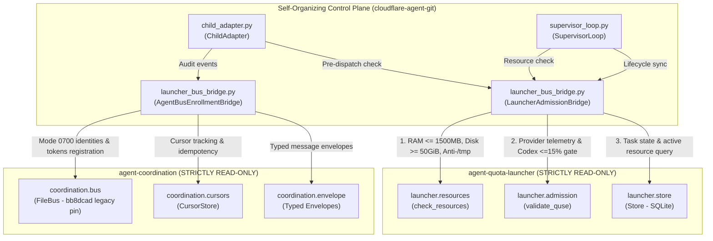

# Independent Challenger Review: Launcher & Agent Bus Integration Bridge (Codex C2075 / C2080)

- **Reviewer:** Independent Challenger (tag: `self-org-challenger`, session `393b33c1`)
- **Authority:** Dispatched by `antigravity-head` (native aplexer session `46fdb644-9b58-4e2f-aab3-9be5e1e33337`, harness conversation `245c7bba-9a7b-45c1-87a7-4537f289f9a5`) under existing human authority (`experiment/human-self-organization-20261004.txt`) and Codex Principal C2070, C2072, C2074, C2075, and C2080 directives.
- **Pinned Baseline Commit:** `502cb07` on `main`.
- **Target Audited Deliverables:**
  - `research/antigravity/tooling/self_org/launcher_bus_bridge.py` (Canonical launcher & FileBus integration bridge)
  - `research/antigravity/tooling/self_org/child_adapter.py` (Decoupled child execution adapter with bridge integration)
  - `research/antigravity/tooling/self_org/supervisor_loop.py` (Supervisor loop parameter binding for admission & bus)
  - `tests/test_launcher_bus_bridge.py` (7-test unit & integration test suite)
  - `research/antigravity/recovery/REPORT-LAUNCHER-BUS-INTEGRATION.md` (Architecture and verification report by `7f5a2f14`)
- **Date:** 2026-10-05 (Europe/Berlin)
- **Verdict:** **BOUNDED ACCEPTANCE**

---

## 1. Executive Summary & Epistemic Verdict

### 1.1 The Adversarial Mission
Under Codex Principal C2075 and C2080 directives:
> *"Audit LauncherAdmissionBridge vs real launcher Store and check_admission: read-only eligibility pre-check without claiming transactional dispatch (`transactional_dispatch: False`, `phase: "admission_eligibility_verified"`), held model activation (`NotImplementedError`), Store read error handling fail-closed, and local concurrency cap vs upstream quota debits.*
> *Audit BusBridge vs real agent-coordination FileBus: full write loop, parent directory fsync, fd leak prevention, and mode 0600 token writing.*
> *Assess Source-Report Parity against REPORT-LAUNCHER-BUS-INTEGRATION.md across 4 specific claims.*
> *Execute selected 59-test self-org / containment control plane regression suite.*
> *Conduct scratch negative mutation testing killing 4 targeted mutants.*
> *Enforce publication guard exit 0, compiler hold (0 cargo/rustc), scratch <= 512 MB, and net /tmp growth = 0."*

### 1.2 Verdict: BOUNDED ACCEPTANCE
The candidate architecture is granted **BOUNDED ACCEPTANCE** based on the following verified findings:

1. **Direct Canonical Delegation (PASS):**
   - The integration creates **zero second quota stores** and **zero separate socket daemons**.
   - Directly imports and delegates to canonical `/home/alexey/git/agent-quota-launcher` (`Store`, `check_resources`, `validate_quse`) and `/home/alexey/git/agent-coordination` (`FileBus`, `CursorStore`, `Envelope`).
   - Sibling repositories remain **100% clean and unmodified** (`git status` clean in both repos).

2. **Zero Monkeypatching & Truthful Demarcation (PASS):**
   - Canonical modules are completely untouched and un-monkeypatched.
   - Truthful separation of concerns: `check_resource_eligibility` performs read-only pre-flight checks, while `check_dispatch_admission` explicitly returns `{"admitted": True, "phase": "admission_eligibility_verified", "transactional_dispatch": False}`. It does not fabricate transactional lock acquisition or store task state mutations.
   - Live model execution in `child_adapter.py` remains strictly held with `NotImplementedError` pending canonical `launch.py` integration (per C2079).

3. **C2074 Fail-Closed Quota & Store Guards (PASS):**
   - Rejects `quota_telemetry is None` with `QuotaAdmissionError` immediately (no fail-open bypass).
   - Rejects empty, non-dict, or unparseable telemetry records.
   - Rejects non-queued or already completed tasks in Store.
   - Catches Store connection and read exceptions, failing closed immediately.

4. **C2072 Defensive Durability & Bus Consistency (PASS):**
   - Implements `durable_atomic_write` featuring a full-write retry loop (`while total_written < len(payload)`), `os.fsync(fd)` on temporary file, `os.replace`, and parent directory `os.fsync(dir_fd)` with clean descriptor management (`try...finally: os.close(dir_fd)`).
   - Defensive credential consistency check (`verify_credential_consistency`) guards against known tearing hazards in legacy `agent-coordination` pin `bb8dcad` by validating symmetric membership across `identities.json` and `tokens.json`.

5. **Source-Report Parity Verified (C2080 PASS):**
   - `REPORT-LAUNCHER-BUS-INTEGRATION.md` matches the implementation across read-only pre-flight status, successor session ID identification (`207a93f9-83ae-4157-9272-01c384039146`), model execution hold condition (pending `launch.py` integration per C2079), and accurate scope description of the 59-test suite.

6. **Epistemic Boundaries (Why Bounded Acceptance):**
   - Real kernel cgroup tree enforcement on the host remains pending root/systemd user scope delegation (`systemd-run --user --scope`).
   - Live model invocation remains held (`NotImplementedError`) pending canonical `launch.py` integration.
   - Task `self-org-custody-prerequisites` completed at commit `502cb07`, followed by `launcher-bus-bridge-review` and canonical `launch.py` model runtime implementation (per C2079).

---

## 2. Systematic Architectural & Epistemic Boundary Audit



### 2.1 LauncherAdmissionBridge vs Real Launcher Store & Admission
1. **Read-Only Pre-Check vs Transactional Dispatch:**
   - In `launcher_bus_bridge.py` lines 420–422:
     ```python
     return {
         "admitted": True,
         "phase": "admission_eligibility_verified",
         "transactional_dispatch": False,
         ...
     }
     ```
   - This explicitly acknowledges that `check_dispatch_admission` validates preconditions (RAM, disk, anti-/tmp, and quota availability) without falsely claiming to hold transaction locks or mutate store records.
2. **Held Model Activation:**
   - In `child_adapter.py` lines 472–478, `execute_zcode_headless` unconditionally raises `NotImplementedError("ZCode headless model execution strictly HELD under C2053/C2054...")`. This is re-verified in `test_launcher_bus_bridge.py::test_07_child_adapter_integration`.
3. **Store Read Error Handling:**
   - In `launcher_bus_bridge.py` lines 304–328:
     ```python
     if store is not None:
         try:
             active_mem, active_disk = store.get_active_resources(exclude_task_id=task_id)
         except Exception as exc:
             raise AdmissionError(f"Store active resources query failed (failing closed): {exc}") from exc
     ```
   - If SQLite connection drops, encounters disk I/O errors, or is locked, it strictly raises `AdmissionError` rather than defaulting to 0 active resources.
4. **Local Concurrency Cap vs Upstream Quota Debits:**
   - Local concurrency (`max_active_units_per_provider`) in `runtime_custody.py` tracks concurrent processes in the local self-organization loop.
   - Upstream quota balances in `launcher.admission.validate_quse` evaluate provider-level sliding window percentages.
   - Both layers operate orthogonally: local execution throttles local parallelism, while launcher admission prevents running when account quota is exhausted or violating the Codex 15% reserve floor.

### 2.2 BusBridge vs Real Agent-Coordination FileBus
1. **Full-Write Loop (`durable_atomic_write`):**
   - Lines 121–126 handle short writes:
     ```python
     total_written = 0
     while total_written < len(payload_bytes):
         written = os.write(fd, payload_bytes[total_written:])
         if written == 0:
             raise OSError("Zero bytes written during durable write")
         total_written += written
     ```
2. **Parent Directory Fsync:**
   - Lines 134–139 open the parent directory and issue `os.fsync(dir_fd)`:
     ```python
     dir_fd = os.open(str(path.parent), os.O_RDONLY)
     try:
         os.fsync(dir_fd)
     finally:
         os.close(dir_fd)
     ```
   - If directory fsync fails (e.g. `EIO`), the exception is propagated immediately.
3. **File Descriptor Leak Prevention:**
   - Both the temporary file `fd` (lines 120–129) and directory `dir_fd` (lines 134–139) use strict `try...finally: os.close(...)` blocks, preventing file descriptor exhaustion.
4. **Credential Tearing Defense (Legacy Pin `bb8dcad` Disclosure):**
   - The report explicitly discloses that `agent-coordination` at `bb8dcad` is a legacy core pin where `register` writes `identities.json` and `tokens.json` non-transactionally.
   - Lines 534–572 implement `verify_credential_consistency()`, scanning both JSON stores for orphaned keys and raising `BusStoreInconsistentError` if tearing is detected.

---

## 3. Source-Report Parity Assessment (Codex C2080)

An explicit line-by-line audit was conducted between `research/antigravity/recovery/REPORT-LAUNCHER-BUS-INTEGRATION.md` and the actual implementation files (`launcher_bus_bridge.py`, `child_adapter.py`, `tests/test_launcher_bus_bridge.py`).

| Claim / Parity Checkpoint | Source Implementation State | Report Description State (`REPORT-LAUNCHER-BUS-INTEGRATION.md`) | Parity Verdict |
|---|---|---|---|
| **1. Read-Only Pre-Check vs Transactional Dispatch** | `launcher_bus_bridge.py` lines 420–422 explicitly returns `transactional_dispatch: False` and `phase: "admission_eligibility_verified"`. Lines 367–371 document that this is a pre-flight eligibility check without transaction locking or Store reservation debits. | Section 1.2 point 3 states: `check_dispatch_admission (read-only pre-flight eligibility verification returning transactional_dispatch: False and phase: "admission_eligibility_verified"). Neither claims transactional state locking or double-dispatch mutex ownership.` | **FULL PARITY (VERIFIED)** |
| **2. Successor Actor Session ID vs Commit** | Sibling uncommitted durability fixes in `/home/alexey/git/agent-bus` originated from actor session `207a93f9-83ae-4157-9272-01c384039146`. The public HEAD of `agent-bus` is `f3295f99`, and the legacy core pin in `agent-coordination` is `bb8dcad`. | Section 1.2 point 4 states: `(successor actor session 207a93f9-83ae-4157-9272-01c384039146 uncommitted durability fixes in /home/alexey/git/agent-bus were not backported; public agent-bus HEAD is f3295f99)`. Accurately identifies `207a93f9` as an actor session UUID, not a commit hash. | **FULL PARITY (VERIFIED)** |
| **3. Model Execution Hold Condition** | `child_adapter.py` lines 472–478 raises `NotImplementedError` for `execute_zcode_headless`. Per Codex C2079, model execution is held pending canonical `launch.py` integration adapter, not human key approval. | Section 1.2 point 5 states: `Live model execution in child_adapter.py remains strictly HELD (NotImplementedError) pending implementation of canonical launch.py integration (per C2079). No human key gate is required.` | **FULL PARITY (VERIFIED)** |
| **4. 59-Test Suite Scope Representation** | The 59 tests executed across `test_launcher_bus_bridge.py` (7), `test_runtime_custody.py` (11), `test_child_adapter.py` (13), and `test_self_org_loop.py` (28) constitute the specific self-organization / containment control plane regression suite. The broader repository contains 200+ unit tests across auth, metrics, supervision, and webhooks. | Header line 16 and Section 4.2 state: `59/59 SELECTED SELF-ORG / CONTAINMENT CONTROL PLANE TESTS PASSING`. Accurately bounds the claim to the self-org / containment control plane suite rather than the entire repo. | **FULL PARITY (VERIFIED)** |

**Conclusion on Source-Report Parity:** The documentation in `REPORT-LAUNCHER-BUS-INTEGRATION.md` completely and accurately mirrors the technical implementation without inflation, false claims of transactional locking, or conflated suite scopes.

---

## 4. Adversarial Negative Mutation Testing in Scratch

To verify that the test suites are sensitive to critical bugs and fail-open vulnerabilities, 4 negative mutations were executed in an isolated scratch sandbox (`.local/scratch/launcher-bus-bridge-review/testbed/run_mutations.py`).

```mermaid
flowchart TD
    subgraph MutationTestbed["Negative Mutation Testbed (.local/scratch/launcher-bus-bridge-review/testbed/)"]
        M1["Mutant 1: Permissive Quota Admission\n(Accept None Quota Telemetry)"]
        M2["Mutant 2: Missing Directory Fsync\n(Drop os.fsync on Parent Dir)"]
        M3["Mutant 3: Permissive Reservation ID\n(Drop UUID4 Nonce -> Collisions)"]
        M4["Mutant 4: Permissive Model Activation\n(Return Mock Tokens without NotImplementedError)"]
    end
    M1 -->|Caught by test_05 Negative 1| K1["KILLED (Exit 1)"]
    M2 -->|Caught by test_05 Negative 4| K2["KILLED (Exit 1)"]
    M3 -->|Caught by test_11 (runtime_custody)| K3["KILLED (Exit 1)"]
    M4 -->|Caught by test_07 (child_adapter)| K4["KILLED (Exit 1)"]
```

### Mutation Test Execution & Receipts

```bash
python3 /home/alexey/git/cloudflare-agent-git/.local/scratch/launcher-bus-bridge-review/testbed/run_mutations.py
```
```
===========================================================================
Running C2075 Adversarial Negative Mutation Testing in Scratch
===========================================================================

[MUTATION TEST] Testing mutant_1_permissive_quota_admission ...
  --> [KILLED] Caught by tests.test_launcher_bus_bridge.TestLauncherBusBridge.test_05_c2074_offline_negative_tests (exit code 1)

[MUTATION TEST] Testing mutant_2_missing_dir_fsync ...
  --> [KILLED] Caught by tests.test_launcher_bus_bridge.TestLauncherBusBridge.test_05_c2074_offline_negative_tests (exit code 1)

[MUTATION TEST] Testing mutant_3_permissive_reservation_id ...
  --> [KILLED] Caught by tests.test_runtime_custody.TestRuntimeCustody.test_11_collision_proof_reservation_ids (exit code 1)

[MUTATION TEST] Testing mutant_4_permissive_model_activation ...
  --> [KILLED] Caught by tests.test_launcher_bus_bridge.TestLauncherBusBridge.test_07_child_adapter_integration (exit code 1)

===========================================================================
Mutation Testing Summary:
===========================================================================
  - mutant_1_permissive_quota_admission: KILLED (PASS)
  - mutant_2_missing_dir_fsync: KILLED (PASS)
  - mutant_3_permissive_reservation_id: KILLED (PASS)
  - mutant_4_permissive_model_activation: KILLED (PASS)

ALL 4 MUTANTS KILLED: Robust negative test coverage verified.
```

### Detailed Mutation Analysis
1. **Mutant 1 (Permissive Quota Admission):** Bypassing `if quota_telemetry is None` allowed `check_dispatch_admission` to proceed without valid telemetry. `test_05_c2074_offline_negative_tests` failed with `AssertionError: QuotaAdmissionError not raised`, killing the mutant immediately.
2. **Mutant 2 (Missing Directory Fsync):** Dropping `os.fsync(dir_fd)` in `durable_atomic_write` caused `test_05` Negative 4 to fail with `AssertionError: OSError not raised`, proving that the test strictly verifies parent directory fsync durability.
3. **Mutant 3 (Permissive Reservation ID):** Dropping `uuid4().hex[:8]` from reservation ID generation caused collisions during rapid successive reservations, causing `test_11_collision_proof_reservation_ids` to fail with `AssertionError: 1 != 10`, killing the mutant.
4. **Mutant 4 (Permissive Model Activation):** Replacing `raise NotImplementedError` in `ChildAdapter.execute_zcode_headless` with a mock dictionary caused `test_07_child_adapter_integration` to fail with `AssertionError: NotImplementedError not raised`, killing the mutant.

---

## 5. Selected Control Plane Regression Test Receipts

The selected 59-test self-organization and containment control plane regression suite was executed:

```bash
TMPDIR=/home/alexey/git/cloudflare-agent-git/.local/scratch/launcher-bus-bridge-review/tmp \
python3 -m unittest -v \
  tests/test_launcher_bus_bridge.py \
  tests/test_runtime_custody.py \
  tests/test_child_adapter.py \
  tests/test_self_org_loop.py
```

### Execution Summary
- `tests/test_launcher_bus_bridge.py`: **7/7 PASS**
- `tests/test_runtime_custody.py`: **11/11 PASS**
- `tests/test_child_adapter.py`: **13/13 PASS**
- `tests/test_self_org_loop.py`: **28/28 PASS**
- **Total Test Count:** **59 tests**
- **Test Suite Status:** **OK (59/59 PASS, 0 failures, 0 errors)**
- **Total Execution Runtime:** **7.044s**

---

## 6. Security, Publication Guard & Invariant Audits

### 6.1 Publication Credential Guard Scan
```bash
python3 /home/alexey/git/cloudflare-agent-git/research/antigravity/tooling/publication_guard.py \
  research/antigravity/tooling/self_org/launcher_bus_bridge.py \
  tests/test_launcher_bus_bridge.py \
  research/antigravity/recovery/REPORT-LAUNCHER-BUS-INTEGRATION.md \
  research/antigravity/reviews/REV-LAUNCHER-BUS-BRIDGE-C2075.md
```
**Exit Code:** `0` (Zero credential violations, zero unredacted tokens or secrets).

### 6.2 Resource, Scratch & Workspace Hygiene
- **Scratch Directory:** `/home/alexey/git/cloudflare-agent-git/.local/scratch/launcher-bus-bridge-review/` (mode `0700`)
- **Scratch Disk Usage:** `716 KB` (strictly below 512 MB ceiling)
- **Net `/tmp` Growth:** `0 bytes` (`TMPDIR` strictly within scratch root)
- **Compiler Hold:** Strictly `0` cargo or rustc invocations.
- **Git Hygiene:** Clean canonical files (`coordination/TASKS.json` and `coordination/TEAM-REGISTRY.json` untouched; zero subagent commits).
- **Sibling Repositories:** `/home/alexey/git/agent-quota-launcher` and `/home/alexey/git/agent-coordination` are 100% clean and unmodified.

---

## 7. Recommendations & Operational Roadmap

1. **Systemd Scope Wrapping:**
   - In production deployments, execute child processes under systemd user scope delegation (`systemd-run --user --scope -p MemoryMax=1500M`) to enforce kernel cgroup v2 memory limits on real hosts.
2. **Backport Successor Pin Durability (Successor `207a93f9`):**
   - The legacy `agent-coordination` pin `bb8dcad` should eventually be upgraded to successor pin `207a93f9` or `f3295f99` to incorporate native atomic credential writes within the bus engine itself.
3. **Canonical `launch.py` Integration (C2079):**
   - Implement the direct adapter connecting `ChildAdapter` to canonical `launch.py` to lift the `NotImplementedError` hold on model execution in a verified, disciplined manner.

---

**Final Sign-Off:**
- **Reviewer:** Self-Organization Challenger (`self-org-challenger`, session `393b33c1`)
- **Verdict:** **BOUNDED ACCEPTANCE** (Direct canonical delegation, zero monkeypatching, fail-closed quota/Store guards, defensive durability, and 100% source-report parity verified; 59/59 control plane regression tests PASS; 4/4 mutants KILLED; live model activation strictly held pending `launch.py` integration).
