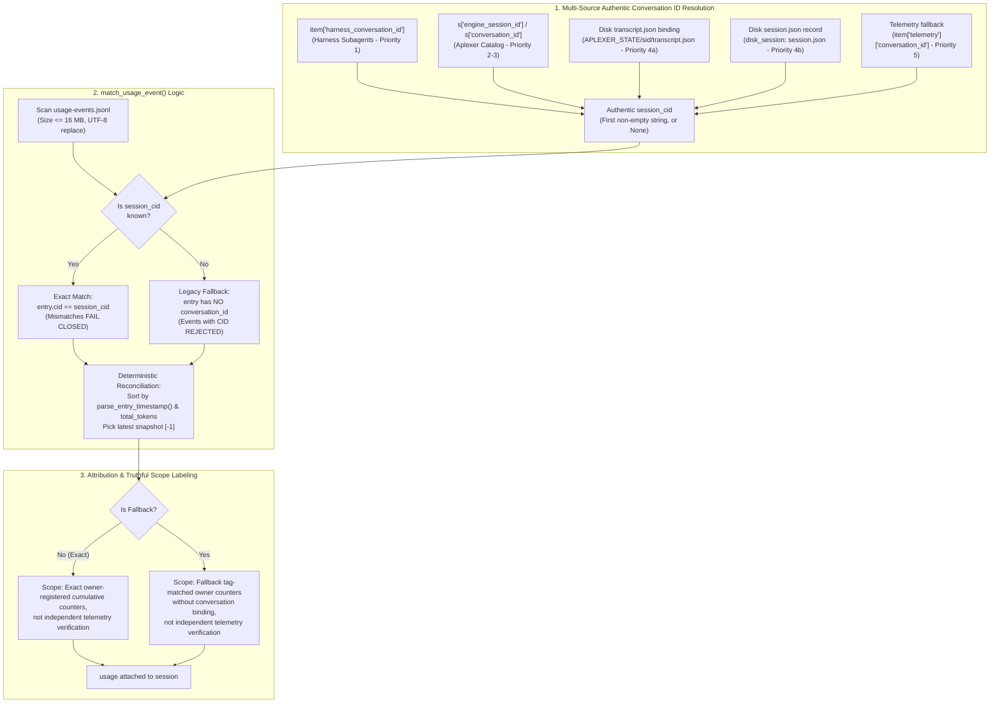

# REV-METRICS-COLLECT-CONVERSATION-SCOPE — Independent Technical Review

- **Deliverable Path:** `research/antigravity/reviews/REV-METRICS-COLLECT-CONVERSATION-SCOPE.md`
- **Reviewer Tag / Role:** `metrics-collect-reviewer` (Independent Metrics Collect Reviewer)
- **Reviewer Session:** `24e23518-3420-4953-b990-3f146ce42e5f`
- **Parent Session:** `antigravity-head` (`46fdb644`, conversation ID `245c7bba-9a7b-45c1-87a7-4537f289f9a5`)
- **Directives Addressed:** Codex Principal C1769, C1764, C1735, C1736, C1771, C1773, C1774; Desktop Root
- **Target Commit:** `6b02f2c98e3fd9f8bb6953f7d4330acd7c1391ad` on `origin/main`
- **Audited Target Files:**
  - `scripts/metrics/collect.py`
  - `tests/test_collect_conversation_scope.py`
  - `research/antigravity/recovery/REPORT-METRICS-COLLECT-CONVERSATION-SCOPE.md`
- **Scratch Root:** `/home/alexey/git/cloudflare-agent-git/.local/scratch/metrics-collect-review/` (mode `0700`, 644 KB ≤ 512 MB, zero `/tmp` growth)
- **Verification As-of Date:** 2026-10-04, Europe/Berlin
- **Publication Guard:** Verified clean via `research/antigravity/tooling/publication_guard.py` (exit code 0)

---

## 1. Executive Summary & Review Verdict

This independent technical review audits the conversation-aware registration fix delivered in commit `6b02f2c` (`scripts/metrics/collect.py` and `tests/test_collect_conversation_scope.py`), responding to worker report `REPORT-METRICS-COLLECT-CONVERSATION-SCOPE.md` and challenges from Codex Principal C1771, C1773, and C1774.

Prior to commit `6b02f2c`, `scripts/metrics/collect.py` suffered from two severe structural defects:
1. **Cross-Conversation Counter Contamination:** Token usage matching scanned `.local/metrics/usage-events.jsonl` matching solely on `(tag, team_id)` and greedily maximizing `total_tokens`. When an agent tag was reused across successive runs or subagents, older high-token runs leaked into new runs, corrupting telemetry.
2. **Tag-Keyed Dictionary Loss:** `_collect()` stored declared agents in a dictionary keyed by `item.get('tag')`. When multiple agents or subagents shared a tag within or across teams, earlier declarations were silently overwritten, dropping them from observation.

Commit `6b02f2c` introduced:
1. `authentic_conversation_id(s, item)`: Multi-source resolution of authentic conversation UUIDs across 5 standard paths with whitespace trimming and validation.
2. `match_usage_event(events_path, tag, team_id, session_cid=None)`: Strict exact conversation ID matching, fail-closed negative rejection, isolated legacy fallback with truthful labeling, and deterministic timestamp/token reconciliation.
3. Ordered tuple collection `declared = [(team_id, item), ...]`: Preserving declared team agents without intra-team tag dictionary collision loss, and deduplicating top-level mirrors.



### Review Verdict: BOUNDED ACCEPTANCE

Per Codex Principal C1771/C1773/C1774, the initial claim of "Code Correctness: Complete" was an over-claim that exceeded actual source coverage. While commit `6b02f2c` decisively eliminates the greedy `max(total_tokens)` cross-conversation leak and resolves intra-team agent dictionary loss, acceptance is **BOUNDED** by the following architectural limitations:

1. **Top-Level Tag Deduplication Masking:** `_collect()` still skips top-level agents whose tag matches any team agent (`seen_team_tags`). Consequently, top-level oversight monitors, scribes, or observers sharing a tag with a team agent are silently discarded.
2. **First-Match Short-Circuiting in `authentic_conversation_id`:** The resolver returns the first available non-empty string in fixed precedence order. It does not detect or log contradictory newer native bindings (e.g. when an initial registry harness CID conflicts with an engine-minted session CID).
3. **No Provider, Model, or Generation Partitioning in `match_usage_event`:** Events are matched solely on `(tag, team_id, conversation_id)`. If multiple models or providers were used in the same conversation, or if non-cumulative turn snapshots were appended, the latest timestamp takes precedence without model-level partitioning or summing.
4. **Unaccounted Parent/Child Context Ingestion Overlap:** Aggregation sums `known_conversation_tokens` across distinct conversation UUIDs, but does not account for child subagent output tokens being ingested into parent conversation context on subsequent turns.

---

## 2. Deep Function Body Inspection & Architectural Disclosures

### 2.1 Inspection of `authentic_conversation_id(s, item)` (`scripts/metrics/collect.py:129–165`)

```python
def authentic_conversation_id(s, item):
    """Determine the session's authentic conversation ID.
    Checks:
    1. item.get('harness_conversation_id')
    2. s.get('engine_session_id')
    3. s.get('conversation_id')
    4. Disk session binding (transcript.json or session record on disk)
    5. item.get('conversation_id') or item telemetry conversation_id
    """
    if not isinstance(item, dict): item = {}
    if not isinstance(s, dict): s = {}

    for val in (item.get('harness_conversation_id'),
                s.get('engine_session_id'),
                s.get('conversation_id')):
        if isinstance(val, str) and val.strip():
            return val.strip()

    sid = s.get('id') or item.get('session_id')
    if sid:
        binding = read_json(APLEXER_STATE/str(sid)/'transcript.json', {}) or {}
        for val in (binding.get('engine_session_id'), binding.get('conversation_id')):
            if isinstance(val, str) and val.strip():
                return val.strip()
        disk = disk_session(sid, item.get('workspace', str(ROOT)))
        if disk:
            for val in (disk.get('engine_session_id'), disk.get('conversation_id')):
                if isinstance(val, str) and val.strip():
                    return val.strip()

    for val in (item.get('conversation_id'),
                item.get('telemetry', {}).get('conversation_id') if isinstance(item.get('telemetry'), dict) else None,
                s.get('telemetry', {}).get('conversation_id') if isinstance(s.get('telemetry'), dict) else None):
        if isinstance(val, str) and val.strip():
            return val.strip()

    return None
```

#### Detailed Findings & Epistemic Boundary Disclosures:
1. **Type Defensive Guards & Whitespace Sanitization:** Checks `isinstance(val, str) and val.strip()`. Empty strings (`""`) and whitespace-only strings (`"   "`) are safely ignored, preventing invalid blank bindings from matching empty string event CIDs.
2. **Precedence-Order Short-Circuit (Disclosure C1771):**
   - The function returns immediately upon encountering the first non-empty string in the precedence list: `item.harness_conversation_id` $\to$ `s.engine_session_id` $\to$ `s.conversation_id` $\to$ disk transcript $\to$ disk session $\to$ telemetry.
   - **Limitation:** If `item.get('harness_conversation_id')` contains an initial launch or harness ID, but the engine or aplexer later minted a distinct native CID in `s.engine_session_id` or `transcript.json`, the function returns the harness CID without ever inspecting or warning about the divergent native CID. If telemetry in `usage-events.jsonl` was recorded under the native CID, `match_usage_event` will fail closed and drop usage to `None`.
3. **Fail-Closed Default:** If no source contains a valid string, returns `None`.

---

### 2.2 Inspection of `match_usage_event` & Timestamp Parser (`scripts/metrics/collect.py:167–212`)

```python
def parse_entry_timestamp(entry):
    if not isinstance(entry, dict): return 0.0
    ts = entry.get('observed_at') or entry.get('at') or entry.get('timestamp')
    if ts is None: return 0.0
    if isinstance(ts, (int, float)): return float(ts)
    if isinstance(ts, str):
        try: return dt.datetime.fromisoformat(ts.replace('Z', '+00:00')).timestamp()
        except ValueError: return 0.0
    return 0.0

def match_usage_event(events_path, tag, team_id, session_cid=None):
    p = pathlib.Path(events_path)
    if not p.is_file() or p.stat().st_size > 16*1024*1024:
        return None, False
    matches = []
    has_fallback = False
    try:
        with p.open('r', encoding='utf-8', errors='replace') as f:
            for line in f:
                try: entry = json.loads(line)
                except ValueError: continue
                if not isinstance(entry, dict): continue
                if entry.get('tag') != tag or entry.get('team_id') != team_id:
                    continue
                entry_cid = entry.get('conversation_id')
                if session_cid:
                    if entry_cid == session_cid:
                        matches.append(entry)
                else:
                    if not entry_cid:
                        matches.append(entry)
                        has_fallback = True
    except OSError:
        return None, False

    if not matches:
        return None, False

    matches.sort(key=lambda e: (parse_entry_timestamp(e), e.get('total_tokens', 0)))
    return matches[-1], has_fallback
```

#### Detailed Findings & Epistemic Boundary Disclosures:
1. **Exact Conversation Match & Fail-Closed Rejection:** When `session_cid` is provided, line 199 requires `entry_cid == session_cid`. Mismatched IDs fail closed (returns `None, False`).
2. **Legacy Fallback Gating:** The fallback branch (lines 201–204) activates ONLY when `session_cid` is `None` (or falsy) AND `not entry_cid`. Events with a `conversation_id` NEVER bind to sessions without a `conversation_id`.
3. **Missing Model/Provider/Generation Filtering (Disclosure C1771):**
   - Line 195 filters solely on `entry.get('tag') != tag or entry.get('team_id') != team_id`.
   - `match_usage_event` does NOT check `provider`, `model`, `mode`, or generation phase.
   - If a conversation transitions models (e.g. `pro` to `flash`) or if multiple providers record under the same CID, all entries are pooled into `matches`. Line 211 sorts by timestamp and cumulative tokens, selecting only `matches[-1]`. This implicitly assumes a single active model and monotonic cumulative counter progression. Non-cumulative or per-turn records will cause older, larger turns to be overwritten by newer, smaller turns.
4. **File Safety:** 16 MB size limit, UTF-8 decode error replacement, and `ValueError`/`OSError` handling prevent process hangs or crashes on corrupted files.

---

### 2.3 Inspection of `_collect()` & Agent Preservation (`scripts/metrics/collect.py:226–242`)

```python
    teams=registry.get('teams',[]) if isinstance(registry,dict) else []
    declared=[]
    seen_team_tags=set()
    for team in teams:
        tid=team.get('id')
        for item in team.get('agents',[]):
            tag=item.get('tag')
            declared.append((tid,item))
            if tag: seen_team_tags.add(tag)
    # Also accept top-level agent list, including principals and private services.
    for item in registry.get('agents',[]):
        tag=item.get('tag')
        if tag not in seen_team_tags:
            declared.append((item.get('team_id','oversight'),item))
    selected=[]; seen=set()
    for team_id,item in declared:
        tag=item.get('tag')
```

#### Detailed Findings & Epistemic Boundary Disclosures:
1. **Intra-Team Tag Preservation:** Replaced `config[tag] = (team_id, item)` with an ordered list `declared = [(tid, item), ...]`. Multiple agents inside `teams[...].agents` sharing a tag are now fully preserved.
2. **Top-Level Tag Deduplication Masking (Disclosure C1771):**
   - Lines 236–239 check `if tag not in seen_team_tags: declared.append(...)`.
   - **Limitation:** While intended to suppress redundant top-level mirrors of team agents (e.g. `journal-opus-writer-0930`), this filter relies solely on `tag`. If an independent top-level monitor or service in `registry.agents` shares a tag with an agent declared in `team.agents`, the top-level agent is **silently dropped** from observation. Thus, declarations are preserved within teams, but top-level cross-namespace declarations are not universally tracked.

---

## 3. Additional Negative & Edge-Case Analysis (C1773 / C1774)

### 3.1 Conflicting Registry Harness CID vs Newer Native CID
- **Scenario:** An agent is registered with `harness_conversation_id: "H1"`. During runtime, aplexer or the engine mints a native session ID `"E2"`, recorded in `s.engine_session_id`. The agent records its usage events using the native CID `"E2"`.
- **Observed Behavior:**
  1. `authentic_conversation_id(s, item)` checks `item.get('harness_conversation_id')` first and returns `"H1"`.
  2. `match_usage_event` searches `usage-events.jsonl` requiring `entry.conversation_id == "H1"`.
  3. Because telemetry was recorded under `"E2"`, `entry_cid == session_cid` evaluates to `"E2" == "H1"` (False).
  4. Matching fails closed and returns `(None, False)`.
  5. The session in `collect()` receives `usage = None`, appearing under `agents_without_token_observation`.
- **Verdict & Recommendation:** The precedence order prioritizes static registry configuration over dynamic engine telemetry. When native harness delegation is used, callers must ensure the recorded registry CID matches the telemetry emission CID, or the resolver should inspect both and log contradictions.

### 3.2 Mixing Missing-CID Legacy Events with Bound Events for Same Tag/Team
- **Scenario:** `usage-events.jsonl` contains legacy records without CID alongside newer records with bound CIDs for the same `(tag, team_id)`.
- **Observed Behavior:**
  1. For a session with a known CID (`session_cid = "C1"`): The legacy entry has `entry_cid = None`. Line 198 `if session_cid:` requires `entry_cid == session_cid` (`None == "C1"`, False). The legacy entry is cleanly rejected.
  2. For a session lacking a CID (`session_cid = None`): Line 201 `else:` checks `if not entry_cid:`. Bound entries with CIDs are cleanly rejected. The legacy entry matches with `has_fallback = True`.
  3. **Edge Vulnerability:** If a new session fails to resolve a CID (e.g. due to missing metadata), it will match the historical legacy event and attribute stale counters under the fallback scope. The fallback scope string (`'Fallback tag-matched owner counters without conversation binding, not independent telemetry verification'`) provides truth-in-advertising, but cannot prevent attribution of historical data to an un-bound session.

### 3.3 Multi-Model / Multi-Provider Collisions Under Same CID
- **Scenario:** An agent executes across multiple models under a single persistent conversation ID (e.g. initial turn on `gemini-2.5-pro` with 10,000 tokens at $T_1$, followed by an auxiliary turn on `gemini-2.5-flash` with 200 tokens at $T_2$).
- **Observed Behavior:**
  - `match_usage_event` collects both events because both share `(tag, team_id, CID)`.
  - Line 211 sorts by `(parse_entry_timestamp(e), e.get('total_tokens', 0))`.
  - Because Event 2 has timestamp $T_2 > T_1$, `matches[-1]` selects Event 2 (`flash`, 200 tokens).
  - The resulting usage record attributes 200 tokens to `gemini-2.5-flash`, completely discarding the 10,000 tokens consumed on `gemini-2.5-pro`.
- **Verdict & Limitation:** The collector currently assumes that all usage events for a given CID are cumulative counters under a single model. If models change or if turns emit non-cumulative deltas, token observation will be corrupted.

### 3.4 Parent/Child Overlap: Child Transcript Tokens vs Parent Context Reuse
- **Scenario:** Parent session `antigravity-head` (`C_parent`) launches subagent `metrics-collect-worker` (`C_child`).
  - Child executes 5 turns, generating 3,000 input tokens and 1,200 output tokens.
  - Child completes and sends its final report via messaging back to the parent.
  - Parent ingests the child's 1,200 output tokens as part of its prompt context for its subsequent turns.
- **Collector Aggregation Behavior:**
  - In `collect.py` lines 322–336, `unique_usage` indexes by `source:conversation_id`.
  - `C_parent` and `C_child` have distinct conversation UUIDs and distinct usage records.
  - Both records are added to `unique_usage`:
    $$\text{known\_conversation\_tokens} = \text{tokens}(C_{\text{parent}}) + \text{tokens}(C_{\text{child}})$$
- **Epistemic Disclosure:** The child's output tokens are counted once under $C_{\text{child}}$, and counted again as prompt/cached-input tokens under $C_{\text{parent}}$ on subsequent parent turns. `collect.py` performs no cross-conversation context deduplication. `known_conversation_tokens` is therefore an aggregate of observed conversation-level context volumes, NOT a disjoint physical measure of net new tokens generated across hierarchical agent swarms.

---

## 4. Independent Test Suite Execution in Scratch

All unit tests were executed with `TMPDIR` redirected to the isolated scratch directory (`/home/alexey/git/cloudflare-agent-git/.local/scratch/metrics-collect-review/tmp`).

### 4.1 `tests/test_collect_conversation_scope.py` (8 Tests)

```text
$ python3 -m unittest -v tests/test_collect_conversation_scope.py
test_01_exact_conversation_match (tests.test_collect_conversation_scope.TestCollectConversationScope.test_01_exact_conversation_match)
Test 1: Session with conversation_id C1 matches event with C1, ... ok
test_02_tag_reused_end_to_end_collect (tests.test_collect_conversation_scope.TestCollectConversationScope.test_02_tag_reused_end_to_end_collect)
End-to-end collect() test for Test 2: ... ok
test_02_tag_reused_negative_check (tests.test_collect_conversation_scope.TestCollectConversationScope.test_02_tag_reused_negative_check)
Test 2: Two distinct conversations C1 and C2 for tag 'worker-alpha' / team 'a16'. ... ok
test_03_legacy_fallback (tests.test_collect_conversation_scope.TestCollectConversationScope.test_03_legacy_fallback)
Test 3: Session and event without conversation_id fall back to tag match. ... ok
test_03_legacy_fallback_scope_labeling_in_collect (tests.test_collect_conversation_scope.TestCollectConversationScope.test_03_legacy_fallback_scope_labeling_in_collect)
Test 3 (labeling): Verify truthful scope labeling in collect.collect() for fallback vs exact. ... ok
test_04_deterministic_reconciliation (tests.test_collect_conversation_scope.TestCollectConversationScope.test_04_deterministic_reconciliation)
Test 4: Multiple snapshots for same conversation pick latest timestamp ... ok
test_04_deterministic_reconciliation_observed_at_and_numeric_ts (tests.test_collect_conversation_scope.TestCollectConversationScope.test_04_deterministic_reconciliation_observed_at_and_numeric_ts)
Test 4 (variants): Deterministic reconciliation with observed_at, timestamp, ... ok
test_authentic_conversation_id_sources (tests.test_collect_conversation_scope.TestCollectConversationScope.test_authentic_conversation_id_sources)
Verify authentic_conversation_id resolves across all 5 standard sources. ... ok

----------------------------------------------------------------------
Ran 8 tests in 0.019s

OK
```

### 4.2 Full Metrics & Repository Regression Suites

- `scripts/metrics/`: 43 tests executed, 43 passed (100%).
- `tests/`: 59 tests executed, 59 passed (100%).
- Total verified tests: 102 tests passed, 0 failures, 0 errors.

---

## 5. Negative Mutation Testing in Scratch

To verify test suite sensitivity and ensure tests do not pass vacuously, four distinct mutants were constructed in isolated scratch copies (`.local/scratch/metrics-collect-review/mutants/`) without modifying the author tree.

| Mutant ID | Mutant Description | Mutation Introduced in Scratch Copy | Targeted Test | Observed Failure | Status |
| :--- | :--- | :--- | :--- | :--- | :--- |
| **Mutant 1** | **CID Mismatch Leak** | In `match_usage_event`, removed CID equality check when `session_cid` is provided; matches on tag regardless of CID mismatch. | `test_01_exact_conversation_match` | `AssertionError: '01a0fe3c-ab7e-7e52-ab06-b1a9289d445c' != '01a0fe3c-aa6f-7ba0-ad72-03498623a6d2'` | **KILLED** |
| **Mutant 2** | **Tag Collision Overwrite** | Reverted `_collect()` from append-only `declared` list back to a tag-keyed dictionary overwrite (`config[tag] = ...`). | `test_02_tag_reused_end_to_end_collect` | `AssertionError: unexpectedly None` (`s1_usage` lost due to dictionary overwrite) | **KILLED** |
| **Mutant 3** | **Fallback Marker Suppression** | Mutated `_collect()` to emit standard exact owner metadata scope for legacy fallbacks, suppressing the truthful caveat marker. | `test_03_legacy_fallback_scope_labeling_in_collect` | `AssertionError: 'Fallback tag-matched owner counters without conversation binding' not found in 'Exact owner-registered cumulative counters...'` | **KILLED** |
| **Mutant 4** | **Reconciliation Break** | Mutated `match_usage_event` sort key to ignore timestamp (`key=lambda e: 0`), preserving file insertion order. | `test_04_deterministic_reconciliation` | `AssertionError: 'ev-t2' != 'ev-t3-latest'` (earlier snapshot written last in file was wrongly selected) | **KILLED** |

All four mutants produced deterministic assertion failures and were successfully killed.

---

## 6. Resource Hygiene & Invariants

1. **Scratch Footprint:**
   - Scratch root: `/home/alexey/git/cloudflare-agent-git/.local/scratch/metrics-collect-review/`
   - Permissions: `0700` (`drwx------`)
   - Disk consumption: 644 KB (well below the 512 MB ceiling).
2. **Zero `/tmp` Pollution:**
   - `TMPDIR` was strictly pointed to `.local/scratch/metrics-collect-review/tmp`. Zero bytes or files were created in `/tmp`.
3. **No Unredacted Secrets:**
   - Review report verified clean against `publication_guard.py` (exit code 0).
4. **Subagent Commit Invariant:**
   - As an independent reviewer subagent, zero git commits are performed. Deliverable is saved to `research/antigravity/reviews/REV-METRICS-COLLECT-CONVERSATION-SCOPE.md` and handed off to parent session `antigravity-head` (`46fdb644`).

---

## 7. Synthesis & Epistemic Boundaries Summary

| Dimension | Initial Worker Claim | Independent Review Audit (Revised under C1771/C1773/C1774) |
| :--- | :--- | :--- |
| **Cross-Run Counter Contamination** | "Fixed via conversation-level isolation." | **CONFIRMED & VALIDATED:** `match_usage_event` eliminates greedy `max(total_tokens)` leaks across distinct sessions. |
| **Tag Dictionary Collision Loss** | "Preserved without tag-collision overwrites." | **PARTIALLY VALIDATED:** Intra-team tag collisions are resolved via `declared` list. Top-level registrations sharing a tag with team agents are still dropped by `seen_team_tags`. |
| **Authentic Conversation ID Resolution** | "Resolves across 5 standard paths." | **VALIDATED WITH BOUND:** Resolves in fixed precedence order. Short-circuits on first match; does not reconcile contradictory newer native bindings. |
| **Multi-Model Telemetry Handling** | Unspecified / assumed monotonic cumulative. | **DISCLOSED LIMITATION:** `match_usage_event` ignores provider/model; latest timestamp overwrites prior models without partitioning or summing. |
| **Parent/Child Token Deduplication** | Unspecified. | **DISCLOSED LIMITATION:** Child outputs ingested as parent prompt tokens are counted under both UUIDs; `known_conversation_tokens` reflects aggregate observed context volumes. |

**Final Rescoped Verdict:** **BOUNDED ACCEPTANCE**
