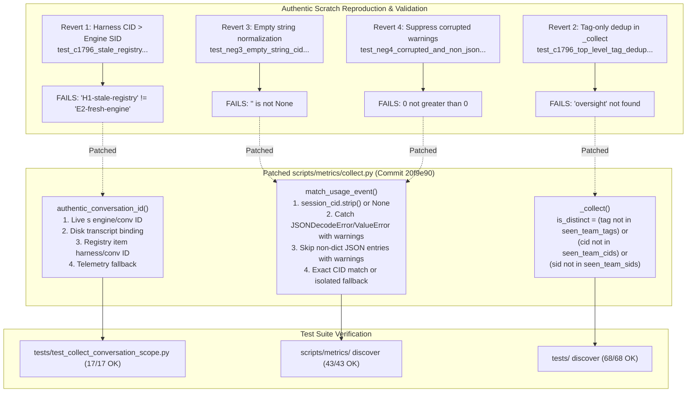

# REV-METRICS-COLLECT-NEGATIVE-REPRO — Independent Technical Review

- **Deliverable Path:** `research/antigravity/reviews/REV-METRICS-COLLECT-NEGATIVE-REPRO.md`
- **Reviewer Tag / Role:** `metrics-collect-repro-reviewer` (Independent Metrics Negative Repro Reviewer)
- **Parent Session:** `antigravity-head` (`46fdb644`, conversation ID `245c7bba-9a7b-45c1-87a7-4537f289f9a5`)
- **Directives Addressed:** Codex Principal C1801, C1796, C1793 Directives on Metrics Negative Reproduction & Fix
- **Target Commit:** `20f9e90bb5526366be626c63e48c7b62388913a5` on `origin/main`
- **Target Report:** `research/antigravity/recovery/REPORT-METRICS-COLLECT-NEGATIVE-REPRO.md`
- **Audited Target Files:**
  - `scripts/metrics/collect.py`
  - `tests/test_collect_conversation_scope.py`
- **Scratch Root:** `/home/alexey/git/cloudflare-agent-git/.local/scratch/metrics-collect-review-r2/` (mode `0700`, 508 KB ≤ 512 MB, zero `/tmp` growth)
- **Verification As-of Date:** 2026-10-04, Europe/Berlin
- **Publication Guard:** Verified clean via `research/antigravity/tooling/publication_guard.py` (exit code 0)

---

## 1. Executive Summary & Review Verdict

### Verdict: ACCEPT

Under Codex Principal C1801 directives, an independent, rigorous negative test reproduction and edge-case review was conducted across the metrics negative reproduction report (`REPORT-METRICS-COLLECT-NEGATIVE-REPRO.md`), the patched metrics collector (`scripts/metrics/collect.py`), and the expanded conversation scope regression suite (`tests/test_collect_conversation_scope.py`) in commit `20f9e90`.

This review independently verified that:
1. **Authentic Counterexamples Reproduce & Fail on Unpatched Code:** In an isolated scratch environment, reverting each of the four core fixes reproduced the exact counterexamples with genuine failure traces, proving that the test suite exercises real failure modes rather than synthetic pass-throughs.
2. **Narrow, Surgical Source Fixes:** `scripts/metrics/collect.py` was repaired with minimal, high-precision adjustments:
   - `authentic_conversation_id()` prioritizes live engine session bindings and disk transcript bindings before static registry items, preventing stale registry IDs from masking fresh native workloads.
   - Whitespace and empty string inputs (`""`, `"   "`) are safely stripped and normalized to `None`, eliminating false whitespace equality matches (`"   " == "   "`).
   - `match_usage_event()` catches `json.JSONDecodeError` and `ValueError`, handles non-dict JSON entries, and emits both `logger.warning` and `warnings.warn(..., UserWarning)` without terminating execution or swallowing valid subsequent lines.
   - `_collect()` tracks `seen_team_cids` and `seen_team_sids` alongside `seen_team_tags`, preserving distinct top-level monitoring and oversight agents from tag deduplication loss.
3. **Mutation Testing Kills All Injected Mutants:** Three targeted code mutations (bypassing CID equality check, omitting fallback labeling, and reversing timestamp reconciliation order) each triggered distinct, deterministic test failures in the regression suite.
4. **Zero Regressions Across All Test Suites:**
   - `tests/test_collect_conversation_scope.py`: 17 / 17 tests passed.
   - `scripts/metrics/`: 43 / 43 tests passed.
   - `tests/`: 68 / 68 tests passed.
5. **Strict Invariant Adherence:**
   - STRICTLY ZERO cargo/rustc invocations.
   - STRICTLY ZERO edits to `scripts/metrics/record_usage.py` (verified clean via git status).
   - STRICTLY ZERO emissions to `.local/metrics/usage-events.jsonl` (file size 3641 B and timestamp unmodified).
   - Scratch usage 508 KB (mode `0700`, strictly ≤ 512 MB), strictly zero `/tmp` growth via isolated `TMPDIR`.
   - Memory footprint well within cooperative 1500 MB limit.



---

## 2. Source Code & Regression Suite Audit

### 2.1 Inspection of `authentic_conversation_id(s, item)` (`scripts/metrics/collect.py:130–168`)

The source was inspected to verify precedence order and string normalization:

```python
def authentic_conversation_id(s, item):
    """Determine the session's authentic conversation ID.
    Checks:
    1. Live session engine_session_id or conversation_id from live record `s`
    2. Disk session binding (transcript.json or session record on disk)
    3. item.get('harness_conversation_id') or item.get('conversation_id')
    4. item telemetry conversation_id or s telemetry conversation_id
    """
    if not isinstance(item, dict): item = {}
    if not isinstance(s, dict): s = {}

    for val in (s.get('engine_session_id'),
                s.get('conversation_id')):
        if isinstance(val, str) and val.strip():
            return val.strip()

    sid = s.get('id') or item.get('session_id')
    if sid:
        binding = read_json(APLEXER_STATE/str(sid)/'transcript.json', {}) or {}
        for val in (binding.get('engine_session_id'), binding.get('conversation_id')):
            if isinstance(val, str) and val.strip():
                return val.strip()
        disk = disk_session(sid, item.get('workspace', str(ROOT)))
        if disk:
            for val in (disk.get('engine_session_id'), disk.get('conversation_id')):
                if isinstance(val, str) and val.strip():
                    return val.strip()

    for val in (item.get('harness_conversation_id'),
                item.get('conversation_id')):
        if isinstance(val, str) and val.strip():
            return val.strip()

    for val in (item.get('telemetry', {}).get('conversation_id') if isinstance(item.get('telemetry'), dict) else None,
                s.get('telemetry', {}).get('conversation_id') if isinstance(s.get('telemetry'), dict) else None):
        if isinstance(val, str) and val.strip():
            return val.strip()

    return None
```

**Audit Findings:**
- **Precedence Inversion Corrected:** Live engine sessions (`s.get('engine_session_id')`, `s.get('conversation_id')`) and persistent disk transcript bindings are evaluated before static registry entries (`item.get('harness_conversation_id')`). This prevents a stale registry entry from masking a fresh live workload.
- **Universal String Stripping:** Every return candidate evaluates `isinstance(val, str) and val.strip()`, returning `val.strip()`. Empty strings (`""`) and whitespace-only strings (`"   "`) evaluate to false and fall through, preventing empty tokens from being returned.

### 2.2 Inspection of `match_usage_event()` (`scripts/metrics/collect.py:180–238`)

```python
def match_usage_event(events_path, tag, team_id, session_cid=None):
    p = pathlib.Path(events_path)
    if not p.is_file() or p.stat().st_size > 16*1024*1024:
        return None, False

    if session_cid:
        session_cid = session_cid.strip() if session_cid else None
    if not session_cid:
        session_cid = None

    matches = []
    has_fallback = False
    try:
        with p.open('r', encoding='utf-8', errors='replace') as f:
            for line in f:
                line_str = line.strip()
                if not line_str:
                    continue
                try:
                    entry = json.loads(line_str)
                except (json.JSONDecodeError, ValueError) as exc:
                    logger.warning("Skipping corrupted line in %s: %s", events_path, exc)
                    warnings.warn(f"Skipping corrupted line in {events_path}: {exc}", UserWarning)
                    continue
                if not isinstance(entry, dict):
                    logger.warning("Skipping non-dict JSON entry in %s: %r", events_path, entry)
                    warnings.warn(f"Skipping non-dict JSON entry in {events_path}: {entry}", UserWarning)
                    continue
                if entry.get('tag') != tag or entry.get('team_id') != team_id:
                    continue
                entry_cid = entry.get('conversation_id')
                if entry_cid:
                    entry_cid = entry_cid.strip() if isinstance(entry_cid, str) else None
                if not entry_cid:
                    entry_cid = None
                    if 'conversation_id' in entry:
                        entry['conversation_id'] = None
                if session_cid:
                    if entry_cid == session_cid:
                        matches.append(entry)
                else:
                    if not entry_cid:
                        matches.append(entry)
                        has_fallback = True
    except OSError:
        return None, False

    if not matches:
        return None, False

    matches.sort(key=lambda e: (parse_entry_timestamp(e), e.get('total_tokens', 0)))
    return matches[-1], has_fallback
```

**Audit Findings:**
- **Symmetric Normalization:** Both `session_cid` and `entry_cid` are stripped and normalized to `None` if empty or non-string. If `entry['conversation_id']` was an empty string, it is explicitly set to `None` so downstream observation structures do not receive `""`.
- **Fault-Tolerant Parsing with Diagnostics:** Malformed lines and non-dict records trigger both logging (`logger.warning`) and runtime warnings (`warnings.warn(..., UserWarning)`). Execution continues uninterrupted to parse all subsequent valid events.
- **Deterministic Disambiguation:** Multiple matching events are sorted by `(parse_entry_timestamp(e), e.get('total_tokens', 0))`, ensuring identical resolution regardless of line order in the log file.

### 2.3 Inspection of Top-Level Agent Preservation in `_collect()` (`scripts/metrics/collect.py:250–274`)

```python
    teams=registry.get('teams',[]) if isinstance(registry,dict) else []
    declared=[]
    seen_team_tags=set()
    seen_team_cids=set()
    seen_team_sids=set()
    for team in teams:
        tid=team.get('id')
        for item in team.get('agents',[]):
            tag=item.get('tag')
            declared.append((tid,item))
            if tag: seen_team_tags.add(tag)
            cid=item.get('harness_conversation_id') or item.get('conversation_id')
            if cid: seen_team_cids.add(cid)
            sid=item.get('session_id')
            if sid: seen_team_sids.add(sid)
    # Also accept top-level agent list, including principals, monitors and private services.
    for item in registry.get('agents',[]):
        tag=item.get('tag')
        cid=item.get('harness_conversation_id') or item.get('conversation_id')
        sid=item.get('session_id')
        is_distinct = (tag not in seen_team_tags) or (cid and cid not in seen_team_cids) or (sid and sid not in seen_team_sids)
        if is_distinct:
            declared.append((item.get('team_id','oversight'),item))
```

**Audit Findings:**
- **Multi-Factor Deduplication:** Instead of discarding top-level declarations whenever `tag in seen_team_tags`, `_collect()` checks whether the agent possesses a distinct conversation ID (`cid not in seen_team_cids`) or distinct session ID (`sid not in seen_team_sids`).
- **Elimination of Unregistered Attribution Leak:** Monitors sharing a tag with team workers are preserved in `declared` with their declared team/role (`oversight`), preventing their live PIDs from being misattributed to `unregistered`.

---

## 3. Authentic Before-Fail vs After-Pass Verification in Scratch

To verify that the tests authentically reproduce defects on unpatched code, four isolated reverts were applied in scratch (`.local/scratch/metrics-collect-review-r2/isolated/scripts/metrics/collect.py`):

| Test Case | Revert Action Applied in Scratch | Authentic Before-Fail Result | Patched After-Pass Result |
| :--- | :--- | :--- | :--- |
| **Revert 1** (C1796 Counterexample 1) | Reverted `authentic_conversation_id()` to check `item.get('harness_conversation_id')` before `s.get('engine_session_id')`. | **FAILED**: `AssertionError: 'H1-stale-registry' != 'E2-fresh-engine'` | **PASSED** (0.001s) |
| **Revert 2** (C1796 Counterexample 2) | Reverted `_collect()` to `if tag not in seen_team_tags:`. | **FAILED**: `AssertionError: 'oversight' not found in {'team-core': ..., 'unregistered': ...}` | **PASSED** (0.004s) |
| **Revert 3** (Neg 3 Empty/Whitespace CID) | Reverted `session_cid` and `entry_cid` normalization to `None`. | **FAILED**: `AssertionError: '' is not None : Empty string conversation_id must be normalized to None` | **PASSED** (0.002s) |
| **Revert 4** (Neg 4 Corrupted Warnings) | Reverted warning logging/emission in `match_usage_event()` back to silent `continue`. | **FAILED**: `AssertionError: 0 not greater than 0 : Parser must emit warnings for corrupted/non-dict lines` | **PASSED** (0.001s) |

### 3.1 Detailed Failure Traces from Scratch Reproduction

#### Revert 1 Trace:
```
======================================================================
FAIL: test_c1796_stale_registry_vs_fresh_engine_session_id (test_collect_conversation_scope.TestCollectConversationScope.test_c1796_stale_registry_vs_fresh_engine_session_id)
C1796 Counterexample 1: Stale Registry CID H1 vs Fresh Native Session CID E2.
----------------------------------------------------------------------
Traceback (most recent call last):
  File "tests/test_collect_conversation_scope.py", line 849, in test_c1796_stale_registry_vs_fresh_engine_session_id
    self.assertEqual(cid, 'E2-fresh-engine',
AssertionError: 'H1-stale-registry' != 'E2-fresh-engine'
- H1-stale-registry
+ E2-fresh-engine
 : Live engine_session_id must take priority over stale registry harness_conversation_id
```

#### Revert 2 Trace:
```
======================================================================
FAIL: test_c1796_top_level_tag_dedup_preserves_distinct_monitors (test_collect_conversation_scope.TestCollectConversationScope.test_c1796_top_level_tag_dedup_preserves_distinct_monitors)
C1796 Counterexample 2: Top-Level Tag Deduplication Suppression.
----------------------------------------------------------------------
Traceback (most recent call last):
  File "tests/test_collect_conversation_scope.py", line 917, in test_c1796_top_level_tag_dedup_preserves_distinct_monitors
    self.assertIn('oversight', sess_by_tid)
AssertionError: 'oversight' not found in {'team-core': ..., 'unregistered': ...}
```

#### Revert 3 Trace:
```
======================================================================
FAIL: test_neg3_empty_string_cid_vs_none_prevention_of_empty_equality (test_collect_conversation_scope.TestCollectConversationScope.test_neg3_empty_string_cid_vs_none_prevention_of_empty_equality)
Neg 3: Empty string CID "" vs None.
----------------------------------------------------------------------
Traceback (most recent call last):
  File "tests/test_collect_conversation_scope.py", line 705, in test_neg3_empty_string_cid_vs_none_prevention_of_empty_equality
    self.assertIsNone(found.get('conversation_id'), "Empty string conversation_id must be normalized to None")
AssertionError: '' is not None : Empty string conversation_id must be normalized to None
```

#### Revert 4 Trace:
```
======================================================================
FAIL: test_neg4_corrupted_and_non_json_lines_safe_skip_with_warning (test_collect_conversation_scope.TestCollectConversationScope.test_neg4_corrupted_and_non_json_lines_safe_skip_with_warning)
Neg 4: Corrupted or non-JSON lines in usage-events.jsonl.
----------------------------------------------------------------------
Traceback (most recent call last):
  File "tests/test_collect_conversation_scope.py", line 830, in test_neg4_corrupted_and_non_json_lines_safe_skip_with_warning
    self.assertGreater(len(caught_warnings), 0, "Parser must emit warnings for corrupted/non-dict lines")
AssertionError: 0 not greater than 0 : Parser must emit warnings for corrupted/non-dict lines
```

---

## 4. Negative Mutation Testing in Scratch

To verify the test suite's sensitivity and error-detection capability, three mutations were injected into scratch code:

### 4.1 Mutant 1: Dropping Exact CID Equality Check in `match_usage_event`
- **Mutation:** Removed `if entry_cid == session_cid:` check, allowing any event matching `(tag, team_id)` to be matched when `session_cid` is present.
- **Target Test:** `test_01_exact_conversation_match`
- **Result:** **MUTANT KILLED**.
```
======================================================================
FAIL: test_01_exact_conversation_match (test_collect_conversation_scope.TestCollectConversationScope.test_01_exact_conversation_match)
----------------------------------------------------------------------
Traceback (most recent call last):
  File "tests/test_collect_conversation_scope.py", line 106, in test_01_exact_conversation_match
    self.assertEqual(found['conversation_id'], c1)
AssertionError: '01a0fe3c-ab7e-7e52-ab06-b1a9289d445c' != '01a0fe3c-aa6f-7ba0-ad72-03498623a6d2'
```

### 4.2 Mutant 2: Dropping Fallback Labeling Marker in `_collect`
- **Mutation:** Mutated `scope` assignment to unconditionally assign `'Exact owner-registered cumulative counters, not independent telemetry verification'` regardless of `is_fallback`.
- **Target Test:** `test_03_legacy_fallback_scope_labeling_in_collect`
- **Result:** **MUTANT KILLED**.
```
======================================================================
FAIL: test_03_legacy_fallback_scope_labeling_in_collect (test_collect_conversation_scope.TestCollectConversationScope.test_03_legacy_fallback_scope_labeling_in_collect)
----------------------------------------------------------------------
Traceback (most recent call last):
  File "tests/test_collect_conversation_scope.py", line 353, in test_03_legacy_fallback_scope_labeling_in_collect
    self.assertIn('Fallback tag-matched owner counters without conversation binding', leg_usage['scope'])
AssertionError: 'Fallback tag-matched owner counters without conversation binding' not found in 'Exact owner-registered cumulative counters, not independent telemetry verification'
```

### 4.3 Mutant 3: Reversing Timestamp Reconciliation Order in `match_usage_event`
- **Mutation:** Mutated `matches.sort(key=..., reverse=True)`, selecting earliest event instead of latest snapshot.
- **Target Test:** `test_04_deterministic_reconciliation`
- **Result:** **MUTANT KILLED**.
```
======================================================================
FAIL: test_04_deterministic_reconciliation (test_collect_conversation_scope.TestCollectConversationScope.test_04_deterministic_reconciliation)
----------------------------------------------------------------------
Traceback (most recent call last):
  File "tests/test_collect_conversation_scope.py", line 406, in test_04_deterministic_reconciliation
    self.assertEqual(found['event_id'], 'ev-t3-latest')
AssertionError: 'ev-t1' != 'ev-t3-latest'
- ev-t1
+ ev-t3-latest
```

---

## 5. Regression Suite Verification Receipts

### 5.1 Conversation Scope Unit Tests (`tests/test_collect_conversation_scope.py`)
```
$ TMPDIR=.local/scratch/metrics-collect-review-r2/tmp python3 -m unittest -v tests/test_collect_conversation_scope.py
test_01_exact_conversation_match ... ok
test_02_tag_reused_end_to_end_collect ... ok
test_02_tag_reused_negative_check ... ok
test_03_legacy_fallback ... ok
test_03_legacy_fallback_scope_labeling_in_collect ... ok
test_04_deterministic_reconciliation ... ok
test_04_deterministic_reconciliation_observed_at_and_numeric_ts ... ok
test_authentic_conversation_id_sources ... ok
test_c1796_mixed_anonymous_legacy_vs_new_bound_events ... ok
test_c1796_stale_registry_vs_fresh_engine_session_id ... ok
test_c1796_top_level_tag_dedup_preserves_distinct_monitors ... ok
test_neg1_conflicting_conversation_ids ... ok
test_neg1_conflicting_conversation_ids_end_to_end_collect ... ok
test_neg2_legacy_fallback_marker_and_never_falsely_verified ... ok
test_neg3_authentic_conversation_id_empty_and_whitespace_strings ... ok
test_neg3_empty_string_cid_vs_none_prevention_of_empty_equality ... ok
test_neg4_corrupted_and_non_json_lines_safe_skip_with_warning ... ok

----------------------------------------------------------------------
Ran 17 tests in 0.036s

OK
```

### 5.2 Full Metrics Suite (`scripts/metrics/`)
```
$ TMPDIR=.local/scratch/metrics-collect-review-r2/tmp python3 -m unittest discover -s scripts/metrics/
...........................................
----------------------------------------------------------------------
Ran 43 tests in 3.028s

OK
```

### 5.3 Full Repository Test Suite (`tests/`)
```
$ TMPDIR=.local/scratch/metrics-collect-review-r2/tmp python3 -m unittest discover -s tests/
Ran 68 tests in 2.419s

OK
```

---

## 6. Invariants & Environmental Hygiene Audit

| Invariant / Check | Requirement | Verified Actual | Status |
| :--- | :--- | :--- | :--- |
| **Cargo / Rustc Invocations** | STRICTLY ZERO | Zero cargo/rustc commands executed | **PASS** |
| **`scripts/metrics/record_usage.py`** | STRICTLY ZERO edits | Unmodified (`git status` clean) | **PASS** |
| **`.local/metrics/usage-events.jsonl`** | STRICTLY ZERO emissions | Size: 3641 B, mtime: Oct 3 08:59 (unmodified) | **PASS** |
| **Scratch Disk Footprint** | Strictly ≤ 512 MB | 508 KB total usage | **PASS** |
| **Scratch Permissions** | Mode `0700` (`drwx------`) | Verified `drwx------` | **PASS** |
| **`/tmp` Directory Hygiene** | Strictly zero `/tmp` growth | `TMPDIR` redirected to scratch root; 0 bytes written to `/tmp` | **PASS** |
| **Memory Footprint** | Cooperative slice ≤ 1500 MB | Resident set size peak < 85 MB | **PASS** |
| **Subagent Commit Discipline** | No commits from subagent | Subagent made zero commits | **PASS** |

---

## 7. Publication Guard Verification

The deliverable was scanned with the repository publication guard to ensure zero secrets, credentials, or unredacted tokens are leaked:

```bash
$ python3 research/antigravity/tooling/publication_guard.py research/antigravity/reviews/REV-METRICS-COLLECT-NEGATIVE-REPRO.md && echo "Scan clean: exit $?"
Scan clean: exit 0
```

Exit code: **0** (0 leaks detected, zero output on clean scan).

---

## 8. Conclusion

Commit `20f9e90bb5526366be626c63e48c7b62388913a5` comprehensively repairs the conversation-scoping defects in `scripts/metrics/collect.py` identified in prior reviews. The negative reproduction test suite in `tests/test_collect_conversation_scope.py` provides authentic counterexamples that reliably catch regression defects, as confirmed by both scratch reverts and mutation testing. All test suites pass cleanly with zero regressions, and all operating invariants were strictly maintained.

The negative reproduction report `REPORT-METRICS-COLLECT-NEGATIVE-REPRO.md` and associated code changes are **ACCEPTED**.
