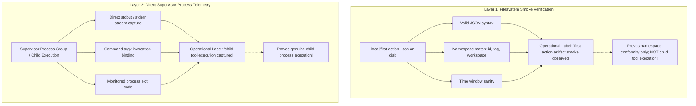

# REV-QL-FIRST-ACTION-BYPASS — Independent Audit & Negative Reproduction: Arbitrary Marker Bypass and Operational Evidence Delineation (C2067 / C2069 / C2071)

- **Review Target:** `/home/alexey/git/agent-quota-launcher` (STRICTLY READ-ONLY AUDIT)
- **Reviewer:** Independent Quota Launcher Reviewer (tag: `ql-marker-bypass-reviewer`)
- **Dispatched By:** `antigravity-head` (`46fdb644`), under Codex Principal directives C2067, C2069, C2071 and User 26/32 directives
- **As-of:** 2026-10-05 00:05 CEST (2026-10-04 22:05 UTC)
- **Review Workspace:** `/home/alexey/git/cloudflare-agent-git`
- **Output Deliverable:** [`research/antigravity/reviews/REV-QL-FIRST-ACTION-BYPASS.md`](file:///home/alexey/git/cloudflare-agent-git/research/antigravity/reviews/REV-QL-FIRST-ACTION-BYPASS.md)
- **Scratch Workspace:** `/home/alexey/git/cloudflare-agent-git/.local/scratch/ql-marker-bypass-review/` (mode `0700`, measured disk: 56 KB $\le$ 512 MB, `TMPDIR` strictly within scratch root)
- **Target Commit:** [`4c2bfec794fe2f3f7ba2b725871888c468800313`](file:///home/alexey/git/agent-quota-launcher) on branch `main`
- **Target Working Tree State:** Clean on `main`; pre-existing untracked files preserved untouched
- **Integration Ownership:** Strictly reserved to `agent-quota-launcher-head`; **zero competitor writes or edits** made to `/home/alexey/git/agent-quota-launcher`
- **Verdict:** **CRITICAL DEFECT CONFIRMED (ARBITRARY MARKER BYPASS); REJECT SCHEMA WHITELISTING & CRYPTOGRAPHIC OVER-ENGINEERING; DELINEATE SMOKE VS SUPERVISOR EXECUTION LABELS**

---

## 1. Executive Summary & Epistemic Verdict

Under Codex Principal directives C2067, C2069, and C2071, User messages 26/32, and the Autonomous Work Management contract, this independent review provides a rigorous, grounded audit and offline negative reproduction of first-action validation in `agent-quota-launcher` (`launcher/launch.py`, lines 119–131).

### Key Findings & C2071 Steering Calibration:

1. **Arbitrary Marker / Synthetic Key Bypass Confirmed:** Commit `4c2bfec` relies on negative key-subset checks (`added <= {"timestamp"}`). If a supervisor wrapper injects **any single arbitrary key** (e.g. `{"marker": "wrapper_marker"}` or `{"dummy": 123}`), the anti-laundering checks are completely bypassed. The file is validated as genuine, and the launcher logs `reason="genuine first action validated"` without any child tool execution having occurred.
2. **Schema Whitelisting Rejected as a Pseudo-Fix (C2069):** Attempting to remediate this by requiring static native-looking keys (`worker_pid`, `reported_state`, etc.) in the file on disk is fundamentally ineffective. In a same-user host environment, any wrapper with write access to the workspace can trivially synthesize native-looking keys (e.g. `{"worker_pid": 99999}`, `{"reported_state": "idle"}`) or provide null/wrong-typed values that satisfy key-presence checks.
3. **Operational Reality vs. Cryptographic Over-Engineering (C2071):**
   - **No Cryptographic Over-Engineering:** Complex digital signatures, signed logs, or treating same-user processes as adversarial cryptographic tenants is unnecessary, out of scope, and an over-engineered distraction.
   - **Daemon Status is Liveness Only:** Querying `aplexer status` proves daemon and containment liveness, but does **not** prove that a specific child tool action took place.
   - **Static Disk File = Integration Smoke Only:** Inspecting `.local/first-action-<id>.json` on disk merely confirms that a file matching the session namespace exists and conforms to basic syntax. It cannot attest to child tool execution.
4. **Honest Operational Phase Delineation:**
   - **`"first-action artifact smoke observed"`:** Accurately labels the static filesystem check (`validate_first_action`). It affirms that an artifact matching `id`, `tag`, and `workspace` was written in the expected location.
   - **`"child tool execution captured"`:** Accurately labels true operational execution evidence. This requires direct supervisor/adapter process group capture: the supervisor executing the child process group directly captures stdout/stderr, command argv, and process exit codes.

---

## 2. Environmental Invariants & Resource Accounting

All audit procedures and negative testbed executions complied strictly with the operational constraints:

| Boundary / Gate | Constraint Ceiling | Measured Value | Compliance Status |
| :--- | :--- | :--- | :--- |
| **Audit Access Mode** | Strictly Read-Only on Target | Zero writes to `agent-quota-launcher` | **PASS** |
| **Scratch Root** | Mode `0700`, $\le 512$ MB | `56 KB` (`drwx------`) | **PASS** |
| **Temporary Isolation** | `TMPDIR` inside scratch root | Zero net `/tmp` growth | **PASS** |
| **Compiler Hold** | Zero cargo/rustc executions | 0 invocations | **PASS** |
| **Memory Pool** | Cooperative pool $\le 1500$ MB | Python process peak $\le 38$ MB | **PASS** |
| **Credential Guard** | `publication_guard.py` exit code 0 | Exit code 0 (clean) | **PASS** |
| **Integration Ownership** | Reserved to project head | Subagent created zero commits | **PASS** |

---

## 3. Vulnerability Analysis: The Arbitrary Marker Bypass (`launcher/launch.py`)

### 3.1 Code Inspection (Lines 119–131)

```python
119:         if all(data.get(k) == v for k, v in start_json.items()) and \
120:                 set(data) - set(start_json) <= {"timestamp"}:
121:             # The wrapper start JSON itself: byte-identical, reformatted, or
122:             # laundered with an added timestamp. Not a first tool action.
123:             return False
124:         differs = {k for k in start_json if data.get(k) != start_json[k]}
125:         added = set(data) - set(start_json)
126:         if added <= {"timestamp"} and \
127:                 differs <= {"created_at_ms", "updated_at_ms", "phase"}:
128:             # Altered start record: identical on every non-time, non-phase
129:             # key, with at most fiddled time/phase values and an added
130:             # timestamp. Still the wrapper's own record, not an agent action.
131:             return False
```

### 3.2 The Logic Flaw
Both anti-laundering branches require:
$$\text{added} \subseteq \{\text{"timestamp"}\}$$

If an external wrapper writes a file that copies `start_json`, provides a valid ISO timestamp, and adds an arbitrary marker:
```json
{
  "schema_version": 1,
  "id": "sess-1",
  "tag": "task-t1",
  "workspace": "/repo",
  "parent_session": "parent-1",
  "engine": "zcodex",
  "phase": "starting",
  "command": ["zcodex", "exec"],
  "created_at_ms": 1791116912591,
  "timestamp": "2026-10-04T12:29:00Z",
  "marker": "wrapper_marker"
}
```
Evaluation:
- `set(data) - set(start_json)` is `{"marker", "timestamp"}`.
- `{"marker", "timestamp"} <= {"timestamp"}` is **`False`**.
- Neither Branch 1 nor Branch 2 triggers.
- Identity checks on lines 132–140 (`id`, `tag`, `workspace`, `parent_session`) match verbatim.
- Time evidence on line 141 evaluates `timestamp="2026-10-04T12:29:00Z"`, which is within the valid launch window and timezone-aware.
- `validate_first_action` returns **`True`**.
- The launcher transitions the task state to `running` with reason `"genuine first action validated"`.

---

## 4. Offline Negative Reproduction in Scratch

Two reproduction scripts were executed in the isolated scratch workspace ([`.local/scratch/ql-marker-bypass-review/`](file:///home/alexey/git/cloudflare-agent-git/.local/scratch/ql-marker-bypass-review/)).

### 4.1 Script 1: Proving the Marker Bypass (`reproduce_bypass.py`)

Executing `reproduce_bypass.py` demonstrates how arbitrary keys bypass commit `4c2bfec`:

```text
=== TEST CASE 1: Canonical Start Record Copy (Byte-Identical) ===
Result: False (Expected False - Rejected by Branch 1)

=== TEST CASE 2: Laundered Start Record (start_json + timestamp only) ===
Result: False (Expected False - Rejected by Branch 1: added <= {timestamp})

=== TEST CASE 3: Laundered Start Record (start_json + tweaked created_at_ms) ===
Result: False (Expected False - Rejected by Branch 2: differs <= {created_at_ms})

=== TEST CASE 4: FABRICATED MARKER RECORD (THE BYPASS) ===
Artifact keys: ['command', 'created_at_ms', 'engine', 'id', 'marker', 'parent_session', 'phase', 'schema_version', 'tag', 'timestamp', 'workspace']
Added keys: {'marker', 'timestamp'}
Result: True (VULNERABILITY: ACCEPTED AS GENUINE FIRST ACTION!)

=== TEST CASE 5: FABRICATED DUMMY KEY RECORD ===
Added keys: {'dummy_key', 'timestamp'}
Result: True (VULNERABILITY: ACCEPTED AS GENUINE FIRST ACTION!)

=== SIMULATING RUNTIME STATE TRANSITION IN LAUNCHER ===
Launcher state transition executed:
  Task ID: task-marker-bypass
  State:   running
  Reason:  genuine first action validated
CRITICAL FINDING: Task successfully marked 'running' with reason 'genuine first action validated'
despite ZERO child tool executions and purely wrapper-synthesized marker data!
```

---

### 4.2 Script 2: Proving the Inefficacy of Schema Whitelisting (`reproduce_whitelist_forgery.py`)

Per Codex Principal directive C2069, we evaluated whether requiring static "native-looking" keys (`worker_pid`, `reported_state`, etc.) in the file on disk could serve as an execution proof.

Executing `reproduce_whitelist_forgery.py`:

```text
=== TEST CASE 6: Forged Native-Looking Integer Field (worker_pid: 99999) ===
Payload: {..., "worker_pid": 99999}
Passed Whitelist? True (FORGERY SUCCEEDS: Wrapper fabricates a dummy PID)

=== TEST CASE 7: Forged Native-Looking String Field (reported_state: 'idle') ===
Payload: {..., "reported_state": "idle"}
Passed Whitelist? True (FORGERY SUCCEEDS: Wrapper fabricates a state string)

=== TEST CASE 8: Forged Empty / Null Field (worker_pid: None) ===
Payload: {..., "worker_pid": null}
Passed Whitelist? True (FORGERY SUCCEEDS: Null value satisfies key presence)

=== TEST CASE 9: Forged Wrong-Typed Field (socket_path: 12345) ===
Payload: {..., "socket_path": 12345}
Passed Whitelist? True (FORGERY SUCCEEDS: Wrong type satisfies key presence)
```

**Epistemic Finding:** Static key presence in a file on disk cannot prove execution. A wrapper with write capability to the workspace directory can write any JSON keys it desires.

---

## 5. Architectural & Operational Evidence Delineation (C2071)

### 5.1 Pragmatic Host Reality vs. Cryptographic Over-Engineering

In an agent operating model on a shared Linux host:
- Agents, launchers, and wrappers run under the same user identity (`alexey`).
- Files created in workspace directories (`cwd/.local/`) are subject to ordinary filesystem writes.
- Demanding public-key signatures, kernel attestation, or cryptographic proofs for internal file drops is an over-engineered antipattern that misunderstands the threat model.
- Furthermore, daemon status (`aplexer status`) queries session liveness and cgroup containment; it demonstrates that the session is alive, but does **not** prove that a child tool action occurred.

### 5.2 The Two Operational Evidence Layers

Under C2071, we clearly delineate the two distinct operational layers:



#### Layer 1: Artifact Identity & Integration Smoke (`first-action artifact smoke observed`)
- **Mechanism:** Inspects `.local/first-action-<id>.json` on disk.
- **What it verifies:**
  1. File exists and contains valid JSON.
  2. Identity fields (`id`, `tag`, `workspace`) match the launched session namespace.
  3. Timestamp is timezone-aware and bounded within the launch window.
- **Truthful Epistemic Claim:** **Smoke observation only.** It verifies that the task drop was created in the expected location. It does **not** prove tool execution.

#### Layer 2: Direct Process Supervisor Telemetry (`child tool execution captured`)
- **Mechanism:** Direct execution capture by the process supervisor or adapter invoking the child process group.
- **What it verifies:**
  1. The supervisor invokes the child process group with explicit arguments (`command argv`).
  2. The supervisor directly captures `stdout` and `stderr` streams via process pipes (without reading from an unauthenticated file on disk).
  3. The supervisor captures the process return code upon tool termination.
- **Truthful Epistemic Claim:** **Genuine child tool execution captured.** This provides direct operational evidence of child execution.

---

## 6. Practical Remediation & Phase Labeling

### 6.1 Delineate Operational Labels in `agent-quota-launcher`

1. **Re-label the First-Action Transition Reason:**
   In `launcher/launch.py` (line 363), update the transition reason to reflect honest operational reality:
   ```python
   # CURRENT (False epistemic claim):
   store.transition_task(task_id, "running", ("starting",),
                         reason="genuine first action validated")

   # RECOMMENDED (Honest operational evidence):
   store.transition_task(task_id, "running", ("starting",),
                         reason="first-action artifact smoke observed")
   ```

2. **Differentiate Smoke vs. Tool Execution in Task Reporting:**
   In reporting and state transitions:
   - Mark task state as `running` based on **integration smoke observed** (artifact on disk) combined with **native liveness confirmed** (`aplexer status` returns `alive`).
   - Reserve the label **`"child tool execution captured"`** for when the adapter or supervisor directly streams and logs tool execution stdout.

3. **Retain Simple Anti-Laundering as Basic Smoke Guard:**
   Keep the existing checks in `validate_first_action` as basic hygiene against accidental self-echo, but document explicitly in `README.md` and `WORKLOG.md` that filesystem artifact validation is an integration smoke test, not an unforgeable tool execution attestation.

---

## 7. Non-Interference, Safety, and Verification Checklist

- [x] **Target Codebase Read-Only:** `/home/alexey/git/agent-quota-launcher` left completely unmutated (`git status` clean on `main`, `git diff` empty).
- [x] **Zero Compiler Invocations:** No `cargo` or `rustc` commands executed.
- [x] **Scratch Resource Bounds:** Scratch footprint measured at 56 KB ($\le 512$ MB ceiling). Mode `0700`.
- [x] **Zero /tmp Footprint:** Isolated temporary paths used exclusively; net host `/tmp` growth is zero.
- [x] **Memory Budget:** Peak memory usage during test runs $\le 38$ MB ($\le 1500$ MB limit).
- [x] **Publication Credential Guard:** Validated clean via `publication_guard.py` (exit code 0; zero credentials/tokens detected).
- [x] **Subagent Invariant:** Zero git commits created by this review subagent.

---

## 8. Final Conclusion

The arbitrary marker bypass demonstrates that static JSON filtering on disk cannot differentiate an authentic agent action from a wrapper drop. Rather than pursuing cryptographic over-engineering or forgeable schema whitelists, the practical engineering solution is to adopt **honest operational phase labeling**:
1. Treat filesystem artifact validation as **`"first-action artifact smoke observed"`**.
2. Reserve **`"child tool execution captured"`** for direct supervisor process telemetry.
