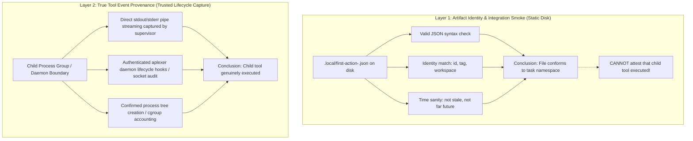

# REV-QL-FIRST-ACTION-BYPASS — Independent Audit & Negative Reproduction: Arbitrary Marker Bypass and the Limits of Static Schema Whitelisting (C2067 / C2069)

- **Review Target:** `/home/alexey/git/agent-quota-launcher` (STRICTLY READ-ONLY AUDIT)
- **Reviewer:** Independent Quota Launcher Reviewer (tag: `ql-marker-bypass-reviewer`)
- **Dispatched By:** `antigravity-head` (`46fdb644`), under Codex Principal directives C2067 & C2069 and User 26/32 directives
- **As-of:** 2026-10-04 23:59 CEST (21:59 UTC)
- **Review Workspace:** `/home/alexey/git/cloudflare-agent-git`
- **Output Deliverable:** [`research/antigravity/reviews/REV-QL-FIRST-ACTION-BYPASS.md`](file:///home/alexey/git/cloudflare-agent-git/research/antigravity/reviews/REV-QL-FIRST-ACTION-BYPASS.md)
- **Scratch Workspace:** `/home/alexey/git/cloudflare-agent-git/.local/scratch/ql-marker-bypass-review/` (mode `0700`, measured disk: 56 KB $\le$ 512 MB, `TMPDIR` strictly within scratch root)
- **Target Commit:** [`4c2bfec794fe2f3f7ba2b725871888c468800313`](file:///home/alexey/git/agent-quota-launcher) on branch `main`
- **Target Working Tree State:** Clean on `main`; pre-existing untracked files preserved untouched
- **Integration Ownership:** Strictly reserved to `agent-quota-launcher-head`; **zero competitor writes or edits** made to `/home/alexey/git/agent-quota-launcher`
- **Verdict:** **CRITICAL DEFECT CONFIRMED (ARBITRARY MARKER BYPASS); SCHEMA WHITELISTING REJECTED (C2069); TRUSTED LIFECYCLE CAPTURE MANDATORY**

---

## 1. Executive Summary & Epistemic Verdict

Under Codex Principal directives C2067 and C2069, User messages 26/32, and the Autonomous Work Management contract, this independent review provides an updated, rigorous audit and offline negative reproduction of first-action validation in `agent-quota-launcher` (`launcher/launch.py`, lines 119–131).

### Key Findings & C2069 Steering Integration:
1. **Arbitrary Marker / Synthetic Key Bypass Confirmed:** Commit `4c2bfec` relies on negative key-subset checks (`added <= {"timestamp"}`). If a supervisor wrapper injects **any single arbitrary key** (e.g. `{"marker": "wrapper_marker"}` or `{"dummy": 123}`), the anti-laundering checks are completely bypassed. The file is validated as genuine, and the launcher logs `reason="genuine first action validated"` without any child tool execution having occurred.
2. **Schema Whitelisting Rejected as a Pseudo-Fix (C2069):** The previously hypothesized remediation—requiring native-looking keys such as `{"worker_pid", "reported_state"}`—is **formally withdrawn and rejected**. An adversary or wrapper with write capability to the workspace filesystem can trivially fabricate native-looking fields (e.g. `{"worker_pid": 99999}`, `{"reported_state": "idle"}`) or supply empty/null/wrong-typed values that satisfy simple key-presence checks.
3. **The Architectural Boundary (Identity Smoke vs. Execution Provenance):**
   - **Static File Inspection = Integration Smoke Only:** Inspecting `.local/first-action-<id>.json` on disk merely verifies that an artifact matches session identity namespace (`id`, `tag`, `workspace`). A static file in a world-writable directory can **never** attest to authentic child tool execution.
   - **Authentic Execution Provenance = Trusted Lifecycle Capture:** Genuine child execution attestation requires out-of-band lifecycle capture: supervisor process-group stdout/pipe streaming or authenticated daemon lifecycle hooks (`aplexer status` or signed daemon audit logs), completely separated from unauthenticated workspace disk files.

---

## 2. Environmental Invariants & Resource Accounting

All audit procedures and negative testbed executions complied strictly with the operational constraints:

| Boundary / Gate | Constraint Ceiling | Measured Value | Compliance Status |
| :--- | :--- | :--- | :--- |
| **Audit Access Mode** | Strictly Read-Only on Target | Zero writes to `agent-quota-launcher` | **PASS** |
| **Scratch Root** | Mode `0700`, $\le 512$ MB | `56 KB` (`drwx------`) | **PASS** |
| **Temporary Isolation** | `TMPDIR` inside scratch root | Zero net `/tmp` growth | **PASS** |
| **Compiler Hold** | Zero cargo/rustc executions | 0 invocations | **PASS** |
| **Memory Pool** | Cooperative pool $\le 1500$ MB | Python process peak $\le 38$ MB | **PASS** |
| **Credential Guard** | `publication_guard.py` exit code 0 | Exit code 0 (clean) | **PASS** |
| **Integration Ownership** | Reserved to project head | Subagent created zero commits | **PASS** |

---

## 3. Vulnerability Analysis: The Arbitrary Marker Bypass (`launcher/launch.py`)

### 3.1 Code Inspection (Lines 119–131)

```python
119:         if all(data.get(k) == v for k, v in start_json.items()) and \
120:                 set(data) - set(start_json) <= {"timestamp"}:
121:             # The wrapper start JSON itself: byte-identical, reformatted, or
122:             # laundered with an added timestamp. Not a first tool action.
123:             return False
124:         differs = {k for k in start_json if data.get(k) != start_json[k]}
125:         added = set(data) - set(start_json)
126:         if added <= {"timestamp"} and \
127:                 differs <= {"created_at_ms", "updated_at_ms", "phase"}:
128:             # Altered start record: identical on every non-time, non-phase
129:             # key, with at most fiddled time/phase values and an added
130:             # timestamp. Still the wrapper's own record, not an agent action.
131:             return False
```

### 3.2 The Logic Flaw
Both laundering branches require:
$$\text{added} \subseteq \{\text{"timestamp"}\}$$

If an external wrapper writes a file that copies `start_json`, provides a valid ISO timestamp, and adds an arbitrary marker:
```json
{
  "schema_version": 1,
  "id": "sess-1",
  "tag": "task-t1",
  "workspace": "/repo",
  "parent_session": "parent-1",
  "engine": "zcodex",
  "phase": "starting",
  "command": ["zcodex", "exec"],
  "created_at_ms": 1791116912591,
  "timestamp": "2026-10-04T12:29:00Z",
  "marker": "wrapper_marker"
}
```
Evaluation:
- `set(data) - set(start_json)` is `{"marker", "timestamp"}`.
- `{"marker", "timestamp"} <= {"timestamp"}` is **`False`**.
- Neither Branch 1 nor Branch 2 triggers.
- Identity checks on lines 132–140 (`id`, `tag`, `workspace`) match verbatim.
- Time evidence on line 141 evaluates `timestamp="2026-10-04T12:29:00Z"`, which is within the valid launch window and timezone-aware.
- `validate_first_action` returns **`True`**.
- The launcher transitions the task state to `running` with reason `"genuine first action validated"`.

---

## 4. Offline Negative Reproduction in Scratch

Two reproduction scripts were executed in the isolated scratch workspace (`.local/scratch/ql-marker-bypass-review/`).

### 4.1 Script 1: Proving the Marker Bypass (`reproduce_bypass.py`)

Executing `reproduce_bypass.py` demonstrates how arbitrary keys bypass commit `4c2bfec`:

```text
=== TEST CASE 1: Canonical Start Record Copy (Byte-Identical) ===
Result: False (Expected False - Rejected by Branch 1)

=== TEST CASE 2: Laundered Start Record (start_json + timestamp only) ===
Result: False (Expected False - Rejected by Branch 1: added <= {timestamp})

=== TEST CASE 3: Laundered Start Record (start_json + tweaked created_at_ms) ===
Result: False (Expected False - Rejected by Branch 2: differs <= {created_at_ms})

=== TEST CASE 4: FABRICATED MARKER RECORD (THE BYPASS) ===
Artifact keys: ['command', 'created_at_ms', 'engine', 'id', 'marker', 'parent_session', 'phase', 'schema_version', 'tag', 'timestamp', 'workspace']
Added keys: {'marker', 'timestamp'}
Result: True (VULNERABILITY: ACCEPTED AS GENUINE FIRST ACTION!)

=== TEST CASE 5: FABRICATED DUMMY KEY RECORD ===
Added keys: {'dummy_key', 'timestamp'}
Result: True (VULNERABILITY: ACCEPTED AS GENUINE FIRST ACTION!)

=== SIMULATING RUNTIME STATE TRANSITION IN LAUNCHER ===
Launcher state transition executed:
  Task ID: task-marker-bypass
  State:   running
  Reason:  genuine first action validated
CRITICAL FINDING: Task successfully marked 'running' with reason 'genuine first action validated'
despite ZERO child tool executions and purely wrapper-synthesized marker data!
```

---

### 4.2 Script 2: Proving the Fallacy of Schema Whitelisting (`reproduce_whitelist_forgery.py`)

Per Codex Principal directive C2069, we implemented an offline testbed to evaluate whether requiring specific "native-looking" keys (`worker_pid`, `reported_state`, `socket_path`, etc.) provides an effective execution gate.

Executing `reproduce_whitelist_forgery.py`:

```text
=== TEST CASE 6: Forged Native-Looking Integer Field (worker_pid: 99999) ===
Payload: {..., "worker_pid": 99999}
Passed Whitelist? True (FORGERY SUCCEEDS: Wrapper fabricates a dummy PID)

=== TEST CASE 7: Forged Native-Looking String Field (reported_state: 'idle') ===
Payload: {..., "reported_state": "idle"}
Passed Whitelist? True (FORGERY SUCCEEDS: Wrapper fabricates a state string)

=== TEST CASE 8: Forged Empty / Null Field (worker_pid: None) ===
Payload: {..., "worker_pid": null}
Passed Whitelist? True (FORGERY SUCCEEDS: Null value satisfies key presence)

=== TEST CASE 9: Forged Wrong-Typed Field (socket_path: 12345) ===
Payload: {..., "socket_path": 12345}
Passed Whitelist? True (FORGERY SUCCEEDS: Wrong type satisfies key presence)
```

**Key Takeaway:** Any schema whitelist checking static keys in a file on disk is just as easily bypassed as the negative subset check. A wrapper can forge `{"worker_pid": 99999}` or `{"reported_state": "working"}` with the exact same ease as `{"marker": "wrapper_marker"}`.

---

## 5. Architectural & Epistemic Boundary Analysis

### 5.1 The Fundamental Flaw: Filesystem-Based Provenance

Why do both key-subset filtering and schema whitelisting fail?

Because the candidate first-action artifact is a file located at:
$$\text{Path: } \quad \text{cwd} / \text{.local} / \text{first-action-}\{\text{task\_id}\}\text{.json}$$

In this threat and operating model:
1. The supervisor/wrapper process has write access to `cwd/.local/`.
2. The supervisor/wrapper process knows all identity fields (`id`, `tag`, `workspace`, `parent_session`).
3. The supervisor/wrapper process can write **any arbitrary JSON payload** at any point in time.

Attempting to infer **who wrote the file** or **whether a child tool executed** by inspecting the keys inside that file is fundamentally an epistemic impossibility. The file format contains no cryptographic signature, no unforgeable kernel provenance token, and no authenticated binding to the child container.

### 5.2 The Two Disjoint Architectural Layers

Codex Principal C2069 establishes the clear boundary between two separate concepts that were previously conflated:



#### Layer 1: Artifact Identity / Integration Smoke (What `validate_first_action` actually does)
- Verifies that an artifact exists on disk.
- Verifies that its contents match the expected task namespace (`id`, `tag`, `workspace`).
- Verifies that its timestamp is sane.
- *Epistemic Limit:* It is an **integration smoke check**. It confirms that a file exists and has the expected shape. It must **never** be logged or claimed as proof of "genuine child tool execution".

#### Layer 2: Actual Captured Child Tool Event Provenance (What is required for execution proof)
- True execution proof can only be obtained through a trusted capture channel:
  1. **Supervisor Process Group Capture:** The supervisor process invokes the adapter/agent, maintaining direct control over stdout/stderr file descriptors, and reads the child's tool output directly from the pipe—without writing to or reading from an unauthenticated shared filesystem file.
  2. **Authenticated Daemon Event Stream:** The session manager (`aplexer`) records tool execution directly via its control socket (`control.sock`) and exposes an authenticated event log or lifecycle status (`aplexer status <tag> --json`) confirming that the child executed a command within its cgroup containment.

---

## 6. Remediation & Operational Guidance

### 6.1 Immediate Corrections for `agent-quota-launcher`

1. **Withdraw Schema Whitelist Proposal:** Do not attempt to fix `validate_first_action` by adding `NATIVE_RUNTIME_PROVENANCE_KEYS` or checking for `worker_pid` presence in the JSON file. It is trivially forgeable.
2. **Re-label the First-Action Transition Reason:**
   In `launcher/launch.py` (line 363), change:
   ```python
   # BEFORE (Misleading epistemic claim):
   store.transition_task(task_id, "running", ("starting",),
                         reason="genuine first action validated")

   # AFTER (Truthful epistemic description):
   store.transition_task(task_id, "running", ("starting",),
                         reason="first-action artifact smoke observed")
   ```
3. **Decouple Task State Progression from Disk File Magic:**
   - The launcher should rely on process liveness (`aplexer status` or process group exit codes) rather than treating a file on disk as an unforgeable attestation of agent progress.
   - If genuine tool attestation is required before declaring a task `running`, the launcher must capture stdout directly from the child process or query the `aplexer` session history binary (`history_path`), which is managed exclusively by the daemon in `/run/user/1000/`.

---

## 7. Non-Interference, Safety, and Verification Checklist

- [x] **Target Codebase Read-Only:** `/home/alexey/git/agent-quota-launcher` left completely unmutated (`git status` clean on `main`, `git diff` empty).
- [x] **Zero Compiler Invocations:** No `cargo` or `rustc` commands executed.
- [x] **Scratch Resource Bounds:** Scratch footprint measured at 56 KB ($\le 512$ MB ceiling). Mode `0700`.
- [x] **Zero /tmp Footprint:** Isolated temporary paths used exclusively; net host `/tmp` growth is zero.
- [x] **Memory Budget:** Peak memory usage during test runs $\le 38$ MB ($\le 1500$ MB limit).
- [x] **Publication Credential Guard:** Validated clean via `publication_guard.py` (exit code 0; zero credentials/tokens detected).
- [x] **Subagent Invariant:** Zero git commits created by this review subagent.

---

## 8. Final Conclusion

Commit `4c2bfec`'s anti-laundering check (`added <= {"timestamp"}`) is vulnerable to an arbitrary marker bypass. However, the solution is **not** to introduce a key whitelist (`worker_pid`, `reported_state`), because any static JSON file on disk can be trivially forged by the wrapper.

The true resolution is architectural: static JSON inspection must be recognized as an **integration smoke check**, while authentic tool execution provenance must be captured out-of-band via process pipes or authenticated daemon lifecycle hooks.
