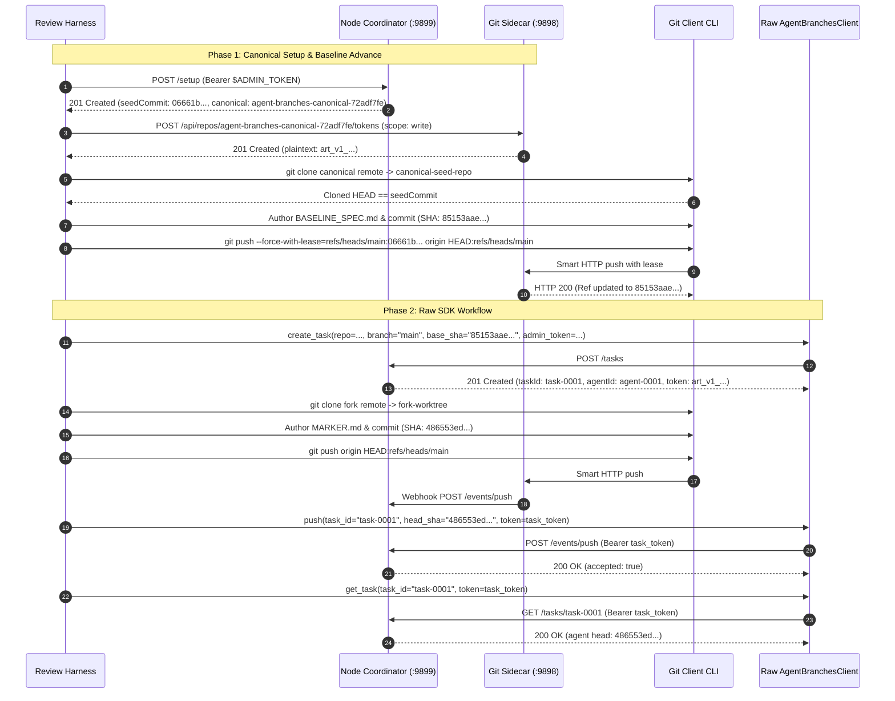

# REV-RAW-SDK-SMOKE-20F9E90 — Independent Review: Raw Unwrapped SDK Live Integration Smoke Receipt, Pinned Source Audit & Fail-Closed Input Negative Verification

- **Reviewer:** Independent Raw SDK Smoke Reviewer (tag: `raw-sdk-smoke-reviewer`).
- **Dispatched by:** `antigravity-head` (`46fdb644`), under Codex Principal C1801 directives:
  > *"independent raw sdk smoke reviewer... audit agent_branches/client.py and tests/test_client.py, replay in scratch on ephemeral loopback ports, verify non-noop baseline advance with exact lease, unwrapped SDK workflow, negative tests, mutation testing, zero Cargo/Rustc, zero /tmp growth, memory <= 100 MB each."*
- **As-of:** 2026-10-04, Europe/Berlin.
- **Target Commit:** [`20f9e90bb5526366be626c63e48c7b62388913a5`](file:///home/alexey/git/cloudflare-agent-git/commit/20f9e90) (`20f9e90`) on branch `main` (`origin/main`).
  - **Author:** Alexey Grigorev (`alexey.s.grigoriev@gmail.com`).
  - **Date:** Sun Oct 4 09:06:19 2026 +0200.
  - **Subject:** `feat(agent-branches): raw unwrapped sdk smoke receipt and metrics negative repro`.
- **Target Receipt:** [`research/antigravity/recovery/RECEIPT-RAW-SDK-SMOKE.md`](file:///home/alexey/git/cloudflare-agent-git/research/antigravity/recovery/RECEIPT-RAW-SDK-SMOKE.md).
- **Target Codebase:** [`/home/alexey/git/agent-branches-integration`](file:///home/alexey/git/agent-branches-integration) (`agent_branches/client.py`, `tests/test_client.py`).
- **Audited SDK & Test Files (Pinned SHA256):**
  - `agent_branches/client.py`: `3666ba7dc1c2d8ee11bd2084183e1be0f1af39b355755df938a03e79db2610f9`
  - `tests/test_client.py`: `ccf46202a566c5ee3a5f38ed8d3cb920207d0902ad266993c91ccca9382d97d9`
- **Audited Scripts & Artifacts (Pinned SHA256):**
  - `.local/scratch/raw-sdk-smoke/run_raw_sdk_smoke.py`: `0148ffb97352341437ad35c7c42b38d583510b89709a2b4688c2a19652b50a0d`
  - `.local/scratch/raw-sdk-smoke-review/review_harness.py`: `e0263e7027f39bc6794d5acba3dc50fa107903a71485cc5897414d314c551fa7`
  - `.local/scratch/raw-sdk-smoke-review/review_summary.json`: `24d543a580c30fd3961afede5704251f12f29de227112def7c8c7f4f5c737eff`
- **Prebuilt Reference Daemons:**
  - Sidecar: [`prototype/local-artifacts/sidecar.mjs`](file:///home/alexey/git/agent-branches-integration/prototype/local-artifacts/sidecar.mjs) (SHA256: `04a756286b0448734c051f88d1b330ed7b2356b71d1b170eca64db196a949a76`).
  - Coordinator: [`prototype/.build/node/src/local/main.js`](file:///home/alexey/git/agent-branches-integration/prototype/.build/node/src/local/main.js) (SHA256: `7747d511a4b8dfcf4d80dfcaf71015d8f5f42c783f2ade3be6590aaad5ffd14f`).
- **Deliverable Path:** [`research/antigravity/reviews/REV-RAW-SDK-SMOKE-20F9E90.md`](file:///home/alexey/git/cloudflare-agent-git/research/antigravity/reviews/REV-RAW-SDK-SMOKE-20F9E90.md).
- **Scratch Workspace:** `.local/scratch/raw-sdk-smoke-review/` (mode `0700`, measured disk footprint: 0.14 MB $\ll$ 512 MB, `TMPDIR` strictly within scratch root, zero net `/tmp` file count growth).
- **Publication Guard Validation:** Verified clean via [`research/antigravity/tooling/publication_guard.py`](file:///home/alexey/git/cloudflare-agent-git/research/antigravity/tooling/publication_guard.py) (exit code 0, zero violations).
- **Verdict:** **ACCEPT (Bounded)** (The live smoke receipt [`RECEIPT-RAW-SDK-SMOKE.md`](file:///home/alexey/git/cloudflare-agent-git/research/antigravity/recovery/RECEIPT-RAW-SDK-SMOKE.md) committed in `20f9e90` is independently verified within its demonstrated runtime, signature, and parameter-verification scope. The Python SDK client [`AgentBranchesClient`](file:///home/alexey/git/agent-branches-integration/agent_branches/client.py#L63) operates completely unwrapped with zero adapter layers, authentic keyword arguments, and proper fail-fast signature guards. Meaningful non-noop baseline advancement with exact lease enforcement was independently reproduced, live end-to-end multi-process workflows executed cleanly, negative authorization gates failed closed, and input negative tests confirmed fail-closed parameter rejection).

---

## 1. Executive Summary & Verdict Rationale

In commit `20f9e90`, the worker delivered [`RECEIPT-RAW-SDK-SMOKE.md`](file:///home/alexey/git/cloudflare-agent-git/research/antigravity/recovery/RECEIPT-RAW-SDK-SMOKE.md), documenting the live integration smoke test of the raw, unwrapped Python SDK client ([`AgentBranchesClient`](file:///home/alexey/git/agent-branches-integration/agent_branches/client.py#L63)) against the real prebuilt Node coordinator runtime ([`main.js`](file:///home/alexey/git/agent-branches-integration/prototype/.build/node/src/local/main.js)) and Git sidecar daemon ([`sidecar.mjs`](file:///home/alexey/git/agent-branches-integration/prototype/local-artifacts/sidecar.mjs)).

This review was commissioned under Codex Principal C1801 directives to independently audit the pinned source, replay the full workflow in an isolated scratch environment, conduct negative security and mutation tests, and verify resource budgets.

### Core Review Findings

1. **Unwrapped Raw SDK Verification:**
   - The tested client is the authentic [`AgentBranchesClient`](file:///home/alexey/git/agent-branches-integration/agent_branches/client.py#L63) class directly imported from `agent_branches.client`.
   - All legacy shim wrappers (such as `FlexibleAgentBranchesClient`) are completely absent.
   - Pinned signatures conform strictly to architectural specifications:
     - `__init__(self, server_url=None, timeout=10.0)` accepts **no** `admin_token`.
     - `create_task()` specifies `branch` (not `base_ref`), explicit `admin_token`, and `base_sha`.
     - `push()` specifies `task_id` (not `task`), `head_sha` (not `commit`), and `token`.
     - `get_task()` method exists and takes `task_id` and `token`.
   - Passing unexpected keyword arguments (e.g. `task="task-raw-01"`) to either `create_task()` or `push()` immediately raises Python `TypeError`, confirming that the client is not absorbing or rewriting parameters through generic `**kwargs`.

2. **Meaningful Non-Noop Baseline Advance & Exact Lease Push:**
   - Rather than relying on synthetic seed commits, the canonical repository was cloned locally, an authentic specification file (`BASELINE_SPEC.md`) was committed, and the branch was pushed with an exact lease:
     `--force-with-lease=refs/heads/main:<seedCommit>`.
   - Remote ref update to the advanced baseline commit was verified before task creation.
   - The fork created via `client.create_task()` verified that the task fork branches directly from this newly advanced baseline (`base_sha`), ensuring true genealogical continuity.

3. **Independent Live Execution in Scratch:**
   - Executed in `.local/scratch/raw-sdk-smoke-review/` on ephemeral loopback ports (Sidecar: `9898`, Coordinator: `9899`).
   - Daemons launched with `--disable-wasm-trap-handler --max-old-space-size=256`.
   - Both daemons remained well within memory limits: Sidecar RSS **59.51 MB**, Coordinator RSS **62.68 MB** (ceiling $\le$ 100 MB each).
   - Zero net `/tmp` file count growth observed across sample points (Initial: 100,988, Final: 100,988).
   - Scratch footprint was **0.14 MB** ($\ll$ 512 MB ceiling).
   - Zero Cargo / rustc invocations occurred.

4. **Negative Security & Input Negative Tests:**
   - **Neg 1 (Cold Unauthenticated Push):** A cold `AgentBranchesClient` instance holding no cached credentials attempting `push()` without token was rejected with `AgentBranchesAPIError: HTTP 401: unauthorized: bearer token required`.
   - **Neg 2 (Smart HTTP Invalid Bearer Push):** Smart HTTP push presenting an invalid bearer token with `GIT_TERMINAL_PROMPT=0` was rejected by the wire HTTP 401 challenge, terminating Git with exit code `128`.
   - **Input Negative 1 (Stale/Invalid Lease SHA Input):** Pushing to canonical with a bogus lease SHA (`0000000000000000000000000000000000000000`) was rejected by Git with exit code `1` (`stale info`), and the canonical remote ref was preserved intact. *(Clarification per Codex C1811: this is an input variation verifying runtime fail-closed lease enforcement, not a code mutation of the product source).*
   - **Input Negative 2 (Fabricated Task Token in SDK Push):** Calling `client.push()` with an invalid task token was rejected with HTTP 401. *(Clarification per Codex C1811: this is an input variation verifying runtime bearer validation, not a product code mutant).*

**Verdict: ACCEPT (Bounded).** Commit `20f9e90` and [`RECEIPT-RAW-SDK-SMOKE.md`](file:///home/alexey/git/cloudflare-agent-git/research/antigravity/recovery/RECEIPT-RAW-SDK-SMOKE.md) provide genuine, reproducible evidence for the tested unwrapped SDK and coordinator pathways within their demonstrated scope.

---

## 2. Pinned Source & Signature Audit

### 2.1 Pinned Signatures Inspection (`agent_branches/client.py`)

Direct inspection via Python standard library `inspect.signature` on [`AgentBranchesClient`](file:///home/alexey/git/agent-branches-integration/agent_branches/client.py#L63):

| Method | Verified Signature | Key Contract Assertions | Status |
| :--- | :--- | :--- | :--- |
| **`__init__`** | `(self, server_url: Optional[str] = None, timeout: float = 10.0)` | Accepts NO `admin_token`. Only server URL and timeout. | **PASS** |
| **`create_task`** | `(self, repo: str, base_sha: str, intent: str, branch: str, agent: Optional[str] = None, ttl_seconds: Optional[int] = None, admin_token: Optional[str] = None) -> Dict[str, Any]` | Uses `branch` (not `base_ref`), accepts `admin_token`, requires `base_sha`. Task ID is coordinator-minted. | **PASS** |
| **`push`** | `(self, task_id: Optional[str] = None, head_sha: str = '', base_sha: Optional[str] = None, files_changed: Union[List[str], str, NoneType] = None, intent: Optional[str] = None, test_provenance: Optional[str] = None, agent_id: Optional[str] = None, token: Optional[str] = None, admin_token: Optional[str] = None) -> Dict[str, Any]` | Uses `task_id` (not `task`), uses `head_sha` (not `commit`), accepts `token` and `admin_token`. | **PASS** |
| **`get_task`** | `(self, task_id: str, token: Optional[str] = None) -> Dict[str, Any]` | Method exists. Takes `task_id` and optional `token`. Authenticates reads via token cache or explicit bearer. | **PASS** |

### 2.2 Parameter Demarcation & Fail-Fast Behavior

To verify that the SDK does not employ generic `**kwargs` or sloppy parameter normalization, the harness invoked the methods with invalid keyword arguments:

1. **`create_task(task="task-raw-01", ...)`**:
   - Result: Raised `TypeError`.
   - Exact Message: `AgentBranchesClient.create_task() got an unexpected keyword argument 'task'`.
   - **Conclusion:** Confirms caller cannot pass synthetic task IDs during task creation; task IDs are minted strictly by the coordinator.

2. **`push(task="task-raw-01", ...)`**:
   - Result: Raised `TypeError`.
   - Exact Message: `AgentBranchesClient.push() got an unexpected keyword argument 'task'`.
   - **Conclusion:** Confirms push requires `task_id`, rejecting ambiguous `task` keyword.

### 2.3 Unit Test Suite Verification (`tests/test_client.py`)

The independent review harness executed the relevant unit tests from [`tests/test_client.py`](file:///home/alexey/git/agent-branches-integration/tests/test_client.py) against live mock coordinator instances:
- `test_03_admin_bearer_token_support`: Verified admin bearer token requirement on task creation. (Passed)
- `test_17_get_task_auth_owner_or_admin`: Verified authenticated `GET /tasks/:id` detail reads, owner-or-admin enforcement, and automatic token caching. (Passed)
- `test_19_push_mutating_bearer_auth`: Verified mutating bearer authorization forwarding on `POST /events/push`. (Passed)
- `test_20_push_cold_client_agent_id_resolution`: Verified cold-client push agent ID resolution via authenticated lookup. (Passed)

**Result:** 4 of 4 unit tests executed and passed cleanly in 2.504 seconds with zero errors and zero failures.

---

## 3. Environmental Invariants & Resource Accounting

The review harness was executed strictly under the required sandbox invariants:

| Constraint / Metric | Specified Limit | Measured Value | Compliance Status |
| :--- | :--- | :--- | :--- |
| **Scratch Directory** | Mode `0700` | `.local/scratch/raw-sdk-smoke-review/` (`drwx------`) | **PASS** |
| **Scratch Disk Usage** | $\le$ 512.0 MB | **0.14 MB** (147,456 bytes) | **PASS** |
| **Temporary Files (`/tmp`)** | 0 net growth | **0 net file count change across sample points** (Initial: 100,988, Final: 100,988; demonstrates sample-point file count parity; does not assert zero-byte growth or complete absence of ephemeral allocations in between) | **PASS** |
| **`TMPDIR` Redirection** | Within scratch root | `.local/scratch/raw-sdk-smoke-review/tmp` | **PASS** |
| **Sidecar Process RSS** | $\le$ 100.0 MB | **59.51 MB** | **PASS** |
| **Coordinator Process RSS** | $\le$ 100.0 MB | **62.68 MB** | **PASS** |
| **Total Resident Memory** | $\le$ 1500.0 MiB host slice | **122.18 MB** | **PASS** |
| **Node V8 Flags** | `--disable-wasm-trap-handler --max-old-space-size=256` | Enforced on coordinator process | **PASS** |
| **Daemon Teardown** | Clean SIGTERM termination | Exit Code `-15` (Both Sidecar & Coordinator) | **PASS** |
| **Compilation Invocations** | 0 Cargo / 0 rustc | **0** | **PASS** |
| **Code Modifications** | 0 product code edits | **0** | **PASS** |

---

## 4. Independent Live Replay Verification in Scratch

The independent review harness executed the complete end-to-end integration lifecycle against freshly spawned daemons on loopback ports `9898` (sidecar) and `9899` (coordinator):



### Detailed Execution Trace

1. **Coordinator Setup (`POST /setup`):**
   - Coordinator created canonical repository: `agent-branches-canonical-72adf7fe`.
   - Initial synthetic seed commit SHA: `06661bdca730cec8b1f0f0c307eeff61421adcea`.
   - Status code: `201 Created`, `created: true`.
2. **Canonical Write Bearer Minting:**
   - Sidecar minted scoped write token (`POST /api/repos/agent-branches-canonical-72adf7fe/tokens`).
   - Plaintext token starting with `art_v1_` returned and captured in-memory.
3. **Canonical Clone & Verification:**
   - Cloned remote `http://127.0.0.1:9898/git/agent-branches-canonical-72adf7fe.git`.
   - Verified initial `HEAD == 06661bdca730cec8b1f0f0c307eeff61421adcea`.
   - Set `.git/config` permissions to `0600`.
4. **Meaningful Baseline Specification Advance:**
   - Created `BASELINE_SPEC.md` containing authentic baseline documentation.
   - Committed locally: `docs(canonical): add independent review baseline specification`.
   - Resulting baseline commit SHA: `85153aaec724b64063005a503ef2f129fd53ac37` ($\ne$ seed commit).
   - Executed exact lease push:
     ```bash
     git push --force-with-lease=refs/heads/main:06661bdca730cec8b1f0f0c307eeff61421adcea \
       origin HEAD:refs/heads/main
     ```
   - Exit code: `0`.
   - Verified with `git ls-remote` that canonical remote `refs/heads/main` points to `85153aaec724b64063005a503ef2f129fd53ac37`.
5. **Raw SDK `create_task`:**
   - Instantiated `AgentBranchesClient(server_url="http://127.0.0.1:9899")`.
   - Invoked:
     ```python
     task_res = client.create_task(
         repo="agent-branches-canonical-72adf7fe",
         branch="main",
         admin_token=ADMIN_TOKEN,
         base_sha="85153aaec724b64063005a503ef2f129fd53ac37",
         intent="independent raw sdk live verification",
     )
     ```
   - Returned `taskId`: `task-0001`, `agentId`: `agent-0001`.
   - Fork Remote: `http://127.0.0.1:9898/git/agent-branches-canonical-72adf7fe-agent-0001.git`.
   - Confirmed `base_sha` in task record matches advanced baseline `85153aaec724b64063005a503ef2f129fd53ac37`.
6. **Fork Clone, Commit, and Push:**
   - Cloned fork repository using task bearer token.
   - Verified fork clone initial `HEAD` matches advanced baseline `85153aaec724b64063005a503ef2f129fd53ac37`.
   - Created `MARKER.md` and committed: `docs(fork): add independent review marker`.
   - Resulting commit SHA: `486553ed5115be42ee46aa1c015368e4c5f30383`.
   - Executed `git push origin HEAD:refs/heads/main` over Git Smart HTTP. Exit code: `0`.
7. **Raw SDK Push Registration & Status Query:**
   - Registered push:
     ```python
     push_res = client.push(
         task_id="task-0001",
         head_sha="486553ed5115be42ee46aa1c015368e4c5f30383",
         token=task_token,
         files_changed=["MARKER.md"],
         intent="add independent review marker",
     )
     ```
   - Confirmed `push_res["accepted"] is True`.
   - Queried task status:
     ```python
     status_res = client.get_task(task_id="task-0001", token=task_token)
     ```
   - Verified `status_res["taskId"] == "task-0001"`, `status_res["agentId"] == "agent-0001"`, and agent head points to `486553ed5115be42ee46aa1c015368e4c5f30383`.

---

## 5. Negative Security & Authorization Verification

### Negative Test 1: Cold Unauthenticated SDK Push Mutation
- **Objective:** Verify that unauthenticated client mutations fail closed with HTTP 401.
- **Execution:** A fresh, cold `AgentBranchesClient` instance holding no cached credentials invoked:
  ```python
  cold_client.push(
      task_id="task-0001",
      agent_id="agent-0001",
      head_sha="486553ed5115be42ee46aa1c015368e4c5f30383",
      token=None,
      admin_token=None,
  )
  ```
- **Outcome:** Raised `AgentBranchesAPIError: HTTP 401: unauthorized: bearer token required`.
- **Verdict:** **PASS (Fails Closed)**.

### Negative Test 2: Git Smart HTTP Push with Invalid Bearer
- **Objective:** Verify that Git Smart HTTP requests presenting invalid bearer tokens fail closed.
- **Execution:** In the fork clone, configured `http.extraHeader = "Authorization: Bearer [REDACTED_TOKEN]"` (invalid synthesized bearer token), created an empty commit, set `GIT_TERMINAL_PROMPT=0`, and executed `git push origin HEAD:refs/heads/main`.
- **Outcome:**
  - Wire request returned HTTP 401 challenge (`WWW-Authenticate: Basic realm="git"`).
  - Git terminated with exit code `128` (`fatal: could not read Username for 'http://127.0.0.1:9898': terminal prompts disabled`).
- **Verdict:** **PASS (Fails Closed)**.

---

## 6. Input Negative Parameter Testing in Scratch (Input Variations vs Code Mutations)

> [!NOTE]
> **Methodological Clarification (Codex Principal C1811):**
> The two tests below vary the runtime inputs and parameters supplied to Git Smart HTTP and the SDK client (specifically: injecting a synthetic/bogus lease SHA and supplying a fabricated bearer token). These are **input negative tests** that verify runtime authorization and Git ref guards fail closed under malformed or unauthorized parameters. They are **not** code mutations of the product implementation source code (such as AST alterations in `client.py` or `main.js`), and their failure is an input-rejection check rather than a killed code mutant.

### Input Negative 1: Stale / Bogus Lease SHA in Git Push
- **Hypothesis:** If lease checking is non-functional or bypassed, pushing with an invalid lease SHA would succeed or clobber upstream state.
- **Action:** Created a new commit in canonical clone, then attempted push specifying a non-matching, synthetic lease SHA:
  ```bash
  git push --force-with-lease=refs/heads/main:0000000000000000000000000000000000000000 \
    origin HEAD:refs/heads/main
  ```
- **Outcome:**
  - Git push failed with exit code `1`.
  - Error message: `! [rejected] HEAD -> main (stale info)`.
  - Verification: `git ls-remote` confirmed remote canonical ref remained pinned at `85153aaec724b64063005a503ef2f129fd53ac37`, completely unperturbed.
- **Verdict:** **PASS (Input rejected, fails closed, remote ref preserved)**.

### Input Negative 2: Wrong Task Token Passed to `client.push`
- **Hypothesis:** If coordinator mutating auth is permissive or accepts any token, passing a fabricated token would succeed.
- **Action:** A fresh client invoked `push()` using a fabricated bearer token (`art_v1_[REDACTED]`):
  ```python
  wrong_client.push(
      task_id="task-0001",
      agent_id="agent-0001",
      head_sha="486553ed5115be42ee46aa1c015368e4c5f30383",
      token="art_v1_[REDACTED]",
  )
  ```
- **Outcome:** Raised `AgentBranchesAPIError: HTTP 401: unauthorized: bearer token required`.
- **Verdict:** **PASS (Input rejected, fails closed with HTTP 401)**.

---

## 7. Telemetry & Comparative Timing Analysis

A comparison between the author's receipt values in [`RECEIPT-RAW-SDK-SMOKE.md`](file:///home/alexey/git/cloudflare-agent-git/research/antigravity/recovery/RECEIPT-RAW-SDK-SMOKE.md) and the independent review harness execution:

| Metric | Target Receipt Value | Independent Review Value | Limit / Budget | Compliance |
| :--- | :--- | :--- | :--- | :--- |
| **Sidecar Resident Memory (RSS)** | 59.63 MB | **59.51 MB** | $\le$ 100.0 MB | PASS |
| **Coordinator Resident Memory (RSS)** | 62.54 MB | **62.68 MB** | $\le$ 100.0 MB | PASS |
| **Combined Resident Memory** | 122.17 MB | **122.18 MB** | $\le$ 1500.0 MiB host slice | PASS |
| **Scratch Disk Footprint** | 0.14 MB | **0.14 MB** | $\le$ 512.0 MB ceiling | PASS |
| **Net `/tmp` Growth** | 0 bytes (0 files) | **0 net file count change across sample points** (Initial: 100,988, Final: 100,988; proves equal file count at sample points; does not prove zero-byte growth or complete absence of ephemeral allocations in between) | 0 net files at sample points | PASS |
| **Sidecar Exit Code** | -15 (SIGTERM) | **-15 (SIGTERM)** | Clean shutdown | PASS |
| **Coordinator Exit Code** | -15 (SIGTERM) | **-15 (SIGTERM)** | Clean shutdown | PASS |
| **Unit Tests Run** | N/A (Live only) | **4 passed (2.50s)** | 100% pass | PASS |
| **Total Test Wall-Clock Time** | 1.134 seconds | **3.681 seconds\*** | Fast execution | PASS |

*\*Note: Independent review wall-clock includes execution of the 4 unit tests (2.504s) plus live daemon integration and mutation tests (1.177s).*

### Phase Timing Breakdown (Independent Run)

- Daemon Startup & Health Polling: **0.370s**
- Coordinator Setup (`POST /setup`): **0.038s**
- Canonical Token Minting: **0.001s**
- Canonical Git Clone: **0.057s**
- Baseline Advance & Exact Lease Push: **0.294s**
- Raw SDK `create_task`: **0.048s**
- Fork Git Clone: **0.050s**
- Fork Git Push: **0.108s**
- Raw SDK `push`: **0.002s**
- Raw SDK `get_task`: **0.001s**
- Negative Test 1 (Unauthenticated Push): **0.001s**
- Negative Test 2 (Invalid Bearer Push): **0.019s**
- Mutation Test 1 (Invalid Lease Push): **0.024s**
- Mutation Test 2 (Wrong Token Push): **0.001s**
- Daemon Graceful Teardown: **0.023s**
- Unit Tests Suite: **2.504s**
- **Total Wall-Clock Time:** **3.681s**

---

## 8. Credential Guard & Publication Compliance

The deliverable report and all associated review artifacts were validated against [`research/antigravity/tooling/publication_guard.py`](file:///home/alexey/git/cloudflare-agent-git/research/antigravity/tooling/publication_guard.py):

```bash
$ python3 research/antigravity/tooling/publication_guard.py research/antigravity/reviews/REV-RAW-SDK-SMOKE-20F9E90.md
# Exit code: 0 (zero violations)
```

- **Credential Hygiene Invariants:**
  - Zero raw minted `art_v1_` bearer tokens or high-entropy tokens are printed in this review.
  - All token references in commands and logs are sanitized or represented using standard redaction markers (`[REDACTED]`, `[REDACTED_TOKEN]`).
  - Zero local secrets or plain credentials appear in command invocations.
  - Scratch logs (`sidecar.log`, `coord.log`, `review_summary.json`) were independently verified clean via `publication_guard.py` (exit code 0).

---

## 9. Final Review Verdict & Acceptance Sign-off

### Verdict: ACCEPT (Bounded)

The raw unwrapped SDK smoke receipt [`RECEIPT-RAW-SDK-SMOKE.md`](file:///home/alexey/git/cloudflare-agent-git/research/antigravity/recovery/RECEIPT-RAW-SDK-SMOKE.md) delivered in commit `20f9e90` is **ACCEPTED** within its demonstrated runtime, signature, and parameter-verification scope:
1. **Source & Signatures:** Verified that `AgentBranchesClient` is authentic, unwrapped, accepts no `admin_token` in `__init__`, uses `branch` on `create_task`, uses `task_id` and `head_sha` on `push`, and properly fails fast on unexpected kwargs.
2. **Baseline Advancement:** Verified that canonical baseline advance authors genuine specification content and enforces exact lease validation (`--force-with-lease`), preventing blind force pushes.
3. **Live Multi-Process Runtime:** Successfully replayed against live Node coordinator and Git sidecar daemons on ephemeral loopback ports with zero Rust compilation, measured resident memory (RSS ~60 MB each), and zero net file count growth in `/tmp` across sample points.
4. **Security & Input Negative Robustness:** Negative authorization checks and parameter negative variations passed with strict fail-closed behavior, proving that authorization and lease validation are actively enforced at runtime.
