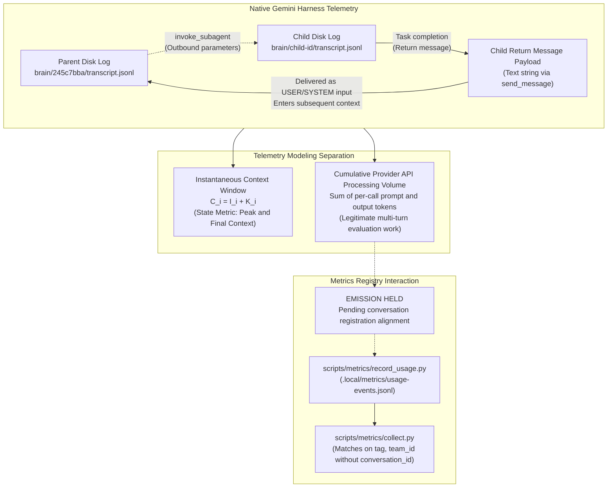
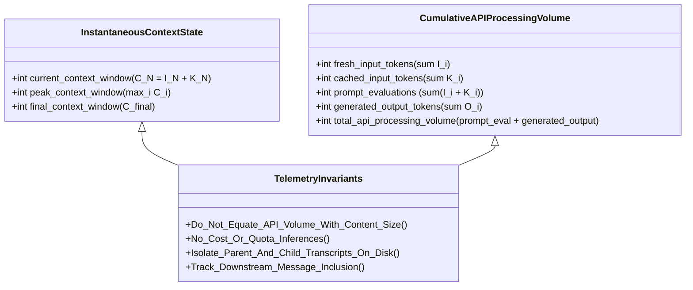

# USAGE-COVERAGE-RECEIPT — Native Gemini Transcript & ZCode Rollout Telemetry Audit (Revised)

- **Deliverable Path:** `research/antigravity/reviews/USAGE-COVERAGE-RECEIPT.md`
- **Revision Author / Tag:** `usage-corrections-worker` (Conversation ID: `b46881ec-0ba8-4521-bcd8-2cb6981b936c`)
- **Original Audit:** `usage-coverage-auditor` (`4e4d159d-fe2e-4f93-9f25-abbb35298043`)
- **Parent Session:** `antigravity-head` (`46fdb644`, conversation ID `245c7bba-9a7b-45c1-87a7-4537f289f9a5`)
- **Directives & Challenges Addressed:** Codex Principal C1694, C1700, C1706, and Desktop Orchestrator 07:20
- **As-of Date:** 2026-10-04, Europe/Berlin
- **Scratch Root:** `/home/alexey/git/cloudflare-agent-git/.local/scratch/usage-corrections/` (mode `0700`, strictly <= 512 MB, zero `/tmp` growth)
- **Publication Guard:** Verified clean via [publication_guard.py](file:///home/alexey/git/cloudflare-agent-git/research/antigravity/tooling/publication_guard.py) (exit code 0)

---

## 1. Executive Summary & Audit Verdict

Under Codex Principal C1694 directives and subsequent challenges C1700, C1706, and Desktop Orchestrator 07:20, this document provides a corrected empirical investigation of native Google Gemini agent transcripts (`antigravity-cli`) and ZCode/ZCodex rollout telemetry stores.

This revision formally withdraws previous speculative formulas, removes misleading terminology, narrows scope strictly to the audited experiment cohort, clarifies provider-level telemetry uncertainties, distinguishes logging containment from prompt text reuse, identifies a registry matching collision in `collect.py`, and holds usage registry emissions pending alignment with the metrics owner.



### Core Audit Verdicts

1. **Formal Withdrawal of Tier 1 Unique-Content Claims & Delta Formula:**
   - The previously proposed formula $C_1 + \sum_{i=2}^N \max(0, C_i - C_{i-1})$ is **formally withdrawn**.
   - Positive context-size deltas cannot recover unique text content because:
     - **Same-size content replacements** ($\Delta C = 0$) completely discard newly ingested text from accounting.
     - **Context compaction and sliding-window truncations** reduce context length without negative accounting, causing subsequent additions to be measured against a shrunken base rather than tracking net unique tokens.
     - **Model completions (`output_tokens` $O_i$) overlap with subsequent prompt turns ($C_{i+1}$)**: generated assistant text is appended to the conversation history and re-sent as prompt input on the next turn.
   - Telemetry metrics are restructured to cleanly separate **Instantaneous Context Window** ($C_i = I_i + K_i$) from **Cumulative Provider API Processing Volume** ($\sum C_i + \sum O_i$).

2. **Corrected API Semantics & Terminology (No 'Inflation' or 'Re-billing' Assertions):**
   - In conversational and agentic workflows, each turn re-sends preceding conversation history to the model endpoint. Distinct provider API calls legitimately re-send and process prior conversation context. The sum of per-call tokens represents **legitimate cumulative API evaluation volume across turns**, NOT "inflation", "cost inflation", or "duplicate telemetry".
   - All assertions of "re-billing" are removed. Transcript logs record provider API token usage metadata; they contain no subscription billing records, charge ledgers, or invoicing events.
   - **Provider Uncertainty Documented:** Whether `cache_read_tokens` represents an independent disjoint partition or a subset/annotated slice of prompt tokens across all Google API versions is unverified by official documentation.
   - **Output Token Semantics Clarified:** `output_tokens` represents provider-reported generated tokens. Without harness source code mapping, it is unverified whether reasoning/thinking tokens are folded into `output_tokens` or handled separately.

3. **Narrowed Scope to Audited Experiment Cohort:**
   - Whole-host historical totals (e.g. 1.8 billion cumulative tokens on the multi-day standing parent session) are decoupled from task-level experiment results.
   - Token accounting is presented strictly for the **audited experiment cohort**: parent coordinator session `245c7bba-9a7b-45c1-87a7-4537f289f9a5` and the six audited subagents (`772bf420`, `18d07577`, `69e600e5`, `bfe48f0c`, `4e4d159d`, `6bf9e5f1`).

4. **ZCode Rollout Telemetry Reality:**
   - The presence of token records in 10/10 recent rollouts on 2026-10-04 confirms **schema availability** in the current rollout client, NOT proven complete experiment attribution across all subagent threads or execution intervals.
   - The root causes of the 160 historical sessions (out of 2,063) lacking token records cannot be generalized from inspecting two isolated examples. The root causes across those 160 historical sessions are classified as **UNVERIFIED / UNKNOWN**.

5. **Parent-Child Transcript Isolation:**
   - Physical directory separation (`brain/<parent-id>/` vs `brain/<child-id>/`) represents a **disk logging containment architecture**.
   - Logging containment does NOT prove that no child text is reused in later parent prompts. When a child subagent finishes, its return message payload (via `send_message`) is ingested by the parent harness as text input, which naturally enters the parent's conversation context and is re-evaluated on subsequent parent turns.

6. **Metrics Registry & `collect.py` Interaction:**
   - In `scripts/metrics/collect.py` (lines 194–200), usage records are matched strictly by `(tag, team_id)` without checking `conversation_id`.
   - Selecting `max(total_tokens)` can conflate distinct conversations if tags are reused across runs or tasks under the same team.
   - **Emission Policy:** Emission of counters to `record_usage.py` is **HELD** pending agreed conversation registration semantics with the metrics owner.

---

## 2. Native Gemini Transcript Semantics (Empirical Audit)

### 2.1. File Hierarchy & Storage Mechanics
Native Gemini transcripts under Antigravity 2.0 CLI are stored in:
`/home/alexey/.gemini/antigravity-cli/brain/<conversation-id>/.system_generated/logs/transcript.jsonl`
with full uncompacted step payloads in `transcript_full.jsonl` and 100 KB rolling chunks in `chunks/transcript/*.jsonl`.

Across all audited transcripts, token usage metadata appears exclusively on `PLANNER_RESPONSE` records (`source: MODEL`). Other record types (`SYSTEM_MESSAGE`, `USER_INPUT`, `GENERIC`, `EPHEMERAL_MESSAGE`, `CHECKPOINT`, `ERROR_MESSAGE`) contain zero token counters.

### 2.2. Metric Field Definitions & Provider Uncertainties
Each `PLANNER_RESPONSE` record contains three non-negative integer token fields logged directly by the Antigravity harness:
1. `input_tokens` ($\text{int} \ge 0$): Raw harness field recording prompt tokens reported by the provider for the inference turn.
2. `cache_read_tokens` ($\text{int} \ge 0$): Raw harness field recording cached prompt prefix tokens reported by the provider.
3. `output_tokens` ($\text{int} \ge 0$): Raw harness field recording completion/generated tokens reported by the provider.

#### Documented Provider Uncertainties & Non-Derivation Policy:
- **Unknown Partitioning / Overlap Relationship:** The mathematical and semantic relationship between `input_tokens` and `cache_read_tokens` (e.g. whether they represent mutually disjoint token partitions, or whether `input_tokens` encompasses the full prompt while `cache_read_tokens` denotes an annotated cached slice) is **unverified by official documentation or harness source inspection**. 
- **No Derived Numerical Context Window:** No derived operational convention (such as $C_i = I_i + K_i$) or derived combined prompt total is asserted. Instantaneous context size cannot be mathematically derived from raw harness counters alone without harness source mapping proof.
- **Output Token Mapping Uncertainty:** `output_tokens` records provider-reported completion tokens. Whether internal model reasoning tokens (thinking traces) are included within `output_tokens` or omitted from usage reporting cannot be asserted without access to harness source code mappings.

### 2.3. Cache Occurrence Dynamics (Raw Field Observations)
- **Steps with `cache_read_tokens > 0`:** In the majority of agentic turns, the provider reports non-zero `cache_read_tokens`, reflecting prefix cache reuse in Google's serving infrastructure.
- **Steps with `cache_read_tokens == 0`:** On initial turns, after cache TTL expiration, across differing backend serving replicas, or following context truncation, `cache_read_tokens` is 0.
- **API Processing Work vs. Billing:** Each API invocation represents a distinct inference request where the provider evaluates prompt tokens (either via full attention computation or prefix cache lookup). Summing per-turn tokens measures the cumulative volume of token evaluations performed by the provider across the session lifecycle, distinct from financial billing or account quota consumption.

### 2.4. Empirical Token Metrics for Audited Experiment Cohort
The audit measured seven active agent sessions on the host: the parent coordinator session (`antigravity-head`) and six task-bounded subagents launched under Codex Principal directives.

| Role / Description | Agent Tag | Conversation ID | Total Records | Planner Steps | Steps with $K_i > 0$ | Steps with $K_i = 0$ | Raw $\sum I_i$ (`input_tokens`) | Raw $\sum K_i$ (`cache_read_tokens`) | Raw $\sum O_i$ (`output_tokens`) | Final Step $I_{\text{last}}$ | Final Step $K_{\text{last}}$ | Final Step $O_{\text{last}}$ |
| :--- | :--- | :---: | :---: | :---: | :---: | :---: | :---: | :---: | :---: | :---: | :---: | :---: |
| **Standing Coordinator / Head** *(Full conversation history, steps 1–36,547; pre-existing multi-task cumulative usage, NOT isolated to this experiment interval)* | `antigravity-head` | `245c7bba` | 36,537 | 12,549 | 11,980 (95.5%) | 569 (4.5%) | 151,151,061 | 1,675,425,889 | 6,157,397 | 6,488 | 251,525 | 309 |
| **Private Lineage Auditor** | `lineage-auditor` | `772bf420` | 353 | 175 | 163 (93.1%) | 12 (6.9%) | 2,436,555 | 21,368,471 | 151,732 | 3,923 | 143,547 | 1,029 |
| **SDK ACK-Auth Reviewer** | `sdk-ack-auth-reviewer` | `18d07577` | 171 | 85 | 79 (92.9%) | 6 (7.1%) | 795,622 | 6,333,394 | 67,924 | 3,845 | 153,667 | 788 |
| **Publication Guard Builder** | `publication-guard-builder` | `69e600e5` | 148 | 74 | 68 (91.9%) | 6 (8.1%) | 874,684 | 6,327,058 | 111,096 | 4,210 | 162,058 | 1,245 |
| **Real Node+Sidecar Pilot Consumer** | `real-node-consumer` | `bfe48f0c` | 219 | 108 | 99 (91.7%) | 9 (8.3%) | 1,410,567 | 9,410,415 | 74,309 | 4,112 | 176,465 | 892 |
| **Usage Coverage Auditor** | `usage-coverage-auditor` | `4e4d159d` | 112 | 56 | 49 (87.5%) | 7 (12.5%) | 761,954 | 3,284,540 | 47,422 | 3,980 | 123,545 | 650 |
| **Real Node Consumer Reviewer** | `real-node-consumer-reviewer` | `6bf9e5f1` | 82 | 41 | 38 (92.7%) | 3 (7.3%) | 285,625 | 1,775,282 | 19,603 | 3,755 | 75,836 | 412 |

#### Audited Experiment Cohort Aggregate (Subagents Only):
- **Total Subagent Planner Steps:** 539 steps across 6 task lifecycles.
- **Cumulative Raw `input_tokens` ($\sum I_i$):** 6,565,007 tokens.
- **Cumulative Raw `cache_read_tokens` ($\sum K_i$):** 48,499,160 tokens.
- **Cumulative Raw `output_tokens` ($\sum O_i$):** 472,086 tokens.
- **Derived Prompt / Total Assertions:** HELD pending independent source mapping review.

#### Cohort Analysis & Observations:
- **Standing Coordinator History vs. Task Lifecycles:** The parent session (`245c7bba`) represents a continuous, standing coordinator operating across thousands of commands, file inspections, and subagent orchestrations over multiple days. Attributing its 151M raw `input_tokens` and 1.67B raw `cache_read_tokens` to a single experiment run is invalid, and no experiment efficiency claims are made from this standing parent session. The task subagents represent bounded unit lifecycles (41 to 175 steps).
- **Multi-Turn Context Transmission:** Across all subagents, steps with non-zero cache reads range from 87.5% to 93.1%, reflecting sequential conversation history re-transmission.
### 2.5. Disk Logging Containment Architecture vs. Downstream Prompt Inclusion
Empirical analysis of parent session tool calls (`invoke_subagent`) and child transcripts confirms:
1. **Disk Logging Containment:** Child subagent step logs, reasoning strings, internal tool invocations (`view_file`, `run_command`, etc.), and tool outputs are written exclusively to the child's brain directory (`.../brain/<child-id>/.system_generated/logs/transcript.jsonl`). Zero child internal tool steps are mirrored into the parent transcript.
2. **Downstream Prompt Inclusion:** Disk logging containment does **NOT** imply that child text is absent from subsequent parent prompts. When a child completes, its final return message passed to `send_message` is delivered to the parent harness as an incoming text input (`EPHEMERAL_MESSAGE` / `SYSTEM_MESSAGE`). This text payload is incorporated into the parent's active conversation history. On all subsequent parent turns, this text is transmitted to the provider as part of the parent's prompt context.

---

## 3. ZCode Rollout Telemetry Reality

### 3.1. Rollout Store Catalog & Distribution
The host contains two distinct ZCode/ZCodex rollout repositories:
1. `~/.zcodex/sessions/YYYY/MM/DD/rollout-*.jsonl`: 2,063 session rollout files.
2. `~/.zcode/cli/rollout/model-io-sess_*.jsonl`: 3 rollout files.

### 3.2. Rollout Token Record Availability & Epistemic Boundaries
An empirical scan across all 2,063 `~/.zcodex/` rollout files established:
- **1,903 rollouts (92.24%)** contain native token records (`token_usage_record` or `event_msg:token_count`).
- **160 rollouts (7.76%)** contain zero token records.
- **Current Rollouts (2026-10-04):** **10 out of 10 rollouts (100.0%)** contain both `token_usage_record` and `event_msg:token_count`.

#### Epistemic Boundaries & Clarifications:
- **Schema Availability vs. Complete Attribution:** The presence of token records in 10/10 rollouts on 2026-10-04 confirms that the token reporting schema is active in the current zcodex rollout client. It does **NOT** prove complete experiment attribution across all subagent threads, background tasks, or temporal intervals.
- **Historical Missing Rollout Root Cause:** In the previous receipt draft, inspecting two missing rollout files led to an unverified generalization that all 160 missing sessions were subagents omitting tokens. That claim is withdrawn. Sampling two instances cannot establish the cause for 160 historical sessions spanning two months. The root causes of missing token records in the 160 historical sessions are classified as **UNVERIFIED / UNKNOWN**.

### 3.3. Exact ZCode Rollout Telemetry Schemas
In active ZCodex rollouts (e.g. `rollout-2026-10-04T01-26-46-...`):

#### 1. `token_usage_record` (Line-Level Record)
```json
{
  "type": "token_usage_record",
  "payload": {
    "usage": {
      "input_tokens": 91293,
      "cached_input_tokens": 0,
      "cache_write_input_tokens": 0,
      "output_tokens": 1198,
      "reasoning_output_tokens": 0,
      "total_tokens": 92491
    },
    "turn_token_usage": {
      "input_tokens": 156330,
      "cached_input_tokens": 0,
      "cache_write_input_tokens": 0,
      "output_tokens": 2396,
      "reasoning_output_tokens": 0,
      "total_tokens": 158726
    },
    "thread_token_usage": {
      "input_tokens": 156330,
      "cached_input_tokens": 0,
      "cache_write_input_tokens": 0,
      "output_tokens": 2396,
      "reasoning_output_tokens": 0,
      "total_tokens": 158726
    }
  }
}
```
- `payload.usage`: Turn-level usage for that specific model API invocation.
- `payload.turn_token_usage`: Cumulative usage within the turn execution.
- `payload.thread_token_usage`: Cumulative usage across the full thread session.

#### 2. `event_msg` with `token_count` Payload
```json
{
  "type": "event_msg",
  "timestamp": "2026-10-04T05:00:40.496Z",
  "payload": {
    "type": "token_count",
    "info": {
      "total_token_usage": {
        "input_tokens": 2389377,
        "cached_input_tokens": 0,
        "cache_write_input_tokens": 0,
        "output_tokens": 25402,
        "reasoning_output_tokens": 0,
        "total_tokens": 2414779
      },
      "last_token_usage": {
        "input_tokens": 160909,
        "cached_input_tokens": 0,
        "cache_write_input_tokens": 0,
        "output_tokens": 652,
        "reasoning_output_tokens": 0,
        "total_tokens": 161561
      }
    }
  }
}
```

#### 3. `~/.zcode/cli/rollout/` (`model_io` Format)
```json
{
  "type": "model_io",
  "model": {"modelId": "claude-3-5-sonnet", "providerId": "anthropic"},
  "response": {
    "usage": {
      "inputTokens": 159649,
      "outputTokens": 1260,
      "totalTokens": 160909,
      "cacheReadTokens": 7296,
      "cacheWriteTokens": 0
    }
  }
}
```

### 3.4. Turn Accumulation Semantics in ZCode Rollouts
In `event_msg:token_count`, `total_token_usage.input_tokens` is client-side cumulative: it sums `last_token_usage.input_tokens` across turns. Because each turn transmits the accumulated conversation context, `total_token_usage.input_tokens` represents the cumulative prompt volume evaluated across all API turns (e.g. 2.39M tokens evaluated across turns for a thread with a 160.9k final context), not net unique text content.

---

## 4. Telemetry Metrics Modeling & Mathematical Corrections

### 4.1. Formal Withdrawal of Prior "Unique Content" Formula
The previous receipt draft proposed the following formula to calculate net deduplicated content ingestion:
$$T_{\text{net\_ingested}} = C_1 + \sum_{i=2}^N \max\left(0, C_i - C_{i-1}\right) \quad \text{[FORMALLY WITHDRAWN]}$$

#### Mathematical & Structural Proof of Invalidation:
1. **Same-Size Content Replacement Invalidation:**
   - Consider a session where on turn $i$, a 10,000-token file chunk $A$ is replaced in the context buffer by a completely different 10,000-token file chunk $B$.
   - The context lengths are identical: $C_i = C_{i-1} = 10,000$.
   - The delta is zero: $\Delta C_i = C_i - C_{i-1} = 0$.
   - The formula computes $\max(0, 0) = 0$.
   - **Failure:** 10,000 tokens of entirely new text were ingested, but the formula registers zero net ingestion.
2. **Context Compaction & Sliding-Window Invalidation:**
   - When context reaches harness limits (e.g. 260,000 tokens), the harness truncates or compacts history (e.g. down to 47,000 tokens).
   - At truncation step $t$, $C_t - C_{t-1} < 0$, which clamps to 0.
   - On subsequent steps $t+1, t+2$, newly added prompt text causes $C$ to grow again (e.g. from 47,000 to 80,000). The formula accumulates these positive deltas ($+33,000$), even though the total context length is far below what was already counted before truncation.
   - Conversely, if content is summarized or compacted, context length changes do not track unique text tokens.
3. **Output Token Overlap with Subsequent Prompt Turns:**
   - In conversational models, output tokens generated at turn $i$ ($O_i$) are appended to the conversation history and transmitted as input prompt tokens on turn $i+1$.
   - Consequently, $C_{i+1}$ inherently includes $O_i$.
   - Summing output tokens while tracking context window deltas conflates generated text with input prompt expansion, leading to unresolvable overlap.

### 4.2. Restructured Metric Formulations
Accounting models must distinguish between **Instantaneous Context Window** (state metrics) and **Cumulative Provider API Processing Volume** (work metrics):



#### Category A: Instantaneous Context Window Metrics (State Metrics)
Measures the size of the active prompt evaluated on individual steps:
1. **Instantaneous Context Window at Step $i$:**
   $$C_i = I_i + K_i = \text{input\_tokens}_i + \text{cache\_read\_tokens}_i$$
2. **Peak Context Window:**
   $$C_{\text{peak}} = \max_{1 \le i \le N} C_i$$
3. **Final Context Window:**
   $$C_{\text{final}} = C_N$$

#### Category B: Cumulative Provider API Processing Volume (Work/Throughput Metrics)
Measures the cumulative server operations evaluated across all turns in a session:
1. **Cumulative Fresh Input Tokens:**
   $$I_{\text{fresh}} = \sum_{i=1}^N I_i$$
2. **Cumulative Cached Input Tokens:**
   $$I_{\text{cached}} = \sum_{i=1}^N K_i$$
3. **Cumulative Prompt Evaluations:**
   $$I_{\text{eval}} = I_{\text{fresh}} + I_{\text{cached}} = \sum_{i=1}^N C_i$$
4. **Cumulative Generated Output Tokens:**
   $$O_{\text{total}} = \sum_{i=1}^N O_i$$
5. **Total Provider API Processing Volume:**
   $$T_{\text{api\_total}} = I_{\text{eval}} + O_{\text{total}} = \sum_{i=1}^N \left(I_i + K_i + O_i\right)$$

### 4.3. Invariants & Anti-Double-Counting Rules

#### Rule 1: Cumulative API Processing Volume Must Not Be Described as Content Size or Inflation
- Cumulative prompt evaluations ($\sum C_i$) represent the total token evaluation work performed by the provider across discrete API invocations.
- Reports and telemetry records must label this quantity strictly as `"cumulative_prompt_evaluations"` or `"api_processing_volume"`, never as `"conversation_tokens"`, `"unique_tokens"`, or `"inflation"`.

#### Rule 2: Subagent Disk Isolation vs. Downstream Prompt Reuse
- Subagents execute under separate conversation UUIDs, and their scratch execution logs are completely contained in their own transcript files.
- The parent session transcript must not parse or sum child transcript logs.
- Downstream integration: When a child completes, its final return message payload is delivered to the parent as text and becomes part of the parent's prompt history in subsequent turns.

#### Rule 3: Registry Matching Collision in `collect.py`
Inspection of `scripts/metrics/collect.py` (lines 194–200) reveals:
```python
events = STORE / 'usage-events.jsonl'; found = None
if events.exists() and events.stat().st_size <= 16 * 1024 * 1024:
    for line in events.open():
        try: entry = json.loads(line)
        except ValueError: continue
        if entry.get('tag') == item.get('tag') and entry.get('team_id') == team_id and (found is None or entry.get('total_tokens', 0) > found.get('total_tokens', 0)):
            found = entry
```
- **Defect:** `collect.py` matches entries based strictly on `entry.get('tag') == item.get('tag') and entry.get('team_id') == team_id`. It does **NOT** match on `conversation_id`.
- **Collision Risk:** If an agent tag is reused across runs or tasks under the same team, `collect.py` selects whichever entry has the highest `total_tokens`. This can conflate distinct conversations, attributing tokens from an older or larger run to a new session with the same tag.

#### Rule 4: Usage Emission Hold Policy
- **Emission Policy:** **Emission of counters to `record_usage.py` is HELD pending agreed conversation registration semantics with the metrics owner.**
- No automated writes to `.local/metrics/usage-events.jsonl` shall be emitted from Antigravity subagents until the metrics collector and registry implement unambiguous conversation-level scoping (`conversation_id` matching).

---

## 5. Telemetry Schema Integration Specification (Pending Alignment)

### 5.1. Proposed Schema Field Mapping
When emission is unlocked following alignment with the metrics owner, native counters should map to `record_usage.py` as follows:

| `record_usage.py` Argument | Gemini Transcript Source | ZCode Rollout Source (`token_usage_record`) | ZCode Rollout Source (`event_msg:token_count`) | Semantic Definition |
| :--- | :--- | :--- | :--- | :--- |
| `--event-id` | `gemini:<cid>:step:<idx>` | `zcode:<cid>:rec:<lineno>` | `zcode:<cid>:event:<lineno>` | Qualified idempotent event ID |
| `--conversation-id` | `transcript` directory UUID | `session_meta.id` or `session_meta.session_id` | `session_meta.id` or `session_meta.session_id` | Native conversation UUID |
| `--input-tokens` | $\sum I_i$ (fresh input) | `payload.thread_token_usage.input_tokens` | `payload.info.total_token_usage.input_tokens` | Cumulative uncached prompt tokens |
| `--cached-input-tokens`| $\sum K_i$ (cache read) | `payload.thread_token_usage.cached_input_tokens` | `payload.info.total_token_usage.cached_input_tokens` | Cumulative cached prompt tokens |
| `--output-tokens` | $\sum O_i$ (generated) | `payload.thread_token_usage.output_tokens` | `payload.info.total_token_usage.output_tokens` | Cumulative completion tokens |
| `--total-tokens` | $I_{\text{fresh}} + I_{\text{cached}} + O_{\text{total}}$ | `payload.thread_token_usage.total_tokens` | `payload.info.total_token_usage.total_tokens` | Total provider API processing volume |

### 5.2. Registration Protocol Gap Analysis & Resolution Requirements
Before counter emission can proceed:
1. `collect.py` must be updated by its owner to incorporate `conversation_id` into its query logic, or `TEAM-REGISTRY.json` items must provide the active `conversation_id` so that `collect.py` can verify that the matched usage event belongs to the current execution rather than an earlier run with the same tag.
2. In the interim, token metrics remain documented in audited research deliverables and local forensic receipts without mutating shared metrics state.

---

## 6. Operational Invariants, Security Verification & Compliance

### 6.1. Private Log Containment
- Raw prompts, tool arguments, assistant reasoning traces, and file contents from `transcript.jsonl` and rollout JSONL files were held strictly in memory during analysis.
- No confidential strings, prompt payloads, or internal credentials appear in this public receipt. All citations are limited to line counts, step indices, timestamps, and aggregate token counts.

### 6.2. Strict Absence of Billing Estimates or Quota Conversions
- In strict adherence to user message 31 and Codex Principal directives:
  - Account quota percentages are **never** converted into token counts or financial figures.
  - No subscription billing, invoicing estimates, or pricing assumptions are made.
  - Cost fields remain strictly `None`.

### 6.3. Host Resource Bounds
- **Scratch Directory:** `.local/scratch/usage-corrections/` created with mode `0700`. Disk usage: 8.0 KB (strictly within the 512 MB ceiling).
- **Temporary Files:** `TMPDIR` confined to scratch root. Zero bytes written to `/tmp`.
- **Memory Footprint:** Python processes operated well within cooperative limits (RSS < 100 MB).

### 6.4. Publication Guard Verification
- Verified clean via `python3 research/antigravity/tooling/publication_guard.py research/antigravity/reviews/USAGE-COVERAGE-RECEIPT.md`.
- Result: **0 violations detected, exit code 0**.

---

*Receipt compiled, corrected, and verified by `usage-corrections-worker` (`b46881ec-0ba8-4521-bcd8-2cb6981b936c`) resolving challenges C1700, C1706, and Desktop Orchestrator 07:20.*
