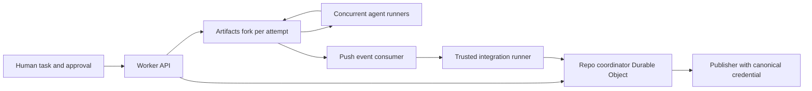
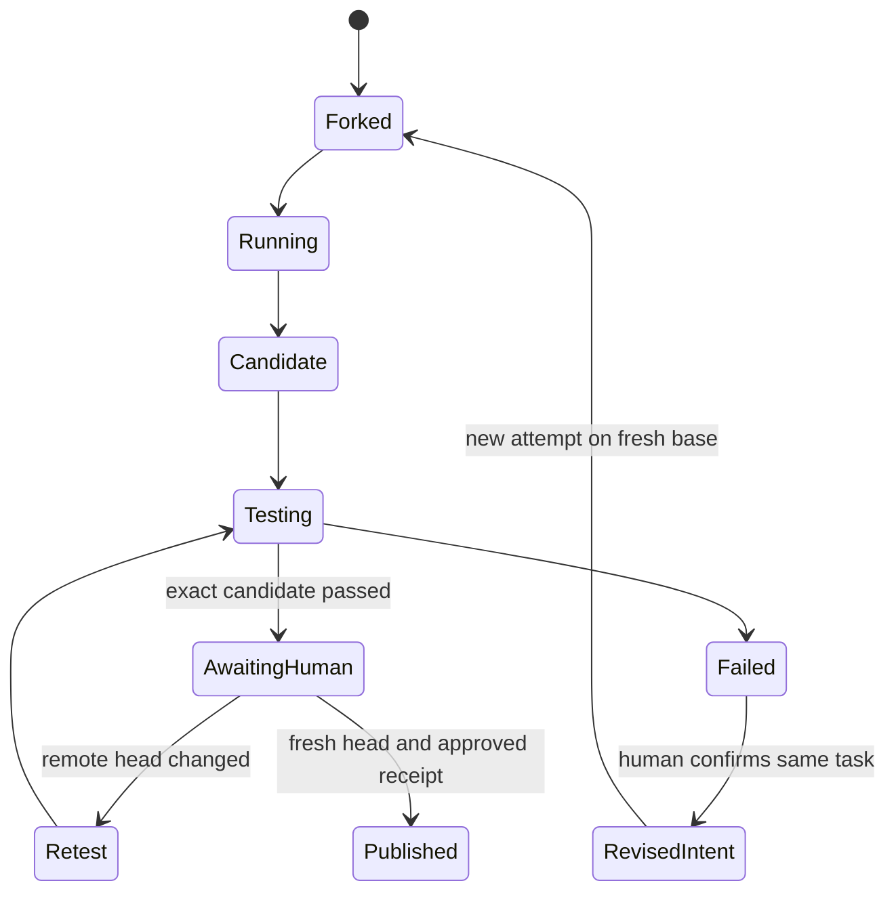

# Artifacts engineering feasibility and differentiation

2026-10-02, Codex execution round 1. For a team shipping a small concurrent-agent platform by October 14. This analysis separates fetched API facts from proposed architecture. No deployed capability or prototype pass is claimed.

## Documented boundary

Artifacts is a Git-compatible storage/control plane, not a documented semantic merge service. The [binding](https://developers.cloudflare.com/artifacts/api/workers-binding/) offers repo lifecycle, inspection and token methods. [Git protocol docs](https://developers.cloudflare.com/artifacts/api/git-protocol/) describe normal clone/fetch/pull/push, v1 receive-pack, v1/v2 fetch, and missing optional filter/include-tag support. [Authentication](https://developers.cloudflare.com/artifacts/guides/authentication/) distinguishes Cloudflare control-plane credentials from repo-scoped Git read/write credentials.

Give each untrusted writer its own repository token. Keep the canonical repository's write credential exclusively with the publisher. A path-policy check on a candidate can reject publication, but it cannot prevent an agent changing arbitrary files in its own fork. A new Git smart-HTTP policy proxy is unnecessary for that boundary and too risky for the first MVP.

[Limits](https://developers.cloudflare.com/artifacts/platform/limits/) currently include 1 GB per repository and 32 MB per blob. Use a small source fixture and compact task/receipt metadata. Put large logs elsewhere or keep them private locally. Do not bundle dependencies, recordings or full transcripts into every fork.

[Push events](https://developers.cloudflare.com/artifacts/guides/event-subscriptions/) carry repository/ref, before/after SHAs and potentially truncated commit summaries. Fetch exact objects rather than trusting summaries. The event occurs after a push; it cannot enforce a pre-push policy. Delivery ordering and deduplication need separate verification; implement idempotent job keys and current-head checks regardless.

## Proposed control flow

A Worker authenticates task creation, allocates an Artifacts fork and serves a task contract. A Durable Object records state for one canonical repository. External local processes or Cloudflare sandboxes run the coding agents and Git commands; Workers orchestrate rather than pretending to execute arbitrary native Git.

The runner must clone exact candidate commits and create a combined tree. A receipt records what actually ran: base SHA, candidate SHA, merged SHA/tree, test-policy digest, runner identity, command, exit code and sanitized output digest. The agent's own tests and narrative are useful context, but not the trusted approval signal. The policy must come from the approved baseline so a candidate cannot pass by removing tests. A signature would establish producer identity and integrity, not software correctness.

## Publication and recovery

Testing alone leaves a race if another candidate changes main before publication. Serialize publishers per canonical repo, re-read remote head and perform a non-force fast-forward update of the exact tested candidate. If main changed, reject stale approval and recreate/retest the integration candidate. How Artifacts reports concurrent receive-pack ref updates needs a real remote spike; do not claim a beta-specific atomic guarantee from ordinary Git intuition.

Intent reapplication reruns a fixed task contract on a fresh base in a new fork after a conflict or compatibility failure. Preserve the rejected attempt and link its successor. Limit retries and compare changed-path scope. Stop for human review if the intent changes, tests remain failing, or hidden requirements emerge. This is a proposal, not deterministic reproduction of model behavior.

## Existing products and precise differentiation

| Existing product, primary source fetched | Current documented capability | Consequence for our proposal |
|---|---|---|
| [Foremerge protocol](https://github.com/naw103/foremerge/blob/main/docs/protocol.md), fetched through GitHub raw API | Advisory leased claims, semantic scopes, provisional changes, durable conflict decisions; claims do not prevent another claim | A claim board is derivative. A fork publisher rejecting stale/conflicting output is a separate enforcement boundary; compare directly against Foremerge with plain Git. |
| [Entire CLI README](https://github.com/entireio/cli), fetched raw Oct 2 | Session/checkpoint capture tied to commits, resume, separate checkpoint remotes, why/blame; why/blame commands described as experimental; current README uses independent checkpoint refs | Session storage and why-graph alone are derivative. Trusted integration receipts and sanitized acceptance contracts are narrower; do not claim Entire lacks private context storage. Web cache shows older checkpoint-branch docs, so avoid stale implementation comparisons. |
| [GitHub merge queue](https://docs.github.com/en/repositories/configuring-branches-and-merges-in-your-repository/configuring-pull-request-merges/managing-a-merge-queue) | Required checks on latest base plus preceding queued changes; failing group removed, rebuilt queue | Combined-state tests alone are derivative. Intent-aware failed-attempt recovery is the proposed distinction; compare against queue plus ordinary agent repair. |
| [AgentFS README](https://github.com/tursodatabase/agentfs), fetched raw | SQLite filesystem/tool-call audit, snapshots/time-travel forking, experimental sandbox; describes Docker sandboxes as complementary | Audit and undo are crowded. Audit does not prove tests or confine all external side effects. |
| [Simfleet thread and repo](https://github.com/entropyconquers/simfleet) | Thread E-X002 advertises device/worktree/port lanes and shared builds; repo implementation not reviewed here | Mobile-device orchestration already has a competitor. A Workers-runtime/data lane may be feasible, but prove isolation with a wrong-commit request. |

Fetched READMEs describe capabilities, not measured quality or adoption. No complete competitor exclusion is established. Do not reproduce their implementation as the competition entry.

## Required spikes and falsification

1. Fork readiness and baseline: fork the approved repository; inspect readiness; clone and compare actual SHA to contract. A mismatch stops launch.
2. Integration: two actual overlapping coding-agent processes make changes; separate branches pass their own tests but a controlled combined fixture fails. Detect failure before canonical publication.
3. Recovery: reapply the second task to fresh main once, preserve original intent and acceptance tests, require human decision. If ordinary agent repair gives the same result with less setup, novelty weakens.
4. Stale race: main advances after a passing receipt; deny publication; retest on current base. Include repeated/out-of-order event fixtures.
5. Evidence trust: candidate removes tests or submits a fake green receipt; baseline-owned checks still fail. Fork writer attempts canonical push and receives authentication denial.
6. Runtime lane: two previews/data namespaces return explicit source SHA and isolated data; reject a receipt for the wrong commit. Branch preview configuration is not automatic fork provisioning.

A 7-minute demo can show two live agents, one passing merge, one incompatible candidate, a denied stale approval, one bounded reapplication and explicit human publish. Setup and approvals must remain understandable without reading internal logs. License is MIT in this repository; run instructions, actual remote spike results and a live Artifacts/Workers path remain required before shortlist gate completion. Local fixture planning does not require Cloudflare secrets.

## Sources and outstanding checks

Sources are linked at each factual claim. See evidence.md for E-X001..017, and Claude's workflows-competitors.md for independently fetched Artifacts APIs and best practices. No new prevalence claims derive from these documents. Competition deadline and eligibility derive from the official linked PDF, recorded in evidence.md. Confirm pricing discrepancy Claude reports between blog (Oct 15) and docs (Oct 14) before runtime budgeting. Confirm beta fork timing, authenticated preview behavior, worker/local bindings, CI SDK availability, and native ref-update semantics in actual spikes.
