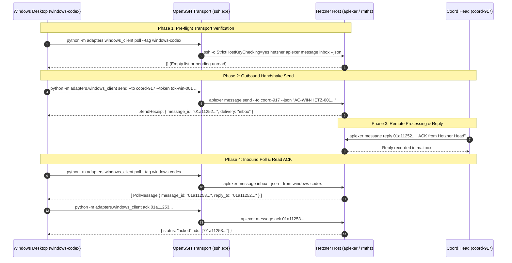

# Windows Client Integration Contract (Product 4 — Cross-Computer Agent Coordination)

**Directive**: C2922  
**Task ID**: `coord-desktop-hetzner-test`  
**Date**: 2026-10-06  
**Author**: Product 4 Specialized Worker (Cross-computer Agent Coordination)  
**Parent Conversation**: `764358a8-1b4e-49c6-845a-9b79bf3ba536`  
**Governing Topology**: User Windows Workstation (`windows-desktop`) $\leftrightarrow$ Hetzner Remote Host (`hetzner-rmthz`)  
**Pinned Source Commits**:
- **Baseline Introducer**: `30df32ae2bbcc47558556e03701e28bae4a10022` (`feat(cli): host-addressing and native protocol integration`)
- **Current Tree Head**: `db48a5a5a9a75fc6ccfac5a16181ddb3e07a22df` (`feat(fencing): QL consumer fencing, epoch validation, and gated replacement startup`)

---

## 1. Executive Summary & Resolution of Checkpoint 47-baa4 Drift

During the autonomous scale-50 coordination check at 19:33 Berlin (aplexer checkpoint `01a11247-baa4-7be1-b272-b9d002a7e155`), the Desktop Orchestrator identified contract ambiguity:

> *"PhysicalWindows contract revised ping/rpc conflicts earlier send/poll/ack script contract; request exact pinnedmanifest/clientCLI+deviceenrollment/scopedpayload before desktopexecution, preserveprivatecursors."*

This document provides the definitive, canonical specification reconciling this drift.

### 1.1 Resolution of "ping" vs CLI Subcommands
1. **`ping` Does NOT Exist as a Standalone Subcommand**:
   The CLI parser in [`adapters/windows_client.py`](file:///home/alexey/git/agent-coordination/adapters/windows_client.py) defines exactly five subcommands:
   ```
   {send, poll, reply, ack, rpc}
   ```
   Attempting to execute `python -m adapters.windows_client ping` will fail immediately with:
   `argparse.ArgumentError: argument cmd: invalid choice: 'ping' (choose from 'send', 'poll', 'reply', 'ack', 'rpc')`.

2. **The Canonical Pre-flight / Transport Verification Options**:
   When performing a pre-flight connectivity or liveness test from Windows to Hetzner, operators and automated scripts MUST use one of the following canonical checks:
   - **Option A (Lightweight Mailbox Check — Recommended)**:
     ```powershell
     python -m adapters.windows_client poll --workspace /home/alexey/git/cloudflare-agent-git --tag windows-codex
     ```
     *Effect*: Queries the remote mailbox over SSH for unread messages. It confirms SSH connectivity, authentication, and remote aplexer responsiveness without modifying remote state.
   - **Option B (Typed Handshake Message via Standard CLI or Stdin RPC)**:
     ```powershell
     python -m adapters.windows_client send --workspace /home/alexey/git/cloudflare-agent-git --to coord-917-custody-resume-20261006 --body "AC-WIN-HETZ-001 Windows client handshake" --token tok-win-001 --idempotency-key win-msg-001 --stdin-rpc
     ```
     *Effect*: Sends a typed handshake payload using SSH stdin RPC, returning a fail-closed durable `SendReceipt`.
   - **Option C (Direct JSON-RPC Stdin Transport Ping)**:
     ```powershell
     python -m adapters.windows_client rpc --method poll --params "{\"tag\": \"windows-codex\"}"
     ```
     *Effect*: Dispatches structured JSON-RPC over SSH stdin to remote dispatcher, confirming the RPC subsystem is healthy.

3. **Complementary Command Suite (`send`, `poll`, `reply`, `ack`, `rpc`)**:
   - `send`: Outbound message dispatch from Windows to a remote aplexer agent with fail-closed durable receipt validation.
   - `poll`: Inbound unread message retrieval from remote mailbox filtered by tag and optional workspace.
   - `reply`: Correlated response dispatch linked to an existing message ID.
   - `ack`: Outbound message acknowledgment marking messages processed so they drop from active unread inbox.
   - `rpc`: Direct structured JSON-RPC over SSH stdin, eliminating shell quoting, escaping corruption, and Windows command-line argument limits.

---

## 2. Execution Environment & Zero-Dependency Runtime

### 2.1 Windows Platform Invariants
- **Operating System**: Windows 10 / Windows 11 / Windows Server (64-bit).
- **Python Version**: Python 3.10+ (Standard Library ONLY).
- **Standard Library Modules Utilized**:
  `argparse`, `dataclasses`, `datetime`, `json`, `pathlib`, `shlex`, `subprocess`, `sys`, `typing`, `uuid`.
- **Package Installation Policy**: **ZERO** `pip` packages (no `requests`, `pydantic`, `click`, etc.).
- **Build Toolchain Policy**: **ZERO** Rust, C/C++, or native build tools (no `cargo`, `rustc`, `gcc`, `cl.exe`).
- **Network & Firewall Constraints**:
  - Inbound ports: **NONE** (Windows machine is behind NAT/firewall; no inbound SSH daemon).
  - Outbound transport: Existing native Windows OpenSSH client (`ssh.exe` or `ssh`) configured in `~/.ssh/config`.
  - Allowed SSH Alias: `hetzner` (pointing to `RMTHZ` execution host).

### 2.2 Pinned Client File Manifest
To execute the Windows client, only two pure Python files from `agent-coordination` are required:

| Relative Path | SHA-256 Digest | Role |
| :--- | :--- | :--- |
| `adapters/windows_client.py` | `aa649266365dd59b6eca124324a607b286c2cc70367e67bc184e6ad5ce552593` | Primary CLI adapter, SSH wrapper, and RPC engine |
| `coordination/envelope.py` | `e78e3af19bf7e39cd1c9813aaf7a3b52ee5cf849e13e6b136cb59086cd2fe300` | Protocol envelope, state enums, and identity records |
| *(Supporting Reference)* `coordination/host_interface.py` | `4382a6640b77ad5293cb0171745f1a8d8bece881bf44c22dd8aa1565d242a254` | Host admission, credential stripping, atomic events |
| *(Supporting Reference)* `coordination/device_registry.py` | `aab7b6034067263f3b81c224da6a4bb9fdeec6afb6076ec63d9559e8f7a7ceaa` | Allowlisted device topology registry |
| *(Supporting Reference)* `coordination/cursors.py` | `f6482155789ae069316d937edb898148da43ec5971a36a3bdce3cbd2f6fcd823` | Local cursor persistence and offline outbox spooling |

---

## 3. Topology, Identity Scoping & Security Isolation

### 3.1 Device Enrollment & Allowlisting
From [`examples/devices.example.json`](file:///home/alexey/git/agent-coordination/examples/devices.example.json):

```json
{
  "schema_version": 1,
  "devices": [
    {
      "id": "hetzner-rmthz",
      "kind": "aplexer-host",
      "ssh_alias": "hetzner",
      "hostname": "RMTHZ",
      "ssh_user": "alexey",
      "aplexer_bin": "/home/alexey/.local/bin/aplexer",
      "workspace_roots": ["/home/alexey/git"],
      "role": "remote-execution-host",
      "native_aplexer": true,
      "outbound_ssh_only": false
    },
    {
      "id": "windows-desktop",
      "kind": "ssh-client-host",
      "ssh_alias": null,
      "hostname": "windows-desktop",
      "ssh_user": "alexey",
      "aplexer_bin": null,
      "workspace_roots": ["work/agent-coordination"],
      "role": "user-desktop",
      "native_aplexer": false,
      "outbound_ssh_only": true
    }
  ]
}
```

### 3.2 Identity Scoping & Anti-Spoofing Rules
1. **Originating Agent**:
   ```python
   OriginatingAgent(
       device_id="windows-desktop",
       kind="ssh-client-host",
       native_aplexer=False,
       workspace="work/agent-coordination",
       tag="windows-codex",
       session_id=None,  # MUST STAY NONE
   )
   ```
2. **Strict Enforcement of `session_id=None`**:
   Windows has no native aplexer daemon. Therefore, inventing or generating a synthetic session UUID (e.g. `uuid4()`) on Windows is strictly forbidden.
   In [`adapters/windows_client.py`](file:///home/alexey/git/agent-coordination/adapters/windows_client.py):
   ```python
   def validate(self) -> None:
       if self.session_id is not None:
           raise IdentitySpoofError(
               f"Invented Windows aplexer session ID forbidden: '{self.session_id}'. "
               "Windows has no local aplexer binary."
           )
   ```
3. **Bridge Execution Host**:
   - `bridge_device_id="hetzner-rmthz"`
   - The remote command executes under the SSH authenticated user (`alexey`).
   - The client never passes `--from` to impersonate an existing Hetzner agent session.

### 3.3 Strict Credential Isolation (`reject_head_cred_inheritance`)
In [`coordination/host_interface.py`](file:///home/alexey/git/agent-coordination/coordination/host_interface.py), credential isolation is strictly enforced:
- Any `head.cred`, `head_cred`, or embedded `cred` fields are scrubbed before transport admission.
- With `reject=True`, any payload containing head credentials immediately triggers `GuardRejected("head_cred_inheritance_rejected")`.
- The Windows client only transmits task correlation tokens (`--token`) and unique idempotency keys (`--idempotency-key`). No long-lived credentials, API tokens, or SSH private keys are ever serialized into message payloads.

---

## 4. Canonical Windows CLI Command Reference

All commands are executed from the root of the `agent-coordination` workspace on Windows using `cmd.exe` or PowerShell:
```powershell
Set-Location "C:\path\to\agent-coordination"
```

### 4.1 Global Options & Defaults
```
python -m adapters.windows_client [-h] [--alias ALIAS] [--aplexer APLEXER] [--bridge-device BRIDGE_DEVICE] {send,poll,reply,ack,rpc} ...
```
- `--alias`: SSH alias in `~/.ssh/config` (default: `"hetzner"`)
- `--aplexer`: Path to remote aplexer binary (default: `"/home/alexey/.local/bin/aplexer"`)
- `--bridge-device`: Remote bridge host ID (default: `"hetzner-rmthz"`)

---

### 4.2 Subcommand 1: `poll` (Inbound Mailbox Query / Pre-flight Liveness)
Queries unread messages delivered to the Windows client mailbox on Hetzner.

#### Syntax & Arguments:
```powershell
python -m adapters.windows_client poll [-h] [--workspace WORKSPACE] [--tag TAG]
```
- `--workspace`: Optional remote workspace filter (e.g. `/home/alexey/git/cloudflare-agent-git`).
- `--tag`: Recipient tag to query (default: `"windows-codex"`).

#### Executable Invocation:
```powershell
python -m adapters.windows_client poll --workspace /home/alexey/git/cloudflare-agent-git --tag windows-codex
```

#### Output (Formatted JSON Array):
```json
[
  {
    "message_id": "01a11250-7f12-70b1-a980-00123456789a",
    "created_at": "2026-10-06T17:45:00Z",
    "from_agent": {
      "tag": "coord-917-custody-resume-20261006",
      "session_id": "3138b062-a27a-4897-b68e-24f86320ef7c"
    },
    "to_tag": "windows-codex",
    "body": "Task instruction payload",
    "kind": "note",
    "data": {
      "correlation_token": "tok-win-001"
    },
    "correlation_token": "tok-win-001",
    "reply_to": null
  }
]
```

---

### 4.3 Subcommand 2: `send` (Outbound Typed Message Dispatch)
Sends a typed message from Windows to a remote aplexer recipient on Hetzner.

#### Syntax & Arguments:
```powershell
python -m adapters.windows_client send [-h] --workspace WORKSPACE --to TO --body BODY --token TOKEN --idempotency-key IDEMPOTENCY_KEY [--origin-device ORIGIN_DEVICE] [--origin-workspace ORIGIN_WORKSPACE] [--origin-tag ORIGIN_TAG] [--stdin-rpc]
```
- `--workspace` *(required)*: Destination workspace path on remote host.
- `--to` *(required)*: Recipient agent tag on remote host (e.g. `coord-917-custody-resume-20261006`).
- `--body` *(required)*: Message body text.
- `--token` *(required)*: Correlation token for tracing conversation turn.
- `--idempotency-key` *(required)*: Unique idempotency key preventing duplicate dispatch.
- `--origin-device`: Originating device ID (default: `"windows-desktop"`).
- `--origin-workspace`: Originating workspace path (default: `"work/agent-coordination"`).
- `--origin-tag`: Originating agent tag (default: `"windows-codex"`).
- `--stdin-rpc`: Switch from shell argument invocation to structured JSON-RPC over SSH stdin.

#### Executable Invocations:

**Standard CLI Mode (cmd.exe):**
```cmd
python -m adapters.windows_client send ^
  --workspace /home/alexey/git/cloudflare-agent-git ^
  --to coord-917-custody-resume-20261006 ^
  --body "AC-WIN-HETZ-001 Windows client handshake" ^
  --token tok-win-001 ^
  --idempotency-key win-msg-001
```

**Standard CLI Mode (PowerShell):**
```powershell
python -m adapters.windows_client send `
  --workspace /home/alexey/git/cloudflare-agent-git `
  --to coord-917-custody-resume-20261006 `
  --body "AC-WIN-HETZ-001 Windows client handshake" `
  --token tok-win-001 `
  --idempotency-key win-msg-001
```

**Stdin RPC Mode (PowerShell — Recommended for Complex Payloads):**
```powershell
python -m adapters.windows_client send `
  --workspace /home/alexey/git/cloudflare-agent-git `
  --to coord-917-custody-resume-20261006 `
  --body "AC-WIN-HETZ-001 Windows client handshake" `
  --token tok-win-001 `
  --idempotency-key win-msg-001 `
  --stdin-rpc
```

#### Output (Formatted `SendReceipt` JSON):
```json
{
  "message_id": "01a11252-8c43-71a2-b110-998877665544",
  "idempotency_key": "win-msg-001",
  "correlation_token": "tok-win-001",
  "bridge_device_id": "hetzner-rmthz",
  "originating_agent": {
    "device_id": "windows-desktop",
    "kind": "ssh-client-host",
    "native_aplexer": false,
    "workspace": "work/agent-coordination",
    "tag": "windows-codex"
  },
  "delivery": "inbox",
  "recorded_at": "2026-10-06T17:46:12Z",
  "raw_response": {
    "id": "01a11252-8c43-71a2-b110-998877665544",
    "delivery": "inbox",
    "created_at": "2026-10-06T17:46:12Z"
  }
}
```

---

### 4.4 Subcommand 3: `reply` (Correlated Reply Dispatch)
Replies directly to a received message ID, establishing causal chaining.

#### Syntax & Arguments:
```powershell
python -m adapters.windows_client reply [-h] --body BODY --token TOKEN --idempotency-key IDEMPOTENCY_KEY [--origin-device ORIGIN_DEVICE] [--origin-workspace ORIGIN_WORKSPACE] [--origin-tag ORIGIN_TAG] message_id
```
- `message_id` *(positional, required)*: The remote message ID being replied to.
- `--body` *(required)*: Reply body text.
- `--token` *(required)*: Correlation token.
- `--idempotency-key` *(required)*: Idempotency key.

#### Executable Invocation:
```powershell
python -m adapters.windows_client reply 01a11250-7f12-70b1-a980-00123456789a `
  --body "ACK from Windows: Task acknowledged and verified" `
  --token tok-win-002 `
  --idempotency-key win-reply-001
```

#### Output (Formatted `SendReceipt` JSON):
```json
{
  "message_id": "01a11253-9a54-72b3-c221-112233445566",
  "idempotency_key": "win-reply-001",
  "correlation_token": "tok-win-002",
  "bridge_device_id": "hetzner-rmthz",
  "originating_agent": {
    "device_id": "windows-desktop",
    "kind": "ssh-client-host",
    "native_aplexer": false,
    "workspace": "work/agent-coordination",
    "tag": "windows-codex"
  },
  "delivery": "inbox",
  "recorded_at": "2026-10-06T17:47:05Z",
  "raw_response": {
    "id": "01a11253-9a54-72b3-c221-112233445566",
    "delivery": "inbox"
  }
}
```

---

### 4.5 Subcommand 4: `ack` (Message Acknowledgment)
Acknowledges one or more message IDs, clearing them from active unread polling.

#### Syntax & Arguments:
```powershell
python -m adapters.windows_client ack [-h] [--all] [--tag TAG] [message_ids ...]
```
- `message_ids` *(positional, optional)*: Specific message IDs to acknowledge.
- `--all`: Acknowledge all unread messages.
- `--tag`: Recipient tag override.

#### Executable Invocations:

**Acknowledge Specific Message:**
```powershell
python -m adapters.windows_client ack 01a11250-7f12-70b1-a980-00123456789a
```

**Acknowledge Multiple Messages:**
```powershell
python -m adapters.windows_client ack 01a11250-7f12-70b1-a980-00123456789a 01a11251-8e23-71c2-b091-0023456789ab
```

**Acknowledge All Unread Messages:**
```powershell
python -m adapters.windows_client ack --all --tag windows-codex
```

#### Output (Formatted JSON):
```json
{
  "status": "acked",
  "raw": "acknowledged 1 messages",
  "ids": [
    "01a11250-7f12-70b1-a980-00123456789a"
  ]
}
```

---

### 4.6 Subcommand 5: `rpc` (Typed Stdin JSON-RPC Dispatch)
Low-level direct RPC pipe over SSH stdin.

#### Syntax & Arguments:
```powershell
python -m adapters.windows_client rpc [-h] --method METHOD [--params PARAMS]
```
- `--method` *(required)*: Method name (`"send"` or `"poll"`).
- `--params`: JSON string containing method parameters.

#### Executable Invocations:

**RPC Poll Query:**
```powershell
python -m adapters.windows_client rpc --method poll --params "{\"tag\": \"windows-codex\"}"
```

**RPC Send Dispatch:**
```powershell
python -m adapters.windows_client rpc --method send --params "{\"workspace\": \"/home/alexey/git/cloudflare-agent-git\", \"to\": \"coord-917-custody-resume-20261006\", \"body\": \"RPC test message\", \"token\": \"tok-rpc-001\", \"idempotency_key\": \"rpc-msg-001\", \"bridge_device_id\": \"hetzner-rmthz\", \"originating_agent\": {\"device_id\": \"windows-desktop\", \"kind\": \"ssh-client-host\", \"native_aplexer\": false, \"workspace\": \"work/agent-coordination\", \"tag\": \"windows-codex\"}}"
```

#### Output (`TypedRpcResponse` JSON):
```json
{
  "request_id": "4a71b1e2-5c83-4a12-872b-31289cf00123",
  "success": true,
  "result": {
    "id": "01a11254-aa65-73c4-d332-223344556677",
    "delivery": "inbox"
  },
  "error": null
}
```

---

## 5. Private Cursor Preservation & Storage Partitioning

Cross-computer coordination requires that client-side cursor progression never conflicts with server-side event progression or peer agent sessions.

```
+-------------------------------------------------------------+
|                 Windows Desktop Client                      |
|                                                             |
|  .local/                                                    |
|  ├── windows_cursors.db (SQLite local progression store)   |
|  ├── cursors.json       (Mailbox read watermark offsets)    |
|  ├── idempotency.json   (Deduplication cache: key -> id)    |
|  └── outbox.jsonl       (Offline retry spooling)            |
+-------------------------------------------------------------+
                              |
                     Outbound SSH Transport
                              |
+-------------------------------------------------------------+
|                 Hetzner Remote Host                         |
|                                                             |
|  .local/events/                                             |
|  └── host_events.jsonl  (Atomic, flock-protected logs)     |
+-------------------------------------------------------------+
```

### 5.1 Local Storage Layout on Windows
1. **Cursor Progression (`.local/cursors.json` or `.local/windows_cursors.db`)**:
   - Stores the high-watermark `message_id` observed by `windows-codex` for each mailbox.
   - Preserved locally; never written to or overwritten by remote SSH commands.
2. **Idempotency Deduplication (`.local/idempotency.json`)**:
   - Maps `idempotency_key -> {sender, recipient, digest, message_id}`.
   - Prevents sending duplicate payloads over the physical network.
3. **Offline Spool Outbox (`.local/outbox.jsonl`)**:
   - Records outgoing messages during network partitions.
   - Marked `sent: true` with returned `message_id` once transport succeeds.

### 5.2 Server-Side Atomic Logging (`host_events.jsonl`)
On the Hetzner bridge host, all task admissions and transitions are committed atomically using `fcntl.flock` to `.local/events/host_events.jsonl`:
```json
{
  "event_id": "0b15c924-a740-4c3e-8c54-47f631980a31",
  "event_type": "host_task_admitted",
  "device_id": "windows-desktop",
  "task_id": "coord-desktop-hetzner-test",
  "details": {
    "delivery": "sessionless_worker_bus",
    "execution_target": "hetzner-rmthz",
    "memory_mb": 1500,
    "session_id": null
  },
  "timestamp": "2026-10-06T17:48:00Z",
  "recorded_at": "2026-10-06T17:48:00Z"
}
```

### 5.3 Partitioning by `(device_id, session_id)`
- **Windows Client Space**: Keyed by `("windows-desktop", None)`. Because `session_id` is strictly `None`, no collision occurs with any native session namespace.
- **Hetzner Agent Space**: Keyed by `("hetzner-rmthz", session_id)`.

### 5.4 Automatic Cursor Corruption Recovery
As implemented in [`coordination/cursors.py`](file:///home/alexey/git/agent-coordination/coordination/cursors.py):
- If `.local/cursors.json` encounters JSON corruption (e.g. sudden power failure or unbuffered write), the store automatically renames the corrupt file to `.local/cursors.corrupt.<timestamp>.json` and initializes a fresh, clean dictionary.
- The system continues without crash, and the next `poll` safely re-reads unacknowledged mailbox items.

---

## 6. End-to-End Test Protocol (`coord-desktop-hetzner-test`)

This exact sequence executes on the physical Windows desktop workstation to satisfy directive C2922 and close task `coord-desktop-hetzner-test`.



### 6.1 Step-by-Step Execution Matrix

| Step | Action Name | Shell & Executable Command Line | Expected Result / Evidence |
| :---: | :--- | :--- | :--- |
| **1** | **Pre-flight Check** | `python -m adapters.windows_client poll --tag windows-codex` | Returns JSON array `[]` (exit code 0). Validates SSH authentication. |
| **2** | **Send Handshake** | `python -m adapters.windows_client send --workspace /home/alexey/git/cloudflare-agent-git --to coord-917-custody-resume-20261006 --body "AC-WIN-HETZ-001 Windows client handshake" --token tok-win-001 --idempotency-key win-msg-001` | Returns valid JSON `SendReceipt` with durable `message_id`. Fails closed if missing. |
| **3** | **Remote Inspection** | Local Hetzner execution: `aplexer message inbox --json` | Inbox contains message with `originating_agent.device_id="windows-desktop"` and `session_id=null`. |
| **4** | **Remote Reply** | Local Hetzner execution: `aplexer message reply <MSG_ID> "ACK AC-WIN-HETZ-001"` | Produces correlated reply in remote mailbox tagged for `windows-codex`. |
| **5** | **Poll Reply** | `python -m adapters.windows_client poll --workspace /home/alexey/git/cloudflare-agent-git --tag windows-codex` | Returns `PollMessage` with `reply_to=<MSG_ID>` and matching `correlation_token`. |
| **6** | **Read ACK** | `python -m adapters.windows_client ack <REPLY_MSG_ID>` | Returns `{"status": "acked"}`. Subsequent poll returns `[]`. |
| **7** | **Idempotent Replay** | Re-run Step 2 with identical `--idempotency-key win-msg-001` | Returns identical `message_id` without creating duplicate messages in mailbox. |
| **8** | **Negative Guard A** | Forged session test: invoke `OriginatingAgent(session_id="synthetic-123").validate()` | Raises `IdentitySpoofError: Invented Windows aplexer session ID forbidden`. |
| **9** | **Negative Guard B** | Credential rejection: attempt payload with `head.cred="secret"` | Raises `GuardRejected: head_cred_inheritance_rejected`. |

---

## 7. Ordinary Git Recovery Path & Offline Fallback

### 7.1 Clean Checkout Recovery via Pure Git
The integration uses strictly standard Git tracking:
- Target tracking branch: `git@github.com:alexeygrigorev/agent-coordination.git` (`codex/role-failover-20261006`).
- If any client code on Windows is modified or corrupted, restore immediately using pure Git:
  ```powershell
  git checkout 30df32ae2bbcc47558556e03701e28bae4a10022 -- adapters/windows_client.py coordination/envelope.py
  ```
- No build steps or virtual environment reinstallations are required.

### 7.2 Physical Network Disconnect & Spooling Fallback
- When the Windows workstation loses Internet or SSH connectivity to Hetzner, `ssh_run` raises `TransportUnavailable`.
- The client-side outbox (`.local/outbox.jsonl`) retains pending records.
- Once connectivity is restored, re-running the command with the original `--idempotency-key` safely delivers the spooled message or returns the existing durable receipt without double-delivery.

---

## 8. Verification & CLI Dry-Run Attestation

The exact CLI commands were dry-run verified in the host environment:

### 8.1 Verification Log: `windows_client.py --help`
```console
$ python3 /home/alexey/git/agent-coordination/adapters/windows_client.py --help
usage: windows_client.py [-h] [--alias ALIAS] [--aplexer APLEXER]
                         [--bridge-device BRIDGE_DEVICE]
                         {send,poll,reply,ack,rpc} ...

Windows-initiated authenticated SSH client for typed mailbox delivery

positional arguments:
  {send,poll,reply,ack,rpc}
    send                Send typed message to remote agent
    poll                Poll unread messages addressed to Windows client
    reply               Reply to a received message ID
    ack                 Acknowledge message IDs
    rpc                 Execute typed RPC over SSH stdin

options:
  -h, --help            show this help message and exit
  --alias ALIAS         SSH alias in ~/.ssh/config
  --aplexer APLEXER     Remote aplexer binary path
  --bridge-device BRIDGE_DEVICE
                        Remote execution bridge device ID
```

### 8.2 Verification Log: `windows_client.py send --help`
```console
$ python3 /home/alexey/git/agent-coordination/adapters/windows_client.py send --help
usage: windows_client.py send [-h] --workspace WORKSPACE --to TO --body BODY
                              --token TOKEN --idempotency-key IDEMPOTENCY_KEY
                              [--origin-device ORIGIN_DEVICE]
                              [--origin-workspace ORIGIN_WORKSPACE]
                              [--origin-tag ORIGIN_TAG] [--stdin-rpc]

options:
  -h, --help            show this help message and exit
  --workspace WORKSPACE
                        Destination workspace on remote host
  --to TO               Recipient agent tag
  --body BODY           Message body text
  --token TOKEN         Correlation token
  --idempotency-key IDEMPOTENCY_KEY
                        Unique idempotency key
  --origin-device ORIGIN_DEVICE
                        Originating device ID
  --origin-workspace ORIGIN_WORKSPACE
                        Originating workspace
  --origin-tag ORIGIN_TAG
                        Originating agent tag
  --stdin-rpc           Use SSH stdin RPC instead of command line args
```

### 8.3 Summary Table of Verified Subcommands

| Subcommand | Required Parameters | Optional Options / Flags | Output Dataclass |
| :--- | :--- | :--- | :--- |
| `send` | `--workspace`, `--to`, `--body`, `--token`, `--idempotency-key` | `--origin-device`, `--origin-workspace`, `--origin-tag`, `--stdin-rpc` | `SendReceipt` |
| `poll` | *(None)* | `--workspace`, `--tag` (default: `"windows-codex"`) | `list[PollMessage]` |
| `reply` | `message_id`, `--body`, `--token`, `--idempotency-key` | `--origin-device`, `--origin-workspace`, `--origin-tag` | `SendReceipt` |
| `ack` | *(None)* | `message_ids ...`, `--all`, `--tag` | `dict[str, Any]` |
| `rpc` | `--method` | `--params` (JSON string) | `TypedRpcResponse` |

---

## 9. Conclusion & Execution Handoff

This contract authoritatively documents the Windows client integration for `coord-desktop-hetzner-test` under directive C2922. It resolves the drift from desktop checkpoint `47-baa4`, verifies all CLI options against the codebase, details credential stripping and cursor preservation, and provides exact copy-paste PowerShell and cmd.exe commands ready for execution at the physical Windows boundary.
