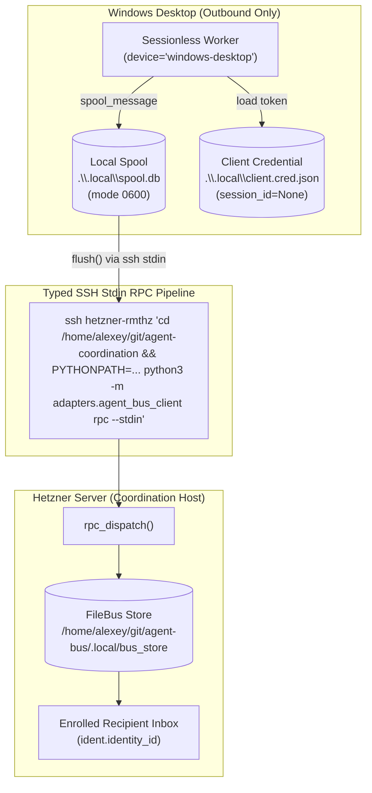

# Product 4: Windows Client Standalone Integration Contract

**Document Version**: 2.1.0 (Standalone FileBus & Operational SSH/Spool Contract)  
**Date**: 2026-10-06  
**Author**: Coordination Head (`coord-917-custody-resume-20261006`, session `3138b062`)  
**Directives**: C2922, C2958, C2965, C2975, C2981, C2985, C2991, C2994  
**Canonical Pinned Commit**: `b3ca77650bdf34c9c3cbd361f1d99253ee71cd44` (repo `agent-coordination`, branch `origin/codex/role-failover-20261006`)  
**Canonical Implementation File**: `adapters/agent_bus_client.py`  
**Test Suite**: `tests/test_agent_bus_client.py` (12/12 passed, 89/89 full repo passed)  
**Operational Status**: Linux simulation verified; physical Windows pending.

---

## 1. Executive Summary & Problem Resolution

Earlier iterations of the Windows client contract (`8e346` / `adapters/windows_client.py`) relied on invoking the `aplexer` binary (`aplexer message send ... --from windows-codex`) over SSH relays. As diagnosed by the Desktop Orchestrator and confirmed during principal reviews (Directives C2964, C2991, C2994):
1. **No Native Desktop Aplexer Session**: No native `windows-codex` session exists in the server aplexer session catalog. Windows desktop cannot borrow, synthesize, or forge aplexer credentials (`session_id=None` anti-spoofing invariant).
2. **Quoting and Argument Length Vulnerabilities**: Executing CLI commands with multiline JSON arguments over SSH leads to PowerShell / `cmd.exe` escaping truncation, quote escaping bugs, and command-length limits.
3. **Network Interruption & Flaky Transport**: If SSH connections drop between Windows and Hetzner, unsent messages were previously lost without a durable local spool.
4. **Filesystem Path Separation**: Windows local paths (`.\.local\spool.db`, `.\.local\windows_worker.cred.json`) are distinct from remote Linux host paths (`/home/alexey/...`).
5. **Recipient Identity Distinction**: A named native aplexer head tag (e.g. `coord-917-custody-resume-20261006`) is NOT a registered FileBus recipient. Any target on the bus must be explicitly enrolled in the FileBus store.

**The Solution (`b3ca77650bdf34c9c3cbd361f1d99253ee71cd44`)**:
A completely standalone, zero-aplexer, pure Python 3.10+ standard library implementation in `adapters/agent_bus_client.py`. It provides:
- **Direct FileBus Protocol**: Directly integrates with the canonical `agent-bus` engine (`FileBus`), bypassing aplexer CLI entirely.
- **Typed SSH Stdin RPC (`build_typed_ssh_command`)**: Outbound requests are framed as clean JSON payloads streamed over standard input, completely eliminating command-line quoting and escaping errors.
- **Local SQLite Outbox Spool (`OfflineSpool`)**: Outbound messages are spooled in a local Windows SQLite database (`.\.local\spool.db`). Messages maintain strict FIFO ordering, enforce `reject_head_cred_inheritance` prior to disk persistence, and feature fail-closed flushing (zero dropped messages on transport failure).
- **Dedicated Independent Cursor**: Cursor progression is partitioned by `(device_id, session_id)`, preventing cross-contamination with server processes.

---

## 2. Runtime Specification & Dependencies

- **Platform**: Windows 10/11 (PowerShell 7+, Windows PowerShell 5.1, or cmd.exe)
- **Interpreter**: Python 3.10+ (Windows standard distribution)
- **Dependencies**: **Pure Python Standard Library ONLY**.
  - `sqlite3` (local outbox spool & durable cursor storage)
  - `json` (serialization & framing)
  - `subprocess` (SSH transport execution)
  - `argparse` (CLI parsing)
  - `dataclasses` (typed data models)
  - `hashlib` (payload digests & idempotency hashes)
  - `pathlib` (filesystem paths)
  - `uuid` (unique message and spool identifiers)
- **Zero Third-Party Packages**: Zero `pip` packages, zero wheel installations, zero Rust compilation (`no-Rust` rule strictly preserved).

---

## 3. Device Identity, Addressing & Security Isolation Invariants



### 3.1. Sessionless Anti-Spoofing
- `identity.device_id`: `"windows-desktop"`
- `identity.session_id`: `None` (rendered canonically as `-` in store logs)
- Zero fabrication of synthetic session UUIDs.

### 3.2. Head Credential Protection (`reject_head_cred_inheritance`)
- Outbound payloads containing `head.cred`, `head_token`, or privileged parent keys are rejected with `ValueError` or stripped before reaching the local spool or wire.

### 3.3. Credential Storage
- Credential files (`.cred.json`) are written atomically with mode `0600` containing `{"identity": {...}, "token": "...", "store": "..."}`.

### 3.4. FileBus Recipient Identity vs Native Aplexer Head Tags (Directive C2991)
- **Aplexer session tags** (such as `coord-917-custody-resume-20261006`, `codex-principal`, `desktop-orchestrator`) exist only in the Hetzner aplexer daemon's local session table.
- **FileBus recipient identities** are registered entities with dedicated FileBus tokens and unique `identity_id` values generated by `bus.register()` or `agent_bus_client.enroll_agent()`.
- A Windows client must **NEVER** address a message to a raw aplexer tag. The recipient must be an enrolled FileBus entity, and the message destination must be its enrolled `identity_id` (e.g. `ident.identity_id`).

---

## 4. Operational Command Reference (Windows PowerShell)

All commands are executed locally in PowerShell on Windows. Notice the clear separation:
- Local Windows paths use Windows syntax (`.\.local\spool.db`, `.\.local\windows_worker.cred.json`).
- Remote server paths over SSH use remote Linux syntax (`/home/alexey/...`).

### 4.1. Remote Pinned SSH Entrypoint Contract
Whenever invoking RPC commands over SSH, the command string MUST pin remote working directory and `PYTHONPATH`:

```powershell
$remoteCmd = 'cd /home/alexey/git/agent-coordination && PYTHONPATH=/home/alexey/git/agent-coordination:/home/alexey/git/agent-bus python3 -m adapters.agent_bus_client rpc --store /home/alexey/git/agent-bus/.local/bus_store --cred /home/alexey/.local/creds/windows_worker.cred.json --stdin'
```

### 4.2. Local Outbox Spooling (`spool`)
Queues an outbound message safely in the local Windows SQLite spool:

```powershell
python -m adapters.agent_bus_client spool `
    --spool-db .\.local\spool.db `
    --recipient-id "<ENROLLED_FILEBUS_RECIPIENT_ID>" `
    --body "Status report from Windows desktop worker" `
    --data '{"status": "active", "completed_tasks": 3}' `
    --idempotency-key "win-task-001"
```

### 4.3. Flushing Spool Over Typed SSH Stdin RPC (`flush`)
Flushes pending spooled messages over SSH to the remote FileBus store in strict chronological FIFO order:

```powershell
# Using Python transport bridge to stream via typed SSH stdin RPC
python -c @"
from pathlib import Path
import subprocess, json
from adapters.agent_bus_client import OfflineSpool

def ssh_transport(recipient_id, body, data, kind, idempotency_key):
    payload = json.dumps({
        'method': 'send',
        'params': {
            'recipient_id': recipient_id,
            'body': body,
            'data': data,
            'kind': kind,
            'idempotency_key': idempotency_key
        }
    })
    ssh_cmd = [
        'ssh', 'hetzner-rmthz',
        'cd /home/alexey/git/agent-coordination && PYTHONPATH=/home/alexey/git/agent-coordination:/home/alexey/git/agent-bus python3 -m adapters.agent_bus_client rpc --store /home/alexey/git/agent-bus/.local/bus_store --cred /home/alexey/.local/creds/windows_worker.cred.json --stdin'
    ]
    proc = subprocess.run(ssh_cmd, input=payload, text=True, capture_output=True, check=True)
    resp = json.loads(proc.stdout)
    if not resp.get('ok'):
        raise RuntimeError(f'Remote RPC failed: {resp}')
    return resp['result']

spool = OfflineSpool(Path(r'.\.local\spool.db'))
delivered = spool.flush(store_path=None, cred=None, transport_fn=ssh_transport)
print(f'Delivered {len(delivered)} messages successfully')
"@
```

*Guarantees*: Fails closed on connection drops or transport exceptions. Delivers messages in exact FIFO order; zero messages are dropped or lost on partial failure.

### 4.4. Typed Stdin RPC for Polling & ACKs (`rpc --stdin`)
Invoked to query remote inbox or acknowledge messages without command-line escaping bugs:

```powershell
# 1. Poll unread messages
$pollPayload = '{"method": "poll", "params": {"unread_only": true}}'
$pollPayload | ssh hetzner-rmthz 'cd /home/alexey/git/agent-coordination && PYTHONPATH=/home/alexey/git/agent-coordination:/home/alexey/git/agent-bus python3 -m adapters.agent_bus_client rpc --store /home/alexey/git/agent-bus/.local/bus_store --cred /home/alexey/.local/creds/windows_worker.cred.json --stdin'

# 2. Acknowledge message delivery
$ackPayload = '{"method": "ack", "params": {"message_id": "<RECEIVED_MESSAGE_ID>"}}'
$ackPayload | ssh hetzner-rmthz 'cd /home/alexey/git/agent-coordination && PYTHONPATH=/home/alexey/git/agent-coordination:/home/alexey/git/agent-bus python3 -m adapters.agent_bus_client rpc --store /home/alexey/git/agent-bus/.local/bus_store --cred /home/alexey/.local/creds/windows_worker.cred.json --stdin'
```

---

## 5. Python Integration API

Windows worker scripts can import and utilize the high-level Python API:

```python
from pathlib import Path
from adapters.agent_bus_client import (
    OfflineSpool,
    build_typed_ssh_command,
    send_message,
    poll_messages,
    ack_message,
    reply_message,
)

# 1. Initialize local spool
spool = OfflineSpool(db_path=Path(r".\.local\spool.db"))

# 2. Spool an outbound task result
spool_entry = spool.spool_message(
    recipient_id="<ENROLLED_FILEBUS_RECIPIENT_ID>",
    body="Windows unit test execution results",
    data={"passed": 12, "failed": 0},
    idempotency_key="win-task-42-completion",
)

# 3. Build safe SSH command for typed stdin execution
cmd_args, stdin_json = build_typed_ssh_command(
    host="hetzner-rmthz",
    store_path="/home/alexey/git/agent-bus/.local/bus_store",
    cred_path="/home/alexey/.local/creds/windows_worker.cred.json",
    method="poll",
    params={"unread_only": True},
)
```

---

## 6. Verification & Falsification Matrix

| Test Requirement | Validation Mechanism | Test Case | Status |
| :--- | :--- | :--- | :--- |
| **Sessionless Identity** | Anti-spoofing check | `test_enroll_creates_sessionless_identity_and_mode_0600_cred` | **PASSED** |
| **FIFO Spool Delivery** | Chronological ordering verification | `test_offline_spool_flush_fifo_lifecycle_and_dedup` | **PASSED** |
| **Fail-Closed Resilience**| Transport crash injection | `test_offline_spool_flush_fails_closed_on_connection_error_without_dropping` | **PASSED** |
| **Head Credential Rejection**| Injected `head.cred` payload | `test_reject_head_cred_inheritance` / `test_offline_spool_stores_and_enforces_cred_protection` | **PASSED** |
| **Typed Stdin RPC** | Stdin JSON framing verification | `test_build_typed_ssh_command_stdin_framing` | **PASSED** |
| **Durable Read Cursor** | Redundant poll after ACK | `test_reply_and_ack_durable_cursor` | **PASSED** |
| **CLI Execution** | End-to-end headless CLI test | `test_cli_spool_and_flush` | **PASSED** |
| **Literal Dry Run** | Full local simulation test suite | `LITERAL-COMMAND-CONTRACT-DRY-RUN-20261006.md` | **IN PROGRESS** |

---

## 7. Ordinary Git Recovery & Fallback

In the event of working tree corruption or local disruption on either host:
1. Canonical source is tracked on `github.com:alexeygrigorev/agent-coordination.git` at branch `refs/heads/codex/role-failover-20261006`.
2. Clean checkout restoration:
   ```bash
   git fetch origin codex/role-failover-20261006
   git checkout origin/codex/role-failover-20261006 -- adapters/agent_bus_client.py tests/test_agent_bus_client.py
   ```
3. Invariant 5 peer paths are strictly backed up in `.local/recovery/coord-head-custody-20261006/private_patches/dirty_5paths.patch` with verified diff SHA-256 `8c9f88b85d05deb21b7d732ad6f03499022bde7bcd74c456a56c2fd7f67c94aa`.
