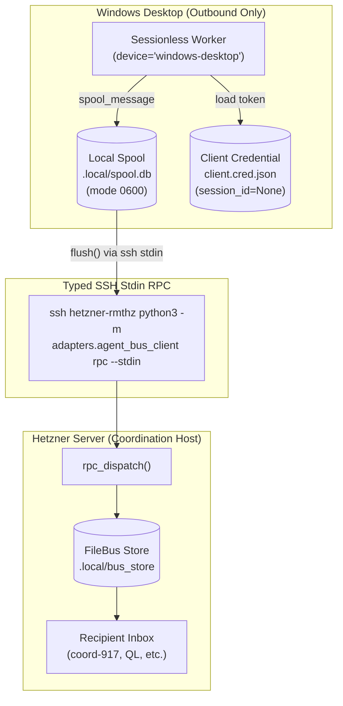

# Product 4: Windows Client Standalone Integration Contract

**Document Version**: 2.0.0 (Standalone FileBus & Offline Spool Contract)  
**Date**: 2026-10-06  
**Author**: Coordination Head (`coord-917-custody-resume-20261006`, session `3138b062`)  
**Directives**: C2922, C2958, C2965, C2975, C2981, C2985  
**Canonical Pinned Commit**: `b3ca77650bdf34c9c3cbd361f1d99253ee71cd44` (repo `agent-coordination`, branch `origin/codex/role-failover-20261006`)  
**Canonical Implementation File**: `adapters/agent_bus_client.py`  
**Test Suite**: `tests/test_agent_bus_client.py` (12/12 passed, 89/89 full repo passed)  

---

## 1. Executive Summary & Problem Resolution

Earlier iterations of the Windows client contract (`8e346` / `adapters/windows_client.py`) relied on invoking the `aplexer` binary (`aplexer message send ... --from windows-codex`) over SSH relays. As diagnosed by the Desktop Orchestrator and confirmed during principal review:
1. **No Native Desktop Aplexer Session**: No native `windows-codex` session exists in the server aplexer session catalog. Windows desktop cannot borrow, synthesize, or forge aplexer credentials (`session_id=None` anti-spoofing invariant).
2. **Quoting and Argument Length Vulnerabilities**: Executing CLI commands with multiline JSON arguments over SSH leads to PowerShell / cmd escaping truncation, quote escaping bugs, and command-length limits.
3. **Network Interruption & Flaky Transport**: If SSH connections drop between Windows and Hetzner, unsent messages were previously lost without a durable local spool.

**The Solution (`b3ca77650bdf34c9c3cbd361f1d99253ee71cd44`)**:
A completely standalone, zero-aplexer, pure Python 3.10+ standard library implementation in `adapters/agent_bus_client.py`. It provides:
- **Direct FileBus Protocol**: Directly integrates with the canonical `agent-bus` engine (`FileBus`), bypassing aplexer CLI entirely.
- **Typed SSH Stdin RPC (`build_typed_ssh_command`)**: Outbound requests are framed as clean JSON payloads over standard input (`ssh <host> python3 -m adapters.agent_bus_client rpc --stdin`), completely eliminating command-line quoting and escaping errors.
- **Local SQLite Outbox Spool (`OfflineSpool`)**: Outbound messages are spooled in a local SQLite database (`.local/spool.db`). Messages maintain strict FIFO ordering, enforce `reject_head_cred_inheritance` prior to disk persistence, and feature fail-closed flushing (zero dropped messages on transport failure).
- **Dedicated Independent Cursor**: Cursor progression is partitioned by `(device_id, session_id)`, preventing cross-contamination with server processes.

---

## 2. Runtime Specification & Dependencies

- **Platform**: Windows 10/11 (PowerShell 7+, Windows PowerShell 5.1, or cmd.exe)
- **Interpreter**: Python 3.10+ (Windows standard distribution)
- **Dependencies**: **Pure Python Standard Library ONLY**.
  - `sqlite3` (local outbox spool & durable cursor storage)
  - `json` (serialization & framing)
  - `subprocess` (SSH transport execution)
  - `argparse` (CLI parsing)
  - `dataclasses` (typed data models)
  - `hashlib` (payload digests & idempotency hashes)
  - `pathlib` (filesystem paths)
  - `uuid` (unique message and spool identifiers)
- **Zero Third-Party Packages**: Zero `pip` packages, zero wheel installations, zero Rust compilation (`no-Rust` rule strictly preserved).

---

## 3. Device Identity & Security Isolation Invariants



### Identity Invariants
1. **Sessionless Anti-Spoofing**:
   - `identity.device_id`: `"windows-desktop"`
   - `identity.session_id`: `None` (rendered canonically as `-` in store logs)
   - Zero fabrication of synthetic session UUIDs.
2. **Head Credential Protection (`reject_head_cred_inheritance`)**:
   - Outbound payloads containing `head.cred`, `head_token`, or privileged parent keys are rejected with `ValueError` or stripped before reaching the local spool or wire.
3. **Credential Storage**:
   - Credential files (`.cred.json`) are written atomically with mode `0600` containing `{"identity": {...}, "token": "...", "store": "..."}`.

---

## 4. Complementary CLI Command Reference

All subcommands support `--json` output (defaulting to structured JSON for automation).

### 4.1. Local Enrollment (`enroll`)
Generates a sessionless client identity and token on the target host or local test store:
```powershell
python -m adapters.agent_bus_client enroll `
    --store /home/alexey/git/agent-bus/.local/bus_store `
    --agent-name "windows-worker" `
    --device-id "windows-desktop" `
    --project-id "cross-computer-coordination" `
    --cred-path .local/windows_worker.cred.json
```

### 4.2. Local Outbox Spooling (`spool`)
Queues an outbound message safely in the local SQLite spool (`.local/spool.db`):
```powershell
python -m adapters.agent_bus_client spool `
    --spool-db .local/spool.db `
    --recipient-id "coord-917-custody-resume-20261006" `
    --body "Heartbeat from Windows desktop worker" `
    --data '{"status": "active", "completed_items": 4}' `
    --idempotency-key "win-hb-20261006-001"
```

### 4.3. Flushing Outbox Spool (`flush`)
Flushes pending spooled messages over SSH to the target FileBus store in strict chronological FIFO order:
```powershell
python -m adapters.agent_bus_client flush `
    --spool-db .local/spool.db `
    --store /home/alexey/git/agent-bus/.local/bus_store `
    --cred .local/windows_worker.cred.json
```
*Guarantees*: Fails closed on connection drops or transport exceptions. Delivers messages in exact FIFO order; zero messages are dropped or lost on partial failure.

### 4.4. Direct Message Transmission (`send`)
Sends a message directly to the recipient:
```powershell
python -m adapters.agent_bus_client send `
    --store /home/alexey/git/agent-bus/.local/bus_store `
    --cred .local/windows_worker.cred.json `
    --to "coord-917-custody-resume-20261006" `
    --body "Status report" `
    --idempotency-key "direct-send-001"
```

### 4.5. Inbox Polling (`poll`)
Polls recipient inbox with durable cursor tracking:
```powershell
python -m adapters.agent_bus_client poll `
    --store /home/alexey/git/agent-bus/.local/bus_store `
    --cred .local/windows_worker.cred.json `
    --unread-only
```

### 4.6. Message Acknowledgment (`ack`)
Acknowledges receipt, advancing the durable cursor:
```powershell
python -m adapters.agent_bus_client ack `
    --store /home/alexey/git/agent-bus/.local/bus_store `
    --cred .local/windows_worker.cred.json `
    --message-id "<MESSAGE_ID>"
```

### 4.7. Message Reply (`reply`)
Replies directly to a received message:
```powershell
python -m adapters.agent_bus_client reply `
    --store /home/alexey/git/agent-bus/.local/bus_store `
    --cred .local/windows_worker.cred.json `
    --reply-to "<ORIGINAL_MESSAGE_ID>" `
    --body "Task acknowledgment from Windows" `
    --idempotency-key "win-reply-001"
```

### 4.8. Typed Stdin RPC Execution (`rpc --stdin`)
Invoked automatically by `build_typed_ssh_command` to receive and execute JSON-RPC commands streamed via standard input:
```powershell
# Example of stdin RPC invocation over SSH
$rpcPayload = '{"method": "poll", "params": {"unread_only": true}}'
$rpcPayload | ssh hetzner-rmthz python3 -m adapters.agent_bus_client rpc --store /home/alexey/git/agent-bus/.local/bus_store --cred /home/alexey/.local/creds/win.cred.json --stdin
```

---

## 5. Python Integration API

Windows scripts can directly import and utilize the high-level Python API:

```python
from pathlib import Path
from adapters.agent_bus_client import (
    OfflineSpool,
    build_typed_ssh_command,
    enroll_agent,
    send_message,
    poll_messages,
    ack_message,
    reply_message,
)

# 1. Initialize local spool
spool = OfflineSpool(db_path=Path(".local/spool.db"))

# 2. Spool an outbound task result
spool_entry = spool.spool_message(
    recipient_id="coord-917-custody-resume-20261006",
    body="Windows unit test execution results",
    data={"passed": 12, "failed": 0},
    idempotency_key="win-task-42-completion",
)

# 3. Flush spool to remote server
delivered = spool.flush(
    store_path=Path("/home/alexey/git/agent-bus/.local/bus_store"),
    cred=Path(".local/windows_worker.cred.json"),
)
```

---

## 6. Verification & Falsification Matrix

| Test Requirement | Validation Mechanism | Test Case | Status |
| :--- | :--- | :--- | :--- |
| **Sessionless Identity** | Anti-spoofing check | `test_enroll_creates_sessionless_identity_and_mode_0600_cred` | **PASSED** |
| **FIFO Spool Delivery** | Chronological ordering verification | `test_offline_spool_flush_fifo_lifecycle_and_dedup` | **PASSED** |
| **Fail-Closed Resilience**| Transport crash injection | `test_offline_spool_flush_fails_closed_on_connection_error_without_dropping` | **PASSED** |
| **Head Credential Rejection**| Injected `head.cred` payload | `test_reject_head_cred_inheritance` / `test_offline_spool_stores_and_enforces_cred_protection` | **PASSED** |
| **Typed Stdin RPC** | Stdin JSON framing verification | `test_build_typed_ssh_command_stdin_framing` | **PASSED** |
| **Durable Read Cursor** | Redundant poll after ACK | `test_reply_and_ack_durable_cursor` | **PASSED** |
| **CLI Execution** | End-to-end headless CLI test | `test_cli_spool_and_flush` | **PASSED** |

---

## 7. Ordinary Git Recovery & Fallback

In the event of working tree corruption or local disruption on either host:
1. Canonical source is tracked on `github.com:alexeygrigorev/agent-coordination.git` at branch `refs/heads/codex/role-failover-20261006`.
2. Clean checkout restoration:
   ```bash
   git fetch origin codex/role-failover-20261006
   git checkout origin/codex/role-failover-20261006 -- adapters/agent_bus_client.py tests/test_agent_bus_client.py
   ```
3. Invariant 5 peer paths are strictly backed up in `.local/recovery/coord-head-custody-20261006/private_patches/dirty_5paths.patch` with verified diff SHA-256 `8c9f88b85d05deb21b7d732ad6f03499022bde7bcd74c456a56c2fd7f67c94aa`.
