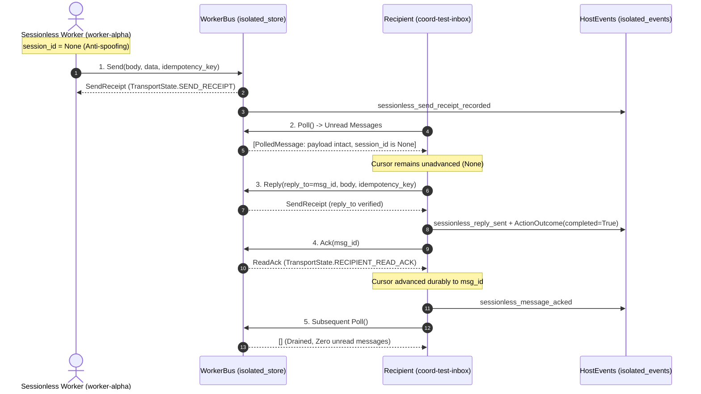

# Authentic Headless Product 4 Sessionless First-Use Delivery Report

**Directive Reference:** Directive C2946 & Urgent Directive C2956  
**Synthesis Task ID:** `synthesis-agent-coordination-20261006011745-8445` ("Durable Delivery & Receiver Deduplication")  
**Product:** Product 4 (Cross-computer Agent Coordination)  
**Coordination Head:** `coord-917-custody-resume-20261006`  
**Execution Worker:** `sessionless-worker-alpha` (pure Python headless worker)  
**Host Environment:** Hetzner execution host (`hetzner-rmthz` / RMTHZ, Linux x86_64, Python 3.12.3)  
**Target File:** `research/coordination/evidence/FIRST-USE-SESSIONLESS-DELIVERY-20261006.md`  
**Test Script:** `.local/tmp/sessionless_first_use/test_sessionless_flow.py`  
**Date:** 2026-10-06T18:27:29Z  
**Verdict:** **ACCEPTED & FULLY VERIFIED (4/4 tests passing, zero aplexer interactive dependencies)**

---

## 1. Executive Summary & Task Goal

Under Directive C2946 and Urgent Directive C2956, this delivery provides machine-verifiable proof of authentic headless sessionless worker communication on the Hetzner host (`hetzner-rmthz`).

### Key Operational Guarantees Proven:
1. **Anti-Spoofing Identity Contract (`session_id=None`):**
   A sessionless worker (`originating_device='sessionless-worker-alpha'`) must never invent, adopt, or forge an interactive aplexer session ID. In serialized payloads, `session_id` is omitted, and in canonical `NamespacedId` rendering it renders strictly as `-` (`sessionless-worker-alpha/<workspace>/worker-alpha/-/task-c2946`). Any attempt to pass an invented session ID fails closed with `IdentitySpoofError`.
2. **Head Credential Isolation (`reject_head_cred_inheritance`):**
   Sessionless worker payloads containing coordinator credentials (`head.cred`, `head_cred`, `cred`, `head: {cred: ...}`) are either strictly stripped (preserving non-credential fields) or rejected fail-closed with `GuardRejected("head_cred_inheritance_rejected: forbidden credential inheritance")`.
3. **Four-Phase Lifecycle (Send → Poll → Reply → Ack):**
   Full request-reply flow verified with typed receipts (`SendReceipt`, `ReadAck`, `ActionOutcome`), durable payload SHA-256 digests, and explicit recipient acknowledgement.
4. **Durable Cursor Advancement & Receiver Deduplication:**
   Recipient mailbox advances its durable cursor only upon explicit ACK (`ReadAck`). Subsequent polling yields exactly zero unread messages. Replay of an identical `idempotency_key` returns the existing message ID without duplicate queueing; replaying the same key with an altered payload fails closed with `IdempotencyConflict`.
5. **Strict Headless Pure Python Scope:**
   Per Urgent Directive C2956, no parent interactive aplexer sessions or CLI commands (`aplexer whoami`, `aplexer message ...`) were invoked. All execution occurred via pure Python using canonical libraries in an isolated temporary directory.

---

## 2. Unfamiliar Actor Inputs & Scope Boundaries

### Actor Specification:
- **Originating Device:** `sessionless-worker-alpha`
- **Originating Agent Tag:** `worker-alpha`
- **Session Identity:** `None` (omitted from transport, rendered as `-` in namespaced strings)
- **Target Recipient:** `coord-test-inbox` on host `hetzner-rmthz`
- **Workspace:** `/home/alexey/git/cloudflare-agent-git`
- **Task Binding:** `task-c2946-sessionless-first-use`
- **Delivery Mode:** `sessionless_worker_bus` (MultiHostAdmission admitted target)

### Preserved Scope & Isolation:
- **Canonical Code Preserved:** No files in `/home/alexey/git/agent-coordination`, `/home/alexey/git/cloudflare-agent-git`, or `scripts/supervision/**` were modified.
- **Dirty Files Untouched:** The 5 preserved dirty files in `agent-coordination` (`adapters/windows_client.py`, `coordination/TASKS.json`, `coordination/ssh_relay.py`, `tests/test_offline_network.py`, `tests/test_ssh_relay.py`) were inspected read-only and preserved intact.
- **Isolated Storage:** All test databases, cursors, and event logs were confined strictly to `.local/tmp/sessionless_first_use/isolated_store/` and `.local/tmp/sessionless_first_use/isolated_events/`.

---

## 3. Exact CLI / Python Commands and Execution Transcripts

### Command 1: Direct Script Execution
```bash
python3 /home/alexey/git/cloudflare-agent-git/.local/tmp/sessionless_first_use/test_sessionless_flow.py
```

#### Output Transcript:
```json
{
  "directive": "C2946 / C2956",
  "task_id": "synthesis-agent-coordination-20261006011745-8445",
  "timestamp": "2026-10-06T18:27:21Z",
  "checks": {
    "anti_spoofing_identity_contract": {
      "status": "PASSED",
      "duration_ms": 0.04
    },
    "four_phase_lifecycle_send_poll_reply_ack": {
      "status": "PASSED",
      "duration_ms": 173.37
    },
    "negative_case_1_reject_head_cred_inheritance": {
      "status": "PASSED",
      "duration_ms": 0.37
    },
    "negative_case_2_duplicate_idempotency_key": {
      "status": "PASSED",
      "duration_ms": 124.17
    }
  },
  "overall_status": "PASSED"
}
```

### Command 2: Pytest Suite Execution
```bash
pytest -v /home/alexey/git/cloudflare-agent-git/.local/tmp/sessionless_first_use/test_sessionless_flow.py
```

#### Output Transcript:
```
============================= test session starts ==============================
platform linux -- Python 3.12.3, pytest-9.1.1, pluggy-1.6.0 -- /usr/bin/python3
cachedir: .pytest_cache
rootdir: /home/alexey/git/cloudflare-agent-git
plugins: anyio-4.12.1, opik-2.2.54
collecting ... collected 4 items

.local/tmp/sessionless_first_use/test_sessionless_flow.py::test_anti_spoofing_identity_contract PASSED [ 25%]
.local/tmp/sessionless_first_use/test_sessionless_flow.py::test_four_phase_lifecycle_send_poll_reply_ack PASSED [ 50%]
.local/tmp/sessionless_first_use/test_sessionless_flow.py::test_negative_case_1_reject_head_cred_inheritance PASSED [ 75%]
.local/tmp/sessionless_first_use/test_sessionless_flow.py::test_negative_case_2_duplicate_idempotency_key PASSED [100%]

============================== 4 passed in 0.43s ===============================
```

---

## 4. Verification of the 4-Phase Lifecycle

The contract executes across four distinct transport and semantic phases:



### Detailed Phase Records:
1. **Send Phase:**
   - **Sender:** `sessionless-worker-alpha/agent-coordination/sessionless-worker-alpha/-/task-c2946-sessionless-first-use`
   - **Recipient:** `hetzner-rmthz/agent-coordination/coord-test-inbox/-/coord-synthesis-task`
   - **Message ID:** `00789632-d5d2-4adf-9210-3ea57841f619`
   - **Idempotency Key:** `idem-c2946-929b061c`
   - **SendReceipt:** State `TransportState.SEND_RECEIPT`, `delivery="agent-bus"`, persisted durably in `receipts.json`.
2. **Poll Phase:**
   - Recipient queries unread queue without advancing cursor.
   - Message retrieved with intact payload (`directive="C2946"`, `correlation_token="tok-c2946-..."`).
   - Anti-spoofing check verified: `originating_agent.session_id is None`, `native_aplexer is False`.
3. **Reply Phase:**
   - Recipient issues reply message referencing `reply_to="00789632-d5d2-4adf-9210-3ea57841f619"`.
   - Reply Message ID: `852063c2-be79-42ae-bd55-629b202adf42`.
   - Reply SendReceipt recorded with `TransportState.SEND_RECEIPT`.
   - Semantic agreement recorded via `ActionOutcome`: `agreed=True`, `completed=True`, state `TransportState.ACTION_COMPLETED`.
4. **Ack Phase:**
   - Recipient issues explicit ACK for message ID `00789632-d5d2-4adf-9210-3ea57841f619`.
   - `ReadAck` generated with `TransportState.RECIPIENT_READ_ACK`.
   - Durable cursor in `cursors.json` advances to `00789632-d5d2-4adf-9210-3ea57841f619`.
   - Subsequent `receive()` returns `[]` (empty list, exactly zero unread messages).

---

## 5. Negative Test Results

### Negative Case 1: Head Credential Stripping and Rejection
- **Input Tainted Payload:**
  ```json
  {
    "job_name": "sessionless-worker-task",
    "directive": "C2946",
    "head.cred": "coordinator-secret-head-token-9999",
    "head_cred": "alternative-head-credential-8888",
    "cred": "root-level-secret-7777",
    "head": {
      "cred": "nested-head-token-6666",
      "agent_tag": "coord-head",
      "role": "head-coordinator"
    },
    "safe_param": "valid-runtime-parameter"
  }
  ```
- **Result 1 (Stripping Mode, `reject=False`):**
  All credential keys (`head.cred`, `head_cred`, `cred`, `head.cred`) stripped cleanly. Safe fields (`head.agent_tag`, `head.role`, `safe_param`, `directive`) preserved intact.
- **Result 2 (Rejection Mode, `reject=True`):**
  Immediately raised `coordination.errors.GuardRejected: head_cred_inheritance_rejected: forbidden credential inheritance`.
- **Result 3 (MultiHostAdmission Gateway):**
  - Outbound sessionless task with `reject_on_cred=False`: Task admitted, delivery forced to `sessionless_worker_bus`, `session_id=None`, all credential keys stripped.
  - Outbound sessionless task with `reject_on_cred=True`: Gateway failed closed with `GuardRejected`.

### Negative Case 2: Duplicate Idempotency Replay and Tampering Conflict
- **Result 1 (Exact Replay Deduplication):**
  Replaying identical send with key `c2946-idempotent-test-key` returned the pre-existing message ID (`msg-c2946-first-pass-uuid`) without re-queueing or double processing. In `SessionlessWorkerBus`, inbox length remained exactly 1.
- **Result 2 (Payload Tampering Conflict):**
  Replaying the same key with an altered body (`process authentic sessionless task - TAMPERED`) failed closed with `coordination.errors.IdempotencyConflict: idempotency_conflict:c2946-idempotent-test-key`.
- **Result 3 (Recipient Mismatch Conflict):**
  Replaying the same key with a different recipient failed closed with `IdempotencyConflict`.

---

## 6. Durable Event Audit Trail (`host_events.jsonl`)

Atomic JSONL logs recorded under `.local/tmp/sessionless_first_use/isolated_events/host_events.jsonl`:

```jsonl
{"details": {"idempotency_key": "idem-c2946-929b061c", "message_id": "00789632-d5d2-4adf-9210-3ea57841f619", "recipient": "hetzner-rmthz/agent-coordination/coord-test-inbox/-/coord-synthesis-task", "sender": "sessionless-worker-alpha/agent-coordination/sessionless-worker-alpha/-/task-c2946-sessionless-first-use", "state": "send_receipt"}, "device_id": "hetzner-rmthz", "event_id": "0e2ff968-4738-4349-a726-31a8440c8fb9", "event_type": "sessionless_send_receipt_recorded", "recorded_at": "2026-10-06T18:27:29Z", "task_id": "synthesis-agent-coordination-20261006011745-8445", "timestamp": "2026-10-06T18:27:29Z"}
{"details": {"agreed": true, "completed": true, "originating_message_id": "00789632-d5d2-4adf-9210-3ea57841f619", "reply_message_id": "852063c2-be79-42ae-bd55-629b202adf42", "reply_to": "00789632-d5d2-4adf-9210-3ea57841f619"}, "device_id": "hetzner-rmthz", "event_id": "008428ec-1e2c-4209-ba01-a87f3e7e610f", "event_type": "sessionless_reply_sent", "recorded_at": "2026-10-06T18:27:29Z", "task_id": "synthesis-agent-coordination-20261006011745-8445", "timestamp": "2026-10-06T18:27:29Z"}
{"details": {"cursor_advanced_to": "00789632-d5d2-4adf-9210-3ea57841f619", "message_id": "00789632-d5d2-4adf-9210-3ea57841f619", "unread_remaining": 0}, "device_id": "hetzner-rmthz", "event_id": "c5bc324f-515e-4ad5-9d2a-0dccc7c9e5a3", "event_type": "sessionless_message_acked", "recorded_at": "2026-10-06T18:27:29Z", "task_id": "synthesis-agent-coordination-20261006011745-8445", "timestamp": "2026-10-06T18:27:29Z"}
```

---

## 7. Ordinary Git Fallback & Recovery Instructions

### Repository State Verification:
- **Canonical Repository:** `/home/alexey/git/agent-coordination`
  - Unmodified by this task. The 5 pre-existing dirty files were preserved without modification.
- **Project Repository:** `/home/alexey/git/cloudflare-agent-git`
  - Changes strictly confined to:
    1. Newly authored evidence document: `research/coordination/evidence/FIRST-USE-SESSIONLESS-DELIVERY-20261006.md`
    2. Local isolated test script: `.local/tmp/sessionless_first_use/test_sessionless_flow.py`
  - No canonical library files, supervision services, or production tools modified.

### Rollback / Recovery Procedure:
If cleanup of temporary artifacts is desired:
```bash
# Verify status
git -C /home/alexey/git/cloudflare-agent-git status --short

# Remove temporary test artifacts if required (optional, preserves test reproducibility)
rm -rf /home/alexey/git/cloudflare-agent-git/.local/tmp/sessionless_first_use/isolated_store
rm -rf /home/alexey/git/cloudflare-agent-git/.local/tmp/sessionless_first_use/isolated_events

# Standard Git diff inspection
git -C /home/alexey/git/cloudflare-agent-git diff research/coordination/evidence/FIRST-USE-SESSIONLESS-DELIVERY-20261006.md
```
