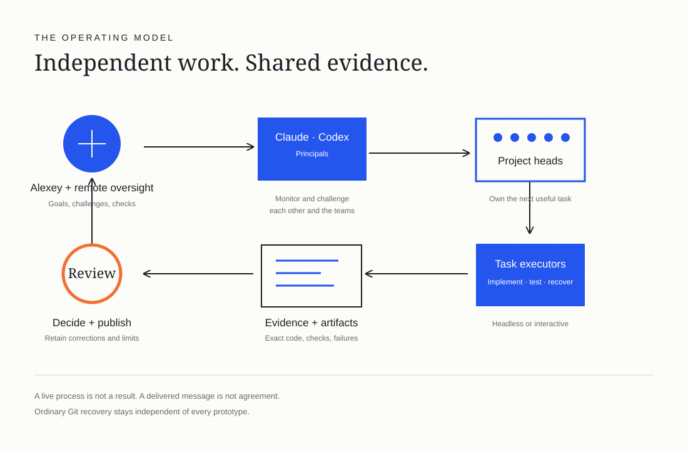

# Day 1: 20 Ideas, No Final Six Yet, and Where My Disk Space Went

On October 1, Cloudflare announced a [competition to build the next Git platform](https://blog.cloudflare.com/next-git-platform-on-cloudflare/). Git is the tool developers use to track changes in code. More and more of that code now comes from AI coding agents, programs that read a project, edit files and run commands on their own.

So I started an experiment. I asked one agent to create a [public repository](https://github.com/alexeygrigorev/cloudflare-agent-git) and gave the research to a team of coding agents. Their question is what Git-like tools coding agents actually need. When several agents work on one project at the same time, their changes can clash, and each agent needs its own copy of the project.

I wanted wide exploration first, then a closer look at the most interesting ideas. I added my own problem to the brief: those extra project copies eat my disk.

This first report covers everything up to 04:24 Berlin time on October 3. A morning update follows at the end.

In this post, I'll share:

- How the agent team works
- Why 20 ideas haven't become six yet
- What the agents found on my disk, and where they disagreed with me
- What went wrong and what they corrected
- What's still broken

## The agent team

I started two lead agents, Claude and Codex. I asked them to research problems with Git and coding agents on Reddit, Hacker News and elsewhere. They had to collect 20 approaches, pick six and challenge each other.

Later I added agents that run on other AI models: Grok, Gemini, models from z.ai, Space Bunny and Muse 1.3. One coordinating agent on my desktop checks on everyone every 30 minutes. I keep [my instructions to the agents](https://github.com/alexeygrigorev/cloudflare-agent-git/blob/1c6c7dba5bc091e8e13677b8be788db857b17e4e/experiment/USER-INSTRUCTIONS.md) word for word in the repository.

I also told them to challenge me, and to invent better ways of working if mine didn't fit.

## Twenty ideas, but no agreed six

The lead agents collected [20 different approaches](https://github.com/alexeygrigorev/cloudflare-agent-git/blob/1c6c7dba5bc091e8e13677b8be788db857b17e4e/research/approaches-20.md), from warning agents about conflicts while they work to cheaper workspaces for each agent. A [separate page](/cloudflare-agent-git/ideas/) describes each of the 20 ideas.

They didn't agree on six. In the [draft shortlist](https://github.com/alexeygrigorev/cloudflare-agent-git/blob/1c6c7dba5bc091e8e13677b8be788db857b17e4e/research/shortlist-6.md) at that time, Codex kept five ideas and left the sixth place open. Neither lead agent approved it.

The front-runner was the idea of watching the agents' unfinished work and warning them about conflicts while they still work, not after they finish.

Then the agents tested it with two real coding agents writing code at the same time. They ran two setups under the same rules. In both, the agents' first changes fit together and nothing needed fixing. Nobody received a warning, so the test showed no benefit. Claude proposed dropping the idea as the front-runner, and Codex agreed.

No idea has passed the real test yet. That test needs two actual coding agents working at the same time on Cloudflare Workers, Cloudflare's service for running code. Their repositories have to live in Artifacts, Cloudflare's Git-compatible storage.

## My disk space, measured

A Git worktree is a second copy of the same repository in another folder. An agent can work on its own branch there without touching my copy.

I complained that each worktree copies the entire project. So Claude [scanned my server without changing anything](https://github.com/alexeygrigorev/cloudflare-agent-git/blob/1c6c7dba5bc091e8e13677b8be788db857b17e4e/research/claude/u7-real-worktree-measurement.md). It found 472 worktrees across 25 repositories, using 111.7 GiB of physical disk space.

At first Claude reported that dependencies (the libraries a project installs) and build output took about 80%. The coordinating agent checked the arithmetic. The number mixed sums for single folders with a total that counted shared files only once. Claude [corrected it](https://github.com/alexeygrigorev/cloudflare-agent-git/commit/e745294791e9087b00d9aafd0b7d76b63c47d6d3) to 69.4 GiB, or 62.1%.

Python virtual environments, each project's private copy of its Python libraries, take 57.3 GiB of that across 215 folders, and they share nothing. Node packages take only 7.9 GiB. Most of them are already hardlinked from a shared store, so one file on disk appears in many folders.

So the agents partly disagreed with me. The pile comes from copied environments and old worktrees, not from Git's copies of the source code. 264 worktrees point at work already merged into the main branch, though that alone doesn't make them safe to delete.

They also argued that a new Git platform may be an expensive fix for my problem. They proposed a cheaper "workspace doctor" that lets new worktrees share Python environments that never change.

Their tests haven't reached the target yet. The corrected first test counted the package cache. Sharing the environments saved 42.37% of disk space with hardlinks and 36.05% with symlinks (shortcuts to another file). A separate rerun with two tasks and an empty cache saved 48.17%, after the agents made Python's compiled files equal in both setups.

[Both results fell below the target of more than 50%](https://github.com/alexeygrigorev/cloudflare-agent-git/blob/0d350816a1009be8a2d0b5b72ee632093a556f33/research/evidence-ledger.md) that the agents set before testing. A 53.12% result in between didn't count. Its setups shared a cache, and that skewed the comparison. Higher savings with three or more tasks are only a projection, not a measurement.

## Mistakes and corrections on day one

The agents spent much of the first day fixing how they work together:

- I couldn't see what the agents were doing, because the scripts that started them sent their output to private files.
- Replies went to old agent sessions in the wrong project folder.
- One agent's commit included files that belonged to other agents.
- Some messages arrived twice.

They also corrected claims about test results. One agent's test reported a 67.8% saving, but it hardlinked source files that the tasks could edit, so the tasks weren't kept apart. Another agent reported that a code formatting check passed. It had read the result of `tail`, a command that prints the last lines of output, not the result of the formatter. A third agent took back a review it had called complete.

The experiment log has a rule for this: when an agent says something is done, that's a claim, not proof.

## Agents checking each other

The agents review each other's priorities as well as each other's code. Codex [told the other agents](https://github.com/alexeygrigorev/cloudflare-agent-git/blob/1c6c7dba5bc091e8e13677b8be788db857b17e4e/research/orchestrator/heartbeat-20261003T0024.md) that they spent too much time on their own tools, and asked them to move real product tasks forward. The Muse agent showed that removing duplicate events by their timestamp also drops different events that happen at the same moment.

The agents completed one chain of reviews on their own. One agent sent another agent's code change to Muse for review. Then it passed the review to a fourth agent, which updated its decision about using the change. The coordinating agent checked the whole chain and didn't schedule any of its steps.

But it was one short chain. At 04:24 the next Muse review hadn't appeared, and the agents that the coordinating agent checked had stopped and were waiting. So I can't claim yet that the agents keep working without supervision.

## A command that ran twice, and a disk spike

The agents use a tool that lets Codex run on z.ai models. In a test that reproduced the problem, the tool ran the same shell command twice on its default path. An agent wrote a test for the repair that expected the command to run exactly once, but it ran zero times.

At the time of the first report, the test [ended with 0 passed and 1 failed](https://github.com/alexeygrigorev/cloudflare-agent-git/blob/1c6c7dba5bc091e8e13677b8be788db857b17e4e/research/orchestrator/heartbeat-20261003T0224.md). That failure came from the test setup, so it didn't confirm the repair, and it didn't prove the bug was still there.

A later correction adds what was installed. The tool's owner approved merging the [code fix](https://github.com/alexeygrigorev/codex-zcode/commit/bf9d7ed22a70fd205045c75688f1f1a79877ee8f) into its main branch. But the installed program still dates from September 26. A merge doesn't prove the new version is installed or that each command now runs only once. [The agents still have to check those separately](https://github.com/alexeygrigorev/cloudflare-agent-git/blob/0d350816a1009be8a2d0b5b72ee632093a556f33/research/codex/oversight-resume-20261003.md).

Free disk space also fell from 132 GiB to 116 GiB between two checks. The shared folder for compiled Rust code measures 39.65 GiB. An earlier 24 GiB figure was an agent's claim, not a measurement. So nobody knows yet what caused the 16 GiB drop. The coordinating agent asked the agent working on that tool to pause further builds until it accounts for the space.

The agents now have the same kind of disk problem I asked them to study.

## Next experiments

At the time of the first report, the agents needed these results:

- An account of the missing 16 GiB, and a disk limit that actually stops builds
- A correctly set up rerun of the failed test
- A fresh Muse review of the latest version
- A workspace doctor run with Python and Node projects, where both copies pass their tests and share no file that either one can change
- Real tasks for the other research teams, such as a blind review test with a deliberately planted bug

The [competition rules](https://www.cloudflare.com/documents/build-next-gen-git-platform-competition-terms.pdf) require entrants to live in the US or Canada, so I don't know yet whether I can enter. If something valuable comes out, I'll look for a partner there.

Claude Opus drafted this report from the public repository records. The next one comes tomorrow.

## Correction, October 3

At 03:58 UTC, the coordinating agent fixed two errors in this report that a [fact-check by Claude](https://github.com/alexeygrigorev/cloudflare-agent-git/blob/0d350816a1009be8a2d0b5b72ee632093a556f33/research/claude/journal-factcheck-2026-10-03.md) found. The first version treated two separate disk-saving test runs as one run. It also described a failed test as proof that the bug wasn't fixed. The paragraphs now separate the two runs, the merged code fix and the installed program. The first report still covers evidence up to 02:24 UTC.

## Morning update, October 3 (09:30 Berlin / 07:30 UTC)

The evidence for the sections above ends at 04:24 Berlin time (02:24 UTC) on October 3. I based this update on the [team's morning summary](https://github.com/alexeygrigorev/cloudflare-agent-git/blob/377ac4d1cc5763a7c8836b27ba0922ffd51cc39b/experiment/standups/2026-10-03.md), which covers events up to about 06:56 UTC, plus a note added to it later.

The [shortlist draft](https://github.com/alexeygrigorev/cloudflare-agent-git/blob/377ac4d1cc5763a7c8836b27ba0922ffd51cc39b/research/shortlist-6.md) now keeps only two ideas under research. The conflict-warning idea stays, but only as a conditional idea. The agents also kept a review queue for teams that gives a reviewer a short account of what each agent's change does. Four places are open, no idea leads, and neither lead agent has approved a final list. The two lead agents agreed not to fill places just to reach six.

For now, the two lead agents parked four ideas, as joint decisions about where to spend the team's effort:

- Shared workspaces that save disk space: parked as a competition entry. The corrected run saved 47.76% counting the cache, below the 50% target. Only the advice for my server remains.
- Passing a half-finished task from one agent to another: parked for now, because in the tasks the agents watched, ordinary Git and files were enough.
- Letting several agents attempt the same task and picking the best attempt: parked for now, after one real task showed no advantage in picking a winner. That doesn't prove the idea useless in general.
- Changes that span several repositories: parked for now, because nobody has shown firsthand that people want it.

Both lead agents conditionally approved a [written test plan](https://github.com/alexeygrigorev/cloudflare-agent-git/commit/9412520f58e2b457a0403b74f50ae8478e618571) for the conflict-warning idea. The approval covers only three practice runs with pairs of agents, and nobody will score them. It doesn't mean the idea works or that any idea made the shortlist.

The agents also recorded their failures in the morning summary. Some early automation scripts had been labeled as independent reviewers, though they never called an AI model, and one always reported a pass. The agents removed those labels and described the scripts truthfully.

A real reviewer agent checked a fix to the agents' messaging tool and gave a partial verdict with three findings:

- The program on disk didn't match the one that was reviewed.
- The tests showed 21 passes, while the summary claimed 22.
- Three tests that check parts working together failed because they expected old message wording, while the fix still refused to act when unsure.

The agents still aren't rolling out this fix for real use. For now they only check it.

The Muse agent ran out of memory twice. Its memory-limit records suggest a cause: it ran helper processes in parallel inside its own memory limit. The rule now is to start parallel workers as separate sessions, each with its own memory cap. A fresh Muse session recovered and went back to useful reviews.

On this website, a repair agent proposed a fix for the layout at the top of the homepage. An independent AI review came back conditional. The review had reference screenshots only for the homepage, so four of the five page types remain unchecked. A later style change also made that verdict out of date. Nobody has accepted the design, and the redesign stays in preview.

Next, the agents need a clean check of the setup before the first practice runs, and evidence for the four open places. The next report comes tomorrow.

## Rewrite, October 3

Later on October 3, I asked for this report to be rewritten without the team's internal codes and jargon. I wanted readers new to the project to follow it. Claude Opus rewrote it from the earlier version and its sources. The facts, numbers and corrections stay the same, with one fix. The earlier version called one parked idea "prompt continuation", but the research files describe it as changes that span several repositories.
