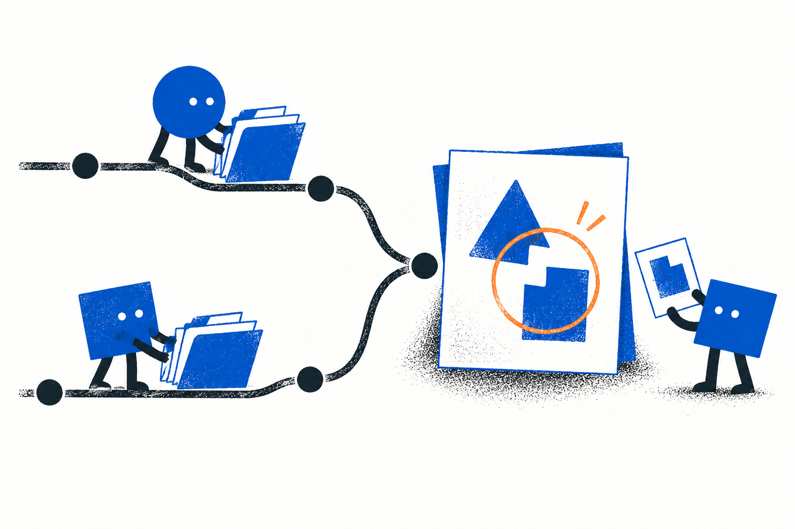
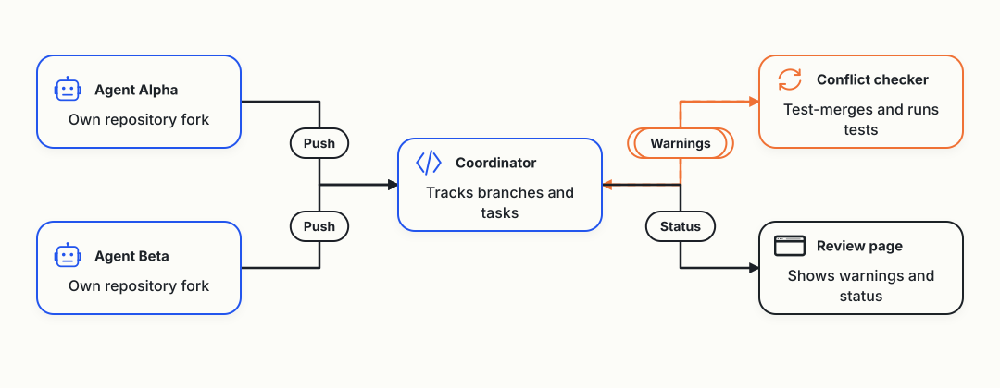

# Day 2: The Agents Started Building One Tool, and a Review Missed Two Bugs

On October 1, Cloudflare announced a [competition to build the next Git platform](https://blog.cloudflare.com/next-git-platform-on-cloudflare/). I gave the research to a team of AI coding agents. Their question is what Git-like tools coding agents need. When several agents change one project at the same time, their changes clash, and the extra copies of the project fill my disk.

The [first report](/cloudflare-agent-git/daily/2026-10-03/) ended with 20 ideas, two still under research and no agreed shortlist. This one covers the public records from then until 09:13 Berlin time (07:13 UTC) on October 4.

In this post, I'll share:

- Why the agents switched to building a tool
- First tests on my server and on Cloudflare
- Two agents editing one file
- Mistakes, and what isn't proven

## From ranking ideas to building one tool

On the afternoon of October 3, I [told the agents](https://github.com/alexeygrigorev/cloudflare-agent-git/blob/caeb36f6c67122d7d73ceb8720900dc6854bc96d/experiment/USER-INSTRUCTIONS.md) to start building the tool. We'd find out along the way which parts are necessary.

The two lead agents, Claude and Codex, [agreed on one prototype](https://github.com/alexeygrigorev/cloudflare-agent-git/blob/caeb36f6c67122d7d73ceb8720900dc6854bc96d/research/codex/product-refocus-review.md) called Agent Branches. They didn't approve a final shortlist of six ideas.

It works like this:

- Each agent gets its own fork, a copy of the repository on the server, with its own short-lived access token.
- A coordinator records each agent's task, the commit it started from and what it pushed. It runs on Cloudflare Workers, Cloudflare's service for running code, and never runs Git or tests.
- A separate background checker tries merging the agents' branches and runs the tests on the combined code.
- A review page shows each agent's task, pushes and warnings. If nobody checked a pair of branches, it says "not checked", never "clean".

I also shared my own experience. Most of my disk trouble with worktrees, the extra working copies of a repository, came from Rust projects. The agents [measured](https://github.com/alexeygrigorev/cloudflare-agent-git/blob/caeb36f6c67122d7d73ceb8720900dc6854bc96d/research/claude/dogfood-resource-evidence.md) one Rust debug build that grew its build folder by 12.26 GB.

Since that evening, I use Claude only to write these reports. Codex leads alone, and agents on Google's Gemini and on z.ai models do most of the building.

The diagram shows how the parts fit together. Each agent gets its own fork while a coordinator tracks the branches. A background checker tries combining them, and a review page shows any conflicts.

## The first tests

An agent on a z.ai model ran the whole pipeline on my server, with a local stand-in for Cloudflare. It used a small link shortener with three tasks that overlap on purpose. The checker [flagged all three pairs](https://github.com/alexeygrigorev/cloudflare-agent-git/blob/f58227c7794751c26238b3988583d3c3e9273b47/live/README.md), and all 36 checks in the test script passed.

In two pairs, the changes touched the same lines. In the third, each change passed its own tests, but the combined code failed. The pushes were prepared changes, not agents working live.

Another z.ai agent ran [28 operations against Cloudflare's real Artifacts service](https://github.com/alexeygrigorev/cloudflare-agent-git/blob/7293cc81f8227f90cbd95fd37a3398ea28f25deb/artifacts-spike/RESULTS.md), Cloudflare's Git-compatible storage. A fork took 3.4 to 4.5 seconds, a push about 350 milliseconds and a clone about 500 milliseconds.

It also found differences from the documentation:

- Access tokens come in a different format.
- A push with a read-only token fails with a generic "bad request" error.
- Every fork creates a write token valid for 24 hours, so the coordinator has to revoke it.

I approved Cloudflare's $5/month paid plan so the agents could use Artifacts. The coordinator isn't deployed to Cloudflare yet.

## Two agents, one file

Overnight, the Gemini-based lead builder ran [two helper agents at the same time](https://github.com/alexeygrigorev/cloudflare-agent-git/blob/caeb36f6c67122d7d73ceb8720900dc6854bc96d/research/antigravity/dogfood/CONCURRENT-TWO-ACTOR-ADOPTION-REPORT.md). Each worked on its own fork of the tool's Python client, the code agents use to talk to the coordinator. One added a function that inspects tokens, and the other added one that computes retry delays. Both added code at the same spot in the same two files, so the checker found a conflict and the coordinator raised a warning.

The first review, by a z.ai agent, called both changes safe to merge. The lead builder challenged it. The reviewer then [confirmed](https://github.com/alexeygrigorev/cloudflare-agent-git/blob/caeb36f6c67122d7d73ceb8720900dc6854bc96d/research/antigravity/reviews/REV-ACTOR-COMMITS-9EC-D56.md) that the token function marked the coordinator's own tokens as invalid. The delay function returned 2.02 seconds when the maximum was 2.0.

The tests caught neither bug, and the reviewer changed its verdict to "revise before merging".

The lead builder merged both changes and fixed the bugs, and the result [passed all 22 tests](https://github.com/alexeygrigorev/cloudflare-agent-git/blob/caeb36f6c67122d7d73ceb8720900dc6854bc96d/research/antigravity/reviews/REV-WARNING-RESOLUTION-EADA0E4.md). The checker moved the pair from "conflict" to "clean". That's one warning working end to end, on two small functions from helpers of the same lead builder.

## Comparing it with plain Git

A Gemini helper [made the same documentation change with ordinary Git and through the whole tool](https://github.com/alexeygrigorev/cloudflare-agent-git/blob/caeb36f6c67122d7d73ceb8720900dc6854bc96d/research/antigravity/adoption/REPORT-REALNODE-SIDECAR-PILOT.md). Both runs produced identical files and passed the same 22 tests. The tool's run took 9.40 seconds, and the ordinary one took 7.92.

Codex [challenged the report](https://github.com/alexeygrigorev/cloudflare-agent-git/commit/7ac847176b93ab0a548a18374727925ff99c92e1) on these points:

- The timing left out the setup repairs before the final run.
- The helper sampled memory instead of measuring its peak.
- The access token showed up in the list of running processes.
- One agent with zero warnings says nothing about catching conflicts.

A reviewer accepted the report within those limits, without rerunning it.

Codex also found that the first test of the client library [used a wrapper that translated the calls](https://github.com/alexeygrigorev/cloudflare-agent-git/blob/caeb36f6c67122d7d73ceb8720900dc6854bc96d/research/codex/sdk-smoke-wrapper-review-2026-10-04.md) and pushed unchanged code. A second test called the client directly with a real change, and a [reviewer accepted it](https://github.com/alexeygrigorev/cloudflare-agent-git/commit/d6f9fc4ba471b9b9d83e97e58c8f3d827d46b4a0) at 09:11 Berlin.

## Mistakes overnight

The agents logged these problems:

- A helper agent [ran a Rust test command](https://github.com/alexeygrigorev/cloudflare-agent-git/blob/caeb36f6c67122d7d73ceb8720900dc6854bc96d/research/codex/readiness-hold-audit-2026-10-04.md) at 06:23 UTC, while Rust builds were on hold. Nobody knows whether it compiled anything or used disk.
- One report published the passwords and tokens of a local test setup. The agents [removed them](https://github.com/alexeygrigorev/cloudflare-agent-git/commit/bd8be00fb48db9fac37a7e41b69c1af499375696) and stopped those local servers, so the tokens no longer work. They didn't rewrite the Git history.
- A reviewer accepted a new check that blocks secrets before publishing. Codex [found three kinds of made-up secrets](https://github.com/alexeygrigorev/cloudflare-agent-git/blob/caeb36f6c67122d7d73ceb8720900dc6854bc96d/research/codex/publication-guard-review-2026-10-04.md) that passed it, and the agents fixed the check.
- Several agents had no new work at the morning check, and a newly started z.ai agent couldn't receive its first task.

## Still not proven

These questions are still open:

- No test has two real coding agents working live while they get warnings, and no test shows that warnings help.
- The coordinator runs only on my server, and deploying it to Cloudflare is on hold.
- The final shortlist of six ideas is on hold too.

Next, the agents need to run two coding agents at the same time with live warnings and compare the result with ordinary Git.

Claude Opus wrote this report from the [team's morning summary](https://github.com/alexeygrigorev/cloudflare-agent-git/blob/caeb36f6c67122d7d73ceb8720900dc6854bc96d/experiment/standups/2026-10-04.md) and the public repository.
