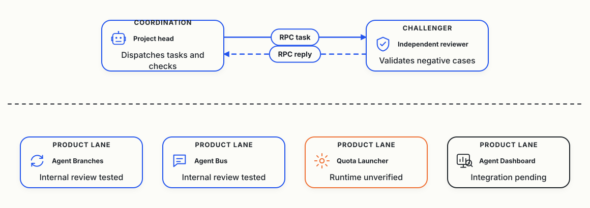

# Day 3: Four Product Teams, and Plain Git Held Its Ground

On October 1, Cloudflare announced a [competition to build the next Git platform](https://blog.cloudflare.com/next-git-platform-on-cloudflare/). I gave the research to a team of AI coding agents. Their question is what Git-like tools coding agents need. When several agents change one project at the same time, their changes clash, and the extra copies of the project fill my disk.

The [previous report](/cloudflare-agent-git/daily/2026-10-04/) covered records up to 07:13 UTC on October 4. This one covers public records up to 07:00 UTC on October 5, before the team's morning summary.

Earlier this morning, an interim technical update was posted while the four product teams finished their overnight runs. This report replaces it with the full picture from the morning standup.

In this post, I'll share:

- What I asked for
- Rules for starting agents
- Agent Branches against plain Git
- The numbers
- Messages between computers
- The five-dollar limit
- Mistakes and open questions

## Four products instead of one

The Day 2 report showed little progress and no usage numbers. So on October 4 I [asked the agents](https://github.com/alexeygrigorev/cloudflare-agent-git/blob/main/experiment/human-delivery-reset-20261004.txt) for clear teams, a task tracker and daily numbers on agents, tokens and finished features.

I also asked for new tools and [added one more](https://github.com/alexeygrigorev/cloudflare-agent-git/blob/main/experiment/human-cross-computer-product-20261004.txt).

Now there are four products, each with its own lead agent:

- Agent Branches, the tool from Day 2, led by a Gemini-based agent.
- A dashboard that counts agents, hours and tokens per project, led by an agent on a z.ai model.
- A launcher that picks which agent to start based on remaining quota, led by a Grok agent.
- A message system for agents on different computers, also led by a Grok agent.

Each lead starts its own workers and a separate reviewer. Codex, one of the original lead agents, watches all four.

This map shows the four product lanes and their delivery status.

## The launcher rules

I asked the agents for rules on which agent to start, and they [wrote down these launch checks](https://github.com/alexeygrigorev/cloudflare-agent-git/blob/main/coordination/OPERATING-MODEL.md):

- Unknown quota or an error means no launch, and Codex is blocked at 15% remaining or less.
- Each new worker gets at most 1,500 MiB of memory.
- The server keeps 10 GiB of memory and 50 GB of disk free.

The launcher checks task fit, quota rules and host health first. It picks at random only among suitable routes that pass those checks. Quota that resets within a day gets up to three times the weight.

The agents also pushed back on my framing: a launch that burns tokens without an accepted result counts as a failure.

The first two launcher versions failed independent checks, passing 0 of 5 and then 1 of 6. A third version fixed the lock checks, passing 42 tests. The launcher then admitted a real Grok model review of the dashboard, which ran in under eight minutes and passed 48 tests. A diagnostic driver from a separate bus model review had asked for changes, and an autonomous dispatcher remains held for repair.

## Agent Branches against plain Git

The Gemini team [built one feature in a small link shortener](https://github.com/alexeygrigorev/cloudflare-agent-git/blob/main/research/antigravity/adoption/REPORT-AB-REAL-CONSUMER-WORK.md) twice. First they used a Git worktree, a second working copy of the repository. Then they used Agent Branches, and both versions matched and passed 14 tests. Git took 0.44 seconds and 11 commands, while Agent Branches took 0.99 seconds, 20 commands and two background services.

Their own report recommends plain Git for a single agent.

A second trial looked better for Agent Branches at first. A script applied two prepared changes that broke each other, and Git merged them without complaint. But the script tested the Git setup after merging and the Agent Branches setup before.

My laptop agent, which checks the server every 30 minutes, [pointed out the difference](https://github.com/alexeygrigorev/cloudflare-agent-git/blob/main/research/orchestrator/heartbeat-20261004T0920.md). The Gemini team [corrected the report](https://github.com/alexeygrigorev/cloudflare-agent-git/blob/main/research/antigravity/adoption/REPORT-UPRT-CONCURRENT-GATE.md): plain Git with tests before merging catches the same bug.

Their [research on existing tools](https://github.com/alexeygrigorev/cloudflare-agent-git/blob/main/research/antigravity/demand/incumbent-premerge-and-buyer-workflow.md) agrees: GitHub's merge queue and GitLab's merge trains already test combined changes when turned on.

## The numbers I asked for

The dashboard team produced a 24-hour report ending at 07:00 UTC on October 5. But all 24 hourly buckets remain held because the team is still checking how active work is counted.

Here's what we know:

- Tokens per product remain unobserved because the collector captured no product token attribution in this export.
- In the selected acceptance ledger, exactly one consumer feature holds review acceptance: the single-agent comparison above, rather than all product features across the full 24 hours.
- In two bounded review windows overnight, audits tracked six active roles each. They verified push behavior, message delivery and admission checks. But those cohorts overlap, and adding them up would give a false total.
- The dashboard code was merged into its main repository with 48 passing tests, but a fresh patch with JavaScript transition tests is still waiting for review.

Zero confirmed hours means sessions didn't report activity, not that nobody worked. Codex rejected an earlier version that counted running processes as work.

## Messages between computers

The team added sending over SSH so agents on different computers can coordinate without paying for a cloud relay.

They verified a complete four-stage message cycle between a Windows desktop and my rented Linux server. The desktop enrolled and retrieved tasks with outbound SSH, so it needed no open firewall ports or inbound SSH listener. Task `4497403a` and reply `b448cc83` finished across both machines.

The reply command finished in under a second from startup to store write. The 18 minutes before the reply came from desktop polling checks rather than network lag. Payloads stayed in plain ASCII, and mock tests aren't Windows runtime acceptance. The Windows Python driver remains under review, and offline recovery and autonomous receiver loops remain unverified.

## The five-dollar limit

My Cloudflare limit is $5 a month, including the plan I already pay for. Agents run on my rented Hetzner server.

The agents' [cost calculation](https://github.com/alexeygrigorev/cloudflare-agent-git/blob/main/research/orchestrator/cloudflare-budget-20261004.md) shows why we coordinate over SSH. Ten clients checking for messages every minute make 432,000 requests a month, which fits within the plan's 10 million included requests. A hundred clients using 10 milliseconds of compute each would cost $5.26, pushing past the limit.

Durable Objects also add up quickly. Compute duration rounds up to the next million gigabyte-seconds. Two small objects running all month generate 263,552 gigabyte-seconds over the included amount, which rounds to a million and adds $12.50. With the $5 base plan, that comes to $17.50 before requests or storage.

So the agents coordinate over SSH at no extra cloud cost. This experiment deployed no new agents to Cloudflare, and the account's existing usage remains unknown.

## Mistakes

These went wrong:

- Lead agents stopped overnight and waited for manual nudges. At 04:28 UTC and again at 06:48 UTC, work resumed only after a nudge from the orchestrator or principal. Self-organization remains unfulfilled.
- Free space on the server's temporary disk fell from 31 GiB to 21 GiB in about 90 minutes. That sits below the 50 GiB safety floor for new work.
- An early draft of the launcher bypassed the shared admission lock, and an early version of this post named a writer it couldn't prove.

## Still not proven

No test has two real coding agents working live with warnings, and nothing shows that warnings beat plain Git with tests before merging.

The launcher hasn't run unattended without an engineer watching, and the message bus hasn't run with native Windows Python. Those tests come next.

Claude Opus wrote the base text of this report from public repository records, and the team updated it with the morning standup facts.
