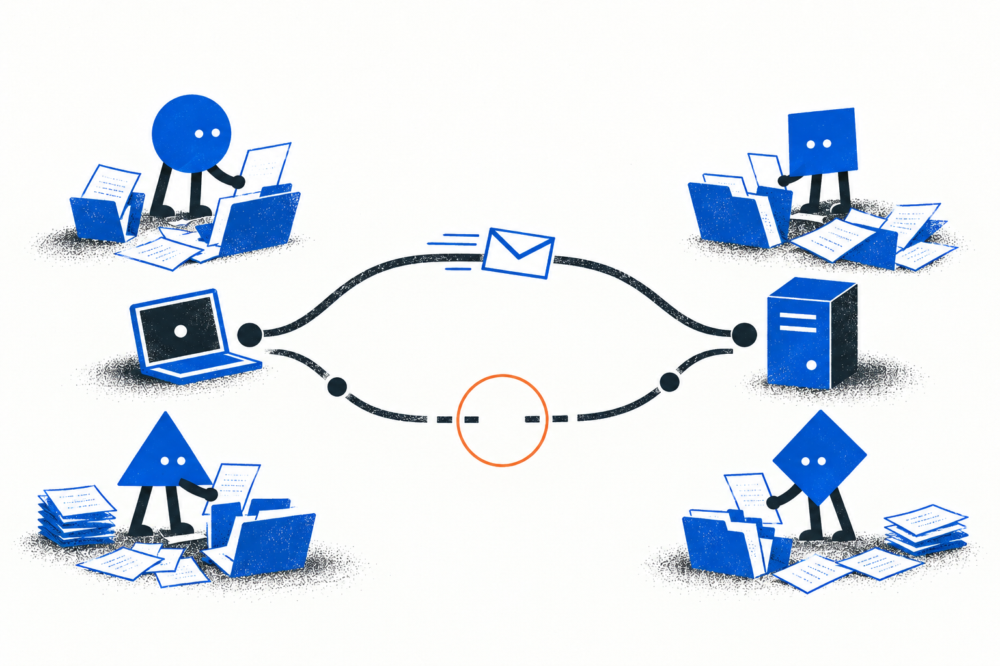
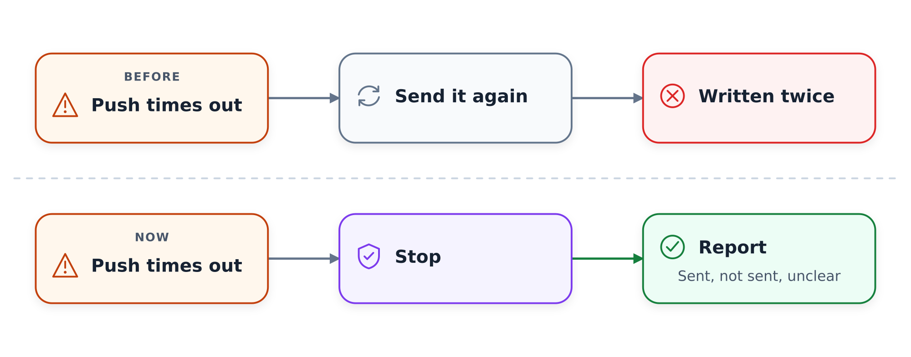
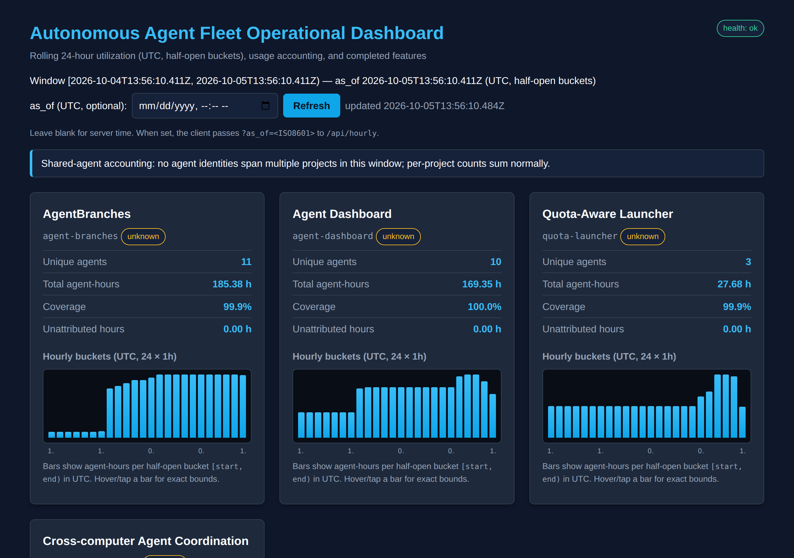
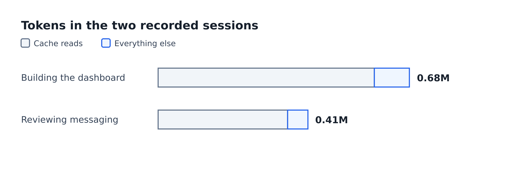
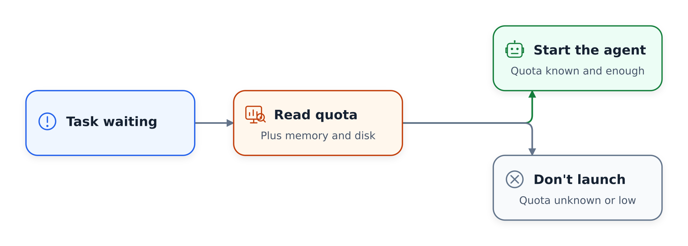
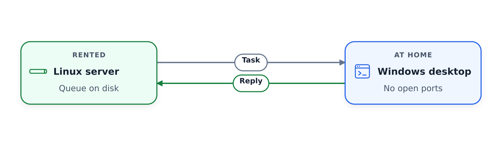
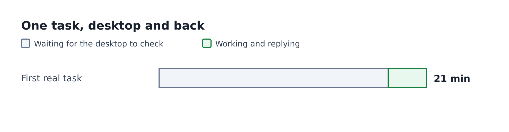
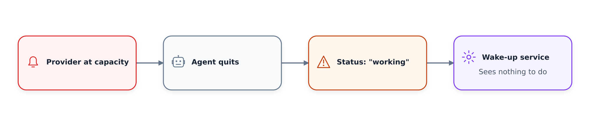
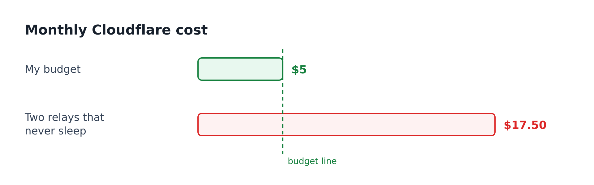
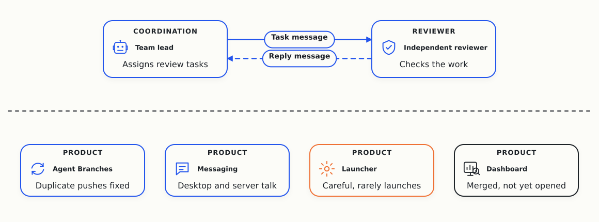

# Day 3: Failed Pushes Stop Before They Write Twice

On October 1, Cloudflare announced a [competition to build the next Git platform](https://blog.cloudflare.com/next-git-platform-on-cloudflare/). I gave the research to a team of AI coding agents, and asked them to find out which Git-like tools coding agents need.

Several agents changing one project at the same time cause real trouble for me. Their changes clash, and the extra copies of the project fill my disk. I don't want faster Git. I want Git that works better when many agents use it at the same time.

Yesterday I asked the agents to split into teams.

They formed these four:

- Agent Branches, a Git server where each task gets its own copy of the project.
- A dashboard that shows what the agents are doing and what it costs.
- A launcher that decides which agent to start next.
- Messaging between my desktop and my rented server.

Today is the first day each team had something to show.

## Agent Branches: no more duplicate pushes

The most useful change was small. When a push failed or timed out, the tool used to send it again. But sometimes the first push had already gone through, so the retry wrote the same changes twice.

Now the tool stops and reports which changes went through, which didn't and which are unclear. A person can check before anything gets written twice. A second agent reviewed the change and ran 61 tests, including one where the server saves the push and then drops the connection.

The team also built one real feature twice: once with plain Git, once with Agent Branches. Both versions came out the same and passed the same tests. That proves the tool works for one feature. It doesn't prove the tool beats plain Git.

An earlier trial seemed to show Agent Branches catching a bug that Git missed. It turned out the trial only ran the tests on Git after merging. When Git ran the same tests before merging, it caught the bug too. So for now, plain Git holds its ground.

Next, the team wants two agents doing real work on the same project at the same time.

## The dashboard: merged and running

The dashboard shows each product's agents and the hours they spend. It's now part of the main project, and 48 tests pass. I opened it for this report, and it runs.

It still speaks the agents' language, with raw timestamps and labels like "half-open buckets". A reviewer also found two different end times in one report. Next, the team fixes those and makes the page readable for a person.

Token counts are still patchy, because only two sessions recorded them. The other agents don't report usage yet, so the full cost is unknown.

## The launcher: careful rules, little action

The launcher checks how much model quota is left before it starts an agent, and it refuses to launch when it can't tell. It also keeps memory and disk free on the server.

Overnight it started two reviews. One timed out, and the other finished in about eight minutes. Next, the team wants a worker to do a useful review on its own, without a script driving it.

## Messaging: the desktop and the server talk

My Windows desktop and my Linux server can now send each other tasks and replies over SSH. The desktop dials out, so it doesn't need open ports.

In the first real test, most of the time went to waiting, because the desktop only checks for new messages now and then.

Nobody has tested what happens when a computer goes offline and comes back.

## Agents still stop

My biggest worry from yesterday still holds, because work stops when a lead agent stops. Twice overnight, work resumed only after another agent nudged it.

When the model provider runs out of capacity, the agent quits, but its status keeps saying "working". That's one likely reason, and the service that wakes stalled agents can't tell the difference. The agents have drafted a timeout rule for this case, but nobody has installed it yet.

My test stays the same, and two useful tasks should start on their own, one after the other, with nobody nudging.

## The five-dollar limit

The messaging works over SSH, but the desktop has to keep asking the server for news. That's why the first task spent most of its time waiting. A small relay in the cloud could push messages the moment they arrive.

The blocker is money, because my Cloudflare budget is $5 a month and Cloudflare bills its relays for every second they stay awake. Two relays that never sleep would push the bill to about $17.50.

So for now the agents keep SSH, with a small queue on disk for messages that are waiting. The cloud relay waits until I can cap the bill.

## Three days in

Each team now has something that works in a small test.

None of it has run with many agents at the same time yet, and that was the whole point of the experiment. So that's the next test for Agent Branches. The other big one is work that keeps going when a lead agent stops, with nobody nudging it.
