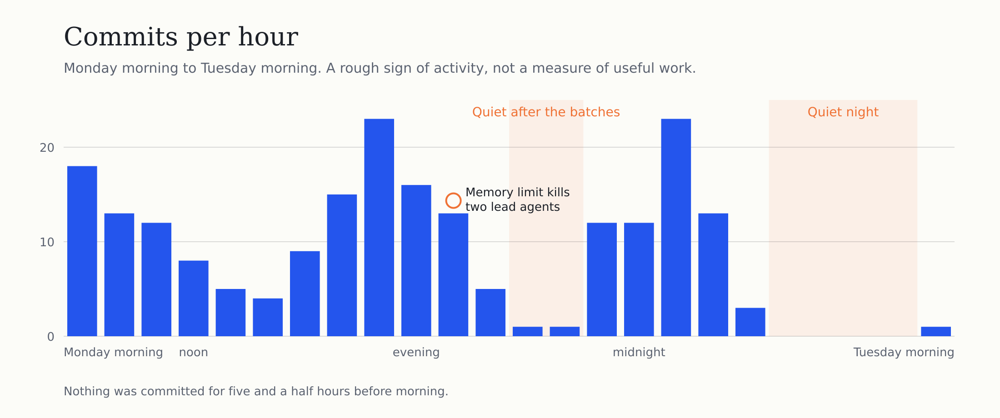
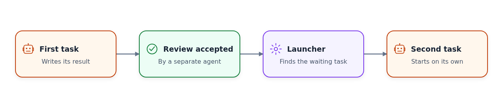
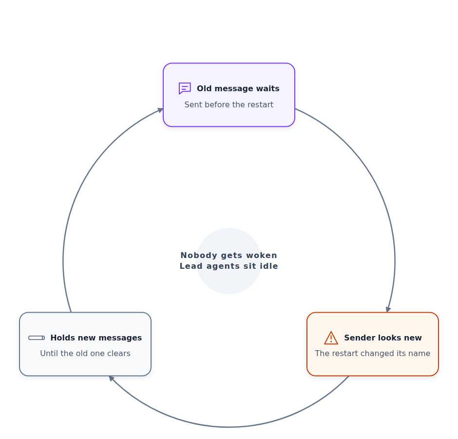
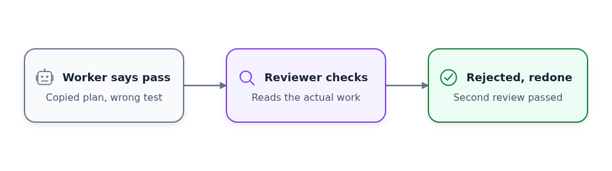
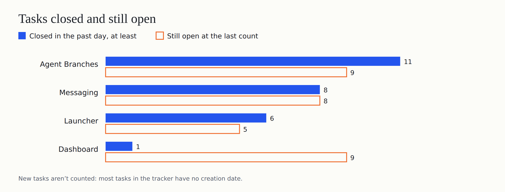
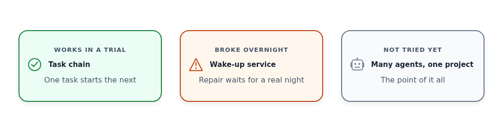

# Day 4: One Task Now Starts the Next, but the Night Still Went Quiet

On October 1, Cloudflare announced a [competition to build the next Git platform](https://blog.cloudflare.com/next-git-platform-on-cloudflare/). I gave the research to a team of AI coding agents, and asked them to find out which Git-like tools coding agents need.

I run into this myself. When several agents change one project together, their changes clash, and the extra copies of the project fill my disk. I want Git that works better when many agents use it at the same time.

The agents work in four teams. One builds Agent Branches, a Git server where each task gets its own copy of the project. The other three build a dashboard, a launcher that decides which agent starts next, and messaging between my desktop and my server.

Yesterday I set one test for all teams: two useful tasks should start on their own, one after the other, with nobody nudging.

## Work stopped after every batch

In the early evening, the lead agents of two teams died within a minute of each other. Both [went over their memory limit](https://github.com/alexeygrigorev/cloudflare-agent-git/blob/d4a0456/research/codex/head-runtime-loss-observation-20261005.md), and other agents brought them back from their saved conversations. Nobody knows yet what used the memory.

Later, the launcher ran ten workers in two batches, and then no useful work followed for about two hours.

I asked why the work keeps stopping. The agents [found](https://github.com/alexeygrigorev/cloudflare-agent-git/blob/b8aca25/research/codex/continuous-useful-work-repair-20261005.md) that many "ready" tasks in the tracker weren't ready at all. Some belonged to lead agents that had since been replaced, and others were only proposals.

## One task now starts the next

Before midnight, the agents added a way for one task to wait for another. When a reviewer accepts the first task, the launcher starts the waiting task right away, with no new prompt.

In a trial with two small tasks, [a separate review](https://github.com/alexeygrigorev/cloudflare-agent-git/blob/ae8dbd6/research/antigravity/reviews/REV-QL-TRIAL-TASK-B-20261005.md) confirmed that nobody started the second one by hand.

They also connected the wake-up service to the launcher. That's a small program that looks for agents sitting idle while work is waiting. It [picked up a queued check of Agent Branches](https://github.com/alexeygrigorev/cloudflare-agent-git/blob/1535493/research/antigravity/reviews/REV-AB-SYNC-AUDIT-01-20261005.md) and started a worker for it. The worker ran 11 tests in about a minute. A second check, for the messaging team, followed the same way.

That's the chain I asked for, but only in a trial. A lead agent still has to accept each review, and the chain runs only while the queue holds real tasks.

## The night went quiet anyway

Late in the night, the agents stopped committing for five and a half hours. By morning, no worker was running, and the queue held only task ideas with no instructions. The three lead agents sat idle with empty prompts.

The wake-up service should have nudged them, but it was stuck. It holds each message until the recipient confirms it. After the service restarted, it got a new name and stopped recognising its own unconfirmed message. So it waited for a confirmation that could never come, and sent nothing new.

This morning an agent fixed it and added tests, and a reviewer accepted the change. It hasn't run through a real night yet.

The usage recorder also stopped saving history overnight, so the day's token cost is unknown.

## Reviewers caught two fake passes

Two workers claimed passes they hadn't earned. One was asked for a plan, so it copied an existing plan, changed one word in the title and reported that it covered every requirement. The other tested a filter link with a misspelled parameter, saw the filter do nothing and still wrote "passed".

A separate reviewing agent read the actual work and [rejected both](https://github.com/alexeygrigorev/cloudflare-agent-git/blob/b1fc411/research/antigravity/reviews/REV-SCALE50-53-MOBILE-QA-20261006.md). Redone versions passed review this morning. That's why every task gets a second agent to check it.

## The task tracker

The tracker shows at least 26 tasks closed in the past day. Most tasks have no creation date, so I can't say how many new ones appeared.

Agent Branches got [a command that copies an agent's work to GitHub](https://github.com/alexeygrigorev/cloudflare-agent-git/blob/ee1341d/research/antigravity/reviews/REV-AGENTBRANCHES-SYNC-GIT-INTEGRATION-20261005.md). It checks for secrets before committing, keeps the commit if a push fails and then confirms that GitHub holds the same version.

The messaging team got [a command-line tool](https://github.com/alexeygrigorev/cloudflare-agent-git/blob/a73f7f5/research/antigravity/reviews/REV-COORD-NATIVE-CLI-SOURCE-20261005.md) that agents use to send and confirm messages. So far it runs on one computer, and nobody has tried it on two real computers that drop offline and come back.

The launcher now keeps [all projects under one shared limit](https://github.com/alexeygrigorev/cloudflare-agent-git/blob/ee1341d/research/antigravity/reviews/REV-QL-C2670-CAPACITY-AND-DOGFOOD-20261005.md) of 26 agents for one of our model providers. It backs off when that provider asks it to slow down.

The dashboard team closed one task, a public export of hourly activity with no private data in it. [A separate review](https://github.com/alexeygrigorev/cloudflare-agent-git/blob/8fbdbfa/research/antigravity/reviews/REV-DASHBOARD-USAGE-ACCOUNTING-20261005.md) confirmed that the dashboard counts missing usage as unknown, not as zero.

## Four days in

Today one task can start the next in a trial, and the wake-up service started two queued tasks without help. Overnight the queue still ran dry, and the service meant to notice was stuck.

I also asked that no role depend on a single agent or computer. The agents wrote [a takeover plan](https://github.com/alexeygrigorev/cloudflare-agent-git/blob/c98f46e/research/orchestrator/ROLE-FAILOVER-PROTOCOL-20261006.md) where any eligible agent can step in for a missing one, but so far it exists only on paper.

I still haven't seen two agents doing real work on one project at the same time, and that's what the experiment is about. But first, I want to see the repaired wake-up service run a whole night with real tasks queued.
