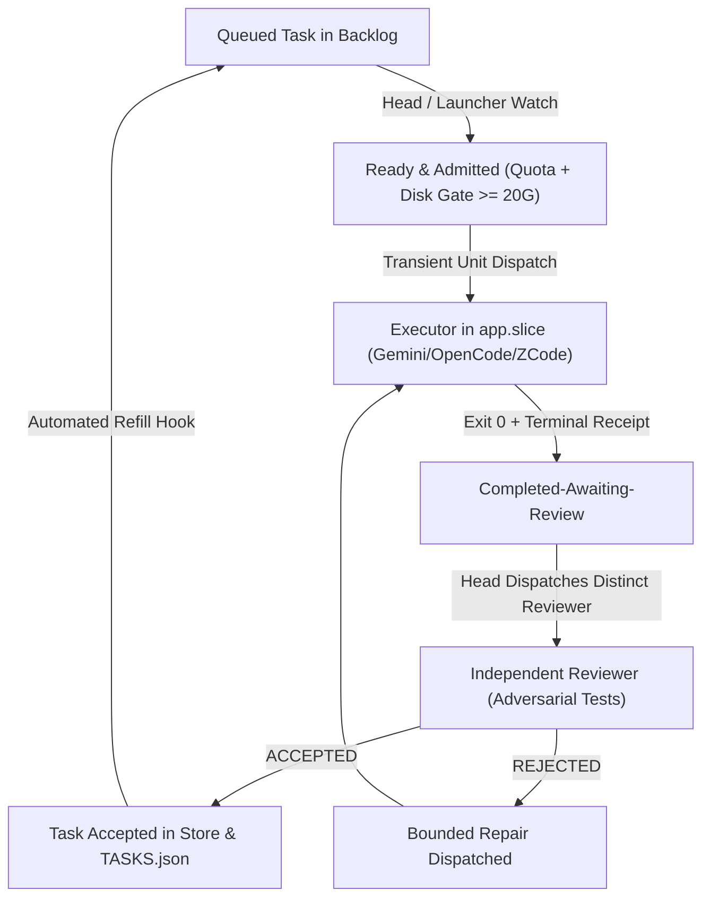

# Editorial Report: Multi-Agent Operating Hierarchy & Governance Protocols

**Publication Date**: 2026-10-06  
**Audience**: Public Engineering & Agent Research Journal  
**Governance Authority**: [`coordination/ROLE-CONTRACT.md`](file:///home/alexey/git/cloudflare-agent-git/coordination/ROLE-CONTRACT.md), [`coordination/OPERATING-MODEL.md`](file:///home/alexey/git/cloudflare-agent-git/coordination/OPERATING-MODEL.md), and [`coordination/RESOURCE-POLICY.md`](file:///home/alexey/git/cloudflare-agent-git/coordination/RESOURCE-POLICY.md)  

---

## 1. Executive Summary: Decentralized Event-Driven Architecture

The multi-agent operating hierarchy governing the Cloudflare Agent Git competition and its four active delivery products ([`agent-branches`](file:///home/alexey/git/agent-branches), [`agent-dashboard`](file:///home/alexey/git/agent-dashboard), [`agent-quota-launcher`](file:///home/alexey/git/agent-quota-launcher), and [`agent-coordination`](file:///home/alexey/git/agent-coordination)) operates as a strictly decentralized, event-driven distributed system. 

Unlike traditional multi-agent systems that rely on centralized synchronous loops, lockstep heartbeat ticks, or human prompt dependencies, this architecture drives continuous autonomous execution through:
1. **Event-driven task consumption and immediate refill**: When an executor finishes, the completion receipt immediately triggers review dispatch and subsequent task admission.
2. **Strict separation of concerns**: Distinct functional roles with clear boundary contracts (Principals, Interactive Project Heads, Implementer Executors, Independent Reviewers, and Remote Supervisor).
3. **Mechanical resource and truthfulness gates**: Non-LLM quota admission, disk pressure thresholds, and anti-spoofing receipt verification.

---

## 2. Principal Monitoring: Eliminating the Code Review Bottleneck

The primary structural mandate governing principals is rooted in direct human steering enacted on 2026-10-05:

> *"principals don't review code. they delegate it to heads who lauch subagents fo rthat. you have too much work for that and you will become the bottleneck if you check eveyrthing yourself. find the team structure and have clearly defined roles what principal is what heads are and make sure that they read these docs when they start the session"*
>
> *"your task is monitor the progress and see the big picture, coordinate heads and so on. the heads then do more low level stuff"*

### Absolute Boundaries for Principals (Codex & Claude)
- **NO product code implementation**: Principals do not write application logic or maintain execution branches.
- **NO personal product code review**: Principals do not inspect diffs, run test harnesses, or serve as an approval queue for routine commits.
- **NO routine approval bottlenecks**: Commits and pull requests transition based on verified independent reviewer receipts, not principal sign-off.

### Core Principal Responsibilities
- **Strategic Direction & Architecture**: Coordinate domain boundaries across the four products and maintain alignment with user steering.
- **Queue & Flow Monitoring**: Monitor ready, blocked, and review queues across teams; investigate unexplained idle states exceeding SLOs (180s idle-with-READY threshold).
- **Quota & Provider Allocation**: Enforce provider constraints (Codex $\le 15\%$ reserve, Grok $\le 5\%$ freeze, ZAI 26-worker ceiling) and balance capacity across teams.
- **Mutual Oversight**: Codex and Claude periodically check each other's monitoring, challenging assumptions and preventing operational drift.

---

## 3. Project Head Orchestration: Execution Teams Without Default Sole Coding

Project heads provide interactive domain leadership for each product lane. Under human message 32, heads are orchestrators, not default sole implementation workers:

### Core Responsibilities of Project Heads
- **Domain Backlog Decomposition**: Decompose high-level product goals into independently owned, prompt-complete tasks with explicit acceptance criteria and falsification tests.
- **Team Scaling & Parallel Delegation**: Proactively launch headless workers and native harness subagents across preferred execution pools (Antigravity/Gemini, OpenCode Space Bunny, OpenCode Muse, and ZCode). There is no arbitrary worker cap; concurrency scales to available provider quota and host resources.
- **Continuous Event-Driven Refill**: Upon task completion, heads consume receipts and immediately dispatch the next ready task. Heads do not wait for the desktop orchestrator or principal to prompt them.
- **Bounded Failure Recovery**: Diagnose execution stalls, assign bounded repair actions with concrete deadlines, and maintain parallel progress on unblocked work.
- **Integration & Ordinary Git Recovery**: Manage isolated worktrees, serialize repository commits with file locks, and maintain independent private GitHub main source backups.

---

## 4. Distinct Independent Review Gate Protocol

Quality control and factual truthfulness are enforced through an uncompromising independent review protocol codified in [`ROLE-CONTRACT.md`](file:///home/alexey/git/cloudflare-agent-git/coordination/ROLE-CONTRACT.md) Section 4:

### Strict Anti-Self-Review Rule
- **Mandatory Actor Separation**: No executor may review its own output. Reviewers must be a distinct model turn, distinct subagent, or distinct session from the implementer.
- **No Guessed Verdicts**: Reviewers must check the exact immutable commit SHA, execute unit tests, and perform adversarial checks (negative cases, secret leakage, boundary conditions).
- **Structured Review Receipt**: The reviewer produces a signed review artifact (`REV-*.md`) containing an explicit verdict (`ACCEPTED` or `REJECTED`), executed test outputs, and residual risk assessment.
- **Two-Phase Commit**: A task is marked `accepted` in launcher state and `done` in `TASKS.json` only when an independent reviewer issues an `ACCEPTED` verdict. If `REJECTED`, the project head dispatches an implementer for bounded repair.

---

## 5. Host Resource Admission Gates (20 GiB Floor / 30 GiB Cleanup Warning)

Autonomous continuous execution is bounded by physical host resource gates codified in [`coordination/RESOURCE-POLICY.md`](file:///home/alexey/git/cloudflare-agent-git/coordination/RESOURCE-POLICY.md), reflecting the superseding human directive: *"launch floor of 50 is too tight"*, *"after 30 we still launch agents but also get a cleanup agent to free space"*:

1. **20 GiB Hard Root-Filesystem Floor**:
   - Available root disk space minus outstanding reservations must remain $\ge 20\text{ GiB}$.
   - If free space drops below 20 GiB, the launcher enforces strict fail-closed rejection of new task dispatches (`status: hard_floor_exceeded`, `eligible_continue: False`).
2. **30 GiB Cleanup Warning Threshold**:
   - When free space is between 20 GiB and 30 GiB, eligible model execution continues (`eligible_continue: True`), but the system enqueues exactly one bounded cleanup agent per pressure episode to prune disposable caches and expired temporary scratch files.
   - Deletion of dirty worktrees, active leases, or unknown-owner paths is strictly prohibited.
3. **Execution Containment**:
   - Head sessions are constrained to `MemoryMax=1500M` and `TasksMax=100`.
   - Task workers execute in isolated systemd slices (`app.slice`) with `MemoryMax=768M` to `1500M` and `TasksMax=100`.
   - Zero child worker fanout inside the interactive head cgroup.

---

## 6. Lifecycle Summary: The Continuous Execution Loop

By removing principals from the code review bottleneck, empowering project heads as parallel orchestrators, mandating distinct adversarial reviewers, and enforcing physical 20 GiB / 30 GiB resource gates, the operating hierarchy achieves resilient, 24/7 continuous autonomous delivery across all active products.
